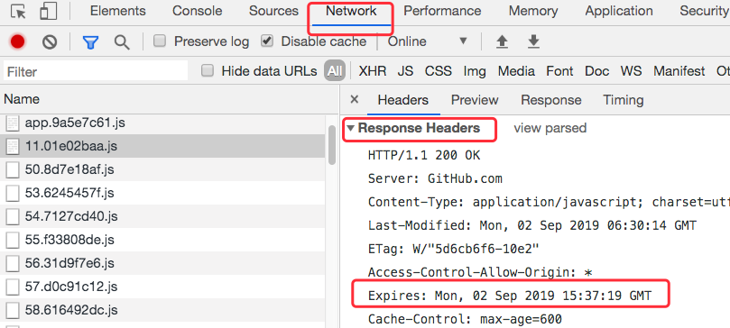

[[TOC]]

[TOC]

# 浏览器缓存

浏览器缓存是浏览器将用户请求过的静态资源(html、css、js、img)，存储到用户电脑中，当浏览器再次访问时，就可以直接从本地加载了，不需要再去服务器请求了。

缓存的优点：

- 减少了冗余的数据传输，节省网费
- 减少服务器的负担，提升网站性能
- 加快了客户端加载网页的速度

缓存的缺点：

- 服务器更新资源后，由于缓存策略，导致用户浏览的页面还是旧的资源


图片转载自：https://github.com/amandakelake/blog/issues/43

## 1. 前端缓存/后端缓存

基本的网络请求有三个步骤：请求、处理、响应。

后端的缓存主要集中在`处理`步骤，通过保留数据库连接，存储处理结果等方式，缩短处理时间，尽快进入响应的步骤。

而前端的缓存则在`请求`、`响应`中进行。

请求阶段：浏览器可以通过存储之前结果的方式直接使用资源，直接省去了发送的请求。

响应阶段：浏览器和服务器配合，通过减少响应内容来缩短传输时间。

## 2. 本地缓存存放位置

在Google的Chrome浏览器的开发者工具中， `Network -> Size`一列中,可以看到一个请求最终的处理方式：如果是大小 (多少 K， 多少 M 等) 就表示是网络请求，否则会列出 `from memory cache`, `from disk cache` 和 `from ServiceWorker`。

它们的优先级是：(由上到下寻找，找到即返回；找不到则继续)

1. Service Worker
2. Memory Cache
3. Disk Cache
4. 网络请求

### 2.1 Service Worker

memory cache 和 disk cache 的缓存策略以及缓存/读取/失效的操作都是由浏览器内部判断&进行的，我们只能设置响应头的某些字段来告诉浏览器，不能自己操作。

Service Worker的出现，给予了我们另外一种更加灵活，更加直接的操作方式。可以通过Service Worker来自己实现、控制缓存策略以及缓存/读取/失效的操作。

Service Worker能够操作的缓存是有别于浏览器内部的 `memory cache`或者`disk cache`方式。 
我们可以在Chrome的开发者工具中， Application - Application - Service Workers 找到。
Service Worker缓存是永久性的，即关闭TAB或者浏览器，下次打开依然还在(memory cache 不是)。

有两种情况会导致这个缓存中的资源被清除：

- 手动调用API`cache.delete(resource)`
- 容量超过限制，被浏览器全部清空

如果Service Worker 没能命中缓存，一般情况会使用`fetch()`方法继续获取资源。这时候，浏览器就去`memory cache`或者`disk cache`进行下一次找缓存的工作了。注意：经过 Service Worker 的 `fetch()` 方法获取的资源，即便它并没有命中 Service Worker 缓存，甚至实际走了网络请求，也会标注为 `from ServiceWorker`。这个情况在后面的第三个示例中有所体现。

### 2.2 memory cache

memory cache是内存中的缓存。按照操作系统的常理：先读内存，再度硬盘。

几乎所有的网络请求资源都会被浏览器自动加入到`memory cache`中。由于存储数量多和内存大小限制，`memory cache`只能是"短期存储"。一般情况下，浏览器TAB标签页关闭后，该次浏览的`memory cache`便会失效(给其他TAB留出内存空间)。在极端情况下(例如一个页面的缓存占用了超级多的内存)，那么TAB没关闭之前，排在前面的缓存就已经失效了。

刚才提过，**几乎所有的请求资源** 都能进入 memory cache，这里细分一下主要有两块：

1. preloader。关于preloader详情可以参阅[这篇文章](https://link.juejin.im?target=https%3A%2F%2Fcalendar.perfplanet.com%2F2013%2Fbig-bad-preloader%2F)。

   熟悉浏览器处理流程的同学们应该了解，在浏览器打开网页的过程中，会先请求 HTML 然后解析。之后如果浏览器发现了 js, css 等需要解析和执行的资源时，它会使用 CPU 资源对它们进行解析和执行。在古老的年代(大约 2007 年以前)，“请求 js/css - 解析执行 - 请求下一个 js/css - 解析执行下一个 js/css” 这样的“串行”操作模式在每次打开页面之前进行着。很明显在解析执行的时候，网络请求是空闲的，这就有了发挥的空间：我们能不能一边解析执行 js/css，一边去请求下一个(或下一批)资源呢？

   这就是 preloader 要做的事情。不过 preloader 没有一个官方标准，所以每个浏览器的处理都略有区别。例如有些浏览器还会下载 css 中的 `@import` 内容或者 `<video>` 的 `poster`等。

   而这些被 preloader 请求够来的资源就会被放入 memory cache 中，供之后的解析执行操作使用。

2. preload (虽然看上去和刚才的 preloader 就差了俩字母)。实际上这个大家应该更加熟悉一些，例如 `<link rel="preload">`。这些显式指定的预加载资源，也会被放入 memory cache 中。

memory cache 机制保证了一个页面中如果有两个相同的请求 (例如两个 `src` 相同的 ``，两个 `href` 相同的 `<link>`)都实际只会被请求最多一次，避免浪费。

不过在匹配缓存时，除了匹配完全相同的 URL 之外，还会比对他们的类型，CORS 中的域名规则等。因此一个作为脚本 (script) 类型被缓存的资源是不能用在图片 (image) 类型的请求中的，即便他们 `src` 相等。

在从 memory cache 获取缓存内容时，浏览器会忽视例如 `max-age=0`, `no-cache` 等头部配置。例如页面上存在几个相同 `src` 的图片，即便它们可能被设置为不缓存，但依然会从 memory cache 中读取。这是因为 memory cache 只是短期使用，大部分情况生命周期只有一次浏览而已。而 `max-age=0` 在语义上普遍被解读为“不要在下次浏览时使用”，所以和 memory cache 并不冲突。

但如果站长是真心不想让一个资源进入缓存，就连短期也不行，那就需要使用 `no-store`。存在这个头部配置的话，即便是 memory cache 也不会存储，自然也不会从中读取了。(后面的第二个示例有关于这点的体现)

### 2.3 disk cache

`disk cache`也叫`HTTP cache`，是存储在硬盘上的缓存，因此它是持久存储的，是实际存在于文件系统中的。而且它允许相同的资源在跨会话，甚至跨站点的情况下使用，例如两个站点都使用了同一张图片。

disk cache 会严格根据HTTP头信息中的各类字段来判定那些资源可以缓存，哪些资源不可以缓存。哪些资源仍然是可用的，哪些资源是过期需要重新请求的。当命中缓存后，浏览器会从硬盘中读取资源，虽然比起从内存中读取慢了一些，但是比起网络请求还是快了不少。绝大部分的缓存都来自disk cache。

凡是持久性的存储都会面临容量增长的问题，disk cache也不例外。在浏览器自动清理时，会有神秘的算法去把`最老的`或者`最可能过时`的资源删除，是一个一个删除的。每个浏览器识别`最老的`或者`最可能过时`的资源的算法不尽相同。

### 2.4 请求网络

如果一个请求在上述 3 个位置都没有找到缓存，那么浏览器会正式发送网络请求去获取内容。之后容易想到，为了提升之后请求的缓存命中率，自然要把这个资源添加到缓存中去。具体来说：

1. 根据 Service Worker 中的 handler 决定是否存入 Cache Storage (额外的缓存位置)。
2. 根据 HTTP 头部的相关字段(`Cache-control`, `Pragma` 等)决定是否存入 disk cache
3. memory cache 保存一份资源 **的引用**，以备下次使用。

## 3. 强缓存/协商缓存

memory cache 是浏览器为了加快读取缓存速度而进行的自身的优化行为，不受开发者控制，也不受 HTTP 协议头的约束，算是一个黑盒。Service Worker 是由开发者编写的额外的脚本，且缓存位置独立，出现也较晚，使用还不算太广泛。所以我们平时最为熟悉的其实是 disk cache，也叫 HTTP cache (因为不像 memory cache，它遵守 HTTP 协议头中的字段)。平时所说的强制缓存，对比缓存，以及 `Cache-Control` 等，也都归于此类。

**强制缓存优先于协商缓存进行，若强制缓存(Expires和Cache-Control)生效则直接使用缓存，若不生效则进行协商缓存(Last-Modified / If-Modified-Since和Etag / If-None-Match)，协商缓存由服务器决定是否使用缓存，若协商缓存失效，那么代表该请求的缓存失效，返回200，重新返回资源和缓存标识，再存入浏览器缓存中；生效则返回304，继续使用缓存**。

### 3.1 强制缓存(强缓存)

强制缓存的含义：当浏览器发送请求后，会先访问缓存数据库看缓存是否存在。如果存在则直接返回；不存在则向服务器发送请求，响应后再写入缓存数据库。

强制缓存直接减少请求数，是提升最大的缓存策略。它的优化覆盖了网络请求的三个步骤：请求、处理、响应。如果考虑使用缓存来优化网页的性能话，强制缓存应该是首先被考虑的。

强缓存是通过后端在响应头中设置字段`Cache-control`和`Expire`实现的。

#### 3.1.1 Expires

Expires是HTTP 1.0 的字段，表示缓存到期时间，是一个绝对的时间(当前时间+缓存时间)，如：

```
Expires: Mon, 02 Sep 2019 15:37:19 GMT
```

在Google的Chrome浏览的开发者工具中可以看到：



在响应消息头中，设置这个字段之后，就可以告诉浏览器，在未过期之前不需要再次请求。

设置Expires会有两个缺点：

1、由于设置的是绝对时间，如果用户把电脑的本地时间修改了，可能会导致浏览器判断缓存失效，重新请求该资源。除此之外，时差、误差等因素也可能造成客户端与服务器的时间不一致，导致缓存失效。

2、写法复杂。表示时间的字符串多个空格、少个字母都会导致非法属性从而设置失效。

#### 3.1.2 Cache-Control

由于Expires的缺点，在HTTP 1.1 版本中，增加了一个字段`Cache-Control`，该字段表示资源缓存的最大有效时间，在该时间内，浏览器不需要向服务器发送请求。

Expires设置的是绝对时间，Cache-Control设置的是相对时间。如：

```
Cache-Control: max-age=600
```

实际例子见`Expires`说明中的图片。

Cache-Control中常用的字段

| 字段            | 说明                                                         |
| :-------------- | ------------------------------------------------------------ |
| max-age         | 最大有效时间，单位秒，在请求返回到浏览器那一刻开始算         |
| must-revalidate | 如果时间超过了`mag-age`，浏览器必须向服务器发送请求，验证资源是否失效。 |
| no-cache        | 需要使用协商缓存来验证缓存数据                               |
| no-store        | 不要缓存，所有内容都不缓存，包括强制缓存和协商缓存           |
| public          | 响应可以被任何对象(浏览器、代理服务器、CDN等等)缓存          |
| private         | 默认值。响应内容只有浏览器客户端才能缓存，代理服务器不能缓存。 |

更多Cache-Control字段介绍查看[MDN](https://developer.mozilla.org/zh-CN/docs/Web/HTTP/Headers/Cache-Control)

这些值可以混合使用，例如 `Cache-control:public, max-age=2592000`。在混合使用时，它们的优先级如下图：


[图片来源](https://developers.google.com/web/fundamentals/performance/optimizing-content-efficiency/http-caching?hl=zh-cn)

#### 3.1.3 max-age=0 和 no-cache区别

从规范的字面意思来说，`max-age` 到期是 **应该(SHOULD)** 重新验证，而 `no-cache` 是 **必须(MUST)** 重新验证。但实际情况以浏览器实现为准，大部分情况他们俩的行为还是一致的。（如果是 `max-age=0, must-revalidate` 就和 `no-cache` 等价了）

顺带一提，在 HTTP/1.1 之前，如果想使用 `no-cache`，通常是使用 `Pragma` 字段，如 `Pragma: no-cache`(这也是 `Pragma` 字段唯一的取值)。但是这个字段只是浏览器约定俗成的实现，并没有确切规范，因此缺乏可靠性。它应该只作为一个兼容字段出现，在当前的网络环境下其实用处已经很小。

总结一下，自从 HTTP/1.1 开始，`Expires` 逐渐被 `Cache-control` 取代。`Cache-control` 是一个相对时间，即使客户端时间发生改变，相对时间也不会随之改变，这样可以保持服务器和客户端的时间一致性。而且 `Cache-control` 的可配置性比较强大。

**Cache-control 的优先级高于 Expires**，为了兼容 HTTP/1.0 和 HTTP/1.1，实际项目中两个字段我们都会设置。

### 3.2 协商缓存(对比缓存)

当强制缓存失效(超过规定时间)时，就需要使用协商缓存，由服务器决定缓存内容是否失效。

协商缓存请求过程：

1、浏览器先请求缓存数据库，返回一个缓存标识。留恋其拿着这个标识请求服务器。

2、如果缓存有效，则返回HTTP状态码304标识继续使用缓存。

3、如果缓存失效，则返回新的数据和缓存规则，浏览器收到响应数据后，根据缓存规则存入缓存数据库。

协商缓存在发送请求上和没有缓存的请求是一致的，但如果响应的状态码是304的话，则仅仅是返回一个状态码而已，并没有实际的文件内容，因此在`响应体体积上节省`是它的优点，协商缓存优化了请求的响应，通过减少响应体体积，来缩短网络传输时间。协商缓存比强制缓存节省时间的提升幅度小，但总比没有缓存的好。

协商缓存可以和强制缓存一起使用，作为强制缓存失效后的一种候选方案。实际项目经常会一起出现。

协商缓存有两组字段：`Last-Modified & If-Modified-Since`和`Etag & If-None-Match`

#### 3.2.1 Last-Modified & If-Modified-Since

1、服务器通过`Last-Modified`字段通知客户端，资源最后一次修改的时间，如：

```
Last-Modified: Mon, 02 Sep 2019 06:30:14 GMT
```

2、浏览器将这个值和内容一起记录在缓存数据库中。

3、下一次请求相同资源时，浏览器从自己的缓存中找出`不确定是否过期`的缓存。因此在请求头中将上次的`Last-Modified`的值写入到请求头的`If-Modified-Since`字段。

4、服务器会将`If-Modified-Since`的值与`Last-Modified`的值进行对比。如果相等，则表示未修改，响应状态码304。反之则表示修改内容了，响应状态码200，并返回数据。

缺点：

1、如果资源更新的速度是秒以下单位，那么该缓存是不能被使用的，因为它的时间单位最低是秒。

2、如果文件是通过服务器动态生成的，那么该方法的更新时间永远是生成的时间，尽管文件可能没有变化，所以起不到缓存的作用。

由于Last-Modified有上面的缺点，所以在 HTTP 1.1 版本中出现了`ETag` 和`If-None-Match`:资源文件的一个唯一标识

#### 3.2.2 Etag & If-None-Match

**Etag是服务器响应请求时，返回当前资源文件的一个唯一标识(由服务器生成)，只要资源有变化，Etag就会重新生成**。浏览器在下一次加载资源向服务器发送请求时，会将上一次返回的Etag值放到request header里的If-None-Match里，服务器只需要比较客户端传来的If-None-Match跟自己服务器上该资源的ETag是否一致，就能很好地判断资源相对客户端而言是否被修改过了。如果服务器发现ETag匹配不上，那么直接以常规GET 200回包形式将新的资源（当然也包括了新的ETag）发给客户端；如果ETag是一致的，则直接返回304知会客户端直接使用本地缓存即可。

#### 3.2.3 Last-Modified和Etag对比

1、优先级上，服务器校验优先考虑Etag。

2、在性能上，Last-Modified优于Etag。因为Last-Modified只需要记录文件最后修改时间，而Etag需要服务器通过算法来计算出资源的唯一标识(hash值)。

3、在精确度上Etag优于Last-Modified。Last-Modified的时间单位是秒，如果资源在1秒内多次修改，那么Last-Modified值没有改变，而Etag每次都会从新生成文件的唯一标识。如果是负载均衡的服务器，则各个服务器生成的Last-Modified也有可能不一致。

## 4. 用户行为对浏览器缓存的影响

所谓用户行为对浏览器缓存的影响，是指用户对浏览器的操作会触发怎样的缓存策略，主要有如下三种：

- 初次打开网页，地址栏输入地址：查找`disk cache`中是否有匹配。如果有则使用；没有则发送网络请求。
- 普通刷新(F5)：因为TAB标签页面没有关闭，因此`memory cache`是可用的，会被优先使用(如果匹配到)，其次才去`disk cache`中匹配。
- 强制刷新(Ctrl + F5)：浏览器不使用缓存，因此发送的请求头部均带有`Cache-Control:no-cache`(为了兼容，还带了`Pragma: no-cache`)，服务器直接返回200和最新的内容。

Mac下Google的Chrome浏览器刷新快捷键(cmd + R), 强制刷新快捷键(shift + cmd + R)

## 5. 缓存实际应用nodejs

为了应用缓存，现在使用nodejs来搭建一个静态服务器来实际学习缓存。

说明：

- 使用的是nodejs来搭建服务，如果没有node，请自行安装。
- 使用的是Google的Chrome浏览器
- Mac下Chrome刷新快捷键是`cmd + R`，强制刷新快捷键是`shift + cmd + R`

1、首先创建一个文件夹，然后创建如下几个文件：

index.html

```html
<!DOCTYPE html>
<html lang="en">
<head>
    <meta charset="UTF-8">
    <title>测试文档</title>
</head>
<body>
    <div class="app"></div>
    
    <script src='./index.js'></script>
</body>
</html>
```

index.js

```js
document.querySelector('.app').innerHTML = '我是JS文件执行输入的！'
```

001.png：随便找个图片

server.js

```js
const http = require('http');
const path = require('path');
const fs = require('fs');
const crypto = require('crypto');

function processCache(req, res, data, filePath) {
  	res.writeHead(200, 'OK');
    res.write(data);
    res.end();
}
const server = http.createServer((req, res) => {
    const filePath = path.join(__dirname, req.url);  // 获取文件路径
    fs.readFile(filePath, function (err, data) {
        if (err) {
            res.writeHead(404, 'not found')
            res.end('Oh, Not Found')
        } else {
            processCache(req, res, data, filepath);
        }
    })
});
server.listen(3000);
console.log('listen to 3000 port');
```

现在文件夹的目录结构：

```
.
├── 001.png
├── index.html
├── index.js
└── server.js
```

2、终端使用`node server.js`来启动服务，然后浏览器输入：http://localhost:3000/index.html，打开浏览器开发者工具，选择Network，就可以看见请求了，由于没有设置任何缓存字段，每次刷新页面，都会重新请求数据。

### 5.1 强缓存Expires实践

修改server.js文件的processCache方法为如下：

```js
function processCache(req, res, data, filePath) {
    // res.setHeader('Expires', 'Wed, 23 Jan 2019 07:40:51 GMT')
    // 设置缓存5秒
    let date = new Date(Date.now() + 1000*5).toGMTString();
    res.setHeader('Expires', date)
    res.writeHead(200, 'OK');
    res.write(data);
    res.end();
}
```

1、修改好文件后，保存，重启node服务。

2、强制刷新一下浏览器，此时查看资源是通过请求获得的。

3、5秒内刷新，此时可以看到资源使用了缓存，使用的是`memory cache`。

4、超过5秒后在刷新，此时可以看到资源又从新发请求了。

注意：index.html 没有使用缓存

### 5.2 强缓存Cache-Control实践

修改server.js文件的processCache方法为如下：

```js
function processCache(req, res, data, filePath) {
  	// res.setHeader('Cache-Control', 'no-cache') // 不使用缓存
    // 设置缓存5秒
    res.setHeader('Cache-Control', 'max-age=5')
    res.writeHead(200, 'OK');
    res.write(data);
    res.end();
}
```

操作步骤跟强缓存Expires实践一样。

注意：index.html 没有使用缓存

### 5.3 协商缓存Etag实践

修改server.js文件的processCache方法为如下：

```js
function processCache(req, res, data, filePath) {
    // 获取客户端传来的Etag
    let oldEtag = req.headers['if-none-match']
    if (!oldEtag) {
        // 如果不存在Etag，则新生成一个Etag
        let md5 = crypto.createHash('md5')
        res.setHeader('Etag', md5.update(data).digest('base64'))
        res.writeHead(200, 'OK')
        res.end(data)
    } else {
        let newEtag = crypto.createHash('md5').update(data).digest('base64')
        if (oldEtag !== newEtag) {
            // 新旧Etag不一致，说明文件修改了。
            res.setHeader('Etag', newEtag)
            res.writeHead(200, 'OK')
            res.end(data)
        } else {
            // 文件没有修改，返回304，让客户端使用缓存数据
            res.writeHead(304)
            res.end()
        }
    }
}
```

1、修改好文件后，保存，重启node服务。

2、强制刷新一下浏览器，此时查看资源是通过请求获得的。

3、之后每次刷新浏览器，查看资源，返回的状态码都是304，资源使用的是缓存。

4、修改`index.js`文件(加几个空行)保存后，刷新浏览器，则该资源状态码变成200，是通过请求获取的资源。

效果如下图所示：


### 5.4 协商缓存Last-Modified实践

修改server.js文件的processCache方法为如下：

```js
function processCache(req, res, data, filePath) {
    // 文件修改时间
    let mtime = Date.parse(fs.statSync(filePath).mtime)
    if (!req.headers['if-modified-since']) {
        // 没有请求
        res.setHeader('Last-Modified', new Date(mtime).toGMTString())
        res.writeHead(200, 'OK')
        res.end(data)
    } else {
        let oldMtime = Date.parse(req.headers['if-modified-since'])
        if (mtime > oldMtime) {
            // 文件更新了
            res.setHeader('Last-Modified', new Date(mtime).toGMTString())
            res.writeHead(200, 'OK')
            res.end(data)
        } else {
            // 没有更新使用缓存
            res.writeHead(304)
            res.end()
        }
    }
}
```

操作过程跟 协商缓存Etag一样。

注意，这里刷新后，只有index.html文件是304， js文件和img文件都是直接使用了`memory cache`，只有设置了`res.setHeader('Cache-Control', 'no-cache')`效果才跟 协商缓存Etag一致。

## 参考资料


[一文读懂前端缓存 掘金](https://juejin.im/post/5c22ee806fb9a049fb43b2c5)

[前端缓存最佳实践 掘金](https://juejin.im/post/5c136bd16fb9a049d37efc47)

[深入理解浏览器的缓存机制 简书](https://www.jianshu.com/p/54cc04190252)

[浅谈HTTP 缓存的那些事儿](https://www.jb51.net/article/149001.htm)

[HTTP缓存理解 segmentfault](https://segmentfault.com/a/1190000016015363)

