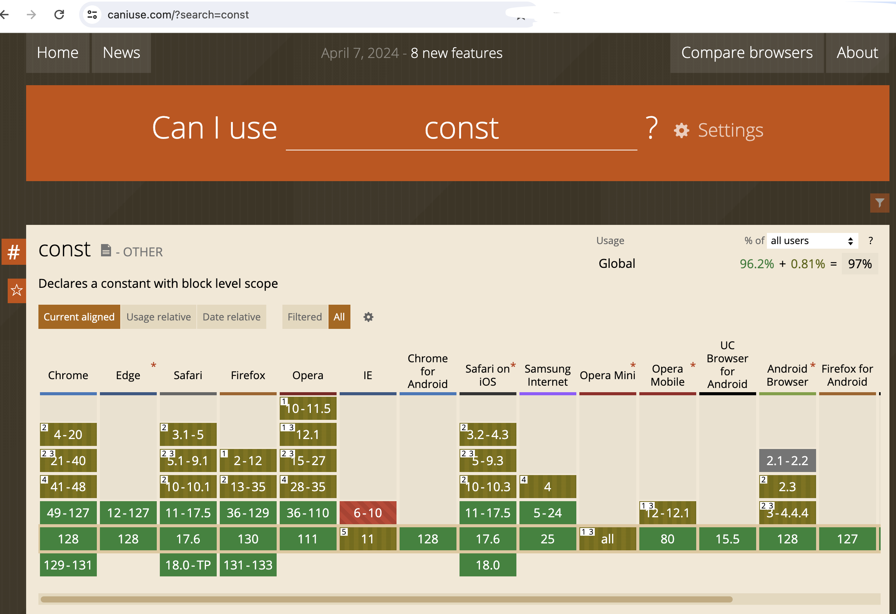

[[TOC]]

[TOC]


# 常见浏览器兼容性问题解决汇总

转载整理自：https://juejin.cn/post/7067808335034220574

## 1. 产生原因

造成浏览器兼容性问题的根本原因就是**各浏览器使用了不同的内核，并且它们处理同一件事情的时候思路不同。**

怎么理解上述文字？即：**不同浏览器使用的内核及所支持的HTML等网页语言标准不同，以及用户客户端的环境不同（如分辨率不同）造成了显示效果不能达到理想效果**。

## 2. 解决方法

前端开发经常需要检查浏览器的兼容性，这里推荐[(Can I Use)](https://caniuse.com)这个查询网站。它是一个针对前端开发人员定制的一个查询CSS、JS、HTML5、SVG在主流浏览器中特性和兼容性的网站，可以很好的保证网页在浏览器中的兼容性。有了这个工具我们就可以快速的了解到代码在各个浏览器中的兼容情况，界面效果如下图所示：



## 3. CSS兼容性问题解决

### 3.1 清除浏览器自带默认样式

其实清除浏览器自带的默认样式，每个前端开发者所用的方法大同小异：

1、可选择引用别人写好的成熟插件[Normalize.css](https://link.juejin.cn/?target=http%3A%2F%2Fnecolas.github.io%2Fnormalize.css%2F)来清除默认样式。

2、选用自定义的清除默认样式的重置样式代码：

```css
/* 该文件用于清除浏览器样式 */
html, body, div, span, applet, object, iframe,
h1, h2, h3, h4, h5, h6, p, blockquote, pre,
a, abbr, acronym, address, big, cite, code,
del, dfn, em, img, ins, kbd, q, s, samp,
small, strike, strong, sub, sup, tt, var,
b, u, i, center,
dl, dt, dd, ol, ul, li,
fieldset, form, label, legend,
table, caption, tbody, tfoot, thead, tr, th, td,
article, aside, canvas, details, embed,
figure, figcaption, footer, header, hgroup,
menu, nav, output, ruby, section, summary,
time, mark, audio, video {
    padding:0;
    margin:0;
    border:0;
    outline: 0;
    font-family: "Helvetica Neue For Number", -apple-system, BlinkMacSystemFont, "Segoe UI", Roboto, "PingFang SC", "Hiragino Sans GB", "Microsoft YaHei", "Helvetica Neue", Helvetica, Arial, sans-serif;
    word-wrap:break-word;
}
html, body {
    width: 100%;
    height: 100%;
}
a {
    text-decoration: none;
    -webkit-tap-highlight-color:rgba(255,255,255,0);
}
ul, ol {
    list-style-type: none;
}
textarea {
    resize: none;
}
/*去除input button默认样式*/
input, button, textarea {
    -webkit-appearance: none;
    -webkit-tap-highlight-color: rgba(255, 225, 225, 0);
    padding: 0;
    border: 0;
    outline: 0;
}
// 修改placeholder属性默认文字颜色
input::-webkit-input-placeholder, textarea::-webkit-input-placeholder {
    /* WebKit browsers */
    color: #999;
}
input:-moz-placeholder, textarea:-moz-placeholder {
    /* Mozilla Firefox 4 to 18 */
    color: #999;
}
input::-moz-placeholder, textarea::-moz-placeholder {
    /* Mozilla Firefox 19+ */
    color: #999;
}
input:-ms-input-placeholder, textarea:-ms-input-placeholder {
    /* Internet Explorer 10+ */
    color: #999;
}
```

### 3.2 不同浏览器的标签默认的内外边距不同

```css
* { margin: 0; padding: 0; }
```

### 3.3 图片加a标签在IE9中会有边框

```css
img { border: none; }
```

### 3.4 IE6及更低版本浮动元素，浮动边双倍边距

**不使用`margin`，使用`padding`**

### 3.5 IE6及更低版本中，部分块元素拥有默认高度

**给元素设置`font-size: 0;`**

### 3.6 a标签蓝色边框

```css
a { outline: none; }
```

### 3.7 IE6不支持min-height属性

```css
{ 
  height:auto !important;
  height:500px;
  min-height:500px; 
}
```

**解释:**

1、由于IE6对!important的解释存在bug，所以它只识别height:500px这一句，超过500px后，IE6自身会增加盒子的高度；

2、IE7和其他标准浏览器三句都能识别，虽然定义height:500px，但我们又有了height:auto !important，所以超过500px也能自动增加盒子的高度。

### 3.8 IE9以下浏览器不能使用opacity

**解决方案：Firefox/Chrome/Safari/Opera浏览器使用opacity；IE浏览器使用filter**

```css
opacity: 0.7; /*Firefox chrome safari opera*/
filter: alpha(opacity:70); /*用了ie滤镜,可以兼容ie*/
```

### 3.9 IE6/7不支持display:inline-block

如果本身是内联元素的，把它的display属性设置设置为inline-block时，所有浏览器都是支持的。相反，如果本身是块级元素的，把它设为display：inline-block;  那么ie6/ie7都是不支持的。

IE中对内联元素使用display:inline-block，IE是不识别的，但使用display:inline-block在IE下会触发layout，从而使内联元素拥有了display:inline-block属性的表征。

这时块元素仅仅是被display:inline-block触发了layout，而它本身就是行布局，所以触发后，块元素依然还是行布局，而不会如Opera中块元素呈递为内联对象。

解决方案1，直接让块元素设置为内联对象呈递（设置属性display:inline），然后触发块元素的layout（如：zoom:1 或float属性等）。代码如下：

```css
div {
  display:inline-block;
  *zoom:1;
  *display: inline;
}
```

关于IE的layout：[你必须知道--IE中的hasLayout](https://blog.csdn.net/WebAdvocate/article/details/5802124)

### 3.10 cursor兼容问题

**统一使用`{cursor: pointer;}`**

### 3.11 IE6/7中img标签与文字放一起时，line-height失效的问题

**解决方案：文字和``都设置`float`**

### 3.12 table宽度固定，td自动换行

**解决方案：table设置 `{table-layout: fixed}`，td设置 `{word-wrap: break-word}`**

### 3.13 相邻元素设置margin边距时，margin将取最大值，舍弃小值

**解决方案：不让边距重叠，可以给子元素加一个父元素，并设置该父元素设置：`{overflow: hidden}`**

### 3.14 a标签css状态的顺序

**解决方案：按照`link--visited--hover--active`的顺序编写**

### 3.15 IE6/7图片下面有空隙的问题

**解决方案：`img{display: block;}`**

### 3.16 ul标签在Firefox中默认是有padding值的，而在IE中只有margin有值

**解决方案：`ul{margin: 0;padding: 0;}`**

### 3.17 IE中li指定高度后，出现排版错误

**解决方案：设置`line-height`**

### 3.18 ul或li浮动后，显示在div外

**解决方案：清除浮动；须在ul标签后加`<div style="clear:both"></div>`来闭合外层div**

### 3.19 ul设置float后，在IE中margin将变大

**解决方案：`ul{display: inline;}`，`li{list-style-position: outside;}`**

### 3.20 li中内容超过长度时，用省略号显示

```css
li{
    width: 200px;
    white-space: nowrap;
    text-overflow: ellipsis;
    -o-text-overflow: ellipsis;
    overflow: hidden;
}
```

### 3.21 div嵌套p时，出现空白行

**解决方案：`li{display: inline;}`**

### 3.22 IE6默认div高度为一个字体显示的高度

**解决方案：`{line-height: 1px;}`或`{overflow: hidden;}`**

### 3.23 在Chrome中字体不能小于10px

**解决方案：`p{font-size: 12px; transform: scale(0.8);}`**

### 3.24 谷歌浏览器上记住密码后输入框背景色为黄色

```css
input{
  background-color: transparent !important;
}
input:-webkit-autofill, textarea:-webkit-autofill, select:-webkit-autofill{
  -webkit-text-fill-color: #333 !important;
  -webkit-box-shadow: 0 0 0 1000px transparent inset !important;
  background-color: transparent !important;
  background-image: none !important;
  transition: background-color 5000s ease-in-out 0s;
}
```

### 3.25 CSS3兼容前缀表示

| 写法     | 内核            | 浏览器        |
| -------- | --------------- | ------------- |
| -webkit- | webkit渲染引擎  | chrome/safari |
| -moz-    | gecko渲染引擎   | Firefox       |
| -ms-     | trident渲染引擎 | IE            |
| -o-      | opeck渲染引擎   | Opera         |

```css
.box{
  height: 40px;
  background-color: red;
  color: #fff;
  -webkit-border-radius: 5px; // chrome/safari
  -moz-border-radius: 5px; // Firefox
  -ms-border-radius: 5px; // IE
  -o-border-radius: 5px; // Opera
  border-radius: 5px;
}
```


## 4. JS兼容性问题解决

### 4.1 事件对象的兼容

`e = ev || window.event`

### 4.2 滚动事件的兼容

```js
scrollTop = document.documentElement.scrollTop || document.body.scrollTop;
```

### 4.3 阻止冒泡的兼容

```js
if (e.stopPropagation) {
  e.stopPropagation();
} else {
  e.cancelBubble=true;
}
```

### 4.4 阻止默认行为的兼容

```js
if (e.preventDefault) {
  e.preventDefault();
} else {
  e.returnValue = false;
}
```

### 4.5 添加事件监听器的兼容

```js
if (target.addEventListener) {
  target.addEventListener("click", fun, false);
} else {
  target.attachEvent("onclick", fun);
}
```

### 4.6 ajax创建对象的兼容

```js
var xhr = null；
if (window.XMLHttpRequest) {
  xhr = new XMLHttpRequest();
} else {
  xhr = new ActiveXObject("Microsoft XMLHTTP");
}
```

### 4.7 鼠标按键编码的兼容

```js
function mouse (ev) {
  var e = ev || window.event; 
  if (evt) {
    return e.button;
  } else if (window.event) {
    switch (e.button) {
      case 1: return 0;
      case 4: return 1;
      case 2: return 2;
    }
  }  
}
```

### 4.8 在IE中，event对象有x，y属性，Firefox中与event.x等效的是event.pageX，而event.pageX在IE中又没有

```js
x = event.x ? event.x : event.pageX;
```

### 4.9 在IE下，event对象有srcElement属性，但是没有target属性；Firefox下，event对象有target属性，但是没有srcElement属性

```js
var source = ev.target || ev.srcElement;
var target = ev.relatedTarget || ev.toElement;
```

### 4.10 在Firefox下需要用CSS禁止选取网页内容，在IE用JS禁止

```js
-moz-user-select: none; // Firefox 
obj.onselectstart = function() {return false;} // IE
```

### 4.11 innerText在IE中能正常工作，但在FireFox中却不行

```js
if (navigator.appName.indexOf("Explorer") > -1) {
  document.getElementById('element').innerText = "IE";
} else {
  document.getElementById('element').textContent = "Firefox";
}
```

### 4.12 在Firefox下，可以使用const关键字或var关键字来定义常量；在IE下，只能使用var关键字来定义常量

**解决方案：统一使用`var`关键字来定义常量**

## 5. 移动端兼容问题

### 5.1 禁止iOS识别长串数字为电话

**解决方案：`<meta content="telephone=no" name="format-detection" />`**

### 5.2 禁止iOS弹出各种操作窗口

**解决方案：`-webkit-touch-callout:none`**

### 5.3 禁止Android手机识别邮箱

**解决方案：`<meta content="email=no" name="format-detection" />`**

### 5.4 禁止iOS和Android用户选中文字

**解决方案：`-webkit-user-select:none`**

### 5.5 iOS下取消input在输入的时候英文首字母的默认大写

**解决方案：`<input autocapitalize="off" autocorrect="off" />`**

### 5.6 Android下取消输入语音按钮

**解决方案：`input::-webkit-input-speech-button {display: none}`**

### 5.7 在移动端修改难看的点击的高亮效果，iOS和安卓下都有效

**解决方案：`* {-webkit-tap-highlight-color:rgba(0,0,0,0);}`**

### 5.8 iOS下input为type=button属性disabled设置true，会出现样式文字和背景异常问题

**解决方案：使用`opacity=1;`**

### 5.9 input为fixed定位，在iOS下input固定定位在顶部或者底部，在页面滚动一些距离后，点击input(弹出键盘)，input位置会出现在中间位置

**解决方案：内容列表框也是fixed定位，这样不会出现fixed错位的问题**

### 5.10 移动端字体小于12px使用四周边框或者背景色块，部分安卓文字偏上bug问题

**解决方案：可以使用整体放大1倍(width、height、font-size等等)，再使用transform缩放**

### 5.11 在移动端图片上传图片兼容低端机的问题

**解决方案：input 加入属性accept="image/\*" multiple**

### 5.12 在Android上placeholder文字设置行高会偏上

**解决方案：input有placeholder情况下不要设置行高**

### 5.13 overflow: scroll或auto；在iOS上滑动卡顿的问题

**解决方案:加入-webkit-overflow-scrolling: touch;**

### 5.14 iOS中日期如：2022-02-22 00:00:00格式的时间转时间戳不成功

**解决方案：需要将时间中的'00:00:00去除之后才能转为时间戳'**

### 5.15 iOS中需要将时间格式转为/，如：2022/02/22

```js
let date = '2022-02-22';
let dateStr = date.replace(/-/g, '/'); // 2022/02/22
```

### 5.16 移动端click300ms延时响应

**解决方案：使用Fastclick**

```js
window.addEventListener( "load", function() { 
    FastClick.attach( document.body ); 
}, false );
```

### 5.17 移动端1px边框问题

**解决方案：原先元素的border去掉，然后利用:before或者:after重做border，并transform的scale缩小一半，原先的元素相对定位，新做的border绝对定位**

```js
.border-1px{ 
  position: relative; 
  border:none; 
}

.border-1px:after{
  content: '';
  position: absolute; 
  bottom: 0;
  background: #000;
  width: 100%; 
  height: 1px;
  -webkit-transform: scaleY(0.5);
  transform: scaleY(0.5);
  -webkit-transform-origin: 0 0;
  transform-origin: 0 0; 
}
```


