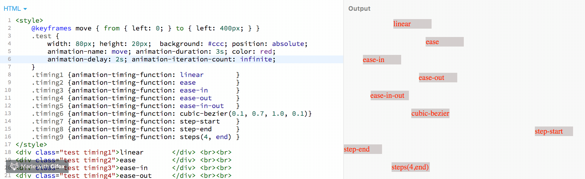
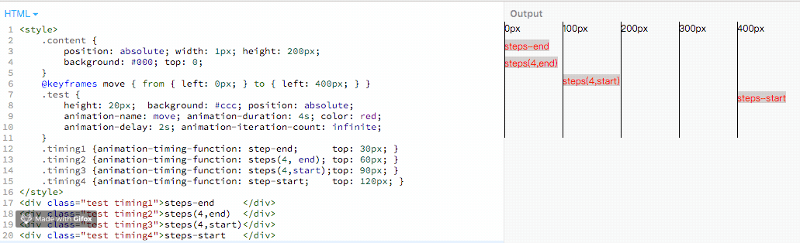
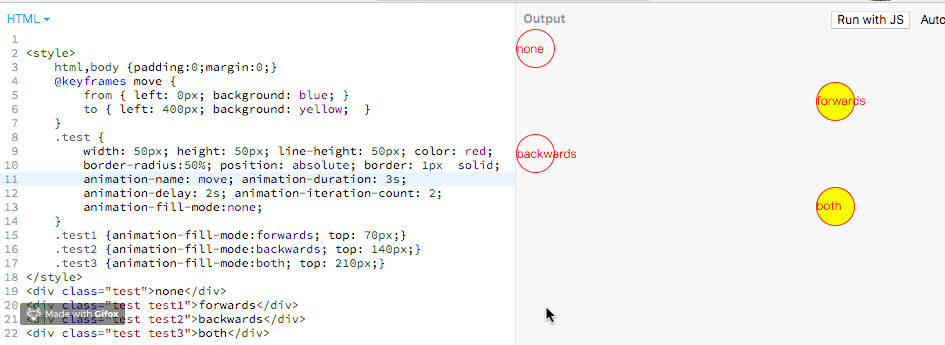

[[TOC]]
[TOC]

# Animation:动画

**CSS animations** 使得可以将从一个CSS样式配置转换到另一个CSS样式配置。

动画包括两个部分:

- 描述动画的样式规则
- 用于指定动画开始、结束以及中间点样式的关键帧。

相较于传统的脚本实现动画技术，使用CSS动画有三个主要优点：

1. 能够非常容易地创建简单动画，你甚至不需要了解JavaScript就能创建动画。
2. 动画运行效果良好，甚至在低性能的系统上。渲染引擎会使用跳帧或者其他技术以保证动画表现尽可能的流畅。而使用JavaScript实现的动画通常表现不佳（除非经过很好的设计）。
3. 让浏览器控制动画序列，允许浏览器优化性能和效果，如降低位于隐藏选项卡中的动画更新频率。

## 1. @keyframes:关键帧

[CSS3中的关键帧 MDN](https://developer.mozilla.org/zh-CN/docs/Web/CSS/@keyframes)

@keyframes是定义动画的表现。
要使用关键帧, 先创建一个带名称的`@keyframes`规则，以便后续使用 [`animation-name`](https://developer.mozilla.org/zh-CN/docs/Web/CSS/animation-name) 这个属性来将一个动画同其关键帧声明匹配。每个`@keyframes` 规则包含多个关键帧，也就是一段样式块语句，每个关键帧有一个百分比值作为名称，代表在动画进行中，在哪个阶段触发这个帧所包含的样式。
您可以按任意顺序列出关键帧百分比；他们将按照其应该发生的顺序来处理。

例子：

```css
@keyframes slidein {
  from { 
    margin-left: 100%; width: 300%; 
  }
  to { margin-left: 0%; width: 100%; }
}
/* 如果一个关键帧中没有出现其他关键帧中的属性，那么这个属性将使用插值(不能使用插值的属性除外, 这些属性会被忽略掉)。例如： */
@keyframes identifier {
  0% { top: 0; left: 0; }
  30% { top: 50px; }
  68%, 72% { left: 50px; }
  100% { top: 100px; left: 100%; }
}
```

1、命名规范

由大小写不敏感的字母a-z、数字0-9、下划线(_)和/或横线(-)组成。第一个非横线字符必须是字母，数字不能在字母前面，不允许两个横线出现在开始位置。来自 [animation-name MDN](https://developer.mozilla.org/zh-CN/docs/Web/CSS/animation-name)

命名尽量不要与animation其他属性的变量重名，否则在使用时候会和其他属性冲突。

```javascript
// 命名需要遵循以下规则
const rIsInvalid = /^--|^[0-9]+-|^(?:unset|initial|inherit|none)$/
    , rIsValid = /^[0-9a-z-_\\]+$/i
function isValidAnimationName(animationName: string): boolean{
  return !rIsInvalid.test(animationName) && rIsValid(animationName)
}
```

2、`<Animation Time Offset>` 关键帧时间点的取值

关键帧使用百分比来指定动画发生的时间点。`0%`表示动画的第一时刻，`100%`表示动画的最终时刻。因为这两个时间点十分重要，所以还有特殊的别名：`from(0%)`和`to(100%)`。这两个都是可选的，若`from`或`to`未指定，则浏览器使用计算值开始或结束动画。也可包含额外可选的关键帧，描述动画开始和结束之间的状态。

3、@keyframes的名字重复怎么办
@keyframes CSS规则不支持层叠样式，因此当出现多个同名keyframes，那么仅最后出现的那个有效。

```css
/* 无效 */
@keyframes rotate {
  from { transform: rotate(0deg); }
  to { transform: rotate(360deg); }
}
/* 生效 */
@keyframes rotate {
  from { transform: rotate(90deg); }
  to { transform: rotate(-360deg); }
}
```

4、关键帧时间点重复怎么办
与@keyframes CSS规则一样，标准规定相同的关键帧不产生层叠，仅最后出现的认定为有效。
但实际上FireFox14+和Chrome均将关键帧设计为可层叠的。
为避免出错，最好不好写重复的关键帧时间点。

```css
@keyframes rotate {
  from { transform: rotate(0deg); }
  from { background: red; }
  /* 上述两条time offset实际上等价于  from { transform: rotate(0deg); background: red; } */
  to {
    transform: rotate(360deg);
    background: yellow;
  }
}
```

5、`!important`导致属性失效
一般情况下使用`!important`会让CSS属性获得最高权重，但在@keyframes下却会导致该CSS属性失效。

```less
@keyframes rotate {
  from {
    transform: rotate(90deg);
    background: red!important; /* background属性无效 */
  }
  to { transform: rotate(-360deg); }
}
```

6、必须提供至少两个关键帧

```less
/* 不会根据缓动函数产生动画效果，而是在动画持续时间的最后瞬间移动过去 */
@keyframes move-left{
   to {
       left: 100px;
   }
}
```

## 2 配置动画效果

创建动画序列，需要使用[`animation`](https://developer.mozilla.org/zh-CN/docs/Web/CSS/animation)属性或其子属性，该属性允许配置动画时间、时长以及其他动画细节，但该属性不能配置动画的实际表现，动画的实际表现是由 [`@keyframes`](https://developer.mozilla.org/zh-CN/docs/Web/CSS/@keyframes)规则实现， 

### 2.1 animation-name、animation-duration、animation-delay

- animation-name

  属性指定应用的一系列动画，每个名称代表一个由[`@keyframes`](https://developer.mozilla.org/zh-CN/docs/Web/CSS/@keyframes)定义的动画序列。

  默认值为none

- animation-duration

  一个动画周期的时长，单位为秒(s)或者毫秒(ms)，无单位值无效。

  默认值为0s，表示无动画。

- animation-delay

  定义动画于何时开始，即从动画应用在元素上到动画开始的这段时间的长度。该值可用单位为秒(s)和毫秒(ms)。如果未设置单位，定义无效。

  默认值为0s，代表动画在应用到元素上后立即开始执行。

上面三个属性代码例子：

```html
<style>
    @keyframes move {
        from { left: 0; }
        to { left: 200px; }
    }
    .test {
        width: 100px; height: 100px; border: 1px solid; background: red;
        position: absolute;
        animation-name: move;
        animation-duration: 3s;
        animation-delay: 1s;
        animation-iteration-count: infinite;	/*无限循环播放动画，下面有讲解*/
    }
</style>
<div class="test"></div>
```

https://jsbin.com/kegefuh/5/edit?html,output


### 2.2 animation-timing-function:动画运动的节奏

animation-timing-function属性定义CSS动画在每一动画周期中执行的节奏。

可选的值：
linear、ease、ease-in、ease-ou、ease-in-ou、
steps(4, end)、step-start、step-end
cubic-bezier(0.1, 0.7, 1.0, 0.1)

代码示例：

```html
<style>
    @keyframes move { from { left: 0; } to { left: 400px; } }
    .test {
        width: 80px; height: 20px;  background: #ccc; position: absolute;
        animation-name: move; animation-duration: 3s; color: red;
        animation-delay: 2s; animation-iteration-count: infinite;
    }
    .timing1 {animation-timing-function: linear        } /*从开始到结束都是匀速运动*/
    .timing2 {animation-timing-function: ease          } /*开始慢，中间块，最后慢*/
    .timing3 {animation-timing-function: ease-in       } /*动画以低速开始*/
    .timing4 {animation-timing-function: ease-out      } /*动画以低速结束*/
    .timing5 {animation-timing-function: ease-in-out   } /*动画以低速开始和结束*/
    .timing6 {animation-timing-function: cubic-bezier(0.1, 0.7, 1.0, 0.1)}
    .timing7 {animation-timing-function: step-start    } /*直接在终点不变*/
    .timing8 {animation-timing-function: step-end      } /*直接在开始不变*/
    .timing9 {animation-timing-function: steps(4, end) } /*分4次跳跃*/
</style>
<div class="test timing1">linear       </div> <br><br>
<div class="test timing2">ease         </div> <br><br>
<div class="test timing3">ease-in      </div> <br><br>
<div class="test timing4">ease-out     </div> <br><br>
<div class="test timing5">ease-in-out  </div> <br><br>
<div class="test timing6">cubic-bezier </div> <br><br>
<div class="test timing7">step-start   </div> <br><br>
<div class="test timing8">step-end     </div> <br><br>
<div class="test timing9">steps(4,end) </div> <br><br>
```



在线代码查看：https://jsbin.com/kegefuh/8/edit?html,output

- 关于cubic-bezier(0.1, 0.7, 1.0, 0.1)

  cubic-bezier定义了一条立方贝塞尔曲线，这些曲线是连续的，一般用于动画的平滑变换，也被称为缓动函数（*easing functions*）。

  一条立方贝塞尔曲线需要四个点来定义，如下图，P0 、P1 、P2 和 P3。P0 和 P3 是起点和终点，这两个点被作为比例固定在坐标系上，横轴为时间比例，纵轴为完成状态。P0 是 `(0, 0)，表示初始时间和初始状态。`P3 是 `(1, 1)` ，表示终止时间和终止状态。

  P1的坐标(x,y)对应了`cubic-bezier(n,n,n,n)`的前两个n值，P2坐标对应了后两个n值。cubic-bezier函数根据P1、P2两个点就能画出一条曲线，这条曲线就是动画运动的轨迹。

  cubic-bezier的几个特定值：

  cubic-bezier(.25, .1, .25, 1): ease

  cubic-bezier(0, 0, 1, 1)      :liner (或者cubic-bezier(1, 1, 0, 0))

  cubic-bezier(.42, 0, 1, 1)   : ease-in

  cubic-bezier(0, 0, .58, 1)   : ease-out

  cubic-bezier(.42, 0, .58, 1) : ease-in-out

  ***注意：***P1、P2的横坐标都在[0,1]范围内时，三次贝塞尔曲线才是是有效的。

  一个在线网站可以在线画出曲线测试，方便自定义动画运动轨迹：https://cubic-bezier.com/

  

- 关于steps(4,end)

  steps()是一个timing function(定时函数)，允许我们将动画或者过渡分割成段，而不是从一种状态持续到另一种状态的过渡。

  语法：steps(number_of_steps, direction)

  第一个参数(number_of_steps):一个正整数，表示一个动画周期分割的段数

  第二个参数(direction):表示在一个分割的段数时间内，物体应该在的位置，该参数有2个选项，`start`、`end`，默认值是`end`。

  `start`表示在动画开始时，动画的第一段将会马上完成。它会立即跳到第一段的结束位置并且保持这样的状态直到第一步的持续时间结束。后面的每一帧都将按照此模式来完成动画。

  `end`表示动画执行时，在每一帧里，动画保持当前状态直到这一段的持续时间完成，才会跳到下一步的起点，后面的每一帧都按照这个模式来进行，在最后一帧的起点，等到这一帧的持续时间结束，整个动画的执行也已经结束，执行动画的元素来不及跳到这一帧的终点，直接回到了整个动画起点。

  在持续运动状态中，在一段时间内，动画会运动一段距离，在这段距离里会有一个起点和终点，由于steps函数是一段时间才跳一次，那么在这一段时间里是应该在起点等待(end)，还是在终点等待(start)。第二个参数就是表示每段等待时间内，物体应该处于的位置。

  ```html
  <style>
      .content {
          position: absolute; width: 1px; height: 200px;
          background: #000; top: 0;
      }
      @keyframes move { from { left: 0px; } to { left: 400px; } }
      .test {
          height: 20px;  background: #ccc; position: absolute;
          animation-name: move; animation-duration: 4s; color: red;
          animation-delay: 2s; animation-iteration-count: infinite;
      }
      .timing1 {animation-timing-function: step-end;      top: 30px; }
      .timing2 {animation-timing-function: steps(4, end); top: 60px; }
      .timing3 {animation-timing-function: steps(4,start);top: 90px; }
      .timing4 {animation-timing-function: step-start;    top: 120px; }
  </style>
  <div class="test timing1">steps-end     </div>
  <div class="test timing2">steps(4,end)  </div>
  <div class="test timing3">steps(4,start)</div>
  <div class="test timing4">steps-start   </div>
  
  <div class="content" style="left: 0">0px</div>
  <div class="content" style="left: 100px">100px</div>
  <div class="content" style="left: 200px">200px</div>
  <div class="content" style="left: 300px">300px</div>
  ```

  

  https://jsbin.com/kegefuh/14/edit?html,output

  参考资料：

  [animation-timing-function知识点以及属性值steps()详解](https://blog.csdn.net/qq_23269747/article/details/76152689)

  [timing-function](https://developer.mozilla.org/zh-CN/docs/Web/CSS/timing-function)

### 2.3 animation-iteration-count、animation-fill-mode

- animation-iteration-count

  定义动画重复播放的次数，可选的值：

  整数(3):重复播放3次

  小数(3.6)：重复播放3次，然后在播放60%的动画

  infinite：无限循环

  默认值是1

  ```css
  animation-iteration-count: infinite;
  animation-iteration-count: 3;
  animation-iteration-count: 2.3;
  animation-iteration-count: 2, 0, infinite;
  ```

- animation-fill-mode

  用于设置动画开始前和结束后是否应@keyframes关键帧中`0%`和`100%`的样式。

  可选的值：

  `none`：默认值，不应用任何样式，动画结束后，恢复到最初样式

  `forwards`: 动画结束后，应用@keyframes关键帧中`100%`的样式

  `backwards`:在动画执行开始前，也就是有等待时间，应用@keyframes关键帧中`0%`的样式

  `both`:同时拥有`forwards`和`backwards`两个作用。

  注意：

  1、默认值，动画结束后会恢复到动画前的样式

  2、设置backwards时，`<animation-delay>`值大于0才能看到效果

   ```html
  <style>
      html,body {padding:0;margin:0;}
      @keyframes move { 
          from { left: 0px; background: blue; }
          to { left: 400px; background: yellow;  } 
      }
      .test {
          width: 50px; height: 50px; line-height: 50px; color: red;
          border-radius:50%; position: absolute; border: 1px  solid;
          animation-name: move; animation-duration: 3s;
          animation-delay: 2s; animation-iteration-count: 2;
          animation-fill-mode:none;
      }
      .test1 {animation-fill-mode:forwards; top: 70px;}
      .test2 {animation-fill-mode:backwards; top: 140px;}
      .test3 {animation-fill-mode:both; top: 210px;}
  </style>
  <div class="test">none</div>
  <div class="test test1">forwards</div>
  <div class="test test2">backwards</div>
  <div class="test test3">both</div>
   ```

  https://jsbin.com/sebesep/3/edit?html,output

  


### 2.4 animation-direction

表示动画的播放顺序，多用于重复动画时的效果。

可选值：

`normal`: 默认值，正向播放，从起点到终点，关键帧从from到to，如果是循环，动画重置到起点重新开始

`reverse`: 反向播放，从终点到起点，关键帧从to到from，如果是循环，动画重置到终点重新开始

`alternate`: 第一次运行时是正向的，然后下一次是反向的，后面依次循环。关键帧from到to，to到from。同时，运动时间函数也相应改变，from到to是ease-in，to到from是ease-out。

`alternate-reverse`:跟alternate相反，第一次运行时是反向的，然后下一次是正向，后面依次循环。关键帧to到from，from到to。

```html
<style>
    html,body {padding:0;margin:0;}
    @keyframes move { 
        from { left: 0px; background: blue; }
        to { left: 400px; background: yellow;  } 
    }
    .test {
        height: 50px; line-height: 50px; color: red;
        border-radius:50%; position: absolute; border: 1px  solid;
        animation-name: move; animation-duration: 3s;
        animation-delay: 7s; animation-iteration-count: infinite;
        animation-direction: normal;
    }
    .test1 {animation-direction: reverse; top: 70px;}
    .test2 {  top: 140px;}
    .test3 {animation-direction: alternate-reverse; top: 210px;}
</style>
<div class="test">none</div>
<div class="test test1">reverse</div>
<div class="test test2">alternate</div>
<div class="test test3">alternate-reverse</div>
```

https://jsbin.com/sebesep/5/edit?html,output


### 2.5 animation-play-state

定义一个动画是否运行或者暂停。可以通过查询它来确定动画是否正在运行。另外，它的值可以被设置为暂停和恢复的动画的重放。

**注意：通过这个属性，我们仅能实现暂停和继续播放的效果，无法实现重播，更别说回放了**

可选值：

`running`:动画正在运行。

`paused`：动画被暂停。

```html
<style>
    html,body {padding:0;margin:0;}
    @keyframes move { 
        from { left: 0px; background: blue; }
        to { left: 400px; background: yellow;  } 
    }
    .test {
        height: 50px; line-height: 50px; color: red;
        border-radius:50%; position: absolute; border: 1px  solid;
        animation-name: move; animation-duration: 3s;
        animation-iteration-count: infinite; top: 60px;
        animation-direction: alternate;
    }
    .test:hover {
        animation-play-state: paused;
    }
</style>
<div class="test">animation-play-state</div>
```

https://jsbin.com/sebesep/7/edit?html,output


### 2.6 animation

 **animation** 属性是 [`animation-name`](https://developer.mozilla.org/zh-CN/docs/Web/CSS/animation-name)，[`animation-duration`](https://developer.mozilla.org/zh-CN/docs/Web/CSS/animation-duration), [`animation-timing-function`](https://developer.mozilla.org/zh-CN/docs/Web/CSS/animation-timing-function)，[`animation-delay`](https://developer.mozilla.org/zh-CN/docs/Web/CSS/animation-delay)，[`animation-iteration-count`](https://developer.mozilla.org/zh-CN/docs/Web/CSS/animation-iteration-count)，[`animation-direction`](https://developer.mozilla.org/zh-CN/docs/Web/CSS/animation-direction)，[`animation-fill-mode`](https://developer.mozilla.org/zh-CN/docs/Web/CSS/animation-fill-mode) 和 [`animation-play-state`](https://developer.mozilla.org/zh-CN/docs/Web/CSS/animation-play-state) 属性的一个简写属性形式。

`animation` 属性用来指定一组或多组动画，每组之间用逗号相隔。

在`animation`的一组动画里：

不需要的属性可以不写，系统会取默认值。

`animation`中对于时间参数有顺序要求，第一个时间值会被分配给animation-duratio，第二个时间值分配给animation-delay，其他参数顺序可以打乱。

动画名animation-name的命名要与animation其他属性的关键字区分开。免得产生混乱。


示例：

```less
.box.rotate {
  animation: rotate 10s infinite alternate;
}
```


## 参考资料

[CSS3（三）Animation 入门详解 CSDN](https://blog.csdn.net/u013243347/article/details/79976352)

[CSS Animations MDN](https://developer.mozilla.org/zh-CN/docs/Web/CSS/CSS_Animations)

[使用 CSS 动画 MDN](https://developer.mozilla.org/zh-CN/docs/Web/CSS/CSS_Animations/Using_CSS_animations)

[CSS3中的关键帧 MDN](https://developer.mozilla.org/zh-CN/docs/Web/CSS/@keyframes)

[CSS魔法堂：更丰富的前端动效by CSS Animation 来自segmentfault](https://segmentfault.com/a/1190000015588193)

[时间函数 `cubic-bezier` 在线网站](https://cubic-bezier.com/)

[`cubic-bezier` 中文版在线网站](http://yisibl.github.io/cubic-bezier/#.55,.49,.83,.67)

[【译】css动画里的steps()用法详解](https://segmentfault.com/a/1190000007042048)