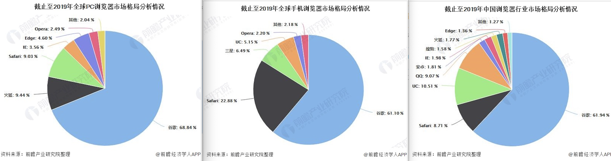
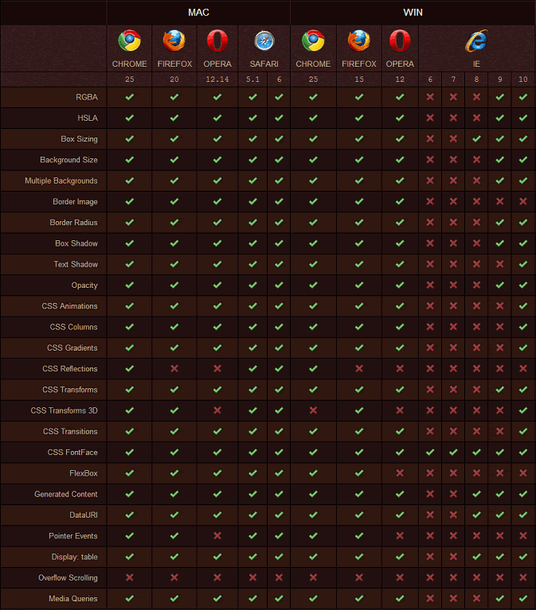
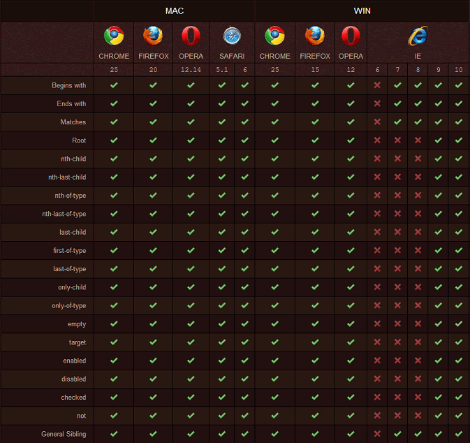

[[TOC]]

[TOC]

# 四、css兼容性

[caniuse.com](http://caniuse.com) 查看CSS属性兼容

同一份代码，有的浏览器效果正常，有的不正常

- 不正常的原因是什么？(不支持? bug？)
- 如何让它展示正常?(条件注释？ 单独Hack？)
- 同一产品，版本越老 bug 越多
- 同一产品，版本越新，功能越多
- 不同产品，不同标准，不同实现方式



## 1. 浏览器兼容性问题原因

不同浏览器对同一段代码有不同的解析，导致页面显示效果不统一的情况。

不同浏览器对CSS的解析认识不完全一样，因此会导致生成的页面效果不一样，得不到我们所需要的页面效果。

造成浏览器兼容性的根本原因，是浏览器的内核不同导致的：

| 浏览器                          | 内核                                                         | JS引擎               |
| ------------------------------- | ------------------------------------------------------------ | -------------------- |
| IE                              | Trident,Edge使用EdgeHTML内核(Trident分支)                    | JScript              |
| Firefox                         | Gecko                                                        | TraceMonkey          |
| Chrome                          | WebKit, Blink(2013年4月开始转换为Blink,算是Webkit的分支,一直引用至今) | V8                   |
| Safari                          | WebKit                                                       | SquirrelFish Extreme |
| Opera                           | Presto(2013年后加入谷歌阵营，弃用了Presto)                   | Carakan              |
| 360、UC、QQ、搜狗、2345等浏览器 | Trident + Chromium                                           |                      |

## 2. 解决兼容问题

### 2.1 处理兼容问题的思路

- 要不要做

  - 产品的角度（产品的受众、受众的浏览器比例、效果优先还是基本功能优先）
  - 成本的角度 (有无必要做某件事)

- 做到什么程度

  - 让哪些浏览器支持哪些效果

- 如何做

  - 根据兼容需求选择技术框架/库(jquery)
  - 根据兼容需求选择兼容工具([html5shiv.js](https://github.com/aFarkas/html5shiv)、[respond.js](https://github.com/scottjehl/Respond)、[css reset](https://segmentfault.com/a/1190000003021766)、[normalize.css](https://github.com/necolas/normalize.css)、[Modernizr](https://github.com/Modernizr/Modernizr))
  - [postCSS](https://github.com/postcss/postcss)
  - 条件注释、CSS Hack、js 能力检测做一些修补

### 2.2 使用合适的框架

1. Bootstrap (>=ie8)
2. jQuery 1.~ (>=ie6), jQuery 2.~ (>=ie9)
3. Vue (>= ie9)
4. react (>= ie9)
5. ...

### 2.3 渐进增强和优雅降级

- `渐进增强`(progressive enhancement): 针对低版本浏览器进行构建页面，保证最基本的功能，然后再针对高级浏览器进行效果、交互等改进和追加功能达到更好的用户体验
- `优雅降级` (graceful degradation): 一开始就构建完整的功能，然后再针对低版本浏览器进行兼容。

[stackoverflow-渐进增强和优雅降级的区别](http://stackoverflow.com/questions/2550431/what-is-the-difference-between-progressive-enhancement-and-graceful-degradation)

### 2.4 使用CSS Hack解决兼容性问题

[browserhacks](http://browserhacks.com/)：查 Hack 的写法

根据浏览器特性：

1、错误处理：遇到CSS无法识别的代码时(写错了bg、旧浏览器不识别CSS3)，不会报错，会跳过这些无法识别的代码继续执行后面的代码。

2、拥有自己独特CSS属性：由于历史原因，不同浏览器及浏览器内核的不同版本，有自己独特的CSS属性，这些属性在CSS标准之外。

根据浏览器的特性，可以对特定的浏览器写特定的CSS，达到相对一致的想要的页面效果。

CSS Hack大致有3种表现形式，`CSS属性前缀法`、`选择器前缀法`以及`IE条件注释法`（即HTML头部引用if IE）Hack，实际项目中CSS Hack大部分是针对IE浏览器不同版本之间的表现差异而引入的。

1、属性前缀法(即类内部Hack)：例如 IE6能识别下划线`_`和星号` *`，IE7能识别星号` *`，但不能识别下划线`_`，IE6~IE10都认识`\9`，但firefox前述三个都不能认识

```css
.box{
  color: red;
  _color: blue; /*ie6*/
  *color: pink; /*ie67*/
  color: yellow\9;  /*ie/edge 6-8*/
}
.clearfix:after{ content: ''; display: block; clear: both; }
.clearfix{
  *zoom: 1; /* 仅对ie67有效 */
}
```

2、选择器前缀法(即选择器Hack)

- Webkit 类型浏览器（如 Safari、Chrome）的私有属性是以`-webkit-`前缀开始
- Gecko 类型的浏览器（如 Firefox）的私有属性是以`-moz-`前缀开始
- Opera 浏览器的私有属性是以`-o-`前缀开始
- 而 Internet Explorer 浏览器的私有属性是以`-ms-`前缀开始（目前只有 IE 8+ 支持`-ms-`前缀）
- (没见过)Konqueror 类型的浏览器的私有属性是以`-khtml-`前缀开始

```css
.transition{
  transition: all .5s;
  -o-transition: all .5s;
  -moz-transition: all .5s;
  -webkit-transition: all .5s;
}
```

3、IE条件注释法(即HTML条件注释Hack)：在HTML源码中被IE有条件解释的语句。条件注释可被用来向IE提供及隐藏代码。条件注释的页面在 IE9 以下中可正常工作，但在 IE10 以上无法正常工作。 [IE10不再支持条件注释](https://msdn.microsoft.com/zh-cn/library/ie/hh801214(v=vs.85).aspx)。这类Hack不仅对CSS生效，对写在判断语句里面的所有代码都会生效。

```html
<!--[if IE 6]>
<p>你使用的是IE6浏览器</p>
<![endif]-->
<!--[if !IE]><!-->
<script>alert(1);</script>
<!--<![endif]-->

<!–-[if IE 7]>
<link rel="stylesheet" href="ie7.css" type="text/css" />
<![endif]–->

<!--[if lt IE 9]>
<script src="https://oss.maxcdn.com/html5shiv/3.7.3/html5shiv.min.js"></script>
<script src="https://oss.maxcdn.com/respond/1.4.2/respond.min.js"></script>
<![endif]-->
```

| 项目 | 范例                | 说明        |
| ---- | ------------------- | ----------- |
| ！   | [if !IE]            | 非IE        |
| lt   | [if lt IE 5.5]      | 小于IE 5.5  |
| lte  | [if lte IE 6]       | 小于等于IE6 |
| gt   | [if gt IE 5]        | 大于 IE5    |
| gte  | [if gte IE 7]       | 大于等于IE7 |
| \|   | [if (IE 6)\|(IE 7)] | IE6或者IE7  |


## 3. 常见属性的兼容情况

- `inline-block`: >=ie8 IE8以上 `inline-block` 才生效
- `min-width/min-height`: >=ie8
- `:before,:after`: >=ie8
- `div:hover`: >=ie7
- `inline-block`: >=ie8
- `background-size`: >=ie9
- 圆角: >= ie9
- 阴影: >= ie9
- 动画/渐变: >= ie10

### 3.1 IE11中有兼容性问题的属性

#### 3.1.1 unset属性会失效

有的属性，比如width设置unset后，在ie11浏览器中会无效，需要注意。

解决的办法是给属性设置成默认值就可以了：

```less
.header {
	background-color: inherit; // inherit:规定应该从父元素继承属性
  width: auto;
  height: initial; // initial: 设置成默认值(IE 不支持该关键字)
}
```

#### 3.1.2 部分行内块元素没有水平对齐，添加`vertical-align: middle;`


### 3.2 如何调试老掉牙的 IE

1、安装虚拟机：老的浏览器是要在 window XP 上安装，推荐使用虚拟机安装调试。   

2、给元素添加border

## 4. 浏览器对CSS3的支持情况

1、CSS3 属性支持情况如下图所示，完全支持 CSS3 属性的浏览器有 Chrome 和 Safari，而且不管是 Mac 平台还是 Windows 平台全支持：




2、CSS3 选择器支持情况如下图所示。除了 IE 家族和 Firefox3，其他几乎全部支持，Chrome、Safari、Firefox 3.6、Opera 10.5 最好：




## 参考资料

一些和兼容相关的开发利器:

[html5shiv.js](https://github.com/aFarkas/html5shiv)
[respond.js](https://github.com/scottjehl/Respond)
[css reset](https://segmentfault.com/a/1190000003021766)

修改浏览器样式修补，让各种浏览器样式保持统一：[normalize.css](https://github.com/necolas/normalize.css)

Modernizr.js既能给老版本浏览器打补丁，又能保证新浏览器渐进增强的用户体验：

[Modernizr](https://github.com/Modernizr/Modernizr)

[JS进阶篇--前端的瑞士军刀Modernizr.js](https://segmentfault.com/a/1190000003820989)
