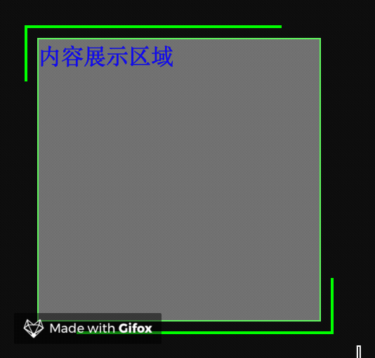

[[TOC]]

[TOC]

# CSS一些常见效果代码片段

## 1. 矩形边框移动动画

效果如下图：



代码：

```html
<style>
  .cont{ width:500px; background: #101010; padding: 30px; }
  .box {
    position: relative;
    width: 200px; height: 200px; color: blue;
    background: #666666; border: 1px solid #5EF75E;
  }
  .box:before, .box:after{
    content: ""; display: block; position: absolute;
    width:220px; height:220px;
    top: -10px; left: -10px; z-index:10;
    border:2px solid #00FF00;
    box-sizing: border-box;
    -webkit-animation: clipAni 6s infinite linear;
  }
  .box:before { -webkit-animation-delay: -3s; }
  @keyframes  clipAni{
    0%,100%{ clip:rect(0px,220px,220px,217px); }
    25%{ clip:rect(0px,220px,3px,0px); }
    50%{ clip:rect(0px,3px,220px,0px); }
    75%{ clip:rect(217px,220px,220px,0px); }            
  }  
</style>
<body>
  <div class="cont">
    <div class="box">内容展示区域</div>
  </div>
</body>
```

