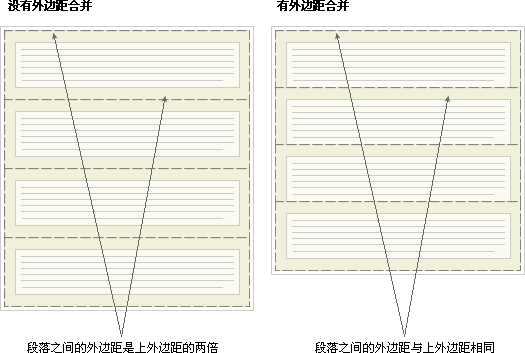

[[TOC]]

[TOC]


# margin外边距合并

**外边距合并指的是，当两个垂直外边距相遇时，它们将形成一个外边距。**

**合并后的外边距的高度等于两个发生合并的外边距的高度中的较大者。**

外边距合并初看上去可能有点奇怪，但是实际上，它是有意义的。以由几个段落组成的典型文本页面为例。第一个段落上面的空间等于段落的上外边距。如果没有外边距合并，后续所有段落之间的外边距都将是相邻上外边距和下外边距的和。这意味着段落之间的空间是页面顶部的两倍。如果发生外边距合并，段落之间的上外边距和下外边距就合并在一起，这样各处的距离就一致了。



## 1. 外边距合并的三种情况

### 1.1 兄弟元素上下margin合并

当一个元素出现在另一个元素上面时，第一个元素的下外边距与第二个元素的上外边距会发生合并。


### 1.2 父子元素上下margin合并

当一个元素包含在另一个元素中时（假设没有内边距或边框把外边距分隔开），它们的上和/或下外边距也会发生合并。


### 1.3 空元素自身合并

假设有一个空元素，它有外边距，但是没有边框或填充。在这种情况下，上外边距与下外边距就碰到了一起，它们会发生合并：


如果这个外边距遇到另一个元素的外边距，它还会发生合并：


## 2. 阻止外边距合并方法

### 2.1 兄弟元素上下合并解决

```html
<style>
  .container {
    width: 400px; height: 600px; border: 1px solid;
  }

  .box {
    width: 300px; height: 100px;
    margin: 50px;
    background-color: green;
  }
</style>
<div class="container">
  <div class="box">一号盒子</div>
  <div class="box">二号盒子</div>
  <div class="box">三号盒子</div>
</div>
```


-   一个元素设置`display: inline-block`

    这个方法由于改变了块级元素为行内元素，因此宽度需要重新设置为100%或固定宽度

-   在兄弟元素间在加一个元素，设置`border: 1px solid 背景色`

-   触发BFC

http://js.jirengu.com/xogor/1/edit

```html
<style>
  .container { width: 400px; height: 600px; border: 1px solid;}
  .box {
    width: 300px; height: 100px;margin: 50px; background-color: green;
  }
  .father:after { content: ''; display: block; clear: both; }
  .sun { float: left;}
</style>
<div class="container">
  <div class="father clearfix">
    <div class="box sun">一号盒子</div>
    <div class="box sun">二号盒子</div>
  </div>
  <div class="box">三号盒子</div>
</div>
```


### 2.2 父子元素margin合并解决


-   父元素添加border或者padding隔离
-   父元素触发BFC

## 参考资料


[CSS 外边距合并 w3school](https://www.w3school.com.cn/css/css_margin_collapsing.asp)

