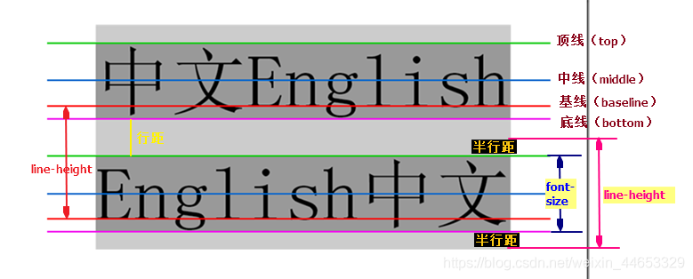
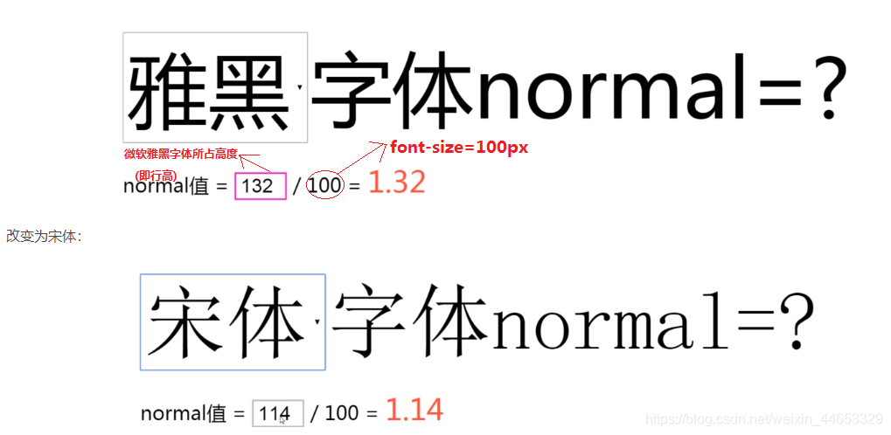
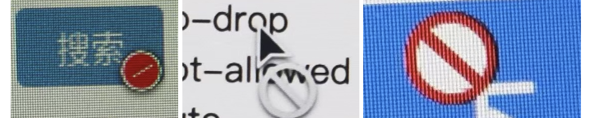

[[TOC]]

[TOC]


# CSS常用属性

## 1. 关键字initial、inherit、unset

```css
.attr {
  color: initial;
  background-color: inherit;
  baorder: unset;
}
```

-   initial

    `initial` 关键字用于设置 CSS 属性为它的默认值，可作用于任何 CSS 样式。（IE 不支持该关键字）

-   inherit

    设置属性继承，每一个 CSS 属性都有一个特性，这个属性必然是默认继承的 (`inherited: Yes`) 或者是默认不继承的 (`inherited: no`)其中之一，我们可以在 [MDN](https://developer.mozilla.org/zh-CN/docs/Web/CSS/Reference) 上通过这个索引查找，判断一个属性的是否继承特性。

-   unset

    名如其意，`unset` 关键字我们可以简单理解为不设置。其实，它是关键字 `initial` 和 `inherit` 的组合。

    什么意思呢？也就是当我们给一个 CSS 属性设置了 `unset` 的话：

    1.  如果该属性是默认继承属性，该值等同于 `inherit`
    2.  如果该属性是非继承属性，该值等同于 `initial`

## 2. zoom属性

[zoom](https://developer.mozilla.org/en-US/docs/Web/CSS/zoom)属性在IE中用到的比较多的属性：

1、设置元素的缩放比例。2、触发IE的haslayout属性，清除浮动、秦楚margin重叠等作用。

zoom属性火狐浏览器不支持，webkit内核浏览器支持了此属性。 zoom在非IE浏览器中表现为设置放大或缩小，但是由于这个属性是一个不标准的css属性，因此一般在非IE浏览器中不用zoom来实现元素的缩放效果，现在大多用css3的transform属性来实现元素的缩放。

_zoom是CSS hack中专对IE6起作用的部分。

- zoom 属性用法

  zoom : normal | number 

  normal :　 默认值。使用对象的实际尺寸 
  number :　 百分数 | 无符号浮点实数。浮点实数值为1.0或百分数为100%时相当于此属性的 normal 值用白话讲解就是zoom:后面的数字即放大的倍数，可以是数值，也可以是百分比。如：zoom:1，zoom:120%。而这个属性只要在IE中才起作用，所以很少用到它的实际用途，而最经常用到作用是清除浮动等。

  ```html
  <style>
    p.small { zoom: 75%; }
    p.normal { zoom: normal; }
    p.big { zoom: 2.5; }
    p { display: inline-block; }
  </style>
  <p class="small">Small</p>
  <p class="normal">Normal</p>
  <p class="big">Big</p>
  ```

  

## 3. line-height属性详解

**line-height，又称行高，指的是两行文字基线之间的距离，又可以称为这行文字所占的高度。**



图中两行基线之间的距离就是行高。上一行的底线和下一行的底线之间的距离就是行距，`行距 = line-height - font-size`。

1、取值：

| 值      | 描述                                                         |
| ------- | ------------------------------------------------------------ |
| normal  | 默认值，设置合理的行间距。与元素字体关联，同时在不同的浏览器之间也有区别 |
| number  | 设置数字，此数字会与当前的字体尺寸相乘来设置行间距。         |
| length  | 设置固定的行间距。                                           |
| %       | 基于当前字体尺寸的百分比行间距。                             |
| inherit | 规定应该从父元素继承 line-height 属性的值。                  |



图中可见，不同的字体，`normal`的取值是不确定的，所以一般在开发时会会重置`line-height`样式。

2、不同取值之间的区别：

| 设置方式 | line-height                            | 计算后的line-height                  | 子元素(font-size: 30px)继承的line-height              |
| -------- | -------------------------------------- | ------------------------------------ | ----------------------------------------------------- |
| normal   | 默认。不同浏览器，不同字体都会有所区别 | -                                    | -                                                     |
| number   | line-height:1.2                        | 自身 font-size(16px) * 1.2 = 19.2px  | 继承 1.2，line-height = 自身font-size(30px)*1.2=36px  |
| %        | line-height:120%                       | 自身 font-size(16px) * 120% = 19.2px | 继承父元素计算后得到的line-height: 19px,而不是 `120%` |
| length   | line-height: 20px                      | 不用计算                             | line-height: 20px                                     |
| inherit  | 父元素的line-height                    | 不用计算                             | 父元素的line-height值                                 |

整理、转载自：https://blog.csdn.net/weixin_44653329/article/details/108172478

## 4. cursor属性：设置鼠标指针样式

cursor属性定义了鼠标指针放在一个元素边界范围内时所用的光标形状。

> 默认值：auto     
> 继承：yes      
> 版本： CSS2       
> JavaScript语法：*object*.style.cursor="crosshair"

常用属性取值：

- pointer：一只小手。一般用来表示可以点击
- not-allowed：禁用样式，不同的系统禁用样式不一样
- no-drop：跟not-allowed 一样
- text：输入文本的样式
- wait：此光标指示程序正忙(通常是一只表或沙漏)
- help：帮助（通常是一个问号或一个气球）
- move：表示对象可被移动
- crosshair：光标呈现为十字线
- auto：默认。浏览器设置的光标
- default：默认光标（通常是一个箭头）
- e-resize、ne-resize、nw-resize、n-resize、se-resize、sw-resize、s-resize、w-resize：光标指向各种角度

代码示例：

```html
<span style="cursor:pointer">一只小手止 pointer</span><br>
<span style="cursor:not-allowed">光标禁止 not-allowed</span><br>
<span style="cursor:no-drop">光标禁止 no-drop</span><br>
<span style="cursor:text">输入文本的样式 text</span><br>
<span style="cursor:wait">此光标指示程序正忙 wait</span><br>
<span style="cursor:help">帮助 help</span><br>
<span style="cursor:move">表示对象可被移动 move</span><br>
<span style="cursor:crosshair">十字线 crosshair</span><br>
<span style="cursor:auto">默认。浏览器设置的光标 auto</span><br>
<span style="cursor:default">默认光标(通常是一个箭头)default</span><br>
<span style="cursor:n-resize">n-向上↑</span><br>
<span style="cursor:ne-resize">ne-右上↗</span><br>
<span style="cursor:e-resize">e-向右→</span><br>
<span style="cursor:se-resize">se-又下↘</span><br>
<span style="cursor:s-resize">s-向下↓</span><br>
<span style="cursor:sw-resize">sw-左下↙</span><br>
<span style="cursor:w-resize">w-向左←</span><br>
<span style="cursor:nw-resize">nw-左上↖</span><br>
```

参考资料：https://www.w3cschool.cn/cssref/pr-class-cursor.html

**注意**：鼠标禁用样式在不同的操作系统中显示的样式是不一样的，如下面图片所示，左边是UOS系统(linux)，中间的是Mac苹果系统，右边是Windows系统。


