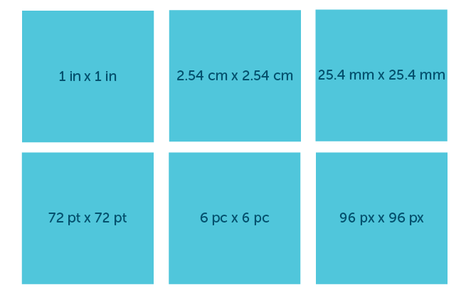
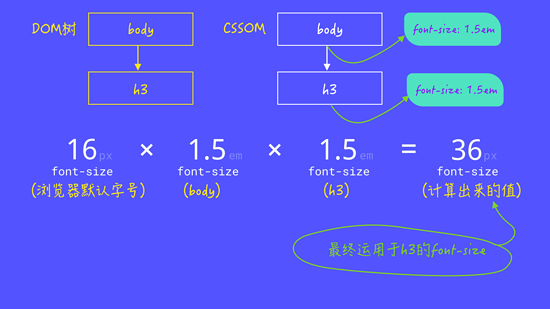
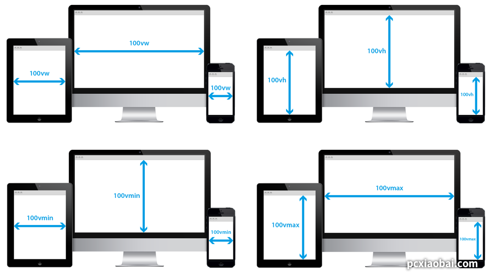
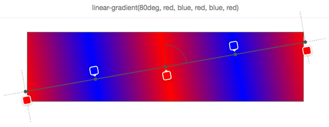
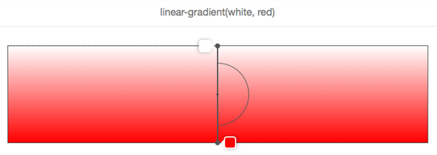
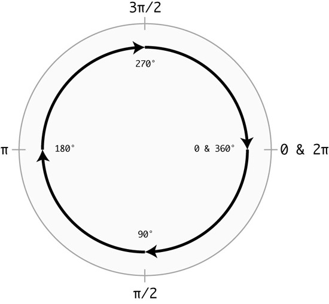

[[TOC]]

[TOC]


# CSS的值和单位

转载整理自：https://pcxiaobai.com/design/front/20190126/400.html

## 1. CSS 的值


上图是我们常见的 CSS 样式规则之一。

我们在声明任何一个 CSS 的规则都可能会包括：

-   CSS 的选择器
-   CSS 的属性
-   CSS 的属性值
-   CSS 的属性值单位

事实上，CSS 不是每个规则都会同时包含 CSS 的属性值和单位，因为很多属性的值是只具有值，不具有单位的。比如上图的color属性，他的值就不带单位，但可以是关键词、字符串、函数等。你在写 CSS 的时候可能会涉及到的 CSS 的值会有：

-   数值：长度值 ，用于指定例如元素width、border-width、font-size等属性的值，这些值可能带有单位，也可能不带任何单位
-   百分比：可以用于指定尺寸或长度，例如取决于父容器的width、height或默认的font-size
-   颜色：用于指定background-color、color等
-   坐标位置：以屏幕的左上角为坐标原点定位元素的位置，比如常见的background-position、top、right、bottom和left等属性
-   函数：用于指定背景图片或背景图片的渐变，比如linear-gradient()、image-set()等

简单的概括一下：**CSS 属性的值有多种，可以是数值、字符串、关键词或函数；同时 CSS 的属性的值可以带单位也可以不带单位**。而且 CSS 的值并不是一尘不变的，不同的属性对应的值都会略有不同，比如：width属性，它的值可以是一个百分比的值，也可以是一个带有数值和单位；color的值可以是一个关键词，也可以是一个函数值；font-size可以是百分比、关键词，带有单位的数值；line-height可以只是一个数值，可以是百分比值，还可以是带有单位的数值等。众多属性不一一列举。

## 2. CSS 的单位

上面也提到了，CSS 属性值是带有单位，也有不带单位的。而 CSS 的单位对于 CSS 的值有是一个直接影响的。因为 CSS 的单位直接对 CSS 的值的计算是有直接影响的。在 CSS 中单位的之间有一个关系图，根据 W3C 规范的划分：


### 2.1 长度单位浏览器的支持情况

下表中的数字表示支持该长度单位的最低浏览器版本。

| 长度单位                          | Chrome | IE     | Firefox | Safari | Opera |
| :-------------------------------- | :----- | :----- | :------ | :----- | :---- |
| em, ex, %, px, cm, mm, in, pt, pc | 1.0    | 3.0    | 1.0     | 1.0    | 3.5   |
| ch                                | 27.0   | 9.0    | 1.0     | 7.0    | 20.0  |
| rem                               | 4.0    | 9.0    | 3.6     | 4.1    | 11.6  |
| vh, vw                            | 20.0   | 9.0    | 19.0    | 6.0    | 20.0  |
| vmin                              | 20.0   | 9.0*   | 19.0    | 6.0    | 20.0  |
| vmax                              | 26.0   | 不支持 | 19.0    | 不支持 | 20.0  |

**注意:** Internet Explorer 9 通过不标准的名称 vm 来支持 vmin 。

摘自：https://www.runoob.com/cssref/css-units.html

## 3. 绝对单位

在 CSS 中有些单位是绝对值，不受任何屏幕大小或字体的影响。这些单位的显示可能会根据不同的屏幕分辨率而有所不同，因为它们取决于屏幕的 DPI（每英寸上的点数）。绝对单位常用于一些物理测量上。在环境输出已知的情形下非常有用。在 CSS 中，绝对单位包括：px、in、cm、mm、pc和pt等。其中px是我们最为常见的一个绝对单位。到目前为止，px在 CSS 的使用中也可以算是主流单位之一。

### 3.1 px像素

维基百科关于像素定义：它是图像显示的基本单元，既不是一个确定的物理量，也不是一个点或者小方块，而是一个抽象概念。

 `px` 也常被称为 CSS 像素。它是一个绝对单位，但也可以被视为相对单位，为什么这么说呢？那是因为像素单位相对的是设备像素。在同一样的设备上，每 `1` 个 CSS 像素所代表的物理像素是可以变化的（即 CSS 像素的第一方面的相对性）；在不同的设备之间，每 `1` 个 CSS 像素所代表的物理像素是可以变化的（即 CSS 像素的第二方面的相对性）。

不同的设备，图像基本采样的单元是不同的，显示器上的物理像素等于显示器的点距，而打印机的物理像素等于打印机的墨点。而衡量点距大小和打印机墨点大小的单位分别被称为 `PPI和` `DPI`。

由于不同的物理设备的物理像素的大小是不一样的，所以 CSS 认为浏览器应该对 CSS 中的像素进行调节，使得浏览器中 `1` 个 CSS 像素的大小在不同物理设备上看上去大小总是差不多 ，目的是为了保证阅读体验一致。为了达到这一点浏览器可以直接按照设备的物理像素大小进行换算，而 CSS 规范中使用"参考像素"来进行换算。

`1` 个参考像素即为从一臂之遥看解析度为 `96DPI` 的设备输出（即 `1` 英寸 `96` 点）时， `1` 点（即 `1/96` 英寸）的视角。它并不是 1/96 英寸长度，而是从一臂之遥的距离处看解析度为 `96DPI` 的设备输出一单位（即 `1/96` 英寸）时视线与水平线的夹角。通常认为常人臂长为 `28` 英寸，所以它的视角是:

```
(1/96)in / (28in * 2 * PI / 360deg) = 0.0213度。
```

由于 CSS 像素是一个视角单位，所以在真正实现时，为了方便基本都是根据设备像素换算的。浏览器根据硬件设备能够直接获取 CSS 像素。


>   一臂之遥：我们在使用不同设备输出时，眼睛与设备输出的典型距离是不同的。比如电脑显示器，通常是一臂之距，而看书和纸张时（对应于打印机的设备输出），则通常会更近一些。看电视时则会更远，比如一般建议是电视机屏幕对角线的 `2.5` 到 `3` 倍长 —— 如果你是个 `42` 英寸彩电，那就差不多是 `3` 米远。

虽然说，像素应该是设备和显示器中显示趋于一致，但是他越来越不正确。那是因为，随站 Retina 屏的出现， `dpr` 不同（设备像素比），对像素和显示器显示会略有不同。比如下图所示：


正因如此，在移动端设计当中，大部分设计都采用 `2` 倍或 `3` 倍尺寸进行设计。

### 3.2 in(英寸)、cm(厘米)、mm(毫米)、pc(派卡)、pt(点)

虽然说 `px` 是 CSS 最绝对单位中最常见，使用最频繁的一个单位。而事实上，CSS 中绝对单位不仅仅这一个，还有其他的绝对单位，比如 `in` （英寸）、 `cm` （厘米）、 `mm` （毫米）、 `pc`(派卡Pica)和 `pt` (点Point)等。其中， `in` 、 `cm` 和 `mm` 可以和 `px` 直接进行换算：

-   1in = 96px
-   1cm = 37.8px
-   1mm = 2.78px

而 `pc` 和 `pt` 和 `in` 有直接关系：

-   1in = 72pt
-   1in = 6pc

如果你希望 `pt` 和 `pc` 直接和 `px` 进行换算的话，可以借助 `in` 为中间桥梁。比如：

-   `1in = 96px = 72pt` ，那么 `1px = 72 / 96 = 0.75pt`
-   `1in = 96px = 6pc` ，那么 `1px = 6 / 96 = 0.0625pc`

可以用一张简单的图来描述绝对单位之间的关系：



在规范中，绝对单位还有一个新单位，不怎么常见，即`Q`，`1Q`相当于`25mm`。它被用于印刷排版。

## 4. 相对单位

相对单位是相对于另一个长度的长度。CSS 的相对单位主要分为两大类，其一是字体相对单位，会根据`font-size`进行计算；其二是视窗相对单位，相对于视窗大小来决定。

-   字体相对单位

    字体相对单位主要有 `em` 、 `rem` 、 `ex` 、 `ch` 、 `cap` 、 `ic` 、 `lh` 和 `rlh` 。其中 `em` 、 `rem` 、 `ex` 和 `ch` 是较为常见的字体相对单位。在这里我们也只会介绍这几个常见的单位。
    
-   视窗相对单位

    `vw`、`vh`、`vmin` 和 `vmax`。

### 4.1 em

-   子元素字体大小的em是相对于父元素字体大小
-   元素的width/height/padding/margin用em的话是相对于该元素的font-size

起初排版度量时是基于当天字体大写字母 **`M`** 的尺寸的。当改变 `font-family` 时，它的尺寸不会发生任何改变，但是在改变 `font-size` 的大小时，它的尺寸就会发生变化。

在 CSS 中，如果没有任何 CSS 规则影响的前提之下， `1em` 的长度是：

```
1em = 16px = 0.17in = 12pt = 1pc = 4.mm = 0.42cm
```

众所周知，每个浏览器都有一个默认的 `font-size` 大小，而这个值通常是 `16px` （用户未修改浏览器字号时）。这也就是为什么 `1em = 16px` 的原理所在。

`em` 还有一点很重要： `em` 和它们的祖先元素的 `font-size` 有关系。因此，如果祖先元素的 `font-size` 设置为 `1.5em` ，同时它的子元素的 `font-size` 设置为 `1.5em` ，在这一情景之下计算出来的 `font-size` 将为会是 `16 x 1.5 x 1.5 = 36px` ：



`px` 和 `em` 之间的转换存有以下公式：`em值 = 需要转换的像素值 ÷ 父元素的font-size`

JS的转换函数：

```js
function px2em(pixel,parentFontSize) {
    retrun (pixel / parentFontSize) + 'em'
}
px2em(10, 16) // => 0.625em
```

`em` 单位除了应用于 `font-size` 属性之外，还可以运用于可以使用长度值的其他属性，比如 `width` 、 `margin` 、 `padding` 、 `border-width` 和 `text-shadow` 等等。这些属性用em的话是相对于该元素的`font-size`大小。

使用 `em` 单位的属性会根据元素 `font-size` 大小来决定。但该元素可能继承其父元素的 `font-size` ，而父元素又有可能继承其父元素的 `font-size` 。因此，以 `em` 为单位的 `font-size` 可能会受到其任何父元素的 `font-size` 大小影响。

 `em` 单位可以更好的维护和扩展组件的大小。比如 `width` 、 `height` 、 `padding` 和 `border-width` 等使用 `em` 作为单位时，如果要调整组件大小，可以直接调整组件的 `font-size` （要是元素自己未设置 `font-size` 时，可以调整其祖先元素的 `font-size` ）。比如下图所示，调整 `font-size` 可以很灵活的控制组件的大小：


### 4.2 rem

`rem` 相对于根元素 `<html>` 的 `font-size` 计算。 [W3C 规范](http://www.w3.org/TR/css3-values/#rem-unit) 是这样描述 `rem` 的：Font size of the root element！

很多时候，我们可以把 `rem` 作为 `em` 的替代品。特别是在 `font-size` 属性上的运用。任何值为 `1rem` 的元素都等于 `16px` ，当然，其前提是浏览器默认的 `font-size` 没有被用户重置，或者未显式的给 `html` 元素设置 `font-size` 值；另外， `rem` 可以不管它的父元素的 `font-size` 如何 ！

另外， `rem` 和 `em` 有点类似，能接受 长度为值的属性都可以以 `rem` 为单位，而且都是相对于根元素 `html` 的 `font-size` 进行计算，并且跟 DOM 的层级没有任何的关系。

 `em` 好，还是 `rem` 好，应该选择哪个更好？

没有最好的，只有最适合的!

-   如果这个属性根据它的 `font-size` 来进行测量，则应该选择 `em`
-   其他的一切事物均应该使用 `rem`
-   `rem` 和 `em` 在客户端中计算出来的样式值（ **计算样式（Computed Style）** ）都会以 `px` 显式
-   `rem` 相对于根元素 `html` 的 `font-size` 计算， `em` 相对于元素 `font-size` 计算

### 4.3 ex 和 ch

ex：依赖于英文字母小 x 的高度

ch：数字 0 的宽度

`ex` 和 `ch` 是排版单位，它们的值取决于元素的 `font-family` 。它们要求浏览器在计算值和应用样式之前要确定好引用的 `font-family` 。因为，元素的 `font-family` 样式对 `ex` 和 `ch` 单位值的计算有直接关系和影响。

`ex`单位的值来自它们所计算的英文字母小 `x` 的高度，`x`高度由两个因素决定：`font-family`和`font-size`。换句话说，它们等于特定字体在特定`font-size`下的`x`高。


正如上图， `font-family` 为 `Helvetica Neue` 设置的 `font-size` 为 `100px` ，那么 `1ex` 大约等于 `52px` 。

`ch`基于数字字符`0`的宽度，它会随着字体而变化。 `0` 的宽度通常是对字体的平均字符宽度，这是一个估计值。


由于 `ch` 单位是一个近似等宽的一个单元，因此在设置容器的宽度是特别的有用。比如说，你想让容器显示特定数量的字符串时，就可以使用 `ch` 单位。

### 4.4 vw,vh,vmin和vmax：视窗相对单位

-   **`vw`** ：视窗宽度的百分比，1vw等于视口宽度（viewport width）的百分之一，`100vw = window.innerWidth`
-   **`vh`** ：视窗高度的百分比，1vh等于视口高度（viewport height）的百分之一，`100vh = window.innerHeight`
-   **`vmin`** ：当前较小的 `vw` 和 `vh`
-   **`vmax`** ：当前较大的 `vw` 和 `vh`

用下图来描述，大家会更清晰一些：



简单的来看看视窗单位是如何进行计算的。例如，如果浏览器的高是900px,1vh求得的值为9px。同理，如果显示窗口宽度为750px,1vw求得的值为7.5px。vh和vw总是与视窗的高度和宽度有关，与之不同的，vmin和vmax是与视窗宽度和高度的最大值或最小值有关，取决于哪个更大和更小。例如，如果浏览器设置为1100px宽、700px高，1vmin会是7px,1vmax为11px。然而，如果宽度设置为800px，高度设置为1080px，1vmin将会等于8px而1vmax将会是10.8px。

视窗单位中的视窗指的是：**PC 端指的是浏览器可视区域，移动端的是布局视窗（Layout Viewport）**：


关于视窗的介绍：

在 PC 端，视窗指的是浏览器的可视区域，而在移动端中相对来说更为复杂一些，它包括三个视窗： **布局视窗** (Layout Viewport)、**视觉视窗**(Visual Viewport)和**理想视窗**(Ideal Viewport)：


**理想视窗**(Ideal Viewport)：理想视口的值其实就是屏幕分辨率的值，它对应的像素叫做设备逻辑像素（device independent pixel, dip）。dip 和设备的物理像素无关，一个 dip 在任意像素密度的设备屏幕上都占据相同的空间。如果用户没有进行缩放，那么一个 CSS 像素就等于一个 dip。

详情参考：[浅谈移动端中的视口（viewport）](https://juejin.im/post/5bb6c62be51d450e47142c60)

## 5. 百分比单位

在 CSS 中接受长度值的属性都可以使用 `%` 单位。但在不同的使用场合，其意义将会有很多地不同。正因如此，要理解 `%` 这个单位，其关键点是： **百分比是一定要有其对应的参照值** ，也就是说， 百分比值是一种相对值，任何时候要分析它的计算值，都需要正确的找到它的参照值 。

所以 CSS 中的百分比单值最终计算出来的值是可变的。常见的可以分为以下几个大类：

### 5.1 position定位中的百分比

在 CSS 中用来控制 `position` 位置的 `top` 、 `right` 、 `bottom` 和 `left` 都可以使用百分比作为单位。如果它们的值为百分比时，其对应的参照物是包含块（但不一定是其父容器）同方向的 `width` 或 `height` 计算。

在 CSS 中 `position` 对应的属性值不一样，其对应的包含块也将不同：

-   如果元素为静态（ `static` ）或相对定位（ `relative` ），包含块一般是其父容器
-   如果元素为绝对定位（ `absolute` ），包含块应该是离它最近的 `position` 为 `absolute` 、 `relative` 或 `fixed` 的祖先元素
-   如果元素为固定定位（ `fixed` ），包含块就是视窗（ `viewport` ）

### 5.2 盒模型中的百分比

CSS 中的盒模型对应的属性主要有 `height` 、 `min/max-height` 、 `width` 、 `min/max-width` 、 `padding` 、 `margin` 和 `border` 等属性。不同的属性其对应的参照物也有所不同。

-   `height` 、 `min/max-height` 属性的值为百分比时，其相对于包含块的 `height` 进行计算
-   `width` 、 `min/max-width` 属性的值为百分比时，其相对于包含块的 `width` 进行计算
-   `padding` 和 `margin` 相对来说更为复杂一些，如果书写模式是水平的，则相对于包含块的 `width` 进行计算；如果书写模式是垂直的，则相对于包含块的 `height` 进行计算

### 5.3 文本中的百分比

在 CSS 中控制文本的属性常见的有 `font-size` 、 `line-height` 、 `text-indent` 、 `vertical-align` 等。不同的属性其参照物也是有所不同：

-   `font-size` 是基于父元素中 `font-size` 进行计算
-   `text-align` 和书写模式有一定的关系。如果书写模式是水平的，则相对于 `width` 进行计算，如果是垂直的，则相对于 `height` 进行计算
-   `line-height` 则基于 `font-size` 进行计算
-   `vertical-algin` 则基于 `line-height` 计算

### 5.4 边框和圆角中的百分比

在 CSS 中 **`border-width` 属性是不支持 `%` 单位的** ，但在 `border-radius` 和 `border-image-width` 两个属性上是可以使用百分比为单位的。如果在 `border-radius` 中使用百分比单位，也就是说圆角的半径是通过百分比来进行计算的，即： 水平方向的半径是相对于元素 `width` 计算，垂直方向的 半径是相对于元素高度进行计算 。比如：

```css
.circle{ width: 200px; height: 200px; border-radius:50%; }

.ellipse { width: 200px; height: 100px; border-radius: 50%; }
```


从结果是可以看出来，元素 `.circle` 的 `width` 和 `height` 都是 `200px` ，当 `border-radius: 50%` 时，计算出来的值都是 `100px` ；而 `.ellipse` 元素的 `width` 和 `height` 分别是 `200px` 和 `100px` ，当 `border-radius` 为 `50%` 时，其计算出来的结果相当于 `border-radius: 100px / 50px` （水平方向相对于 `width` 计算，垂直方向相对于 `height` 计算）。

对于 `border-image-width` 来说，相对要简单一些，如果该属性的值是百分比，其计算参照于图像边框区域的大小（包含 `border` 和 `padding` ）进行计算。

### 5.5 背景属性中的百分比

 `background-size` 则是基于 `background-origin` 区域的大小进行计算。可以对背景图像进行缩放处理。

对于 `background-position` 中的百分比，相对而言更为复杂一些，需要通过一些数学公式计算：

```
（容器尺寸 - 背景图像尺寸）* 百分比值
```

当背景图片尺寸（ `background-size` ）不做任何的重置（也就是 `100% 100%` ）时，水平百分比的值等于容器宽度百分比值减去背景图片宽度百分比值。垂直百分比的值等于容器高度百分比值减去背景图片高度百分比值。

假设有一个元素，其 `width` 是 `410px` ， `height` 是 `210px` ，使用的背景图片的尺寸是 `100px * 100px` 。如果， `background-position` 的值是 `75% 50%` ，那么百分比最终计算出来的值是：

-   水平位置（ `x` 轴）： `(410 - 100) * 75% = 232.5px`
-   垂直位置（ `y` 轴）： `(210 - 100) * 50% = 55px`


如果你的背景图片是通过渐变属性来绘制的话，那么在渐变中的每个颜色的位置也可以使用百分比来设置。详细的介绍放到渐变那个章节来介绍。这个只提供一个简单的示例：

```css
background-image: linear-gradient(80deg, red, blue, red, blue, red)
```

如果没有显式指定颜色在渐变线上的位置，这将交给浏览器来确定颜色在渐变线上的位置。最简单的情况下只有两个颜色，颜色 `1` 将被放置在渐变线 `0%` 位置（渐变线开始位置），颜色 `2` 将被放置在 `100%` 位置处（渐变线的结束点）。如果有三个颜色，那么颜色 `1` 在渐变线的 `0%` ，颜色 `2` 在渐变线的 `50%` ，颜色 `3` 在渐变线的 `100%` 。在上面的这个示例中，有五个颜色，那么它们的位置分别在 `0%` 、 `25%` 、 `50%` 、 `75%` 和 `100%` 。它们将沿着渐变线平均分布渐变颜色。



### 5.6 在渐变中的百分比的计算是相对于渐变线计算


### 5.7 变换中的百分比

CSS 中的 `transform` 属性中的 `translate` 和 `transform-origin` 值也可以设置百分比。

-   `translateX()` 的百分比相对于容器的 `width` 计算
-   `translateY()` 的百分比相对于容器的 `height` 计算
-   `transform-origin` 中横坐标（ `x` ）相对于容器的 `width` 计算；纵坐标（ `y` ）相对于容器的 `height` 计算

注意，在 `translate` 还有一个 `z` 轴的函数 `translateZ()` 。它是不接受百分比为单位的值。

### 5.8 百分比值的继承

请注意， 当百分比值用于可继承属性时，只有结合参照值计算后的绝对值会被继承，而不是百分比值本身 。例如，一个元素的 `font-size` 是 `14px` ，并定义了 `line-height:150%;` ，那么该元素的下一级子元素继承到的 `line-height` 就是 `21px` ，而不会再和子元素自己的 `font-size` 有关。


## 6. 角度单位

CSS中角度用于表示角的大小，单位为度（degrees）、 百分度（gradians）、弧度（radians）或圈数（turns）。角度数据类型有数字和角度单位组成，数字与单位之间没有空格。数字为0时，单位可以省略。角度可以使用 `+` 或 `-` 开头。正数表示顺时针的角，负数表示逆时针的角。对于静态的角，同样的角度可以使用任意等效的值表示。比如 `90deg` 等于 `-270deg`，`1turn` 等于 `4turn`。而对于动态的角，比如应用了 [`animation`](https://developer.mozilla.org/zh-CN/docs/Web/CSS/animation) 或 [`transition`](https://developer.mozilla.org/zh-CN/docs/Web/CSS/transition) 时，显示效果则不一样。

-   `deg`

    [度](https://zh.wikipedia.org/wiki/度_(角))。一个完整的圆是 `360deg`。例：`0deg`，`90deg，``14.23deg`。

-   `grad`

    [百分度](https://zh.wikipedia.org/wiki/百分度)。一个完整的圆是 `400grad`。例：`0grad`，`100grad`，`38.8grad`。

-   `rad`

    [弧度](https://zh.wikipedia.org/wiki/弧度)。一个完整的圆是 2π 弧度，约等于 `6.2832rad`。`1rad` 是 180/π 度(大约为 `57.3deg`)。

-   `turn`

    圈数。一个完整的圆是 `1turn`。例：`0turn`，`0.25turn`，`1.2turn`。

转换关系：

```
直角：90deg = 100grad = 0.25turn ≈ 1.5708rad
平角：180deg = 200grad = 0.5turn ≈ 3.1416rad
直角（逆时针）：-90deg = -100grad = -0.25turn ≈ -1.5708rad
```

### 6.1 CSS 中的旋转

角度最常用的用法之一就是在 CSS 中给旋转元素设置一个旋转角度（度数），依赖于 CSS 的 `transform` 属性中的 `rotate()` ， `skew()` 函数等。其中给 `rotate()` 函数传一个角度的值，让元素做相应的旋转。比如：

```css
.rectangle {
    width: 200px;
    height: 100px;
    border: 10px solid #83B692;
    background-color: #BEE7B8;
    margin: 100px;
    transform: rotate(37deg);
}
```

给 `rotate()` 函数设置了一个 `37deg` 的值，告诉元素 `.rectangle` 围绕着旋转原点（旋转原点可以通过 `transform-origin` 属性进行设置）旋转 `37deg` 。最终这个 `.rectangle` 元素旋转后的效果如下图所示：


在现实中， **角度值是随着逆时针方向增加** 。在 Web 上，角度值却是随着顺时针方向增加。

如果角度值低于 `0` 或者大于 `360` 度最终都会规化到 `0` 至 `360` 度范围内 。大多数情况之下，负值和大于 `360` 度值都并不很重要。下图就很好的阐述了负值和大于 `360` 度值并不影响元素最终的旋转结果：


上图的结果来看， `.rectangle` 元素旋转 `37deg` 、 `397deg` 、 `757deg` 或 `-323deg` ，其最终的结果都将是一样的。

只有在做动画的时候， 这个结果才是不一样的。在动画中，旋转角度的最终值和如何获得最终旋转的角度值都非常重要。对于负值，表示我们的元素在做逆时针旋转，旋转到最终的角度值；大于 `360deg` 表示元素一直在旋转，直到最终的角度值。当我们真正的可视化实际发生的一切时，这样做的一切都变得有意义了。


旋转`37deg`的矩形，他是一个正常的效果。旋转`397deg`的矩形，它最终停止点也是在`37deg`的位置，只不过做了一个完整的圆旋转后，在继续旋转了`37deg（360 + 37）`。`757deg`的矩形也类似。最后旋转`-323deg`的矩形则不一样，它是逆时针旋转，最终动画停止位置和其他矩形一样。所以，这四个矩形动画停止位置是相同的，但是动画过程是不同的。

另外，这四个动画持续时间都是`8s`，由于4个矩形旋转的角度不同，但是到达的最终目的是相同的，这样就会造成动画旋转快慢的不同。

### 6.2 渐变中的角度

在 CSS 中还会使用到角度的另外一个典型属性是 CSS 渐变的相关属性。比如线性渐变属性 `linear-gradient()` ：

`background: linear-gradient(45deg, #f36, #389);`

渐变的角度和旋转的角度完全不是一回事。线性渐变的这个角度以圆心为起点发散。先来看一张图：


`C` 点是渐变容器的中心点（即，元素的中心点）， `A` 角度是通过 `C` 点垂直线与通过 `C` 点渐变线的夹角，这个角称为 **渐变角度** （比如示例中的 `45deg` ）。在 CSS 的渐变属性中可以通过下面两种方法来定义这个角度：

-   使用关键词： `to top` 、 `to bottom` 、 `to left` 、 `to right` 、 `to top right` 、 `to top left` 、 `to bottom right` 和 `to bottom left`
-   使用带单位数字定义角度，比如 `45deg` 、 `1turn` 等 
-   如果省略角度值的设置，那默认是 `to bottom` （对应 `180deg` 或者 `.5turn` ）



在上面的示例中，渐变角度是没有设置， `white` 至 `red` 渐变色从 `top` 至 `bottom` 渐变，它和使用 `to bottom` 关键词得到的效果是一样的，如下所示：


除了使用这些关键词之外，还可以使用明确的角度值，比如 `45deg` ，而且更建议你使用角度值来替代关键词。下图能帮助我们看看渐变角度动态变化时，渐变线是怎么移动的：


回顾一下渐变角度：

-   角度是渐变线与渐变容器中心点向上垂直线之间的夹角
-   `0deg` 的意思就是 `to top`
-   角度的默认值（也就是角度没有设置），它的值是 `to bottom` ，也和 `180deg` 相同
-   顶角关键词和渐变容器尺寸有关

### 6.3 Canvas 中的角度

大家都知道， `canvas` 可以用来帮助我们绘制一些几何图形，也可以帮助我们做很多 CSS 之类无法做到的事情。在 `canvas` 的部分 API 中也会使用到角度，比如使用 `arc()` 、 `arcTo()` 绘制圆和圆弧以及 Canvas 中的 `rotate()` 方法。

在 Canvas 中，角度的测量和我们常见的角度测量是有所差异的，其差异如下图所示：


然而，在 Canvas 中，角度并不是我们通常意义上所了解的角度，而是用弧度来表示的。比如，一个圆是 `360` 度，那么用弧度来表示的，其对应的就是 `2π` 弧度，即以圆心为坐标原点，开始计算开始弧度与终止弧度。顺时针还是逆时针就是画线的方向（或者旋转方向），比如像下图这样：



### 6.4 HSL 中的角度

在 CSS 中，我们有多种指定颜色的方式，最为经典的是十六进制和 `RGB` 格式。除此之外，我们还可以使用另一种指定颜色的格式，即 `HSL` 。其中 `HSL` 分别是色相（ `Hue` ），饱和度（ `Saturation` ）和亮度（ `Lightness` ）三个单词的首字母。

对于 `HSL` 相关的细节已经超出这篇文章的有关范围，但 [维基百科上的 HSL ](https://zh.wikipedia.org/wiki/HSL和HSV色彩空间)很好地解释了它的工作原理和目的。我们所知道的是，在 Web 中可以通过 `hsl` 或 `hsla` 函数来指定 HSL 格式中的任何颜色，这两个数都类似，唯一的区别是 `hsla` 增加了对透明度的支持。比如，我们可以像下面这样使用 `hsla` 来指定颜色：

`background-color: hsla(54, 100%, 62%, 1);`

上面使用 `hsla` 指定了 `background-color` 的值，上面的代码 `hsla(54, 100%, 62%, 1)` 是一个黄橙色。

 `HSL` 颜色（以及 `hsla` 函数的扩展）是由四个值组成： **色相** ， **饱和度** ， **亮度** 和 **透明度** 。

`HSL` 中的 **`H`** ，也就是颜色的色相，它指定色相的方式是 **以度数为单位的，这些度数映射到色盘上的颜色** ，比如像下图这样：


在我们这个示例中，指定的颜色的色相值是 `54` 度。对应到色盘上的位置，就是我们看到的黄橙色。在实际使用的时候，如果一时无法确定角度值对应色盘上的颜色，我们可以借助浏览器开发者工具来帮助我们，比如像下面这样：


### 6.5 弧度和度数间的转换

一个完整的圆的弧度是 `2π` ，所以 `2π rad = 360°` ， `1 π rad = 180°` ， `1°= π/180 rad` ， `1 rad = 180°/π` （约 `57.29577951°` ）。以度数表示的角度，把数字乘以 `π/180` 便转换成弧度；以弧度表示的角度，乘以 `180/π` 便转换成度数。

在 JavaScript 中我们可以很容易实现度数和弧度之间的换数：

```
rad = (Math.PI * deg) / 180
```

同样的：

```
deg = (rad * 180) / Math.PI
```

为了方便计算和使用，可以将其封装成 JavaScript 函数：

```
function getRads (degrees) {
    return (Math.PI * degrees) / 180;
}

function getDegrees (rads) {
    return (rads * 180) / Math.PI;
}
```

比如我们要将 `30deg` 转换成 `rad` ，可以直接使用：

```
getRads(30); // 0.5235987755982988rad
getDegrees(0.7853981633974483); // 45deg
```

下图展示了常见的角度和弧度之间的换算：


## 7. 时间单位

CSS 中有两个常见的时间单位，即 **秒** （ `s` ）和 **毫秒** （ `ms` ）。其中 `1s = 1000ms` 。这两个单位常用于 CSS 中 `transition-duration` 、 `transition-delay` 、 `animation-duration` 和 `animation-delay` 属性中。

## 8. 频率单位

频率值使用在听（或说）级联样式表中，有两个单位值，及 **赫兹** （ `Hz` ）和 **千赫** （ `kHz` ），有点毫秒和秒的感觉。频率可以被用来改变一个语音阅读文本的音调。低频率是低音，高频率，高音。例如下面的代码：

```css
.low {
    pitch: 105Hz;
}
.squeal {
    pitch: 135Hz;
}
```


## 参考资料

[CSS的值与单位 MDN](https://developer.mozilla.org/zh-CN/docs/Learn/CSS/Building_blocks/Values_and_units)

[浅谈移动端中的视口（viewport）](https://juejin.im/post/5bb6c62be51d450e47142c60)

[angle MDN](https://developer.mozilla.org/zh-CN/docs/Web/CSS/angle)

[图说 CSS：CSS 的值和单位](https://www.codercto.com/a/51004.html)


