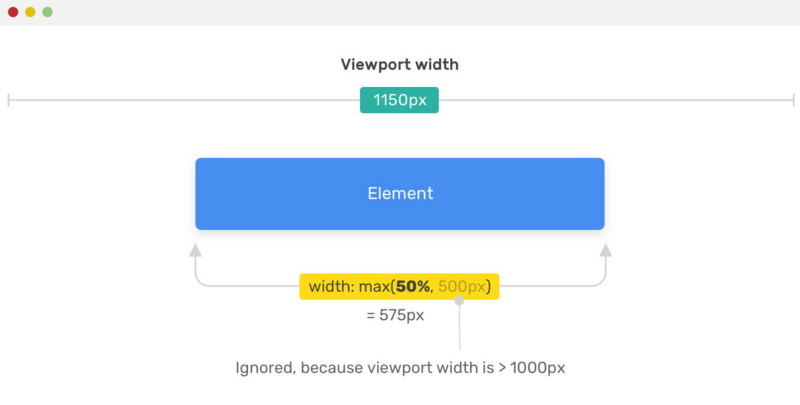
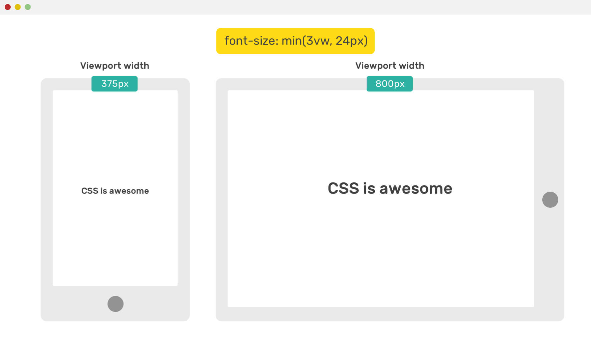
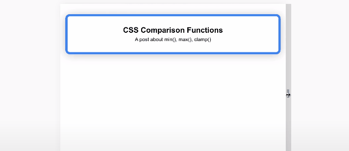
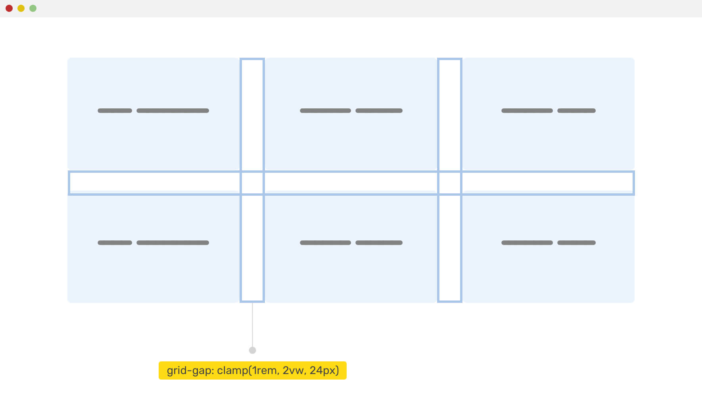

[[TOC]]

[TOC]

# css中min、max、clamp的使用

本文整理、转载自：[一文学会使用 CSS 中的 min(), max(), clamp() 以及它们的使用场景](https://segmentfault.com/a/1190000022857178)

2020年4月8日，**Firefox**浏览器支持了 CSS **比较函数**（`min()`，`max()`，`clamp()`），这意味着现在所有主流浏览器都支持它们。 这些CSS函数最大的作用就是可以为我们提供动态布局和更灵活设计组件方法。

简单的这些元素主要用来设置元素尺寸，如容器大小，字体大小，内距，外距等等 。在这篇文章中，我将用一些示例和大家一起来探讨这几个函数在实际中的使用，希望能更好的帮助大家理解它们。

## 1. 兼容性

`min` 和 `max` 的支持情况：


`clamp()`的支持情况：


## 2. min():获取最小值

`min()` 函数支持一个或多个表达式，每个表达式之间使用逗号分隔，然后以最小的表达式的值作为返回值，我们可以使用`min()`为元素设置最大值。

考虑下面的例子，我们希望元素的最大宽度为`500px`。

```css
.element {
    width: min(50%, 500px);
}
```

浏览器需要在`(50%，500px)` 取一个最小值，因为有个百分比，所以最终结果取决于视口宽度。如果`50%`的计算值大于`500px`，那么就取 `500px`。

否则，如果`50%`计算值小于`500px`，则`50%`将用作宽度的值，假设视口的宽度是 `900px`， 最终元素的宽度为 `900px x 50% = 450px`。


## 3. max()：获取最大值

`max()`函数和`min()`函数语法类似，区别在于`max()`函数返回的是最大值，`min()`函数返回的是最小值。同样，我们可以使用`man()`为元素设置最小值。

考虑下面的例子，我们希望元素的最小宽度为`500px`。

```css
.element {
    width: max(50%, 500px);
}
```

浏览器需要在`(50%，500px)` 取一个最大值，因为有个百分比，所以最终结果取决于视口宽度。如果`50%`的计算值小于`500px`，那么就取 `500px`。

否则，如果`50%`计算值大于`500px`，则`50%`将用作宽度的值，假设视口的宽度是 `1150px`， 最终元素的宽度为 `1150px x 50% = 575px`。



## 4. clamp()：返回区间值

clamp()函数作用是返回一个区间范围的值。语法如下：

```
clamp(MIN, VAL, MAX)
```

其中`MIN`表示最小值，`VAL`表示首选值，`MAX`表示最大值。意思是，如果`VAL`在`MIN`和`MAX`范围之间，则使用`VAL`作为函数返回值；如果`VAL`大于`MAX`，则使用`MAX`作为返回值；如果`VAL`小于`MIN`，则使用`MIN`作为返回值。

`clamp(MIN, VAL, MAX)`实际上等同于`max(MIN, min(VAL, MAX))`。

考虑下面的例子

```css
.element {
    width: clamp(200px, 50%, 1000px);
}
```

假设我们有一个元素，其最小宽度为`200px`，首选值为`50%`，最大值为`1000px`,如下所示：


上面的计算过程是这样的：

-   宽度永远不会低于`200px`
-   内容中间首选值是`50%`，只有在视口宽度大于`400px`小于`2000px`时才有效
-   宽度不会超过 `1000px`

上面示例代码：http://js.jirengu.com/cirur/2/edit

## 5. 上下文对计算属性的影响

计算值取决于上下文。 可能是`%`，`em`，`rem`，`vw/vh`。 甚至百分比值也可以基于视口宽度（如果元素直接位于`<body>`中），也可以基于其父元素。

## 6. 使用数学表达式

 clamp() 函数也可以用于数学表达式，而不必借助于 `calc()`，如下代码所示：

```css
.type {
  /* 强制字体大小保持在 12px 到 100px 之间 */
  font-size: clamp(12px, 10 * (1vw + 1vh) / 2, 100px);
}
```

## 7. 实际例子

### 7.1 侧边栏和主界面


通常，页面的侧边栏是固定的，主界面度是灵活的。 如果视口足够大，我们可以根据视口的大小动态增加侧边栏宽度，这里我们可以使用`max()`函数为其设置最小宽度。

考虑下面的示例:

```css
.wrapper { display: flex; }

aside { flex-basis: max(30vw, 150px); }

main { flex-grow: 1; }
```

如果视口大于 `500px`，则侧边栏的最小宽度为`150px`(500 * 30% = 150)。

### 7.2 标题字体大小


`clamp()`的一个很好的用例是用于标题。假设我们希望标题的最小大小为`16px`，最大大小为`50px`。`clamp()`函数将为我们提供一个介于两者之间的值。

```css
.title { font-size: clamp(16px, 5vw, 50px); }
```

在这里使用`clamp()`是非常适合的，因为它确保了所使用的字体大小是可访问的和易于阅读的。如果换做`min()`，那么就不能在小的视图中控制字体了。

```css
.title {
    font-size: min(3vw, 24px); /* Not recommended, bad for accessibility */
}
```



在移动端，字体大小很小。因此，不要对字体大小使用`min()`函数。当然，我们也可以通过媒体查询来适配，但是这样就错过了一次使用 **CSS 比较函数**实战。

如前所述，可以在`max()`函数中嵌套`min()`来实现`clamp()` 效果，该函数将模仿`clamp()`函数，如下所示：

```css
.title {
    font-size: max(16px, min(10vw, 50px));
}
```

### 7.3 装饰性标题


注意看上图标题下面有一个大的半透明的标题，这是一个装饰性的文本，根据视窗的大小来缩放。我们可以使用`max()`函数和`CSS viewport`单元来设置它的最小值。

```css
.section-title:before {
  content: attr(data-test);
  font-size: max(13vw, 50px);
}
```

源码: https://codepen.io/shadeed/pen/e0128b73de7c84cb9b98cf733a3835c4?editors=1100

### 7.4 平滑渐变

当在CSS中使用渐变时，你可能需要对它进行一些调整，使颜色之间的过渡更加平滑。我们先看看下面的渐变：

```css
.element {
    background: linear-gradient(135deg, #2c3e50, #2c3e50 60%, #3498db);
}
```


注意移动的过渡是有一条比较明显的线分开，这是不好的。我们可以通过使用媒体查询来解决这个问题：

```css
@media (max-width: 700px) {
    .element {
        background: linear-gradient(135deg, #2c3e50, #2c3e50 25%, #3498db)
    }
}
```

有一种更加简洁的方法就是使用 `min()` 函数，如下 所示：

```css
.element {
    background: linear-gradient(135deg, #2c3e50, #2c3e50 min(20vw, 60%), #3498db);
}
```


事例源码：https://codepen.io/shadeed/pen/2c4bf2ded32f66390fdef13409be4a10?editors=1100

### 7.5 透明渐变

当需要在图片上放置文本时，我们应该在图片上加层渐变让文本更加可读。与上一个示例类似，渐变大小应该在小视图和大视图之间有所不同。见下图：


```css
.element {
    background: linear-gradient(to top, #000 0, transparent max(20%, 20vw));
}
```

事例源码：https://codepen.io/shadeed/pen/babf1bfd4c85eeb1b6f9f549dd0fe602?editors=1100

### 7.6 容器宽度


如果有一个容器，它的宽度应该是它父容器的80%，但不能超过`780px`，你会用什么?通常，你应该会用`max-width`，如下所示：

```css
.container {
    max-width: 780px;
    width: 80%;
}
```

这里使用 `min() `函数也可以为元素设置最大值：

```css
.container {
    max-width: min(80%, 780px);
}
```

事例源码：https://codepen.io/shadeed/pen/3d8b44709b04efdd7336fe91363e3d76?editors=1100

### 7.7 边界与阴影



在一些设计案例中，如果元素边框的宽度和弧度比较大时，在移动时应尽量减小。通过使用`clamp()`，我们可以根据视窗宽度使其动态。

```css
.element {
    box-shadow: 0 3px 10px 0 red;
    border: min(1vw, 10px) solid #468eef;
    border-radius: clamp(7px, 2vw, 20px);
    box-shadow: 0 3px clamp(5px, 4vw, 50px) 0 rgba(0, 0, 0, 0.2);
}
```

事例源码：https://codepen.io/shadeed/pen/7b5c7979e09573ca32150ebfc7f74a66?editors=1100

### 7.8 Grid Gap



在一个使用风格布局的界面上，如果我们想根据视口大小来调整网格之间的间距，使用 `clamp()` 是很容易做到的：

```css
.wrapper {
  display: grid;
  grid-template-columns: repeat(auto-fit, minmax(200px, 1fr));
  grid-gap: clamp(1rem, 2vw, 24px);
}
```

事例源码：https://codepen.io/shadeed/pen/a14c7d9fcbbae84340a4f83833294f5b?editors=1100

## 8. 在不兼容浏览器中使用

与任何新的 CSS 函数一样，提供后退方案是很重要的。 要实现这一点，我们可以使用以下方法之一：

### 8.1 手动添加回退方案

我们可以在使用**比较函数**之前加一个默认的方式，如下所示：

```css
.hero {
    padding: 4rem 1rem;
    padding: clamp(2rem, 10vmax, 10rem) 1rem;
}
```

支持的浏览器将忽略第一个，不支持的将使用第一个`padding`。

### 8.2 使用 CSS `@supports`

我们可以使用`@supports`检测浏览器是否支持 CSS 比较函数，如下所示：

```css
.hero {
    /* 默认值，用于不支持的浏览器 */
    padding: 4rem 1rem;
}

@supports (width: min(10px, 5vw)) {
   /* 用于支持的浏览器  */
  .hero {
    padding: clamp(2rem, 10vmax, 10rem) 1rem;
  }
}
```


