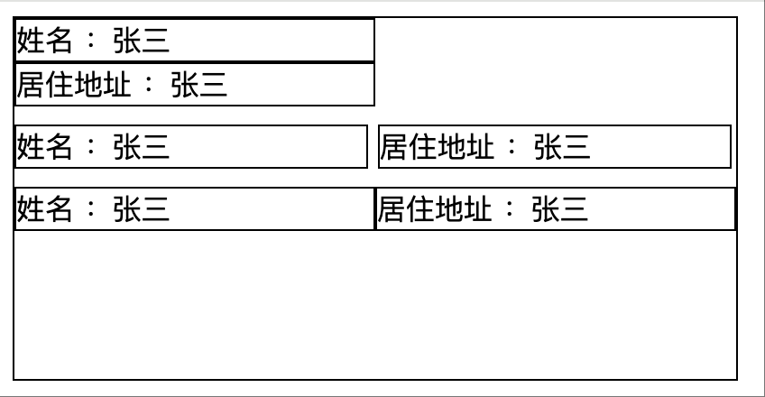

[[TOC]]

[TOC]


# CSS常见问题

## 1. 中英文混排版时行高不一样解决

问题描述：

1、同一个浏览器，不同版本相同页面，一段文字区域高度不同。

2、在页面的一段文章标题区域中，在测试环境页面中和在线上环境中的显示高度不一致。

问题原因：经过仔细查看，发现线上环境的文字中有 中英文和数字，测试环境文字只有中文， 经过网络查找资料， 发现 中文、英文、数字 显示高度会有细微差别。导致了排版行高不一致的情况。

> 全中文排版：如果对文字选中，我们从背景上看上去，下面多了一部分，由此可知中文是上对齐的。即用css术语讲就是产生了padding-bottom属性。
>
> 全英文排版：和全中文刚刚相反，是下对齐。即会出现类似padding-top的属性。所以，这时不管是全中文还是全英文排版，行高都能保持一致。
>
> 混合排版：因为中文与英文的对齐方式不一样，混合之后，整行文字的内边距就变为padding=padding-top+padding-bottom,相当于无形中多了一个padding-top或者padding-bottom。这样行高又怎么会一样呢？

解决方案(设置高度、修改字体)： 

可以解决问题(实测)：每行都有一个元素包裹文字，这个元素设置固定高度(height)。就能解决问题。

网上找到的方案(没试过)：从字体上下手，有一种字体可以解决这个问题，这个字体就是“simsun”，“simsun”就是传说已久的“宋体”，在windows字体文件夹下“宋体”的文件名就是“simsun”，这可能会损失一些效果。

尝试：本来想使用line-height固定的，但是line-height是每一行的基线与基线之间的距离，又因为汉字的基线和英文字母是不同的，所以起不到作用，再说如果是用作导航菜单只有一行还是没有用的。

## 2. 两个`inline-block`元素设置为`width: 50%`却无法并排显示

1、问题描述：两个行内块元素，宽度设置50%，按照正常情况应该是能够在一行显示，但是却两行显示。元素已经设置了`box-sizing: border-box`(IE盒模型)。

**注意**：并不是每个浏览器都有这个问题，甚至不同浏览器版本也会有不同现象，比如chrome的高版本就有这个问题，低版本没有这个问题。遇到这种样式问题可以参考排查一下。

2、经过查找资料，可能的原因：

> 1、‌**HTML换行符被解析为空格**：源代码中`</div>`和`<div>`之间的换行符会被浏览器解析为一个空白字符（约4-5px宽度），导致总宽度超过父容器的100%。
>
> 2、**默认字体间距影响**：即使未显式设置字体大小，浏览器默认的`font-size`会为行内块元素间添加额外间隙

我本人遇到的问题就是`默认字体间距影响`的原因导致的，浏览器Chrome(版本 131.0.6778.86（正式版本） (x86_64))

3、解决方案：

> 1、‌**HTML换行符被解析为空格**：删除HTML标签间的换行
>
> 2、**默认字体间距影响**：父容器设置`font-size: 0`，子元素从新设置字体大小

代码例子：

```html
<style>
  .box { width: 400px; height: 200px; border: 1px solid; }

  .item {
    font-size: 16px; /* 需在子元素重置字体大小 */
    box-sizing: border-box;
    display: inline-block;
    vertical-align: top;
    width: 50%;
    border: 1px solid;
  }
  .item2 {
    width: 49%;
  }
  .normal {
    box-sizing: border-box; /* IE规则 */
    margin-bottom: 10px;
  }
  .font-size0 {
    font-size: 0; /* 消除间隙 */
  }
</style>

<body>
  <div class="box">
    <div class="normal">
      <div class="item">
        <span class="title">姓名</span> <span class="value">：张三</span>
      </div>
      <div class="item">
        <span class="title">居住地址</span> <span class="value">：张三</span>
      </div>
    </div>
    <div class="normal">
      <div class="item item2">
        <span class="title">姓名</span> <span class="value">：张三</span>
      </div>
      <div class="item item2">
        <span class="title">居住地址</span> <span class="value">：张三</span>
      </div>
    </div>
    <div class="font-size0">
      <div class="item">
        <span class="title">姓名</span> <span class="value">：张三</span>
      </div>
      <div class="item">
        <span class="title">居住地址</span> <span class="value">：张三</span>
      </div>
    </div>
  </div>
</body>
```

效果如图：



图片说明：第一组是遇到的问题效果(50%宽度没有一行显示)，第二组是说明他们之间确实存在缝隙，第三组是设置字体后的希望效果。