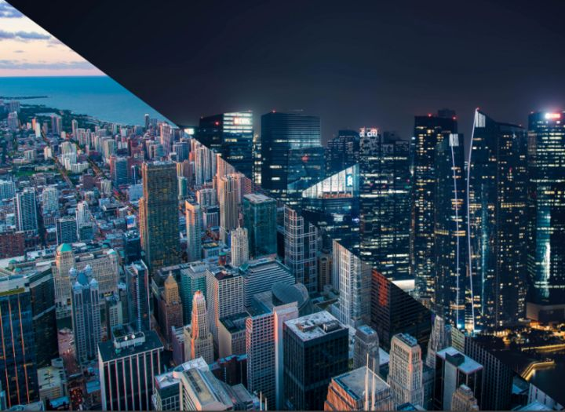
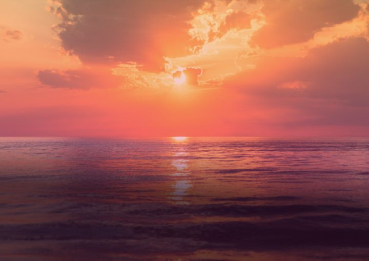
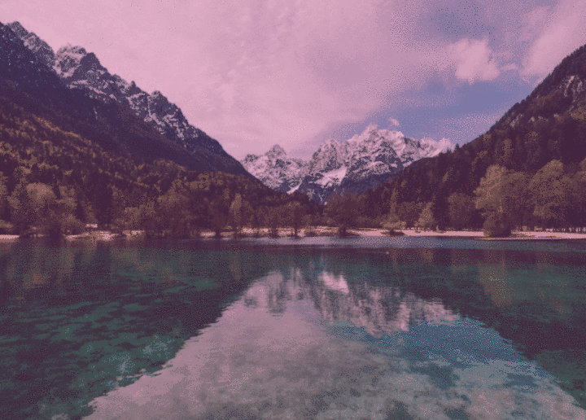
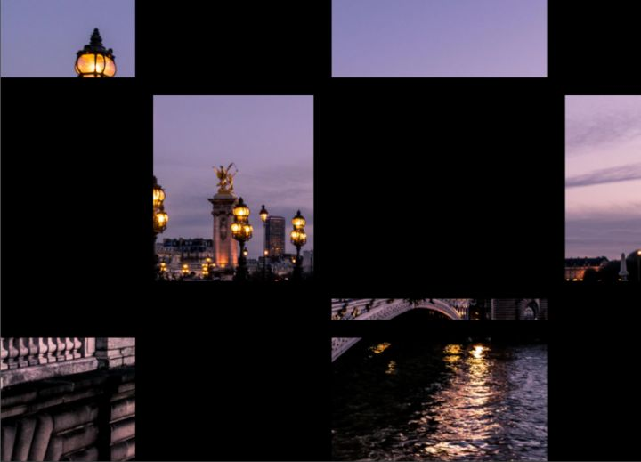
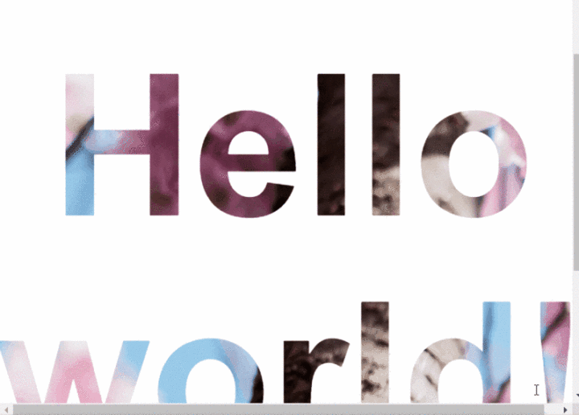

[[TOC]]

[TOC]


# 7个关于 CSS background image 好用技巧

整理转载自：https://zhuanlan.zhihu.com/p/148204848

## 1. 背景图如何才能完美适配视口

```css
body {
  background-image: url('https://images.unsplash.com/photo-1573480813647-552e9b7b5394?ixlib=rb-1.2.1&ixid=eyJhcHBfaWQiOjEyMDd9&auto=format&fit=crop&w=2253&q=80');
  background-repeat: no-repeat;
  background-position: center;
  background-attachment: fixed;
  background-size: cover;
  -webkit-background-size: cover;
  -moz-background-size: cover;
  -o-background-size: cover;
}
```

事例源码：https://link.zhihu.com/?target=https%3A//codepen.io/duomly/pen/xxwYBOE

## 2. 如何在CSS中使用多个背景图片？

CSS3 中可以直接 指定多个背景路径，如下所示：

```css
body {
  background-image: url(https://image.flaticon.com/icons/svg/748/748122.svg), url(https://images.unsplash.com/photo-1478719059408-592965723cbc?ixlib=rb-1.2.1&auto=format&fit=crop&w=2212&q=80);
  background-position: center, top;
  background-repeat: repeat, no-repeat;
  background-size: contain, cover;
}
```


事例源码：https://link.zhihu.com/?target=https%3A//codepen.io/duomly/pen/eYpVoJR

## 3. 如何创建一个三角形的背景图像

另一个很酷的背景特效就是三角形背景，当我们想展示某些完全不同的选择（例如白天和黑夜或冬天和夏天）时，这种特效就更加棒。

思路是这样的，首先创建两个`div`，然后将两个背景都添加到其中，然后，第二个`div`使用`clip-path`属性画出三角形。

**html**

```html
<body>
  <div class="day"></div>
  <div class="night"></div>
</body>
```

css

```css
body {
  margin: 0;
  padding: 0;
}

div {
  position: absolute;
  height: 100vh;
  width: 100vw;
}

.day {
  background-image: url("https://images.unsplash.com/photo-1477959858617-67f85cf4f1df?ixlib=rb-1.2.1&ixid=eyJhcHBfaWQiOjEyMDd9&auto=format&fit=crop&w=2613&q=80");
  background-size: cover;
  background-repeat: no-repeat;
}

.night {
  background-image: url("https://images.unsplash.com/photo-1493540447904-49763eecf55f?ixlib=rb-1.2.1&ixid=eyJhcHBfaWQiOjEyMDd9&auto=format&fit=crop&w=2250&q=80");
  background-size: cover;
  background-repeat: no-repeat;
  clip-path: polygon(100vw 0, 0% 0vh, 100vw 100vh);
}
```



源码：https://link.zhihu.com/?target=https%3A//codepen.io/duomly/pen/RwWQmwW

## 4. 如何在背景图像上添加叠加渐变？

有时我们想在背景上添加一些文字，但有的图片太亮，导致字看不清楚，所以这里我们就需要让背景图叠加一些暗乐来突出文字效果。

例如，可以通过添加粉红橙色渐变或红色至透明渐变来增强日落图像，这些情况下使用叠加的渐变就很容易做到。

```css
body {
  background-image: 
    linear-gradient(4deg, rgba(38,8,31,0.75) 30%, rgba(213,49,127,0.3) 45%, rgba(232,120,12,0.3) 100%),
    url("https://images.unsplash.com/photo-1503803548695-c2a7b4a5b875?ixlib=rb-1.2.1&auto=format&fit=crop&w=2250&q=80");
  background-size: cover;
  background-repeat: no-repeat;
  background-attachment: fixed;
  background-position: center
}
```



源码：https://link.zhihu.com/?target=https%3A//codepen.io/duomly/pen/rNOJgQE

## 5. 如何创建一个颜色动态变化的背景

如果你很多颜色，你想确认哪种颜色更适合背景图片的颜色，刚动态更改背景颜色的技巧就很有用。

**css**

```css
HTML CSSResult
EDIT ON
@keyframes background-overlay-animation {
  0%   {
      background-image: 
        linear-gradient(4deg, rgba(255,78,36,0.3) 50%, rgba(255,78,36,0.3) 100%), url("https://images.unsplash.com/photo-1559310589-2673bfe16970?ixlib=rb-1.2.1&ixid=eyJhcHBfaWQiOjEyMDd9&auto=format&fit=crop&w=2250&q=80");
  }
  25%  {
      background-image: 
         linear-gradient(4deg, rgba(213,49,127,0.3) 50%, rgba(213,49,127,0.3) 100%), url("https://images.unsplash.com/photo-1559310589-2673bfe16970?ixlib=rb-1.2.1&ixid=eyJhcHBfaWQiOjEyMDd9&auto=format&fit=crop&w=2250&q=80");
  }
  50%  {
    background-image: 
       linear-gradient(4deg, rgba(36,182,255,0.3) 50%, rgba(36,182,255,1) 100%),
     url("https://images.unsplash.com/photo-1559310589-2673bfe16970?ixlib=rb-1.2.1&ixid=eyJhcHBfaWQiOjEyMDd9&auto=format&fit=crop&w=2250&q=80");
  }
  100% {
    background-image: 
        linear-gradient(4deg, rgba(0,255,254,0.3) 50%, rgba(0,255,254,0.3) 100%),
        url("https://images.unsplash.com/photo-1559310589-2673bfe16970?ixlib=rb-1.2.1&ixid=eyJhcHBfaWQiOjEyMDd9&auto=format&fit=crop&w=2250&q=80");
  }
}

@-webkit-keyframes background-overlay-animation {
  0%   {
      background-image: 
        linear-gradient(4deg, rgba(255,78,36,0.3) 50%, rgba(255,78,36,0.3) 100%)
        url("https://images.unsplash.com/photo-1559310589-2673bfe16970?ixlib=rb-1.2.1&ixid=eyJhcHBfaWQiOjEyMDd9&auto=format&fit=crop&w=2250&q=80");
  }
  25%  {
      background-image: 
         linear-gradient(4deg, rgba(213,49,127,0.3) 50%, rgba(213,49,127,0.3) 100%),
        url("https://images.unsplash.com/photo-1559310589-2673bfe16970?ixlib=rb-1.2.1&ixid=eyJhcHBfaWQiOjEyMDd9&auto=format&fit=crop&w=2250&q=80");
  }
  50%  {
    background-image: 
       linear-gradient(4deg, rgba(36,182,255,0.3) 50%, rgba(36,182,255,1) 100%),
     url("https://images.unsplash.com/photo-1559310589-2673bfe16970?ixlib=rb-1.2.1&ixid=eyJhcHBfaWQiOjEyMDd9&auto=format&fit=crop&w=2250&q=80");
  }
  100% {
    background-image: 
        linear-gradient(4deg, rgba(0,255,254,0.3) 50%, rgba(0,255,254,0.3) 100%),
```



源码：https://link.zhihu.com/?target=https%3A//codepen.io/duomly/pen/gOavNOv

## 6. 如何制作网格背景图像？

有时候会遇到一些需要有艺术或者摄影类的项目，他们一般要求网站要有艺术信息，要有创意。网络的背景就挺有创意的，效果如下:



**HTML**

```html
<body>
<div class="container">
  <div class="item_img"></div>
  <div class="item"></div>
  <div class="item_img"></div>
  <div class="item"></div>
  <div class="item"></div>
  <div class="item_img"></div>
  <div class="item"></div>
  <div class="item_img"></div>
  <div class="item"></div>
  <div class="item"></div>
  <div class="item_img"></div>
  <div class="item"></div>
  <div class="item_img"></div>
  <div class="item"></div>
  <div class="item_img"></div>
  <div class="item"></div>
</div>
</body>
```

**scss**

```scss
body {
 margin: 0;
  padding: 0;
}

.container {
  position: absolute;
  width: 100%;
  height: 100%;
  background: black;
  display: grid;
  grid-template-columns: 25fr 30fr 40fr 15fr;
  grid-template-rows: 20fr 45fr 5fr 30fr;
  grid-gap: 20px;
  .item_img {
    background-image: url('https://images.unsplash.com/photo-1499856871958-5b9627545d1a?ixlib=rb-1.2.1&ixid=eyJhcHBfaWQiOjEyMDd9&auto=format&fit=crop&w=2207&q=80');
  background-repeat: no-repeat;
  background-position: center;
  background-attachment: fixed;
  background-size: cover;
}
}
```

源码：https://link.zhihu.com/?target=https%3A//codepen.io/duomly/pen/MWaQNWb

## 7. 如何将背景图像设置为文本颜色？

使用`background-image`与 `background-clip` ，可以实现背景图像对文字的优美效果。 在某些情况下，它可能非常有用，尤其是当我们想创建一个较大的文本标题而又不如普通颜色那么枯燥的情况。



**HTML**

```html
<body>
  <h1>Hello world!</h1>
</body>
```

**SCSS**

```scss
body {
  display: flex;
  align-items: center;
  justify-content: center;
  flex-direction: column;
  width: 100%;
  text-align: center;
  min-height: 100vh;
  font-size: 120px;
  font-family:Arial, Helvetica, sans-serif;
}

h1 {
   background-image: url("https://images.unsplash.com/photo-1462275646964-a0e3386b89fa?ixlib=rb-1.2.1&ixid=eyJhcHBfaWQiOjEyMDd9&auto=format&fit=crop&w=2600&q=80");
  background-clip: text;
  -webkit-background-clip: text;
  color: transparent;
}
```

源码：https://link.zhihu.com/?target=https%3A//codepen.io/duomly/pen/wvKyVjG


