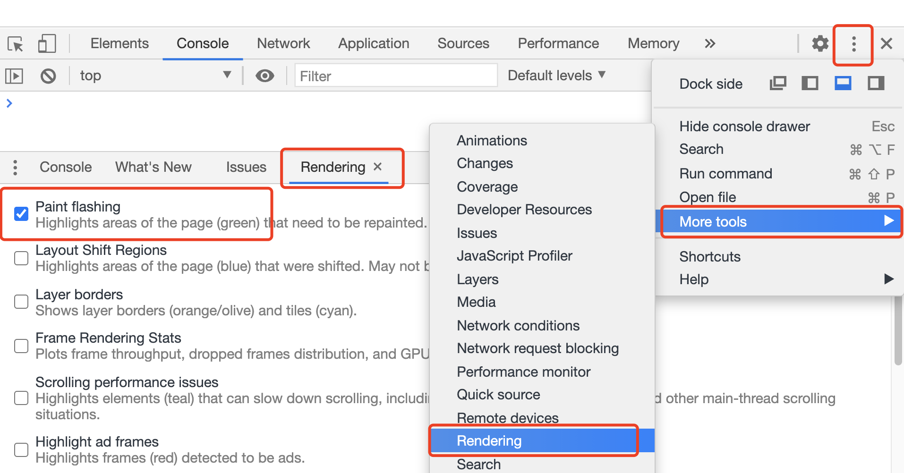

[[TOC]]

[TOC]


# CSS中隐藏元素属性opacity、visibility、display对比分析


## 1. 说明

[opacity ](http://www.w3school.com.cn/cssref/pr_opacity.asp)用来设置透明度。

[display](https://www.w3school.com.cn/cssref/pr_class_display.asp) 定义建立布局时元素生成的显示框类型。

[visibility](http://www.w3school.com.cn/cssref/pr_class_visibility.asp) 用来设置元素是否可见。

opacity、visibility、display 这三个属性分别取值 0、hidden、none 都能使元素在页面上看不见，但是他们在方方面面都还是有区别的。

|                                    | opacity: 0 | visibility: hidden | display: none |
| ---------------------------------- | ---------- | ------------------ | ------------- |
| 是否占据页面空间                   | 是         | 是                 | 否            |
| 子元素设置该属性其他值是否继续显示 | 不显示     | 显示               | 不显示        |
| 自身绑定的事件是否能触发           | 能触发     | 不能触发           | 不能触发      |
| 是否影响遮挡住的元素触发事件       | 影响       | 不影响             | 不影响        |
| 属性值改变是否产生回流(reflow)     | 不产生     | 不产生             | 产生          |
| 属性值改变是否产生重绘(repaint)    | 不一定产生 | 产生               | 产生          |
| 该属性是否支持transition           | 支持       | 支持               | 不支持        |

## 2. 是否占据页面空间对比

使用 opacity 和 visibility 属性时，元素还是会占据页面空间的，而使用 display 属性时，元素不占据页面空间。


代码：

```html
<html lang="en"> <!-- http://js.jirengu.com/palal/5/edit -->
 <head>
  <meta charset="UTF-8">
  <style>
    div { width: 100px; height: 100px; }
    .box {
      border: 1px solid; width: 150px;
      height: 230px; display: inline-block;
    }
    .yellow{ background:yellow; }
    .red{ background:red; }
    .blue {background:blue; opacity:0;}
    .green {background: green; visibility:hidden;}
    .other {background: #3472f3; display:none;}
  </style>
 </head>
 <body>
   <div class="box">
     正常的时候
     <div class="yellow"></div> <div class="red"></div>
   </div>
   <div class="box">
     opacity:0;
     <div class="blue"></div> <div class="red"></div>
   </div>
   <div class="box">
     visibility:hidden;
     <div class="green"></div> <div class="red"></div>
   </div>
   <div class="box">
     display:none;
     <div class="other"></div> <div class="red"></div>
   </div>
 </body>
</html>
```


## 3. 对子元素的影响

如果子元素什么都不设置的话，都会受父元素的影响，和父元素的显示效果一样。

如果子元素设置的值和父元素不一样时：

使用 opacity 和 display 属性时，父元素对子元素的影响很明显，子元素设置的 opacity 和 display 属性是不起作用的，显示的效果和父元素一样，而使用 visibility 属性时，子元素如果设置为 `visibility:visible;` 并没有受父元素的影响，可以继续显示出来。


代码：

```html
<!doctype html> <!-- http://js.jirengu.com/focitecila/7/edit -->
<html lang="en">
 <head>
  <meta charset="UTF-8">
   <style>
       div {border: 1px solid;}
      .box { height: 130px; width: 130px; padding: 5px; display: inline-block; }
      .father { width:100px; height:100px;padding: 5px; background: yellow; }
      .son { width:50px; height:50px; background: blue; }
   </style>
 </head>
 <body>
   <div class="box">
     正常
     <div class="father">
       <div class='son'></div>
     </div>
   </div>
   <div class="box">
     opacity 测试
     <div class="father" style="opacity:0;">
       <div class='son'  style="opacity:1;"></div>
     </div>
   </div>
   
   <div class="box">
     visibility 测试
     <div class="father" style="visibility:hidden;">
       <div class='son'  style="visibility:visible;"></div>
     </div>
   </div>
   <div class="box">
     display 测试
     <div class="father" style="display:none;">
       <div class='son'  style="display:block;"></div>
     </div>
   </div>
 </body>
</html>
```

## 4. 自身绑定的事件是否能继续触发

这里的绑定事件是指用户在页面操作触发的事件。

使用 display 属性的话，元素不仅看不见，而且也不占据页面空间，所有不会触发事件。

总的来说，使用 visibility 和 display 属性，自身的事件不会触发，而使用 opacity 属性，自身绑定的事件还是会触发的。


代码：

```html
<!DOCTYPE html>
<html>
<head>
  <meta charset="utf-8">
  <style>
    div {border: 1px solid;}
    .box { height: 130px; width: 130px; padding: 5px; display: inline-block; }
    .button { cursor: pointer; }
  </style>
</head>
<body>
  <div class="box">
    正常
    <div class="button" onmouseenter="alert(0)">
      点击我
    </div>
  </div>
  <div class="box">
    opacity 测试
    <div class="button" onmouseenter="alert(0)" style="opacity:0;">
      点击我
    </div>
  </div>
  <div class="box">
    visibility 测试
    <div class="button" onmouseenter="alert(0)" style="visibility:hidden;">
      点击我
    </div>
  </div>
</body>
</html>
```

## 5. 是否影响其他元素触发事件

总结：visibility 和 display 属性是不会影响其他元素触发事件的，而 opacity 属性 如果遮挡住其他元素，其他的元素就不会触发事件了。

如下图：

1、在`opacity 测试`部分，黄色块div元素设置 `opacity:0; `，通过定位，遮挡住了 蓝色的p元素，当鼠标移到蓝色p元素上时，并没有触发蓝色p元素的事件。

2、在`visibility 测试`部分，黄色块div元素设置 `visibility:hidden; `，通过定位，虽然遮挡住了 蓝色的p元素，但是当鼠标移到蓝色p元素上时，还是触发了蓝色p元素绑定的事件。

3、display 属性就不举例子了，因为他不会占据页面空间，也就不会遮挡其他元素，就不会影响其他元素触发事件了。


代码：

```html
<!doctype html>
<html lang="en">
<head>
  <meta charset="UTF-8">
  <style>
    .box { height: 200px; width: 250px; padding: 5px; display: inline-block; border: 1px solid; }
    .red{ width:200px; height:20px; background:red; position:relative; }
    .yellow{ position:absolute; top:0; left:0; width:100px; height:150px; background:yellow;}
    .blue{ width:100px; height:100px; background:blue; }

    .opacity .yellow { opacity:0; }
    .opacity .red:hover .yellow { opacity:1;   }
    
    .visibility .yellow { visibility: hidden; }
    .visibility .red:hover .yellow { visibility: visible; }
  </style>
</head>
<body>
  <div class="box opacity">
    opacity 测试
    <div class='red'>
      <div class='yellow'></div>
    </div>
    <p class='blue' onmouseenter=alert(0)></p>
  </div>
  <div class="box visibility">
    visibility 测试
    <div class='red'>
      <div class='yellow'></div>
    </div>
    <p class='blue' onmouseenter=alert(0)></p>
  </div>
</body>
</html>
```

## 6. 是否产生回流（reflow）

**回流**

>   当页面中的一部分(或全部)因为元素的规模尺寸，布局，隐藏等改变而需要重新构建。这就称为回流(也有人会把回流叫做是重布局或者重排)。
>   每个页面至少需要一次回流，就是在页面第一次加载的时候。

dispaly 属性会产生回流，而 opacity 和 visibility 属性不会产生回流。

## 7. 是否产生重绘（repaint）

**重绘**

>   当页面中的一些元素需要更新属性，而这些属性只是影响元素的外观，风格，而不会影响布局的时候，比如background-color。则称为重绘。

dispaly 和 visibility 属性会产生重绘，而 opacity 属性不一定会产生重绘。

[元素提升为合成层后，transform 和 opacity 不会触发 repaint，如果不是合成层，则其依然会触发 repaint。](https://segmentfault.com/q/1010000008983727)
[在 Blink 和 WebKit 内核的浏览器中，对于应用了 transition 或者 animation 的 opacity 元素，浏览器会将渲染层提升为合成层。](https://segmentfault.com/q/1010000008983727)
[也可以使用 translateZ(0) 或者 translate3d(0,0,0) 来人为地强制性地创建一个合成层。](https://segmentfault.com/q/1010000008983727)

opacity 例子代码：

```html
<!doctype html>
<html lang="en">
<head>
  <meta charset="UTF-8">
  <style>
    p { transition: 1s; padding: 10px; border: 1px solid; width: 300px;}
  </style>
</head>
<body>
  <div id="one">重绘 repaint</div>
  <p id="two">重绘 repaint transition</p>
  <script>
    var flag = false;
    setInterval(function () {
      flag = !flag;
      one.style.opacity = flag ? 0 : 1;
    }, 1000);
    var flag2 = false;
    setInterval(function () {
      flag2 = !flag2;
      two.style.opacity = flag2 ? 0 : 1;
    }, 1000)
  </script>
</body>
</html>
```

首先打开Chrome DevTools 的 Rendering 来检查看效果:

chorome浏览器打开DevTools -> 右上角三个点 -> More tools -> Renddering -> 再出现的界面中 勾选 Paint flashing



然后页面效果：


通过查看效果，在没有加 transition 的元素中有高亮显示，加上 transition 后就没有 高亮显示了，这时候 opacity 不会触发重绘。

>   实际上透明度改变后，GPU 在绘画时只是简单的降低之前已经画好的纹理的 alpha 值来达到效果，并不需要整体的重绘。不过这个前提是这个被修改的 opacity 本身必须是一个图层，如果图层下还有其他节点，GPU 也会将他们透明化。

**注意：回流必将引起重绘，而重绘不一定会引起回流。**

## 8. 是否支持transition

opacity 是支持 transition的。

visibility 也是支持 transition 的， visible 过渡到 hidden，看上去不是平滑的过渡，而是进行了一个延时。而 hidden 过渡到 visible ，则是立即显示，没有延时。

display 不仅不支持transition，它还会使 transition 失效。这是因为`display:none;` 的元素，是不会渲染在页面上的，而 transition 要起作用，元素必须是已经渲染在页面上的元素。

opacity 和 visibility 例子代码：

```html
<!doctype html>
<html lang="en">
<head>
  <meta charset="UTF-8">
  <style>
    div { transition: 1s; padding: 10px; border: 1px solid; width: 300px; margin-bottom: 20px;}
  </style>
</head>
<body>
  <div id="one">visibility transition 测试</div>
  <div id="two">opacity transition 测试</div>
  <div id="three">display transition 测试</div>
  <script>
    var flag = false;
    setInterval(function () {
      flag = !flag;
      one.style.visibility = flag ? 'hidden' : 'visible';
    }, 2000);
    var flag2 = false;
    setInterval(function () {
      flag2 = !flag2;
      two.style.opacity = flag2 ? 0 : 1;
    }, 1000)
    var flag3 = false;
    setInterval(function () {
      flag3 = !flag3;
      three.style.display = flag3 ? 'none' : 'block';
    }, 1000)
  </script>
</body>
</html>
```

效果：


## 参考资料

https://segmentfault.com/a/1190000015116392


