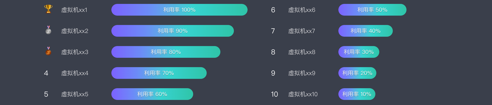
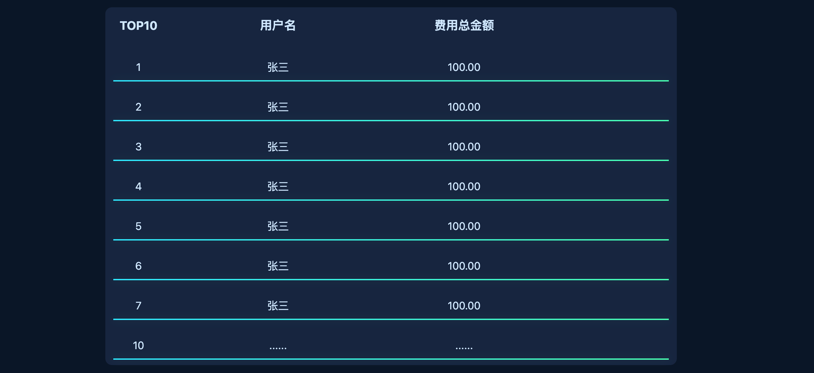

[[TOC]]

[TOC]

# css整体效果

## 1. 可调节水球进度显示

效果图片：

代码：浏览器控制台查看iframe源代码

效果：

<iframe
  :src="$withBase('/css/css-demo/20-01.html')"
  width="100%" height="300"
  frameborder="1" scrolling="No" leftmargin="0" topmargin="0"
/>

## 2. 上下切换菜单

效果图片：

代码：浏览器控制台查看iframe源代码

效果：

<iframe
  :src="$withBase('/css/css-demo/20-02.html')"
  width="100%" height="270"
  frameborder="1" scrolling="No" leftmargin="0" topmargin="0"
/>

## 3. 排名 — 渐变进度条（按排名递减）

效果图片：

代码：浏览器控制台查看iframe源代码

效果：

<iframe
  :src="$withBase('/css/css-demo/20-03.html')"
  width="100%" height="270"
  frameborder="1" scrolling="No" leftmargin="0" topmargin="0"
/>

## 4. 排名 — 列表形式

效果图片：

代码：浏览器控制台查看iframe源代码

效果：

<iframe
  :src="$withBase('/css/css-demo/20-04.html')"
  width="100%" height="570"
  frameborder="1" scrolling="No" leftmargin="0" topmargin="0"
/>

