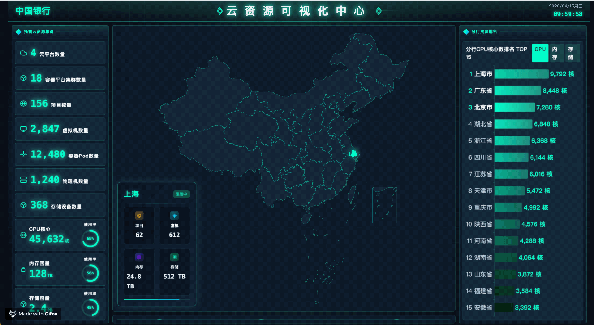

[[TOC]]

# 大屏效果

## 1. 资源大屏效果

效果动图：

代码：浏览器控制台查看iframe源代码

效果：

<iframe
  :src="$withBase('/css/css-demo/30-01/index.html')"
  width="100%" height="450"
  frameborder="1" scrolling="No" leftmargin="0" topmargin="0"
/>