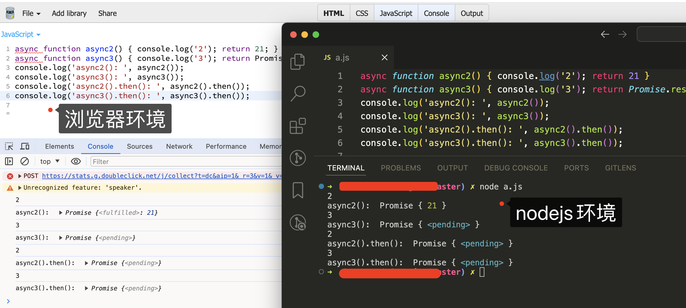

[[TOC]]

[TOC]


# async/await函数说明

async 用于申明一个 function 是异步的，而 await 用于等待一个异步方法执行完成。

根据语法规格，`await`命令只能出现在 async 函数内部，否则都会报错。

```js
function func() { await 10; }
func()
// 执行报错：Uncaught SyntaxError: await is only valid in async function

// 全局环境单独执行，node环境报错，浏览器没有报错
var a = await 3
// SyntaxError: await is only valid in async function
```

如果需要通过 await 来调用一个 async 函数，那这个调用的外面必须得再包一个 async 函数。


## 1. asyne起什么作用

这个问题的关键在于，async 函数是怎么处理它的返回值的！

我们当然希望它能直接通过 `return` 语句返回我们想要的值，但是如果真是这样，似乎就没 await 什么事了。所以，写段代码来试试，看它到底会返回什么：

```js
async function async1() {}
async function async2() { return "hello async"; }
console.log('async1(): ', async1());
console.log('async2(): ', async2());
// 输出结果：
// async1():  Promise { undefined }
// async2():  Promise { 'hello async' }
```

可以看到async函数返回的是一个 Promise 对象。

所以，async 函数返回的是一个 Promise 对象。从[文档](https://developer.mozilla.org/docs/Web/JavaScript/Reference/Statements/async_function)中也可以得到这个信息。async 函数（包含函数语句、函数表达式、Lambda表达式）会返回一个 Promise 对象，如果在函数中 `return` 一个直接量，async 会把这个直接量通过 `Promise.resolve()` 封装成 Promise 对象。

由于async函数返回的是一个 Promise 对象，所以在不使用await的情况下，可以使用`then()` 链来处理这个 Promise 对象，就像这样：

```js
async function async2() { return "hello async"; }
async2().then( res => { console.log('res: ', res) })
// res:  hello async
```

联想一下 Promise 的特点——无等待，所以在没有 `await` 的情况下执行 async 函数，它会立即执行，返回一个 Promise 对象，并且，绝不会阻塞后面的语句。这和普通返回 Promise 对象的函数并无二致。

那么下一个关键点就在于 await 关键字了。

## 2. await 到底在等啥

根据[mdn](https://developer.mozilla.org/zh-CN/docs/Web/JavaScript/Reference/Operators/await)介绍：

await 表达式会暂停当前 [`async function`](https://developer.mozilla.org/zh-CN/docs/Web/JavaScript/Reference/Statements/async_function) 的执行，等待 Promise 处理完成。若 Promise 正常处理(fulfilled)，其回调的resolve函数参数作为 await 表达式的值，继续执行 [`async function`](https://developer.mozilla.org/zh-CN/docs/Web/JavaScript/Reference/Statements/async_function)。若 Promise 处理异常(rejected)，await 表达式会把 Promise 的异常原因抛出，不会在执行async函数中剩下的代码了。另外，如果 await 操作符后的表达式的值不是一个 Promise，则返回该值本身。

按照语法说明，await 等待的是一个表达式，这个表达式的计算结果是 Promise 对象或者其它值（换句话说，就是没有特殊限定）。

await 可以用于等待一个 async 函数的返回值——这也可以说是 await 在等 async 函数，但要清楚，它等的实际是一个返回值。await 后面实际是可以接普通函数调用或者直接量的。所以下面这个示例完全可以正确运行

```js
function getSomething() { return "something"; }
async function testAsync() { return Promise.resolve("hello async"); }
async function test() {
    const v1 = await getSomething();
    const v2 = await testAsync();
  	const v3 = await 'jack';
    console.log(v1, v2, v3);
}
test(); // something hello async jack
```

`await` 是个运算符，用于组成表达式，await 表达式的运算结果取决于它等的东西:

>   如果它等到的不是 Promise 对象，await 表达式的运算结果就是它等到的东西
>
>   如果它等到的是一个 Promise 对象，await 就忙起来了，它会阻塞后面的代码，等着 Promise 对象 resolve，然后得到 resolve 的值，作为 await 表达式的运算结果

由于await表达式会阻塞，这就是 await 必须用在 async 函数中的原因。async 函数调用不会造成阻塞，它内部所有的阻塞都被封装在一个 Promise 对象中异步执行。

## 3. 一个简单的async/await的用法

上面说过，async函数会返回一个背封装的 Promise 对象，而 await 会等待这个 Promise 完成，并将其 resolve 的结果返回出来。

一个列子，用setTimeout模拟耗时的异步操作，如果只用 Promise 方式：

```js
function takeLongTime() {
    return new Promise(resolve => {
        setTimeout(() => resolve("long_time_value"), 3000);
    });
}
takeLongTime().then(v => { console.log("got：", v); });
// 3秒后输出：got： long_time_value
```

使用async/await：

```js
function takeLongTime() {
    return new Promise(resolve => {
        setTimeout(() => resolve("long_time_value"), 3000);
    });
}
async function test() {
  var v = await takeLongTime()
  console.log("got：", v)
}
test() //  3秒后输出：got： long_time_value
```

`takeLongTime()`函数前面没有加`async`，是因为自己主动返回了一个 Promise对象。

## 4. async/await 的优势在于处理 then 链

单一的 Promise 链并不能发现 async/await 的优势，但是，如果需要处理由多个 Promise 组成的 then 链的时候，优势就能体现出来了（很有意思，Promise 通过 then 链来解决多层回调的问题，现在又用 async/await 来进一步优化它）。

假设一个业务，分多个步骤完成，每个步骤都是异步的，而且依赖于上一个步骤的结果。我们仍然用 `setTimeout` 来模拟异步操作：

```js
// 传入参数 n，表示这个函数执行的时间（毫秒）,执行的结果是 n + 200，这个值将用于下一步骤
function takeLongTime(n) {
    return new Promise(resolve => { setTimeout(() => resolve(n + 200), n); });
}
function step1(n) {
    console.log(`step1 with ${n}`); return takeLongTime(n);
}
function step2(n) {
    console.log(`step2 with ${n}`); return takeLongTime(n);
}
function step3(n) {
    console.log(`step3 with ${n}`); return takeLongTime(n);
}
```

使用 Promise 方式实现三个步骤顺序处理：

```js
function doIt() {
    console.time("doIt");
    const time1 = 300;
    step1(time1)
        .then(time2 => step2(time2))
        .then(time3 => step3(time3))
        .then(result => { console.log(`result is ${result}`); console.timeEnd("doIt"); });
}
doIt();

// 输出结果
// step1 with 300
// step2 with 500
// step3 with 700
// result is 900
// doIt: 1513.870ms
```

用async/await 来实现：

```js
async function doIt() {
    console.time("doIt");
    const time1 = 300;
    const time2 = await step1(time1);
    const time3 = await step2(time2);
    const result = await step3(time3);
    console.log(`result is ${result}`);
    console.timeEnd("doIt");
}
doIt();
```

结果和之前的 Promise 实现是一样的， 但是这个代码看起来就清晰很多了，达到了同步代码的效果。

### 4.1 一个更复杂一点的例子

现在把业务要求改一下，仍然是三个步骤，但每一个步骤都需要之前每个步骤的结果

```js
function takeLongTime(n) {
    return new Promise(resolve => { setTimeout(() => resolve(n + 200), n); });
}
function step1(n) {
    console.log(`step1 with ${n}`);
    return takeLongTime(n);
}
function step2(m, n) {
    console.log(`step2 with ${m + n} =  ${m} + ${n}`);
    return takeLongTime(m + n);
}
function step3(k, m, n) {
    console.log(`step3 with ${k + m + n} =  ${k} + ${m} + ${n}`);
    return takeLongTime(k + m + n);
}
```

使用 Promise 方式实现三个步骤顺序处理:

```js
function doIt() {
    console.time("doIt");
    const time1 = 300;
    step1(time1)
        .then(time2 => {
            // return step2(time1, time2).then(time3 => [time1, time2, time3]);
            return step2(time1, time2).then(time3 => {
                // 由于then方法返回的是一个新的Promise实例，所以
                // 先执行了step2的then，获取到time3，然后把[time1, time2, time3]返回
                return [time1, time2, time3]
            });
        })
        .then(times => {
            const [time1, time2, time3] = times; // 这里解析参数，然后传递参数调用
            return step3(time1, time2, time3);
        })
        .then(result => {
            console.log(`result is ${result}`); console.timeEnd("doIt");
        });
}
doIt();

// 输出结果
step1 with 300
step2 with 800 =  300 + 500
step3 with 1800 =  300 + 500 + 1000
result is 2000
doIt: 2915.403ms
```

使用 Promise方式，传递参数，太麻烦了

用async/await 来实现：

```js
async function doIt() {
    console.time("doIt");
    const time1 = 300;
    const time2 = await step1(time1);
    const time3 = await step2(time1, time2);
    const result = await step3(time1, time2, time3);
    console.log(`result is ${result}`);
    console.timeEnd("doIt");
}

doIt();
```

## 5. async/await错误处理

如果`await`后面的异步操作出错，那么等同于`async`函数返回的 Promise 对象被`reject`。

```js
async function f() {
  // await new Promise(function (resolve, reject) { throw new Error('出错了'); });
  // await new Promise(function (resolve, reject) { reject('出错了'); });
  // 一旦 await 后面表达式报错，那么变量v还没有赋值，就跳出f()函数了
  var v = await Promise.reject('出错了')
  console.log('出错后，这里不执行了')
}

f()
.then(v => console.log(v))
.catch(e => console.log(e))
// Error：出错了
```

防止出错的方法，也是将其放在`try...catch`代码块之中。

```js
async function f() {
  try {
    await new Promise(function (resolve, reject) { reject('出错了'); });
  } catch(e) {
  }
  // return await('hello world');
}
f().catch(e => console.log(e))
```

## 6.async/await在代码中的执行流程

上面说过：

async函数会返回一个 Promise对象，async 函数调用不会造成阻塞，它内部所有的阻塞都被封装在一个 Promise 对象中异步执行。

await表达式后面如果是一个 Promise 对象，那么await就会阻塞代码，等待 Promise 对象异步执行的结果，如果是resolve，那么就会继续执行接下来的代码，如果是reject，那么就终止接下来的代码。

下面是一但代码：

```js
async function async1() { console.log('1') }
async function async2() { console.log('2'); return 3 }
async function async3() { console.log('4'); return Promise.resolve(5) }
async function async4() { console.log('6'); return Promise.reject(7) }
async function async5() {
    console.log('8')
    console.log(await async1()) // 第7行
    console.log(await async2()) // 第8行
    console.log('9')
}
async function async6() { // 第11行
    console.log('10')
    console.log(await async3()) // 第13行
    await async4()
    console.log('11')
}
console.log('12') // 第17行
async5()
console.log('13') // 第19行
async6()
console.log('14') // 第21行
// 12、8、1、13、10、4、14、undefined、2、3、9、5、6
```

代码执行流程：

第一步、执行一个宏任务，执行同步代码：

从第11行开始，console输出12，执行async5()异步函数，console输出8，执行`await async1()`，执行async1()方法，输出1，默认返回一个 Promise的回调。由于`await async1()`阻塞了async5 ()方法，接着执行第19行代码，输出13。开始执行async6()，输出10，执行`await async3()`，开始执行async3()函数，输出4，同时返回一个 Promise回调。回到async6()，由于await阻塞了async6() ，开始执行第21行代码，输出14，这次宏任务结束执行。

此时输出的结果：12、8、1、13、10、4、14。微任务回调队列有2个回调：async1()的回调、async3()的回调

第二步、执行所有可执行的微任务：

执行async1()的回调返回了undefined，所以第7行输出undefined，await取消阻塞，接着执行async5()函数，执行`await async2()`，执行async2()方法，输出2，接着返回一个Promise回调。

此时输出的结果：undefined、2。微任务回调队列有2个回调：async3()的回调、async2()的回调

微任务回调队列有2个回调：async3()的回调、async2()的回调

***注意，接下来代码运行顺序在浏览器和本地node环境运行的有所差别：***

-   在node环境中运行的顺序：

第三步、接着上面第二步，由于`await async2()`阻塞了async5()方法，所以，此时，async5()暂时暂停，去执行下一个微任务。

第四步、执行async3()的回调返回了5，所以第13行输出5，await取消阻塞，接着执行async6()函数，执行`await async4()`，执行async4()方法，输出6，接着返回一个Promise回调。

第五步、执行async2()的回调返回了3，所以第8行输出3，await取消阻塞，接着执行async5()函数，输出9，async5()函数执行结束。

第六步、执行async4()的回调返回了异常，因此中断async6()的执行，没有任务任务可以执行了，结束程序

此时输出的结果：5、6、3、9

所以在node环境中最终输出：`12、8、1、13、10、4、14、undefined、2、5、6、3、9`

-   在浏览器中运行的顺序：

第三步、接着上面的第二步，执行async2()的回调返回了3，所以第8行输出3，await取消阻塞，接着执行async5()函数，执行第9行代码，输出9，async5()函数执行结束。

第四部、执行async3()的回调返回了5，所以第13行输出5，await取消阻塞，接着执行async6()函数，执行`await async4()`，执行async4()方法，输出6，接着返回一个Promise回调。

第五步、执行async4()的回调返回了异常，因此中断async6()的执行，没有任务任务可以执行了，结束程序

此时输出的结果：3、9、5、6

所以在浏览器环境中最终输出：`12、8、1、13、10、4、14、undefined、2、3、9、5、6`

在浏览器中，可执行的微任务中，async5()中的所有微任务优先级都比async6()中的高，在上面代码的第8行下面加一行代码`console.log(await async2())`然后在浏览器里面运行，就会看到效果。




## 参考资料

[理解 JavaScript 的 async/await](https://segmentfault.com/a/1190000007535316)

[async 函数 ES6 阮一峰

[async function MDN](https://developer.mozilla.org/zh-CN/docs/Web/JavaScript/Reference/Statements/async_function)

[await MDN](https://developer.mozilla.org/zh-CN/docs/Web/JavaScript/Reference/Operators/await)