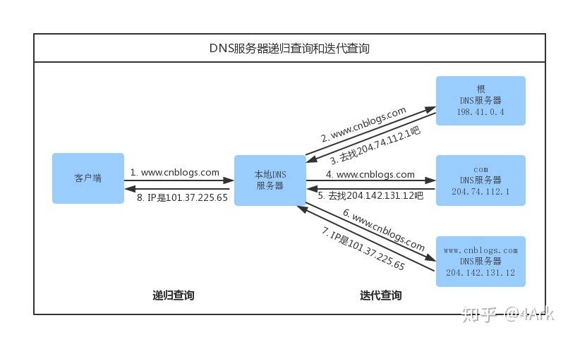
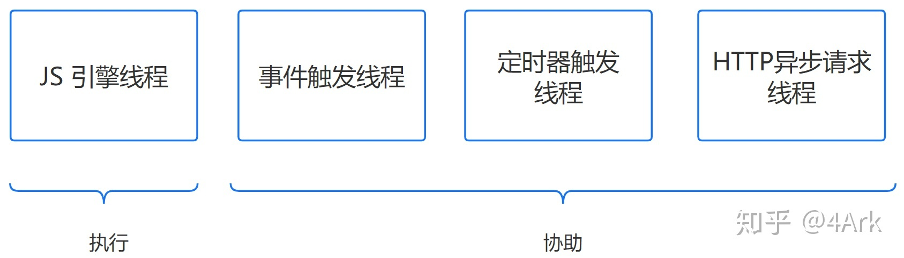

# 从输入URL到页面渲染过程

本文转载自：https://zhuanlan.zhihu.com/p/80551769

总体来说共分成一下几个过程：
URL输入
DNS解析
TCP连接
发送HTTP请求
服务器处理请求
服务器响应请求
浏览器解析渲染页面
连接结束

## 1. URL解析

### 1.1 地址解析

首先判断你输入的是一个合法的URL还是一个带搜索的关键词，并且根据你输入的内容自动完成、字符编码等操作。

### 1.2 HSTS

由于安全隐患，会使用`HSTS`来强制客户端使用HTTPS来访问页面。 [HSTS介绍](https://www.jianshu.com/p/caa80c7ad45c)

当你的网站均采用 HTTPS，并符合它的安全规范，就可以申请加入 HSTS 列表，之后用户不加 HTTPS 协议再去访问你的网站，浏览器都会定向到 HTTPS。

### 1.3 其他操作

浏览器还会进行一些额外的操作，比如安全检查、访问限制（之前国产浏览器限制 996.icu）。

### 1.4 缓存检查


## 2. DNS查询

因为 http 是基于 tcp 连接的，而 tcp 则是通过 ip 地址去识别访问的。DNS 解析就是域名转化成 ip 地址的过程。

基本步骤：


- 浏览器缓存

  浏览器会先检查是否在缓存中，没有则调用系统库函数进行查询。

- 操作系统缓存

  操作系统也有自己的DNS缓存，但在这之前，会检查域名是否存在本地的Host文件里，没有则向DNS服务器发送查询请求。

- 路由器缓存

  路由器也有自己的缓存。

- ISP DNS 缓存

  ISP DNS 就是在客户端电脑上设置的首选 DNS 服务器，它们在大多数情况下都会有缓存。

- **根域名服务器查询**

  在前面所有步骤没有缓存的情况下，本地 DNS 服务器会将请求转发到互联网上的根域。

下面这个图很好的诠释了整个流程：



需要注意的点：

1. 递归方式：一路查下去中间不返回，得到最终结果才返回信息（浏览器到本地DNS服务器的过程）
2. 迭代方式，就是本地DNS服务器到根域名服务器查询的方式。
3. 什么是 DNS 劫持
4. 前端 dns-prefetch 优化

## 3. TCP链接

### 3.1 TCP/IP分层

TCP/IP 分为四层，在发送数据时，每层都要对数据进行封装：


#### 3.1.1. 应用层：发送HTTP请求

在前面的步骤我们已经得到服务器的IP地址，浏览器会开始构造一个HTTP报文，其中包括：

- 请求报文(Request Header)：请求方法、目标地址、遵循的协议等
- 请求主题(其他参数)

需要注意的点：

- 浏览器只能发送GET、POST方法，打开网页使用的是GET方法

#### 3.1.2. 传输层：TCP传输报文

传输层会发起一条到达服务器的 TCP 连接，为了方便传输，会对数据进行分割（以报文段为单位），并标记编号，方便服务器接受时能够准确地还原报文信息。

在建立连接前，会先进行 TCP 三次握手。

#### 3.1.3. 网络层：IP协议查询Mac地址

将数据段打包，并加入源及目标的IP地址，并且负责寻找传输路线。

判断目标地址是否与当前地址处于同一网络中，是的话直接根据 Mac 地址发送，否则使用路由表查找下一跳地址，以及使用 ARP 协议查询它的 Mac 地址。

> 注意：在 OSI 参考模型中 ARP 协议位于链路层，但在 TCP/IP 中，它位于网络层。

#### 3.1.4. 链路层：以太网协议

**以太网协议**

根据以太网协议将数据分为以“帧”为单位的数据包，每一帧分为两个部分：

- 标头：数据包的发送者、接受者、数据类型
- 数据：数据包具体内容

**Mac 地址**

以太网规定了连入网络的所有设备都必须具备“网卡”接口，数据包都是从一块网卡传递到另一块网卡，网卡的地址就是 Mac 地址。每一个 Mac 地址都是独一无二的，具备了一对一的能力。

**广播**

发送数据的方法很原始，直接把数据通过 ARP 协议，向本网络的所有机器发送，接收方根据标头信息与自身 Mac 地址比较，一致就接受，否则丢弃。

**注意**：接收方回应是单播。

> 相关知识点：

1. ARP 攻击

**服务器接受请求**

接受过程就是把以上步骤逆转过来，参见上图。

### 3.2 TCP三次握手建立连接

三次握手是为了防止已失效的连接请求报文段突然又传送到了服务端，因而产生错误。失效的连接是怎样一种情况呢？我们都经历过网络不好的时候，网络中的延迟现象也是时有发生的。当客户端发送的一个请求在网络的某个地方停滞的时候，服务器端并不会感知到，延迟到一定时间就会发生超时现象，客户端通常会断开连接。而这时候停滞在途中的某个请求，又发送服务器了，假设不是约定“三次握手”，服务器认定客户端此时要建立连接，便会占用程序去监听处理此连接，但是客户端是完全“无感”的，并无连接，就会导致连接“错开”的现象。同样的，服务器像客户端发请求也是一样的，请求滞后也会导致这种现象。所以要彼此确认，再建立连接。

三次握手：

- 首先是客户端（浏览器）初始一个序列号 seq = x （随机生成），设 SYN = 1， 发送报文段给服务器端，表明自己想要建立连接。
- 服务器接收到之后，如果可以连接，服务器端同样会初始自己的序列号 seq = y，设值 SYN = 1，ACK = 1，并根据客户端的序列号，设置确认号为 ackn = x + 1，为什么要加 1，我们知道确认号表示发送了多少数据，它是从客户端的初始序列号加上发送数据的结果，而 SYN 恰好是第一次携带的数据（跟主体数据等价），所以就是 x + 1。最后像客户端发送报文段来作为应答。
- 客户端收到应答后，还会再确认一次，设置序列号为 seq = x + 1，表示发送了 1 bite 数据（SYN），SYN 不需要设置，因为第一次已经标识了要建立连接了。这次最主要的是设置 ACK = 1（需要确认并告诉服务端已接收到数据），ackn = y + 1（服务器携带 SYN = 1），最后发送报文段给服务器端。第三次的包比较特殊，只带seq和确认号，不带数据。


### 3.3 TCP四次挥手断开连接

TCP 数据传输完，是要断开连接的。我说的数据传输完，是某一端发送完数据，要断开连接，去发送一个断开的请求，客户端和服务端都可以主动断开连接。为什么断开要四次呢。

- 第一次是连接的某一端 A 请求断开连接，发送报文段给 B，设置 seq = x 和 ackn = y，另外加一个标识位 FIN，表示已经没有数据发送了，请求断开。
- B 收到请求，需要进行确认，即设置 ACK = 1，然后是 ackn = x（A 的 seq） + 1，B 的 seq 仍然是 y，只是确认收到 A 的关闭请求。
- 隔一段时间，B 再向 A 发送 FIN 报文段，请求关闭，FIN = 1，seq = y，ackn = x + 1。此时是最后确认阶段。
- A 收到 B 的 FIN，向 B 发送 ACK，确认关闭，seq = x + 1，ACK = 1，ackn = y + 1。发送完之后，A 会进入 TIME_WAIT 的阶段，如果 B 收到 ACK 关闭连接，A 在 2MSL （报文最大生存时间）收不到 B 的响应就自己默认关闭了。


#### 为什么断开要四次

对比 TCP 建立连接的时候，区别大概就是第二步拆成了两步。“三次握手”的时候确认 ACK 和同步 SYN 是一块返回的，断开连接则是分开发送，先发送 ACK 确认，再发送 FIN。这里主要是因为 B 端是被动断开的一方，A 发送完数据了，发送 FIN 表示我已经完事了，但是 B 不一定，也能还有数据会发送给 A。所以 B 会先 ACK 确认，然后当它真的没有数据要发送了，才会执行 FIN。

这种情况主要是由于 TCP 全双工传输的特性决定的。什么是全双工？先说一下半双工吧，举个栗子，有一条很窄的道路，只有单通道，但是却两个方向的车都可以走。当有一个方向的车进入，另一个方向的车就只能等待它通过才能进入。而全双工就是互不影响，你走你的，我走我的。所以 TCP 的数据传输也是这样，两端同时可以向对方发送数据，所以当 A 要断开连接的时候，B 接收到 FIN 表示没有数据会发来了，但是我还可以继续发送数据，可能还有数据要发，为了数据不丢失，即采用先确定后断开的方式。

## 4. 服务器处理请求

大致流程：


**服务器主程序HTTPD**

最常见的 HTTPD 有 Linux 上常用的 Apache 和 Nginx，以及 Windows 上的 IIS。

它会监听得到的请求，然后开启一个子进程去处理这个请求。

**处理请求**

接受 TCP 报文后，会对连接进行处理，对HTTP协议进行解析（请求方法、域名、路径等），并且进行一些验证：

- 验证是否配置虚拟主机
- 验证虚拟主机是否接受此方法
- 验证该用户可以使用该方法（根据 IP 地址、身份信息等）

**重定向**

假如服务器配置了 HTTP 重定向，就会返回一个 `301`永久重定向响应，浏览器就会根据响应，重新发送 HTTP 请求（重新执行上面的过程）。

> 关于更多：[详见这篇文章](https://link.zhihu.com/?target=https%3A//www.cnblogs.com/workest/p/3891321.html)

**URL 重写**

然后会查看 URL 重写规则，如果请求的文件是真实存在的，比如图片、html、css、js文件等，则会直接把这个文件返回。

否则服务器会按照规则把请求重写到 一个 REST 风格的 URL 上。

然后根据动态语言的脚本，来决定调用什么类型的动态文件解释器来处理这个请求。

以 PHP 语言的 MVC 框架举例，它首先会初始化一些环境的参数，根据 URL 由上到下地去匹配路由，然后让路由所定义的方法去处理请求。

## 5. 浏览器接受响应

浏览器接收到来自服务器的响应资源后，会对资源进行分析。

首先查看 Response header，根据不同状态码做不同的事（比如上面提到的重定向）。

如果响应资源进行了压缩（比如 gzip），还需要进行解压。

然后，对响应资源做缓存。

接下来，根据响应资源里的 [MIME](https://link.zhihu.com/?target=https%3A//developer.mozilla.org/zh-CN/docs/Web/HTTP/Basics_of_HTTP/MIME_types) 类型去解析响应内容（比如 HTML、Image各有不同的解析方式）。

## 6. 渲染页面

### 6.1 浏览器内核、渲染流程

浏览器内核：


渲染基本流程：

不同的浏览器内核，渲染过程也不完全相同，但大致流程都差不多。


### 6.2 HTML解析

首先要知道浏览器解析是从上往下一行一行地解析的。

解析的过程可以分为四个步骤：

**1. 解码（encoding）**

传输回来的其实都是一些二进制字节数据，浏览器需要根据文件指定编码（例如UTF-8）转换成字符串，也就是HTML 代码。

**2. 预解析（pre-parsing）**

预解析做的事情是提前加载资源，减少处理时间，它会识别一些会请求资源的属性，比如`img`标签的`src`属性，并将这个请求加到请求队列中。

**3. 符号化（Tokenization）**

符号化是词法分析的过程，将输入解析成符号，HTML 符号包括，开始标签、结束标签、属性名和属性值。

它通过一个状态机去识别符号的状态，比如遇到`<`，`>`状态都会产生变化。

**4. 构建树（tree construction）**

> 注意：符号化和构建树是并行操作的，也就是说只要解析到一个开始标签，就会创建一个 DOM 节点。

在上一步符号化中，解析器获得这些标记，然后以合适的方法创建`DOM`对象并把这些符号插入到`DOM`对象中。

```html
<html>
<head>
    <title>Web page parsing</title>
</head>
<body>
    <div>
        <h1>Web page parsing</h1>
        <p>This is an example Web page.</p>
    </div>
</body>
</html>
```


**浏览器容错进制**

你从来没有在浏览器看过类似"语法无效"的错误，这是因为浏览器去纠正错误的语法，然后继续工作。

**事件**

当整个解析的过程完成以后，浏览器会通过`DOMContentLoaded`事件来通知`DOM`解析完成。

### 6.3 CSS解析

一旦浏览器下载了 CSS，CSS 解析器就会处理它遇到的任何 CSS，根据[语法规范](https://link.zhihu.com/?target=https%3A//drafts.csswg.org/css-syntax-3/)解析出所有的 CSS 并进行标记化，然后我们得到一个规则表。

**CSS 匹配规则**

在匹配一个节点对应的 CSS 规则时，是按照从右到左的顺序的，例如：`div p { font-size :14px }`会先寻找所有的`p`标签然后判断它的父元素是否为`div`。

所以我们写 CSS 时，尽量用 id 和 class，千万不要过度层叠。

### 6.4 生成渲染树

其实这就是一个 DOM 树和 CSS 规则树合并的过程。

> 注意：渲染树会忽略那些不需要渲染的节点，比如设置了`display:none`的节点。

**计算**

通过计算让任何尺寸值都减少到三个可能之一：`auto`、百分比、px，比如把`rem`转化为`px`。

**级联**

浏览器需要一种方法来确定哪些样式才真正需要应用到对应元素，所以它使用一个叫做`specificity`的公式，这个公式会通过：

1. 标签名、class、id
2. 是否内联样式
3. `!important`

然后得出一个权重值，取最高的那个。

**渲染阻塞**

当遇到一个`script`标签时，DOM 构建会被暂停，直至脚本完成执行，然后继续构建 DOM 树。

但如果 JS 依赖 CSS 样式，而它还没有被下载和构建时，浏览器就会延迟脚本执行，直至 CSS Rules 被构建。

所有我们知道：

- CSS 会阻塞 JS 执行
- JS 会阻塞后面的 DOM 解析

为了避免这种情况，应该以下原则：

- CSS 资源排在 JavaScript 资源前面
- JS 放在 HTML 最底部，也就是 ``前

另外，如果要改变阻塞模式，可以使用 defer 与 async，详见：[这篇文章](https://link.zhihu.com/?target=https%3A//github.com/xiaoyu2er/blog/issues/8)

### 6.5 布局、绘制、渲染

确定渲染树种所有节点的几何属性，比如：位置、大小等等，最后输入一个盒子模型，它能精准地捕获到每个元素在屏幕内的准确位置与大小。

然后遍历渲染树，调用渲染器的 paint() 方法在屏幕上显示其内容。

### 6.6 回流与重绘

**回流(reflow)**

当浏览器发现某个部分发现变化影响了布局时，需要倒回去重新渲染，会从`html`标签开始递归往下，重新计算位置和大小。

reflow基本是无法避免的，因为当你滑动一下鼠标、resize 窗口，页面就会产生变化。

**重绘(repaint)**

改变了某个元素的背景色、文字颜色等等不会影响周围元素的位置变化时，就会发生重绘。

每次重绘后，浏览器还需要合并渲染层并输出到屏幕上。

回流的成本要比重绘高很多，所以我们应该尽量避免产生回流。

比如：

- `display:none` 会触发回流，而 `visibility:hidden` 只会触发重绘。

## 7. JavaScript 编译执行

大致流程：


可以分为三个阶段：

### 7.1 词法分析

JS 脚本加载完毕后，会首先进入语法分析阶段，它首先会分析代码块的语法是否正确，不正确则抛出“语法错误”，停止执行。

几个步骤：

- 分词，例如将`var a = 2`，，分成`var`、`a`、`=`、`2`这样的词法单元。
- 解析，将词法单元转换成抽象语法树（AST）。
- 代码生成，将抽象语法树转换成机器指令。

### 7.2 预编译

JS 有三种运行环境：

- 全局环境
- 函数环境
- eval

每进入一个不同的运行环境都会创建一个对应的执行上下文，根据不同的上下文环境，形成一个函数调用栈，栈底永远是全局执行上下文，栈顶则永远是当前执行上下文。

**创建执行上下文**

创建执行上下文的过程中，主要做了以下三件事：

- 创建变量对象

- - 参数、函数、变量

- 建立作用域链

- - 确认当前执行环境是否能访问变量

- 确定 This 指向

### 7.3 执行

**JS 线程**



虽然 JS 是单线程的，但实际上参与工作的线程一共有四个：

> 其中三个只是协助，只有 JS 引擎线程是真正执行的

- JS 引擎线程：也叫 JS 内核，负责解析执行 JS 脚本程序的主线程，例如 V8 引擎
- 事件触发线程：属于浏览器内核线程，主要用于控制事件，例如鼠标、键盘等，当事件被触发时，就会把事件的处理函数推进事件队列，等待 JS 引擎线程执行
- 定时器触发线程：主要控制`setInterval`和`setTimeout`，用来计时，计时完毕后，则把定时器的处理函数推进事件队列中，等待 JS 引擎线程。
- HTTP 异步请求线程：通过XMLHttpRequest连接后，通过浏览器新开的一个线程，监控readyState状态变更时，如果设置了该状态的回调函数，则将该状态的处理函数推进事件队列中，等待JS引擎线程执行。

**注：浏览器对同一域名的并发连接数是有限的，通常为 6 个。**

**宏任务**

分为：

- 同步任务：按照顺序执行，只有前一个任务完成后，才能执行后一个任务
- 异步任务：不直接执行，只有满足触发条件时，相关的线程将该异步任务推进任务队列中，等待JS引擎主线程上的任务执行完毕时才开始执行，例如异步Ajax、DOM事件，setTimeout等。

**微任务**

微任务是ES6和Node环境下的，主要 API 有：`Promise`，`process.nextTick`。

微任务的执行在宏任务的同步任务之后，在异步任务之前。


**代码例子**

```js
console.log('1'); // 宏任务 同步

setTimeout(function() {
    console.log('2'); // 宏任务 异步
})

new Promise(function(resolve) {
    console.log('3'); // 宏任务 同步
    resolve();
}).then(function() {
    console.log('4') // 微任务
})

console.log('5') // 宏任务 同步
```

以上代码输出顺序为：1,3,5,4,2


## 参考资料：

[在浏览器输入 URL 回车之后发生了什么（超详细版）知乎](https://zhuanlan.zhihu.com/p/80551769)

[从浏览器输入一个 url 到页面渲染，涉及的知识点及优化点 github](https://github.com/sunyongjian/blog/issues/34)