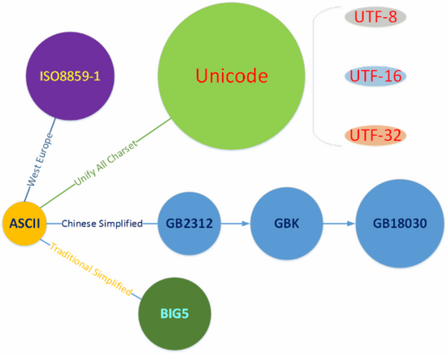

[[TOC]]

[TOC]

# 字符编码

计算机一开始发明出来时是用来解决数字计算问题的，后来人们发现，计算机还可以做更多的事，例如文本处理。

但计算机其实挺笨的，它只“认识”010110111000…这样由0和1两个数字组成的二进制数字，这是因为计算机的底层硬件实现就是用电路的断开和闭合两种状态来表示0和1两个数字的。因此，计算机只可以直接存储和处理二进制数字。

为了在计算机上也能表示、存储和处理像文字、符号等等之类的字符，就必须将这些字符转换成二进制数字。

当然，肯定不是我们想怎么转换就怎么转换，否则就会造成同一段二进制数字在不同计算机上显示出来的字符不一样的情况，因此必须得定一个统一的标准进行转换。

## 1. 基本概念

### 1.1 位

位，即比特(Bit)，亦称二进制位、比特位、位元，指二进制数中的一位，是计算机中信息表示的最小单位。

Bit是Binary digit（二进制数位）的缩写，由数学家John Wilder Tukey提出，习惯上以小写字母b表示，如8比特可表示为8b。

每个比特有0和1两个可能的值，除了代表数值本身之外，还可代表：

- 数值的正、负；
- 两种状态，如电灯的开、关，某根导线上电流的有、无，等等；
- 抽象逻辑上的是、否，或者说真、假。

### 1.2 字节

字节(byte)，又称为位元组，是计算机中计量存储容量和传输容量的一种基本计量单位，是由连续的、固定数量的位(即比特)所组成的位串(即比特串)，一般由8个位组成，即1 byte = 8 bit。习惯上用大写的B表示，如3字节可表示为3B。

现代个人计算机(PC)的存储器编址，一般是以字节为单位的，称之为按字节编址，因此字节一般也是存储器的最小存取单位以及处理器的最小寻址单位。

### 1.3 字符

各种文字和符号的总称，包括各国家文字、标点符号、图形符号、数字等。
也就是说，它是一个信息单位，一个数字是一个字符，一个文字是一个字符，一个标点符号也是一个字符。

### 1.4 字符集

字符的集合就叫字符集。不同集合支持的字符范围自然也不一样，譬如ASCII只支持英文，GB18030支持中文等等

在字符集中，有一个码表的存在，每一个字符在各自的字符集中对应着一个唯一的码。但是同一个字符在不同字符集中的码是不一样的，譬如字符“中”在Unicode和GB18030中就分别对应着不同的码(`20013`与`54992`)。

### 1.5 字符编码

定义字符集中的字符如何编码为特定的二进制数，以便在计算机中存储。
字符集和字符编码一般一一对应(有例外)

譬如GB18030既可以代表字符集，也可以代表对应的字符编码，它为了兼容`ASCII码`，编码方式为code大于`255`的采用两位字节(或4字节)来代表一个字符，否则就是兼容模式，一个字节代表一个字符。(简单一点理解，将它认为是现在用的的中文编码就行了)

字符集与字符编码的一个例外就是Unicode字符集，它有多种编码实现(UTF-8,UTF-16,UTF-32等)

## 2. 字符编码发展史

- 欧美的单字节字符编码发展

  - 美国人发明了计算机，使用的是英文，所以一开始就设计了一个几乎只支持英文的字符集`ASCII码`(1963 发布)，有128个码位，用一个字节即可表示，范围为`00000000-01111111`
  - 后来发现码位不够，于是在这基础上进行拓展，256个字符，取名为`EASCII(Extended ASCII)`，也能一个字节表示，范围为`00000000-11111111`
  - 后来传入欧洲，发现这个标准并不适用于一些欧洲语言，于是在`ASCII`(最原始的ASCII)的基础上拓展，形成了ISO-8859标准(国际标准，1998年发布)，跟EASCII类似，兼容ASCII。然后，根据欧洲语言的复杂特性，结合各自的地区语言形成了N个子标准，`ISO-8859-1、ISO-8859-2、...`。

- 亚洲，只能双字节了

  - 计算机传入亚洲后，国际标准已被完全不够用，东亚语言随便一句话就已经超出范围了，也是这时候亚洲各个国家根据自己的地区特色，有发明了自己地图适用的字符集与编码，譬如中国大陆的GB2312，中国台湾的BIG5，日本的Shift JIS等等

  这些编码都是用双字节来进行存储，它们对外有一个统称(ANSI-American National Standards Institute)，也就是说GB2312或BIG5等都是ANSI在各自地区的不同标准。

- Unicode一统天下

  - 到了全球互联网时代，不同国家，不同地区需要进行交互，这时候由于各自编码标准都不一样，彼此之间都是乱码，无法良好的沟通交流，于是这时候ISO组织与统一码联盟分别推出了UCS(Universal Multiple-Octet Coded Character Set)与Unicode。后来，两者意识到没有必要用两套字符集，于是进行了一次整合，到了Unicode2.0时代，Nnicode的编码和UCS的编码都基本一致(所以后续为了简便会同意用Unicode指代)，这时候所有的字符都可以采用同一个字符集，有着相同的编码，可以愉快的进行交流了。
  - 需要注意的是UCS标准有自己的格式，如UCS-2(双字节)，UCS-4(四字节)等等

  而Unicode也有自己的不同编码实现，如UTF-8，UTF-16，UTF-32等等
  其中UTF-16可以认为是UCS-2的拓展，UTF-32可以认为是UCS-4的拓展，而Unicode可以认为是Unicode最终用来制霸互联网的一种编码格式。

## 参考资料

[刨根究底字符编码之零——前言](https://zhuanlan.zhihu.com/p/27012715)

[【字符编码系列】大纲 segmentfault](https://segmentfault.com/a/1190000012470198)