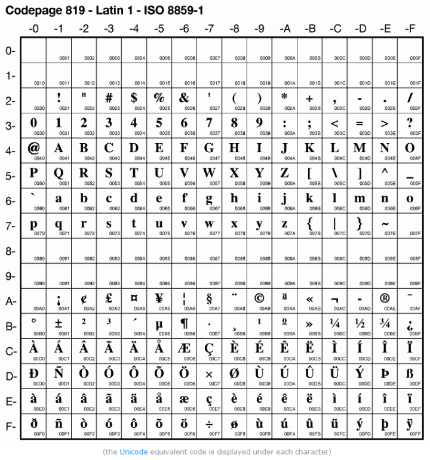
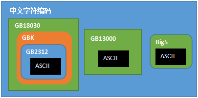

[[TOC]]

[TOC]

# 字符编码

计算机一开始发明出来时是用来解决数字计算问题的，后来人们发现，计算机还可以做更多的事，例如文本处理。

但计算机其实挺笨的，它只“认识”010110111000…这样由0和1两个数字组成的二进制数字，这是因为计算机的底层硬件实现就是用电路的断开和闭合两种状态来表示0和1两个数字的。因此，计算机只可以直接存储和处理二进制数字。

为了在计算机上也能表示、存储和处理像文字、符号等等之类的字符，就必须将这些字符转换成二进制数字。

当然，肯定不是我们想怎么转换就怎么转换，否则就会造成同一段二进制数字在不同计算机上显示出来的字符不一样的情况，因此必须得定一个统一的标准进行转换。

## 1. 基本概念

### 1.1 位

位，即比特(Bit)，亦称二进制位、比特位、位元，指二进制数中的一位，是计算机中信息表示的最小单位。

Bit是Binary digit（二进制数位）的缩写，由数学家John Wilder Tukey提出，习惯上以小写字母b表示，如8比特可表示为8b。

每个比特有0和1两个可能的值，除了代表数值本身之外，还可代表：

- 数值的正、负；
- 两种状态，如电灯的开、关，某根导线上电流的有、无，等等；
- 抽象逻辑上的是、否，或者说真、假。

### 1.2 字节

字节(byte)，又称为位元组，是计算机中计量存储容量和传输容量的一种基本计量单位，是由连续的、固定数量的位(即比特)所组成的位串(即比特串)，一般由8个位组成，即1 byte = 8 bit。习惯上用大写的B表示，如3字节可表示为3B。

现代个人计算机(PC)的存储器编址，一般是以字节为单位的，称之为按字节编址，因此字节一般也是存储器的最小存取单位以及处理器的最小寻址单位。

### 1.3 字符

各种文字和符号的总称，包括各国家文字、标点符号、图形符号、数字等。
也就是说，它是一个信息单位，一个数字是一个字符，一个文字是一个字符，一个标点符号也是一个字符。

### 1.4 字符集

字符的集合就叫字符集。不同集合支持的字符范围自然也不一样，譬如ASCII只支持英文，GB18030支持中文等等

在字符集中，有一个码表的存在，每一个字符在各自的字符集中对应着一个唯一的码。但是同一个字符在不同字符集中的码是不一样的，譬如字符“中”在Unicode和GB18030中就分别对应着不同的码(`20013`与`54992`)。

### 1.5 字符编码

定义字符集中的字符如何编码为特定的二进制数，以便在计算机中存储。
字符集和字符编码一般一一对应(有例外)

譬如GB18030既可以代表字符集，也可以代表对应的字符编码，它为了兼容`ASCII码`，编码方式为code大于`255`的采用两位字节(或4字节)来代表一个字符，否则就是兼容模式，一个字节代表一个字符。(简单一点理解，将它认为是现在用的的中文编码就行了)

字符集与字符编码的一个例外就是Unicode字符集，它有多种编码实现(UTF-8,UTF-16,UTF-32等)

## 2. 字符编码发展史

- 欧美的单字节字符编码发展

  - 美国人发明了计算机，使用的是英文，所以一开始就设计了一个几乎只支持英文的字符集`ASCII码`(1963 发布)，有128个码位，用一个字节即可表示，范围为`00000000-01111111`
  - 后来发现码位不够，于是在这基础上进行拓展，256个字符，取名为`EASCII(Extended ASCII)`，也能一个字节表示，范围为`00000000-11111111`
  - 后来传入欧洲，发现这个标准并不适用于一些欧洲语言，于是在`ASCII`(最原始的ASCII)的基础上拓展，形成了ISO-8859标准(国际标准，1998年发布)，跟EASCII类似，兼容ASCII。然后，根据欧洲语言的复杂特性，结合各自的地区语言形成了N个子标准，`ISO-8859-1、ISO-8859-2、...`。

- 亚洲，只能双字节了

  - 计算机传入亚洲后，国际标准已被完全不够用，东亚语言随便一句话就已经超出范围了，也是这时候亚洲各个国家根据自己的地区特色，有发明了自己地图适用的字符集与编码，譬如中国大陆的GB2312，中国台湾的BIG5，日本的Shift JIS等等

  这些编码都是用双字节来进行存储，它们对外有一个统称(ANSI-American National Standards Institute)，也就是说GB2312或BIG5等都是ANSI在各自地区的不同标准。

- Unicode一统天下

  - 到了全球互联网时代，不同国家，不同地区需要进行交互，这时候由于各自编码标准都不一样，彼此之间都是乱码，无法良好的沟通交流，于是这时候ISO组织与统一码联盟分别推出了UCS(Universal Multiple-Octet Coded Character Set)与Unicode。后来，两者意识到没有必要用两套字符集，于是进行了一次整合，到了Unicode2.0时代，Nnicode的编码和UCS的编码都基本一致(所以后续为了简便会同意用Unicode指代)，这时候所有的字符都可以采用同一个字符集，有着相同的编码，可以愉快的进行交流了。
  - 需要注意的是UCS标准有自己的格式，如UCS-2(双字节)，UCS-4(四字节)等等

  而Unicode也有自己的不同编码实现，如UTF-8，UTF-16，UTF-32等等
  其中UTF-16可以认为是UCS-2的拓展，UTF-32可以认为是UCS-4的拓展，而Unicode可以认为是Unicode最终用来制霸互联网的一种编码格式。

### 2.1 ASCII码

ASCII码(American Standard Code for Information Interchange美国信息交换标准码)，由美国国家标准学会ANSI(American National Standard Institute)于1968年正式制定。

目前所通行的其他字符编码方案，比如ISO-8859系列、GB系列(GB2312、GBK、GB18030、GB13000)、Big5、Unicode等等，均直接或间接兼容ASCII码。

http://ascii.911cha.com/

ASCII字符集共计有128个字符(见上表)，码点编号(即字符编号)从0到127(二进制为从0000 0000到0111 1111，十六进制为从0x00到0x7F)，二进制最高位都是0。其中：

1）0~31：不可显示不可打印的控制字符或通讯专用字符，如0x07(BEL响铃)会让计算机发出哔的一声、0x00(NUL空，注意不是空格)通常用于指示字符串的结束、0x0D(CR回车)和0x0A(LF换行)用于指示打印机的打印针头退到行首(即回车)并移到下一行(即换行)等；

2）32：可显示但不可打印的空格字符；

3）33~126：可显示可打印字符，其中48~57为0-9的阿拉伯数字，65~90为26个大写英文字母，97~122为26个小写英文字母，其余的是一些标点符号、运算符号等；

4）127：不可显示不可打印字符的控制字符DEL。

ASCII字符编解码非常简单，比如若要将字符序列编码为二进制流写入存储设备，只需要将该字符序列里的各个字符在ASCII字符集中的字符编号(即码点编号)，直接以一个二进制字节写入存储设备即可，字符编号就是字符编码，中间不需要经过特别的编码算法进行字符编号到字符编码的转换计算，更不存在所谓码元序列到字节序列的转换。

### 2.2 ISO-8859编码

计算机出现之后，首先逐渐从美国发展到了欧洲。由于欧洲很多国家所用到的字符中，除了基本的、美国也用的那128个ASCII字符之外，还有很多衍生的拉丁字母等字符。比如，在法语中，字母上方有注音符号；而欧洲其他国家也有各自特有的字符。

考虑到一个字节能够表示的编码实际上有256个(2^8 = 256)，ASCII只使用了一个字节所能表示的256个编码中的前128个(2^7 = 128)编码，而后128个编码相当于被闲置了。因此，欧洲各国纷纷打起了后面这128个编码的主意。

ISO/IEC 8859是一组字符集的总称，其下共包含了15个字符集，即ISO/IEC 8859-n，n=1、2、3...15、16(其中12未定义，所以共15个)。

- ISO 8859-1收录了西欧常用字符(包括德法两国的字母)，也称Latin-1，目前使用得最为普遍；
- ISO 8859-2字符集，也称为Latin-2，收录了东欧字符；
- ISO 8859-3字符集，也称为Latin-3，收录了南欧字符；
- ISO 8859-4字符集，也称为Latin-4，收录了北欧字符；
- ISO 8859-5字符集，也称为Cyrillic，收录了斯拉夫语系字符；
- ISO 8859-6字符集，也称为Arabic，收录了阿拉伯语系字符；
- ISO 8859-7字符集，也称为Greek，收录了希腊字符；
- ISO 8859-8字符集，也称为Hebrew，收录了西伯莱(犹太人)字符；
- ISO 8859-9字符集，也称为Latin-5或Turkish，收录了土耳其字符；
- ISO 8859-10字符集，也称为Latin-6或Nordic，收录了北欧(主要指斯堪地那维亚半岛)的字符；
- ISO 8859-11字符集，也称为Thai，从泰国的TIS620标准字符集演化而来；
- ISO 8859-12字符集，目前尚未定义(未定义的原因目前有两种说法：一是原本要设计成一个包含塞尔特语族字符集的“Latin-7”，但后来塞尔特语族变成了ISO 8859-14 / Latin-8；二是原本预留给印度天城体梵文的，但后来却搁置了)；
- ISO 8859-13字符集，也称为Latin-7，主要函盖波罗的海(Baltic)诸国的文字符号，也补充了一些被Latin-6遗漏的拉脱维亚(Latvian)字符；
- ISO 8859-14字符集，也称为Latin-8，它将Latin-1中的某些符号换成塞尔特语(Celtic)的字符；
- ISO 8859-15字符集，也称为Latin-9，或者被戏称为Latin-0，它将Latin-1中较少用到的符号删除，换成当初遗漏的法文和芬兰字母，还把英镑和日元之间的金钱符号，换成了欧盟货币符号；
- ISO 8859-16字符集，也称为Latin-10，涵盖了阿尔巴尼亚语、克罗地亚语、匈牙利语、意大利语、波兰语、罗马尼亚语及斯洛文尼亚语等东南欧国家语言。

### 2.3 中文编码系列(GB2312、GBK、GB18030)

英文字母再加一些其他标点字符之类的也不会超过256个，用一个字节来表示一个字符就足够了(2^8 = 256)。但其他一些文字不止这么多字符，比如中文中的汉字就多达10多万个，一个字节只能表示256个字符，肯定是不够的，因此只能使用多个字节来表示一个字符。

于是当计算机被引入到中国后，相关部门设计了GB系列编码(“GB”为“国标”的汉语拼音首字母缩写，即“国家标准”之意)。

因此，GB系列编码方案向下完全直接兼容ASCII编码方案。也就是说，如果一段用GB编码方案编码的文本里的所有字符都在ASCII编码方案中有定义(即该文本全部由ASCII字符组成)，那么这段GB编码实际上和ASCII编码完全一样。

#### 2.3.1 GB2312

由中国国家标准总局于1980年发布、1981年5月1日开始实施的一套国家标准，标准号为GB2312-1980。

GB2312标准共收录6763个汉字，其中一级汉字3755个，二级汉字3008个；同时，除了汉字，GB2312还收录了包括拉丁字母、希腊字母、日文平假名及片假名字母、俄语西里尔字母在内的682个字符。

可能是出于显示上视觉美观的考虑，除汉字之外的682个字符中，GB2312甚至还包括了ASCII里本来就有的数字、标点、字母等字符。也就是说，这些ASCII里原来就有的单字节编码的字符，又再编了两个字节长的GB2312编码版本。

这682个双字节编码字符就是常说的“全角”字符，而这些字符所对应的单字节编码的ASCII字符就被称之为“半角”字符。

#### 2.3.2 全角、半角

早期的点阵显示器由于像素有限，原先*ASCII*美欧字符的显示宽度用来显示汉字有点挤，因此采用了两倍于*ASCII*字符的显示宽度显示汉字。这样一来，ASCII西文字符在显示时其宽度为汉字的一半。或许是为了在西文字符与汉字混合排版时，让西文字符能与汉字对齐等视觉美观上的考虑，于是就设计了让西文字母、数字和标点等特殊字符在外观视觉上也占用一个汉字的视觉空间(主要是宽度)，并且在内部存储上也同汉字一样使用2个字节进行存储的方案。这些与汉字在显示宽度上一样的西文字符就被称之为全角字符。

而原来ASCII中的西文字符由于在外观视觉上仅占用半个汉字的视觉空间(主要是宽度)，并且在内部存储上使用1个字节进行存储，相对于全角字符，因而被称之为半角字符。

后来，其中的一些全角字符因为比较有用，就得到了广泛应用(比如全角的逗号“，”、问号“？”、感叹号“！”、空格“　”等，这些字符在输入法中文输入状态下的半角与全角是一样的，英文输入状态下全角跟中文输入状态一样，但半角大约为全角的二分之一宽)，专用于中日韩文本，成为了标准的中日韩标点字符。而其它的许多全角字符则逐渐失去了价值(现在很少需要让纯文本的中文和西文字符对齐了)，就很少再用了。

#### 2.3.3 GBK汉字国标扩展码

GBK编码，是对GB2312编码的扩展，因此完全兼容GB2312-80标准。GBK编码依然采用双字节编码方案，其编码范围：8140－FEFE，剔除xx7F码位，共23940个码位。共收录汉字和图形符号21886个，其中汉字（包括部首和构件）21003个，图形符号883个。GBK编码支持国际标准ISO/IEC10646-1和国家标准GB13000-1中的全部中日韩汉字，并包含了BIG5编码中的所有汉字。GBK编码方案于1995年12月15日正式发布，这一版的GBK规范为1.0版。

Windows 95系统就是以GBK为内码，又由于GBK同时也涵盖了Unicode所有CJK汉字，所以也可以和Unicode做一一对应

#### 2.3.4 GB18030

中国国家质量技术监督局于2000年3月17日推出了GB18030-2000标准，以取代GBK。GB18030-2000除保留全部GBK编码汉字之外，在第二字节再度进行扩展，增加了大约一百个汉字及四位元组编码空间。

GB18030是我国计算机系统必须遵循的基础性标准之一。

#### 2.3.5 GB13000

为了对世界各个国家和地区的所有字符进行统一编码，以实现对世界上所有字符在计算机上的统一处理，国际标准化组织制定了新的编码标准——ISO/IEC 10646标准，收录了世界上其他文字字符之外，也收录了中国大陆、台湾、日本及韩国的汉字，总共20,902个。

为了与国际标准接轨，中国于是制定了与ISO/IEC 10646.1:1993标准相对应的中国国家标准——GB13000.1-1993

#### 2.3.6 BIG5 编码

BIG5编码又称大五码，是繁体中文字符集编码标准，共收录13060个中文字，其中有二字为重复编码。

BIG5重复地收录了两个相同的字：“兀、兀”（A461及C94A)、“嗀、嗀”(DCD1及DDFC)。

BIG5采用双字节编码，使用两个字节来表示一个字符。高位字节使用了0x81-0xFE，低位字节使用了0x40-0x7E，及0xA1-0xFE

适用于台湾和香港地区的繁体中文系统软件等.不过由于编码本身存在的问题.已经基本改用Unicode编码了.

### 2.4 Unicode编码

https://zhuanlan.zhihu.com/p/27151824

Unicode字符集的目标是涵盖目前人类使用的所有字符，并为每个字符分配唯一的字符编号。

Unicode字符集的字符编码方式一开始规定用两个字节的码元(即16位码元)来统一表示所有的字符(即UTF-16编码方式，UTF-16编码方式要早于UTF-8编码方式、UTF-32编码方式出现)。

在这套系统中: **一个字符代表一个code，不存在二义性**，例如`U+0041`总是代表`'A'`，而且这套标准也会随着需求不断的拓展。

Unicode是一个标准，只规定了某个字符应该对应哪一个code，但是并没有规定这个字符应该用多少字节来存储。规定用几个字节存储字符的是Unicode的不同实现，譬如UTF-8，UTF-16等。

#### 2.4.1 UTF-8

UTF-8是Unicode的一种实现方式，是一种变长编码，根据不同的Unicode字符,用1到6个字节(也有说1~4个字节)编码。

UTF-8在中文字符处理时，一般都是3个字节，这样相比GBK，UTF-16等编码，会更浪费空间(但是针对英文又有天然的优势-单字节)。

UTF-8同其他的多字节码元编码方式相比具有以下优点：

- UTF-8的编码空间足够大，未来Unicode新标准收录更多字符
- UTF-8是变长编码，比如一个字节足以容纳所有的ASCII码字符，就用一个字节来存储，不必在高位补0以浪费更多的字节来存储，因此在英语作为国际语言的现实情况下，UTF-8因其ASCII字符的单字节编码这一特性可节省大量存储空间。
- UTF-8完全直接兼容ASCII码
- UTF-8编码带有前缀码，所以容错性好，即使在传输过程中发生局部的字节错误，比如即便丢失、增加、改变了某些字节，也不会导致所有后续字符全部错乱这样传递性、连锁性的错误问题
- 由于UTF-8编码没有状态，从UTF-8字节流的任意位置开始可以有效地找到一个字符的起始位置，字符边界很容易界定、检测出来，所以具有很好的“自同步性”。
- UTF-8已经成为互联网所采用的字符编码方式的事实标准。

UTF-8编码最短的为一个字节、最长的目前为四个字节，从首字节就可以判断一个UTF-8编码有几个字节：

- 如果首字节以0开头，肯定是单字节编码(即单个单字节码元)；

- 如果首字节以110开头，肯定是双字节编码(即由两个单字节码元所组成的双码元序列)；

- 如果首字节以1110开头，肯定是三字节编码(即由三个单字节码元所组成的三码元序列)，以此类推。

https://zhuanlan.zhihu.com/p/27364614

##### 2.4.1.1 BOM(Byte Order Mark)字节序标记

字节序标记BOM是Unicode码点值为FEFF(十进制为65279，二进制为1111 1110 1111 1111)的字符，因此BOM实际上可认为是该字符(U+FEFF)的别名。

最初，字符U+FEFF如果出现在字节流的开头，则用来标识该字节流的字节序——是高位在前还是低位在前；如果它出现在字节流的中间，则表达为该字符的原义——**零宽度不中断空格(ZERO WIDTH NO-BREAK SPACE零宽度无断空白)**。该字符名义上是个空格，实际上是零宽度的，即相当于是不可见也不可打印字符。

不过，从Unicode 3.2开始，U+FEFF只能出现在字节流的开头，且只能用于标识字节序，就如它的别名——字节序标记——所表示的意思一样；除此以外的用法已被舍弃。取而代之的是，使用U+2060来表示零宽度不中断空格。

UTF-8编码本身并不存在字节序的问题，但仍然有可能会用到BOM——有时被用来标示某文本是UTF-8编码格式的文本。**再强调一遍：在UFT-8编码格式的文本中，如果添加了BOM，则只用它来标示该文本是由UTF-8编码方式编码的，而不用来说明字节序，因为UTF-8编码根本就不存在字节序问题。**

许多Windows程序(包含记事本)会添加BOM到UTF-8编码格式的文件中。然而，在类Unix系统中，这种作法则不被建议采用。

因为它会影响到无法识别它的编程语言，如gcc会报告源码文件开头有无法识别的字符；而在PHP中，如果没有激活输出缓冲(output buffering)的话，则它会使得页面内容开始被送往浏览器(即http header头被提交)，从而使PHP脚本无法再指定http header头。

对于已在IANA注册的字符编码(实际为字符编码模式CES)UTF-16BE、UTF-16LE、UTF-32BE和UTF-32LE等来说，不可使用BOM，因为其名称本身已决定了其字节顺序。而对于已注册的字符编码UTF-16和UTF-32来说，则必须在文本开头使用BOM。

#### 2.4.2 UTF-16

Unicode编码中，最常用的字符其实是`0-65535`，因此针对这点产生了UTF-16方案。

UTF-16将0–65535范围内的字符编码成2个字节，超过这个的用4个字节编码。(因此基本可以认为是双字节的)

UTF-16是完全对应于UCS-2的，即把UCS-2规定的代码点通过Big Endian或Little Endian方式直接保存下来。所以UTF-16采用2个字节来存储Unicode。UTF-16也可以表示UCS-4的部分字符，所以UTF-16也采用4个字节来存储Unicode。

#### 2.4.3 UTF-32

UTF-32是Unicode的一种实现方式.
UTF32编码使用固定的4个字节来存储。
因此,非常浪费空间,不利于网络传输,所以使用不普遍。

 HTML5中明确规定禁止使用Utf-32编码

## 3. 常见乱码和问题解决

## 参考资料

[刨根究底字符编码之零——前言](https://zhuanlan.zhihu.com/p/27012715)

[【字符编码系列】大纲 segmentfault](https://segmentfault.com/a/1190000012470198)