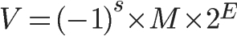

[[TOC]]

[TOC]

# Number运算精度和大数显示问题

## 1. 开发遇到的计算问题

在项目开发过程中遇到了一个计算数学问题：

`89*0.15 + 85*0.1 + 84*0.1 + 86*0.2 + 92*0.25 + 97*0.2 = 89.85000000000001`


在 JavaScript 中整数和和小数都属于 `Number` 数据类型，都是是采用 [IEEE 754 标准](https://zh.wikipedia.org/wiki/IEEE_754)的 64 位双精度浮点数。 当浮点数做数学运算的时候，你经常会发现一些问题：

```js
// 加法
// 0.1 + 0.2 = 0.30000000000000004
// 0.7 + 0.1 = 0.7999999999999999
// 0.2 + 0.4 = 0.6000000000000001
// 89*0.15 + 85*0.1 + 84*0.1 + 86*0.2 + 92*0.25 + 97*0.2 = 89.85000000000001
 
// 减法
// 1.5 - 1.2 = 0.30000000000000004
// 0.3 - 0.2 = 0.09999999999999998
 
// 乘法
// 19.9 * 100 = 1989.9999999999998
// 19.9 * 10 * 10 = 1990
// 1306377.64 * 100 = 130637763.99999999
// 1306377.64 * 10 * 10 = 130637763.99999999
// 0.7 * 180 = 125.99999999999999

// 除法
// 0.3 / 0.1 = 2.9999999999999996
// 0.69 / 10 = 0.06899999999999999
```

在JS中，整数精度同样存在问题：

```js
console.log(19571992547450991);                    // 19571992547450990
console.log(19571992547450991===19571992547450992) // true
Math.pow(2, 53) - 1                                // 9007199254740991
Number.MAX_SAFE_INTEGER                            // 9007199254740991
Number.MIN_SAFE_INTEGER                            // -9007199254740991
```

在 JavaScript 中 `Number`类型统一按浮点数处理，整数是按最大54位来算最大(`2^53 - 1`，`Number.MAX_SAFE_INTEGER`,`9007199254740991`) 和最小(`-(2^53 - 1)`，`Number.MIN_SAFE_INTEGER`,`-9007199254740991`) 安全整数范围的。所以只要超过这个范围，就会存在被舍去的精度问题。

这个问题并不只是在 JS 中才会出现，几乎所有的编程语言都采用了 IEEE-745 浮点数表示法，任何使用二进制浮点数的编程语言都会有这个问题，只不过在很多其他语言中已经封装好了方法来避免精度的问题，而 JS 是一门弱类型的语言，从设计思想上就没有对浮点数有个严格的数据类型，所以精度误差的问题就显得格外突出。

## 2. Number存储方式和计算

根据IEEE 754标准，任意一个**二进制浮点数** V 可以表示成下面的形式：

>  
>
> **（1）(-1)^s表示符号位，s=0，V为正数；s=1，V为负数。**     
> **（2）M表示有效数字，大于等于1，小于2。**    
> **（3）2^E表示指数位。**  
> **例如：二进制`1111`换算成指数表示法就是`(-1)^0 * 1.111 * 2^3`**  

对于64位的浮点数在内存中的表示，最高的1位是符号位，接着的11位是指数，剩下的52位为有效数字，具体：

-   第0位到第51位：储存小数部分（即有效数字M），决定了数值的精度；
-   第52位到第62位：储存指数部分(E)，决定了数值的大小；
-   第63位：符号位(S)，0表示正数，1表示负数；


- 对有效数字M的规定：

  1≤M<2，也就是说，M是1.xxxxxx的形式，其中xxxxxx表示小数部分。**IEEE 754规定，在计算机内部保存M时，默认这个数的第一位总是1，因此可以被舍去，只保存后面的xxxxxx部分**。比如保存1.01的时候，只保存01，等到读取的时候，再把第一位的1加上去。这样做的目的，是节省1位有效数字。因此最大有效位数是53位。

- 关于指数E：

  E为一个无符号整数，由于长度是11位，它的取值范围为0~2047。但是，科学计数法中的E是可以出现负数的，**所以标准规定，E的真实值必须再减去一个中间数，对于11位的E，这个中间数是1023**。然后，指数E还可以再分成三种情况：

  - 1、**E不全为0或不全为1**。这时就采用上面的规则表示，即指数E的计算值减去1023，得到真实值，再将有效数字M前加上第一位的1。
  - 2、**E全为0**。这时，实际指数E等于-1023，有效数字M不再加上第一位的1，而是还原为0.xxxxxx的小数。这样做是为了表示±0，以及接近于0的很小的数字。
  - 3、**E全为1**。这时，如果有效数字M全为0，表示±无穷大（正负取决于符号位s）；如果有效数字M不全为0，表示这个数不是一个数（NaN）。
  
  

### 2.1 一个存储例子

比如数字15，转换为二进制：

```js
(15).toString(2) // 1111
```

二进制`1111`换算成指数表示法就是`(-1)^0 * 1.111 * 2^3`:

- 符号位S：0
- 指数位E：01111111110(1023)  + 11(3) = 10000000010(1026) 
- 小数位M：111


### 2.2 小数计算过程

以`0.1 + 0.2 `为例：

1、首先十进制要转化为二进制(第一次损失精度)：

```js
// 0.1、0.2 的二进制：无线循环，截取到53位
(0.1).toString(2) // '0.000110011 0011 0011 001100110011001100110011001100110011' 
(0.2).toString(2) // '0.001100110 0110 0110 011001100110011001100110011001100110'
```

2、IEEE 754浮点数的小数部分最多支持 53 位二进制位，所以两者相加之后得到二进制为(第二次损失精度)：

```js
0.01001100110011001100110011001100110011001100110011001 
```

3、因浮点数小数位的限制而截断的二进制数字，再转换为十进制，就成了 `0.30000000000000004`。所以在进行算术计算时会产生误差。

二进制和十进制互相转换方法：


## 3. 第三方类库解决

通常这种对精度要求高的计算都应该交给后端去计算和存储，因为后端有成熟的库来解决这种计算问题。前端也有几个类似的库(大量计算会影响页面性能)：

- [Math.js](http://mathjs.org/):

  Math.js 是专门为 JavaScript 和 Node.js 提供的一个广泛的数学库。它具有灵活的表达式解析器，支持符号计算，配有大量内置函数和常量，并提供集成解决方案来处理不同的数据类型像数字，大数字(超出安全数的数字)，复数，分数，单位和矩阵。 功能强大，易于使用。GitHub：https://github.com/josdejong/mathjs

- [decimal.js](http://mikemcl.github.io/decimal.js/):

  为 JavaScript 提供十进制类型的任意精度数值。GitHub：https://github.com/MikeMcl/decimal.js

- [big.js](http://mikemcl.github.io/big.js):

  一个小、快速，易于使用的十进制类型任意精度计算的库。GitHub：https://github.com/MikeMcl/big.js/

- [Numeral.js](http://numeraljs.com/):

  一个用于格式化和操作数字的JavaScript库。数字可以被格式化为货币，百分比，时间，几个小数位数，千分位等等。GitHub：https://github.com/adamwdraper/Numeral-js

- [accounting.js](http://openexchangerates.github.io/accounting.js/):

  一个很小的JavaScript库，提供简单和高级的数字、货币和货币格式。它是轻量级的，没有依赖关系，适用于所有客户端和服务器端JavaScript应用程序。GitHub：https://github.com/openexchangerates/accounting.js

这几个类库帮我们解决很多这类问题，不过前端大部分都是做展示数据，大量计算数据的情况很少，所以很多时候，一个函数能解决的问题，就不需要引用类库了。

## 4. 自定义函数解决

### 4.1 加法函数

```js
/**
 * 加法函数，用来得到精确的加法结果
 * 说明：JS的加法结果会有误差，在两个浮点数相加的时候会比较明显。这个函数返回较为精确的加法结果。
 * 调用：accAdd(arg1,arg2)
 * 返回值：arg1加上arg2的精确结果
 * 原理： 小数变成整数，相加后在变回小数， 如： 1.12 + 0.123 => (1.12 * 1000 + 0.123 * 1000) / 1000
 */
function accAdd(arg1, arg2) {
  let r1 = 0;
  let r2 = 0;
  try {
    // 获取参数1的小数长度，比如 12.12345，那么 r1 === 5
    r1 = arg1.toString().split('.')[1].length;
  } catch (e) { /**/ }
  try {
    // 获取参数2的小数长度，比如 12.12345，那么 r2 === 5
    r2 = arg2.toString().split('.')[1].length;
  } catch (e) { /**/ }
  const m = Math.pow(10, Math.max(r1, r2)); // 小数位数最多的，10的次幂
  return (arg1 * m  + arg2 * m) / m; // // 整数相加后，变回小数
}

// 给Number类型增加一个add方法，调用起来更加方便。
Number.prototype.add = function(arg) {
  return accAdd(arg, this);
};

console.log('0.1 + 0.2 = ', accAdd(0.1, 0.2))
console.log('0.7 + 0.1 = ', accAdd(0.7, 0.1))
```

### 4.2 减法函数

```js
/**
 * 减法函数，用来得到精确的减法结果
 * 说明：javascript的减法结果会有误差，在两个浮点数相减的时候会比较明显。这个函数返回较为精确的减法结果。
 * 调用：accSub(arg1,arg2)
 * 返回值：arg1加上arg2的精确结果
 * 原理： 小数变成整数，相减后在变回小数， 如： 1.12 - 0.123 => (1.12 * 1000 - 0.123 * 1000) / 1000
 */
function accSub(arg1, arg2) {
  let r1 = 0;
  let r2 = 0;
  try {
      r1 = arg1.toString().split(".")[1].length;
  } catch (e) { /**/ }
  try {
      r2 = arg2.toString().split(".")[1].length;
  } catch (e) { /**/ }
  const n = Math.max(r1, r2);
  const m = Math.pow(10, n); // 小数位数最多的，10的次幂
  return ((arg1 * m - arg2 * m) / m).toFixed(n);
}

// 给Number类型增加一个sub方法，调用起来更加方便。
Number.prototype.sub = function (arg) {
  return accSub(arg, this);
};

console.log('1.5 - 1.2 = ', accSub(1.5, 1.2))
console.log('0.3 - 0.2 = ', accSub(0.3, 0.2))
```

### 4.3 乘法函数

```js
/**
 * 乘法函数，用来得到精确的乘法结果
 * 说明：JS的乘法结果会有误差，在两个浮点数相乘的时候会比较明显。这个函数返回较为精确的乘法结果。
 * 调用：accMul(arg1,arg2)
 * 返回值：arg1乘以 arg2的精确结果
 */
function accMul(arg1, arg2) {
  let m = 0; 
  const s1 = arg1.toString();
  const s2 = arg2.toString();
  try {
      m += s1.split(".")[1].length;
  } catch (e) { /**/ }
  try {
      m += s2.split(".")[1].length;
  } catch (e) { /**/ }
  return Number(s1.replace(".", "")) * Number(s2.replace(".", "")) / Math.pow(10, m);
}

// 给Number类型增加一个mul方法，调用起来更加方便。
Number.prototype.mul = function (arg) {
  return accMul(arg, this);
};

console.log('0.5 * 0.008', accMul(0.5, 0.008))
console.log('19.9 * 100', accMul(19.9, 100))
console.log('0.7 * 180', accMul(0.7, 180))
console.log('500 * 300', accMul('500', 300))
```

### 4.4 除法函数

```js
/** 
 * 除法函数，用来得到精确的除法结果
 * 说明：JS的除法结果会有误差，在两个浮点数相除的时候会比较明显。这个函数返回较为精确的除法结果。
 * 调用：accDiv(arg1,arg2)
 * 返回值：arg1除以arg2的精确结果
 */
function accDiv(arg1, arg2) {
  let t1 = 0;
  let t2 = 0;
  try {
      t1 = arg1.toString().split(".")[1].length;
  } catch (e) { /**/ }
  try {
      t2 = arg2.toString().split(".")[1].length;
  } catch (e) { /**/ }
  const r1 = Number(arg1.toString().replace(".", ""));
  const r2 = Number(arg2.toString().replace(".", ""));
  return (r1 / r2) * Math.pow(10, t2 - t1);
}

// 给Number类型增加一个div方法，调用起来更加方便。
Number.prototype.div = function (arg) {
  return accDiv(this, arg);
};

console.log('0.3 / 0.1 = ', accDiv(0.3, 0.1))
console.log('0.69 / 10 = ', accDiv(0.69, 10))
console.log('10 / 1 = ', accDiv(10, 3))
```

### 4.5 格式化数字、金额、保留几位小数等

一般格式化金额需要千分位分隔，保留2位小数等等。

在处理金融保险的业务场景的时候，由于关系到经济利益，在格式化、保留几位小数的时候，还要考虑舍去或者舍入几厘。每个用户几厘钱可能带来巨大的经济收益。就比如说收手续费，如果一笔手续费计算出来是 `3.4521` 元，精确到分一般都会收 `3.46` 元。当然如果是付出去，那可能就是直接舍去了，一般会计算为 `3.45` 元。

```js
/*
 * 格式化数字、金额、保留几位小数
 * number：要格式化的数字
 * decimals：保留几位小数
 * decPoint：小数点符号
 * thousandsSep：千分位符号,默认 ","
 * roundTag:舍入参数，默认 "ceil" 向上取,"floor"向下取,"round" 四舍五入
 */
function numberFormat(number, decimals, decPoint, thousandsSep, roundTag) {
  number = (`${number}`).replace(/[^0-9eE.+-]/g, ''); // 删除 跟数字无关的字符
  roundTag = roundTag || "ceil"; // "ceil","floor","round"
  const n = !isFinite(+number) ? 0 : +number; // 是数字
  const prec = !isFinite(+decimals) ? 0 : Math.abs(decimals);
  const sep = (typeof thousandsSep === 'undefined') ? ',' : thousandsSep;
  const dec = (typeof decPoint === 'undefined') ? '.' : decPoint;
  const toFixedFix = function (n, prec) {
    const k = Math.pow(10, prec);
    return `${parseFloat(Math[roundTag](parseFloat((n * k).toFixed(prec*2))).toFixed(prec*2)) / k}`;
  };
  const s = (prec ? toFixedFix(n, prec) : `${Math.round(n)}`).split('.'); // 整数、小数 分开
  const re = /(-?\d+)(\d{3})/;
  while (re.test(s[0])) {
    s[0] = s[0].replace(re, `$1${sep}$2`);
  }
  if ((s[1] || '').length < prec) {
    s[1] = s[1] || '';
    s[1] += new Array(prec - s[1].length + 1).join('0');
  }
  return s.join(dec);
}

console.log(numberFormat(2, 2, ".", ",")) // "2.00"
console.log(numberFormat(3.7, 2, ".", ","))// "3.70"
console.log(numberFormat(3, 0, ".", ",")) // "3"
console.log(numberFormat(9.0312, 2, ".", ","))// "9.04"
console.log(numberFormat(9.00, 2, ".", ","))// "9.00"
console.log(numberFormat(39.715001, 2, ".", ",", "floor")) // "39.71"
console.log(numberFormat(9.7, 2, ".", ","))// "9.70"
console.log(numberFormat(39.7, 2, ".", ","))// "39.70"
console.log(numberFormat(9.70001, 2, ".", ","))// "9.71"
console.log(numberFormat(39.70001, 2, ".", ","))// "39.71"
console.log(numberFormat(9996.03, 2, ".", ","))// "9,996.03"
console.log(numberFormat(1.797, 2, ".", ",", "floor"))// "1.79"
```

参考：https://www.html.cn/archives/7324，对参考的方法进行了优化和改进

## 5. toFixed()保留小数精度丢失问题解决

当对数字处理保留几位小数的，会经常用到`toFixed()`方法，此方法会对数据进行四舍五入的方式截取小数，但是此方法会对小数5处理不准：

```js
(1.345).toFixed(2)  // 1.34    错误
(1.375).toFixed(2)  // 1.38    正确
(10.055).toFixed(2) // 10.05   错误
(10.005).toFixed(2) // 10.01   正确
```

对于不需要精确的地方没什么问题，但是遇到如下场景就不行了：

- 1、对项目打分、涉及排名等
- 2、金融保险等涉及金额，关系到经济利益的时候

因此需要精确处理小数位数，因此可以使用如下自定义方法：

```js
/**
 * 自定义保留小数方法
 *
 * @param  {number} number 需要处理的数据
 * @param  {number} n      保留几位小数，可选，默认0
 * @return {string}        有返回值在写这个，没有不写return
 */
function toFixedDec(number, n) {
  // 保留小数点在0到20之间，超过报异常
  if (n > 20 || n < 0) {
    throw new RangeError('toFixedDec() digits argument must be between 0 and 20');
  }
  // number 不能转成数字、 是 NaN 或超过范围，返回对应字符串
  if (isNaN(Number(number)) || number >= Math.pow(10, 21)) {
    return number.toString(); // null 和 undefined 会自动在这里报错
  }
  // 没有传 n 或 n === 0， 则直接返回整数
  if (typeof (n) === 'undefined' || n == 0) {
    return (Math.round(number)).toString();
  }

  let result = number.toString();
  const arr = result.split('.');

  // 整数的情况
  if (arr.length < 2) {
    result += '.';
    for (let i = 0; i < n; i += 1) {
      result += '0';
    }
    return result;
  }

  const integer = arr[0];
  const decimal = arr[1];
  if (decimal.length == n) {
    return result;
  }
  if (decimal.length < n) {
    for (let i = 0; i < n - decimal.length; i += 1) {
      result += '0';
    }
    return result;
  }
  result = integer + '.' + decimal.substr(0, n);
  const last = decimal.substr(n, 1);

  // 四舍五入，转换为整数再处理，避免浮点数精度的损失
  if (parseInt(last, 10) >= 5) {
    const x = Math.pow(10, n);
    result = (Math.round((parseFloat(result) * x)) + 1) / x;
    result = result.toFixed(n);
  }
  return result;
};

console.log(toFixedDec(1.345, 2));
console.log(toFixedDec(1.375, 2));
console.log(toFixedDec(10.055, 2));
console.log(toFixedDec(10.005, 2));
console.log(toFixedDec(1234.3344, 10));
```

参考：https://juejin.cn/post/6844904161914388487 ，对参考的方法进行了优化和改进


## 6. 超大(小)数显示问题：解决数字显示中的'e'和'E'

js中当数字很大或者很小时，会把数字用科学计数法来显示。

科学记数法是一种记数的方法。把一个数表示成a与10的n次幂相乘的形式（1≤a<10，n为整数），这种记数法叫做科学记数法。当我们要标记或运算某个较大或较小且位数较多时，用科学记数法免去浪费很多空间和时间。

```js
var d=0.00000000002;
console.log(d);              // 2e-11
// 科学计数法的显示是不影响数字计算
console.log(d+2);            // 2.00000000002
console.log(d+0.00000000002) // 4e-11
```

大部分的页面中，数字不能显示为科学计数法，比如价值很高的商品(比特币)等，在交易计算过程中会出现科学计数法的情况，但是页面中显示不能显示为科学计数法，所以需要对科学计数法进行处理。

自定义函数：

```js
function toolNumber(num_str) {
  num_str = num_str.toString();
  if (num_str.indexOf('+') != -1) {
    num_str = num_str.replace('+', '');
  }
  if (num_str.indexOf('E') != -1 || num_str.indexOf('e') != -1) {
    var resValue = '',
      power = '',
      result = null,
      dotIndex = 0,
      resArr = [],
      sym = '';
    var numStr = num_str.toString();
    if (numStr[0] == '-') {
      // 如果为负数，转成正数处理，先去掉‘-’号，并保存‘-’.
      numStr = numStr.substr(1);
      sym = '-';
    }
    if (numStr.indexOf('E') != -1 || numStr.indexOf('e') != -1) {
      var regExp = new RegExp(
        '^(((\\d+.?\\d+)|(\\d+))[Ee]{1}((-(\\d+))|(\\d+)))$',
        'ig'
      );
      result = regExp.exec(numStr);
      if (result != null) {
        resValue = result[2];
        power = result[5];
        result = null;
      }
      if (!resValue && !power) {
        return false;
      }
      dotIndex = resValue.indexOf('.') == -1 ? 0 : resValue.indexOf('.');
      resValue = resValue.replace('.', '');
      resArr = resValue.split('');
      if (Number(power) >= 0) {
        var subres = resValue.substr(dotIndex);
        power = Number(power);
        // 幂数大于小数点后面的数字位数时，后面加0
        for (var i = 0; i <= power - subres.length; i++) {
          resArr.push('0');
        }
        if (power - subres.length < 0) {
          resArr.splice(dotIndex + power, 0, '.');
        }
      } else {
        power = power.replace('-', '');
        power = Number(power);
        // 幂数大于等于 小数点的index位置, 前面加0
        for (var i = 0; i < power - dotIndex; i++) {
          resArr.unshift('0');
        }
        var n = power - dotIndex >= 0 ? 1 : -(power - dotIndex);
        resArr.splice(n, 0, '.');
      }
    }
    resValue = resArr.join('');
    return sym + resValue;
  } else {
    return num_str;
  }
}

var a = 0.000000009;
console.log('0.000000009')                      // 0.000000009
console.log(a)                                  // 9e-9
console.log(toolNumber(a))                      // 0.000000009

var b = 10000000000000000000000;
console.log('10000000000000000000000')           // 10000000000000000000000
console.log('10000000000000000000000'.length)    // 23
console.log(b);                                  // 1e+22
console.log(toolNumber(b))                       // 10000000000000000000000
console.log(toolNumber(b).length)                // 23
```

整理自：https://developer.aliyun.com/article/708291


## 参考资料

[浮点数的二进制表示 阮一峰](https://www.ruanyifeng.com/blog/2010/06/ieee_floating-point_representation.html)

 [IEEE 754 标准 维基百科](https://zh.wikipedia.org/wiki/IEEE_754)

[JavaScript 浮点数运算的精度问题](https://www.html.cn/archives/7340)

[0.30000000004](https://0.30000000000000004.com/)


