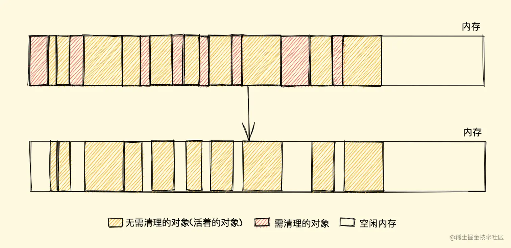
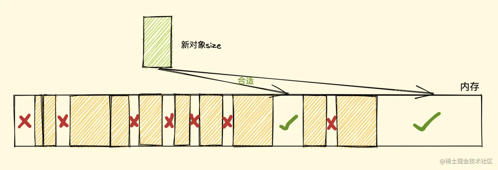
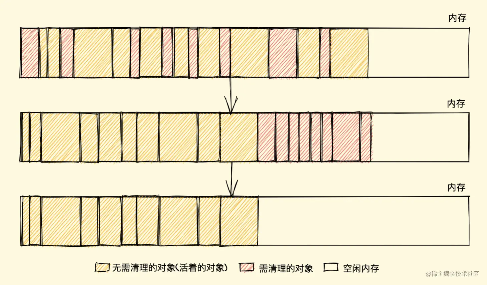

[[TOC]]

[TOC]

# JS中的垃圾回收和内存泄露

本文参考了：

https://segmentfault.com/a/1190000019035469

https://juejin.cn/post/6981588276356317214

程序的运行需要内存。只要程序提出要求，操作系统或者运行时就必须供给内存。所谓的内存泄漏简单来说是不再用到的内存，没有及时释放。为了更好避免内存泄漏，我们先介绍Javascript垃圾回收机制。

在C与C++等语言中，开发人员可以直接控制内存的申请和回收。但是在Java、C#、JavaScript语言中，变量的内存空间的申请和释放都由程序自己处理，开发人员不需要关心。也就是说Javascript具有自动垃圾回收机制(Garbage Collecation)。

## 1. 垃圾回收的必要性

下面这段话引自《JavaScript权威指南（第四版）》

由于字符串、对象和数组没有固定大小，所有当他们的大小已知时，才能对他们进行动态的存储分配。JavaScript程序每次创建字符串、数组或对象时，解释器都必须分配内存来存储那个实体。只要像这样动态地分配了内存，最终都要释放这些内存以便他们能够被再用，否则，JavaScript的解释器将会消耗完系统中所有可用的内存，造成系统崩溃。

这段话解释了为什么需要系统需要垃圾回收，JavaScript不像C/C++，它有自己的一套垃圾回收机制。

JavaScript垃圾回收的机制很简单：找出不再使用的变量，然后释放掉其占用的内存，但是这个过程不是时时的，因为其开销比较大，所以垃圾回收器会按照固定的时间间隔周期性的执行。

```javascript
var a = "浪里行舟";
var b = "前端工匠";
var a = b; //重写a
```

这段代码运行之后，“浪里行舟”这个字符串失去了引用（之前是被a引用），系统检测到这个事实之后，就会释放该字符串的存储空间以便这些空间可以被再利用。

## 2. 垃圾回收机制

在 JavaScript 内存管理中有一个概念叫做 `可达性`，就是那些以某种方式可访问或者说可用的值，它们被保证存储在内存中，反之不可访问则需回收

至于如何回收，其实就是怎样发现这些不可达的对象（垃圾）它并给予清理的问题， `JavaScript` 垃圾回收机制的原理说白了也就是定期找出那些不再用到的内存（变量），然后释放其内存

你可能还会好奇为什么不是实时的找出无用内存并释放呢？其实很简单，实时开销太大了

我们都可以 Get 到这之中的重点，那就是怎样找出所谓的垃圾？

这个流程就涉及到了一些算法策略，有很多种方式，我们简单介绍两个最常见的

- 标记清除算法
- 引用计数算法

### 2.1 标记清除

标记清除（Mark-Sweep），目前在 `JavaScript引擎` 里这种算法是最常用的，到目前为止的大多数浏览器的 `JavaScript引擎` 都在采用标记清除算法，只是各大浏览器厂商还对此算法进行了优化加工，且不同浏览器的 `JavaScript引擎` 在运行垃圾回收的频率上有所差异

就像它的名字一样，此算法分为 `标记` 和 `清除` 两个阶段，标记阶段即为所有活动对象做上标记，清除阶段则把没有标记（也就是非活动对象）销毁。

引擎在执行 GC（使用标记清除算法）时，需要从出发点去遍历内存中所有的对象去打标记，而这个出发点有很多，我们称之为一组 `根` 对象，而所谓的根对象，其实在浏览器环境中包括又不止于 `全局Window对象`、`文档DOM树` 等

整个标记清除算法大致过程就像下面这样

- 垃圾收集器在运行时会给内存中的所有变量都加上一个标记，假设内存中所有对象都是垃圾，全标记为0
- 然后从各个根对象开始遍历，把不是垃圾的节点改成1
- 清理所有标记为0的垃圾，销毁并回收它们所占用的内存空间
- 最后，把所有内存中对象标记修改为0，等待下一轮垃圾回收

#### 2.1.1 优点

标记清除算法的优点只有一个，那就是实现比较简单，打标记也无非打与不打两种情况，这使得一位二进制位（0和1）就可以为其标记，非常简单

#### 2.1.2 缺点

标记清除算法有一个很大的缺点，就是在清除之后，剩余的对象内存位置是不变的，也会导致空闲内存空间是不连续的，出现了 `内存碎片`（如下图），并且由于剩余空闲内存不是一整块，它是由不同大小内存组成的内存列表，这就牵扯出了内存分配的问题



假设我们新建对象分配内存时需要大小为 `size`，由于空闲内存是间断的、不连续的，则需要对空闲内存列表进行一次单向遍历找出大于等于 `size` 的块才能为其分配（如下图）



这三种策略里面 `Worst-fit` 的空间利用率看起来是最合理，但实际上切分之后会造成更多的小块，形成内存碎片，所以不推荐使用，对于 `First-fit` 和 `Best-fit` 来说，考虑到分配的速度和效率 `First-fit` 是更为明智的选择

综上所述，标记清除算法或者说策略就有两个很明显的缺点

- **内存碎片化**，空闲内存块是不连续的，容易出现很多空闲内存块，还可能会出现分配所需内存过大的对象时找不到合适的块
- **分配速度慢**，因为即便是使用 `First-fit` 策略，其操作仍是一个 `O(n)` 的操作，最坏情况是每次都要遍历到最后，同时因为碎片化，大对象的分配效率会更慢

#### 2.1.3 解决缺点

归根结底，标记清除算法的缺点在于清除之后剩余的对象位置不变而导致的空闲内存不连续，所以只要解决这一点，两个缺点都可以完美解决了

而 **标记整理（Mark-Compact）算法** 就可以有效地解决，它的标记阶段和标记清除算法没有什么不同，只是标记结束后，标记整理算法会将活着的对象（即不需要清理的对象）向内存的一端移动，最后清理掉边界的内存（如下图）




### 2.2 引用计数

引用计数（Reference Counting），这其实是早先的一种垃圾回收算法，它把 `对象是否不再需要` 简化定义为 `对象有没有其他对象引用到它`，如果没有引用指向该对象（零引用），对象将被垃圾回收机制回收，目前很少使用这种算法了，因为它的问题很多，不过我们还是需要了解一下

它的策略是跟踪记录每个变量值被使用的次数

- 当声明了一个变量并且将一个引用类型赋值给该变量的时候这个值的引用次数就为 1
- 如果同一个值又被赋给另一个变量，那么引用数加 1
- 如果该变量的值被其他的值覆盖了，则引用次数减 1
- 当这个值的引用次数变为 0 的时候，说明没有变量在使用，这个值没法被访问了，回收空间，垃圾回收器会在运行的时候清理掉引用次数为 0 的值占用的内存

如下例

```js
et a = new Object() 	// 此对象的引用计数为 1（a引用）
let b = a 		// 此对象的引用计数是 2（a,b引用）
a = null  		// 此对象的引用计数为 1（b引用）
b = null 	 	// 此对象的引用计数为 0（无引用）
...			// GC 回收此对象
```

这种方式是不是很简单？确实很简单，不过在引用计数这种算法出现没多久，就遇到了一个很严重的问题——循环引用，即对象 A 有一个指针指向对象 B，而对象 B 也引用了对象 A ，如下面这个例子

```js
function test(){
  let A = new Object()
  let B = new Object()
  
  A.b = B
  B.a = A
}
```

如上所示，对象 A 和 B 通过各自的属性相互引用着，按照上文的引用计数策略，它们的引用数量都是 2，但是，在函数 `test` 执行完成之后，对象 A 和 B 是要被清理的，但使用引用计数则不会被清理，因为它们的引用数量不会变成 0，假如此函数在程序中被多次调用，那么就会造成大量的内存不会被释放

我们再用标记清除的角度看一下，当函数结束后，两个对象都不在作用域中，A 和 B 都会被当作非活动对象来清除掉，相比之下，引用计数则不会释放，也就会造成大量无用内存占用，这也是后来放弃引用计数，使用标记清除的原因之一

> 在 IE8 以及更早版本的 IE 中，`BOM` 和 `DOM` 对象并非是原生 `JavaScript` 对象，它是由 `C++` 实现的 `组件对象模型对象（COM，Component Object Model）`，而 `COM` 对象使用 引用计数算法来实现垃圾回收，所以即使浏览器使用的是标记清除算法，只要涉及到 ` COM` 对象的循环引用，就还是无法被回收掉，就比如两个互相引用的 `DOM` 对象等等，而想要解决循环引用，需要将引用地址置为 `null` 来切断变量与之前引用值的关系，如下
>
> ```js
> // COM对象
> let ele = document.getElementById("xxx")
> let obj = new Object()
> 
> // 造成循环引用
> obj.ele = ele
> ele.obj = obj
> 
> // 切断引用关系
> obj.ele = null
> ele.obj = null
> ```
>
> 不过在 IE9 及以后的 `BOM` 与 `DOM` 对象都改成了 `JavaScript` 对象，也就避免了上面的问题
>
> 此处参考 JavaScript高级程序设计 第四版(第三版) 4.3.2 小节

#### 2.2.1 优点

引用计数算法的优点我们对比标记清除来看就会清晰很多，首先引用计数在引用值为 0 时，也就是在变成垃圾的那一刻就会被回收，所以它可以立即回收垃圾。

而标记清除算法需要每隔一段时间进行一次，那在应用程序（JS脚本）运行过程中线程就必须要暂停去执行一段时间的 `GC`，另外，标记清除算法需要遍历堆里的活动以及非活动对象来清除，而引用计数则只需要在引用时计数就可以了。

#### 2.2.2 缺点

引用计数的缺点想必大家也都很明朗了，首先它需要一个计数器，而此计数器需要占很大的位置，因为我们也不知道被引用数量的上限，还有就是无法解决循环引用无法回收的问题，这也是最严重的。


## 3. 哪些情况会引起内存泄漏？

虽然JavaScript会自动垃圾收集，但是如果我们的代码写法不当，会让变量一直处于“进入环境”的状态，无法被回收。下面列一下内存泄漏常见的几种情况：

### 3.1 意外的全局变量

```javascript
function foo(arg) {
    bar = "this is a hidden global variable";
}
```

bar没被声明,会变成一个全局变量,在页面关闭之前不会被释放。

另一种意外的全局变量可能由 `this` 创建:

```javascript
function foo() {
    this.variable = "potential accidental global";
}
// foo 调用自己，this 指向了全局对象（window）
foo();
```

在 JavaScript 文件头部加上 'use strict'，可以避免此类错误发生。启用严格模式解析 JavaScript ，避免意外的全局变量。

### 3.2 被遗忘的计时器或回调函数

```javascript
var someResource = getData();
setInterval(function() {
    var node = document.getElementById('Node');
    if(node) {
        // 处理 node 和 someResource
        node.innerHTML = JSON.stringify(someResource));
    }
}, 1000);
```

这样的代码很常见，如果id为Node的元素从DOM中移除，该定时器仍会存在，同时，因为回调函数中包含对someResource的引用，定时器外面的someResource也不会被释放。

### 3.3 闭包

```javascript
function bindEvent(){
  var obj=document.createElement('xxx')
  obj.onclick=function(){
    // Even if it is a empty function
  }
}
```

闭包可以维持函数内局部变量，使其得不到释放。上例定义事件回调时，由于是函数内定义函数，并且内部函数--事件回调引用外部函数，形成了闭包。

```javascript
// 将事件处理函数定义在外面
function bindEvent() {
  var obj = document.createElement('xxx')
  obj.onclick = onclickHandler
}
// 或者在定义事件处理函数的外部函数中，删除对dom的引用
function bindEvent() {
  var obj = document.createElement('xxx')
  obj.onclick = function() {
    // Even if it is a empty function
  }
  obj = null
}
```

解决之道，将事件处理函数定义在外部，解除闭包，或者在定义事件处理函数的外部函数中，删除对dom的引用。

### 3.4 没有清理的DOM元素引用

有时，保存 DOM 节点内部数据结构很有用。假如你想快速更新表格的几行内容，把每一行 DOM 存成字典（JSON 键值对）或者数组很有意义。此时，同样的 DOM 元素存在两个引用：一个在 DOM 树中，另一个在字典中。将来你决定删除这些行时，需要把两个引用都清除。

```javascript
var elements = {
    button: document.getElementById('button'),
    image: document.getElementById('image'),
    text: document.getElementById('text')
};
function doStuff() {
    image.src = 'http://some.url/image';
    button.click();
    console.log(text.innerHTML);
}
function removeButton() {
    document.body.removeChild(document.getElementById('button'));
    // 此时，仍旧存在一个全局的 #button 的引用
    // elements 字典。button 元素仍旧在内存中，不能被 GC 回收。
}
```

虽然我们用removeChild移除了button，但是还在elements对象里保存着#button的引用，换言之，DOM元素还在内存里面。

## 4. 内存泄漏的识别方法

新版本的chrome在 performance 中查看, 打开performance步骤：

- 页面右键 -> Inspect，在弹出的开发者工具中，选择 Performance
- 勾选 Screenshots 和 memory
- 左上角小圆点开始录制(record)
- 停止录制

图中 Heap 对应的部分就可以看到内存在周期性的回落也可以看到垃圾回收的周期,如果垃圾回收之后的最低值(我们称为min),min在不断上涨,那么肯定是有较为严重的内存泄漏问题。


避免内存泄漏的一些方式：

- 减少不必要的全局变量，或者生命周期较长的对象，及时对无用的数据进行垃圾回收
- 注意程序逻辑，避免“死循环”之类的
- 避免创建过多的对象

总而言之需要遵循一条**原则：不用了的东西要及时归还**


## 5. 垃圾回收的使用场景优化

### 5.1 数组array优化

将[]赋值给一个数组对象，是清空数组的捷径(例如： arr = [];),但是需要注意的是，这种方式又创建了一个新的空对象，并且将原来的数组对象变成了一小片内存垃圾！实际上，将数组长度赋值为0（arr.length = 0）也能达到清空数组的目的，并且同时能实现数组重用，减少内存垃圾的产生。

```javascript
const arr = [1, 2, 3, 4];
console.log('浪里行舟');
arr.length = 0  // 可以直接让数字清空，而且数组类型不变。
// arr = []; 虽然让a变量成一个空数组,但是在堆上重新申请了一个空数组对象。
```

### 5.2 对象尽量复用

对象尽量复用，尤其是在循环等地方出现创建新对象，能复用就复用。不用的对象，尽可能设置为null，尽快被垃圾回收掉。

```javascript
var t = {} // 每次循环都会创建一个新对象。
for (var i = 0; i < 10; i++) {
  // var t = {};// 每次循环都会创建一个新对象。
  t.age = 19
  t.name = '123'
  t.index = i
  console.log(t)
}
t = null //对象如果已经不用了，那就立即设置为null；等待垃圾回收。
```

### 5.3 在循环中的函数表达式，能复用最好放到循环外面

```js
// 在循环中最好也别使用函数表达式。
for (var k = 0; k < 10; k++) {
  var t = function(a) {
    // 创建了10次  函数对象。
    console.log(a)
  }
  t(k)
}
// 推荐用法
function t(a) {
  console.log(a)
}
for (var k = 0; k < 10; k++) {
  t(k)
}
t = null
```

**给大家推荐一个好用的BUG监控工具[Fundebug](https://www.fundebug.com/)，欢迎免费试用！**

## 6. 参考资料

- [浪里行舟的blog](https://github.com/ljianshu/Blog)
- [JavaScript高级内幕（js高级）](https://ke.qq.com/course/276435)
- [JavaScript垃圾回收机制](https://www.cnblogs.com/hustskyking/archive/2013/04/27/garbage-collection.html)
- [JavaScript 内存泄漏教程](http://www.ruanyifeng.com/blog/2017/04/memory-leak.html)
- [JavaScript 中的垃圾回收](https://zhuanlan.zhihu.com/p/23992332)
- [4类 JavaScript 内存泄漏及如何避免](http://www.ruanyifeng.com/blog/2017/04/memory-leak.html)

