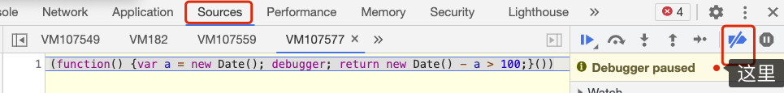

[[TOC]]

[TOC]


# 浏览器控制台反调试

当在浏览器中打开调试台，想要查看页面的Network的时候，发现页面不断在debugger，于是发现了页面的反调试功能。

## 1. 前端页面阻止JS代码调试


### 1.1 立即实行匿名函数

```js
(function() {var a = new Date(); debugger; return new Date() - a > 100;}())
```

在一个反调试的页面中，看见了一个如上一段代码，这段代码每次在断点处停下来的时候页面都会跳到`source`这个tab页面。虽然简单，但是却很有效：

-   不停地打断你，页面跳到source页面，阻止你看他代码
-   不断产生不可回收的对象，占据你的内存，造成内存泄漏，没过多久浏览器就会卡顿


## 2. 阻止反调试

### 2.1 停止页面断点调试

如果不需要调试JS代码，那么可以直接`停止断点调试`，在调试工具中，Sources -> 点击Deactivate breakpoints， 如下图所示：

