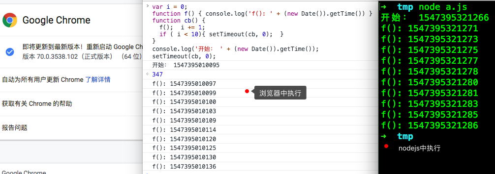

# 三、JS中异步方法

## 1. setTimeout、setInterval

setTimeout()方法设置一个定时器，该定时器在定时器到期后执行一个函数或指定的一段代码。

setInterval() 方法重复调用一个函数或执行一个代码段，在每次调用之间具有固定的时间延迟。

setTimeout的用法(setInterval用法一样)：

```javascript
function f() { console.log('f') }
function t(a) { console.log(a) }
setTimeout(f, 0);
setTimeout(f, 1000);
setTimeout(t, 0, 'hello');
var id = setTimeout(t, 1000, '我不会被执行');
setTimeout("console.log('类似evel方法')"); // nodejs中此处会报错
clearTimeout(id)	// 取消了setTimeout函数的回调
```

参数(setTimeout、setInterval一样)：

> 第一个参数(必填)：带执行的函数，也可以使用字符串代替函数，在`delay`毫秒之后执行字符串 (使用该语法是**不推荐的,** 原因和使用`eval`一样，有安全风险)
>
> 第二个参数(可选)：延迟的毫秒数 (一秒等于1000毫秒)，函数的调用会在该延迟之后发生。如果省略该参数，delay取默认值0。实际的延迟时间可能会比 delay 值长
>
> 第三个以后的参数(可选)：执行函数的参数

返回值

> 返回一个正整数，表示定时器的编号。
>
> 这个值传递给`clearTimeout()`可以用来来取消setTimeout的定时。
>
> 这个值传递给`clearInterval()`可以用来来取消setInterval的定时。

***注意：***IE9 及更早的 IE 浏览器不支持向延迟函数传递额外参数的功能。

### 1.1 关于延迟

https://html.spec.whatwg.org/multipage/timers-and-user-prompts.html#timers

目前看到的文档关于setTimeout第二个参数的说明：

> If timeout is less than 0, then set timeout to 0.
>
> If nesting level is greater than 5, and timeout is less than 4, then set timeout to 4.
>
> 翻译成中文：
>
> 如果timeout小于0，则将timeout设置为0。
>
> 如果嵌套级别大于5，并且超时小于4，则将超时设置为4。


1、如果JavaScript中没有耗时久的代码，并且setTimeout函数延迟是0的话，那么在浏览器中和nodejs中都是会立刻就执行的：

```javascript
function f() { console.log('f(): ' + (new Date()).getTime()) }
setTimeout(f, 0);
setTimeout(f, 0);
setTimeout(f, 0);
setTimeout(f, 0);
setTimeout(f, 0);
console.log('开始： ' + (new Date()).getTime());
```

下面的图片分别是在浏览器中和nodejs中的输出结果。


2、如果JavaScript同步代码有耗时的代码，那么setTimeout回调函数执行的时间就会大于设置的时间：

```javascript
function f() { console.log('f(): ' + (new Date()).getTime()) }
setTimeout(f, 0);
var t = (new Date()).getTime()
console.log('开始： ' + t);
while(true){
  if (t < (new Date()).getTime() - 3000) {
    break;
  }
}
// 输出结果
// 开始： 1547394071675
// f(): 1547394074677
```

可以看到上面的setTimeout回调函数要在3秒以后才能执行

3、如果setTimeout有超过5层以上的嵌套

```javascript
var i = 0;
function f() { console.log('f(): ' + (new Date()).getTime()) }
function cb() { 
  f();  i += 1;
  if ( i < 10){ setTimeout(cb, 0);  }
}
console.log('开始： ' + (new Date()).getTime());
setTimeout(cb, 0);
```

通过实际运行结果可以看见，在浏览器中第五次以后执行会大于4毫秒。

nodejs是最少间隔1毫秒执行一次。




## 2. setImmediate()

此方法是一个特殊timer，目前在nodejs得到支持，在浏览器环境还没有成为标准，在Google浏览器(70版本)中还不支持，

在nodejs中etImmediate()是放在`check`阶段执行的

```javascript
setImmediate(function(a, b) {
  console.log('setImmediate:'+ a + b)
}, 5000, 'hello') 
// setImmediate:5000hello
```

***注意：***setImmediate不能设置延迟时间，setImmediate第一个参数是回调函数，后面的参数是回调函数的参数。

```javascript
setTimeout(function() {
  console.log('setTimeout')
}, 0)
setImmediate(function() {
  console.log('setImmediate')
})  
```

setTimeout和setImmediate在nodejs有时输出顺序不一致。

setTimeout与setImmediate先后入队之后，首先进入的是`timers`阶段，如果我们的机器性能一般或者加入了一个同步长耗时操作，那么进入`timers`阶段，1ms已经过去了，那么setTimeout的回调会首先执行。 
如果没有到1ms，那么在`timers`阶段的时候，超时时间没到，setTimeout回调不执行，事件循环来到了`poll`阶段，这个时候队列为空，此时有代码被setImmediate()，于是先执行了setImmediate()的回调函数，之后在下一个事件循环再执行setTimemout的回调函数。

## 3. process.nextTick()

process.nextTick()方法目前只在nodejs中支持。

有时我们想要立即异步执行一个任务，可能会使用延时为0的定时器，但是这样开销很大。我们可以换而使用`process.nextTick()`，它会将传入的回调放入`nextTickQueue`队列中,不管事件循环进行到什么地步，都在当前**执行栈**的操作结束的时候调用。这点很重要，注意。

process.nextTick方法指定的回调函数，总是在**当前执行队列**的尾部触发，多个process.nextTick语句总是一次执行完（不管它们是否嵌套），递归调用process.nextTick，将会没完没了，主线程根本不会去读取事件队列，导致**阻塞后续调用**，直至达到最大调用限制。

相比于在定时器中采用红黑树树的操作时间复杂度为0(lg(n))，而`process.nextTick()`的时间复杂度为0(1)，相比之下更高效。

一个例子：

```javascript
setTimeout(() => {                                      // settimeout1
  process.nextTick(() => console.log('nextTick1'))      // nextTick1
  setTimeout(() => {                                    // settimeout2
    console.log('setTimout1')
    process.nextTick(() => {                            // nextTick2
      console.log('nextTick2')
      setImmediate(() => console.log('setImmediate1'))  // check2
      process.nextTick(() => console.log('nextTick3'))  // nextTick4
    })
    setImmediate(() => console.log('setImmediate2'))    // check1
    process.nextTick(() => console.log('nextTick4'))    // nextTick3
    console.log('sync2')
    setTimeout(() => console.log('setTimout2'), 0)      // settimeout3
  }, 0)
  console.log('sync1')
}, 0)

// sync1 nextTick1 setTimout1 sync2 nextTick2 nextTick4 nextTick3 setImmediate2 setImmediate1 setTimout2
```

上面的代码执行过程：

- node初始化
  - 执行JavaScript代码
    - 遇到`setTimeout`, 把回调函数放到`Timer`队列中，记为settimeout1
  - 没有`process.nextTick`回调，略过
  - 没有微任务，略过
- 进入第一次事件循环
  - 进入timer阶段
    - 检查Timer队列是否有可执行的回调，此时队列有一个回调：settimeout1
    - 执行settimeout1回调：
      - 遇到process.nextTick，把回调加入到nextTick队列，记为nextTick1
      - 遇到setTimeout，把回调加入到Timer队列，记为settimeout2
      - 遇到console，输出：sync1
    - 检查`process.nextTick`队列，发现有一个回调nextTick1，执行，输出：nextTick1
    - 检查微任务队列，没有略过
    - Timer阶段执行结束，此阶段输出：`sync1 nextTick1`
  - Pending I/O Callback阶段没有任务，略过
  - 进入 Poll 阶段
    - 检查是否存在尚未完成的回调,此时有一个Timer回调待执行：settimeout2
    - 执行settimeout2回调
      - 遇到console，输出：setTimout1
      - 遇到process.nextTick，把回调加入到nextTick队列，记为nextTick2
      - 遇到setImmediate，把回调加入到Check队列，记为check1
      - 遇到process.nextTick，把回调加入到nextTick队列，记为nextTick3
      - 遇到console，输出：sync2
      - 遇到setTimeout，把回调加入到Timer队列，记为settimeout3
    - 检查`process.nextTick`队列，发现有两个回调：nextTick2，nextTick3
      - 执行nextTick2
        - 遇到console，输出：nextTick2
        - 遇到setImmediate，把回调加入到Check队列，记为check2
        - 遇到process.nextTick，把回调加入到nextTick队列，记为nextTick4
      - 执行nextTick3，输出：nextTick4
      - 由于又加了nextTick4，在nextTick队列后面执行，输出：nextTick3
    - 检查微任务队列，没有略过
    - Poll 阶段执行结束，此阶段输出：`setTimout1 sync2 nextTick2 nextTick4 nextTick3`
  - 进入check 阶段
    - 检查check队列是否有可执行的回调，此时队列有两个回调：check1、check2
    - 执行check1回调，输出：setImmediate2
    - 执行check2回调，输出：setImmediate1
    - check 阶段执行结束，此阶段输出：`setImmediate2 setImmediate1`
  - closing阶段没有任务，略过
  - 检查是否还有活跃的`handles(定时器、IO等事件句柄)`,有，继续下一轮事件循环
- 进入第二次事件循环
  - 进入Timer阶段
    - 检查Timer队列是否有可执行的回调，此时队列有一个回调：settimeout3
    - 执行settimeout3回调，输出：setTimout2
    - Pending I/O Callback、Poll、check、closing阶段没有任务，略过
    - 检查是否还有活跃的`handles(定时器、IO等事件句柄)`,没有了，结束事件循环，退出程序
- 程序执行结束，输出结果：`sync1 nextTick1 setTimout1 sync2 nextTick2 nextTick4 nextTick3 setImmediate2 setImmediate1 setTimout2`

## 4. Promise

Promise 是异步编程的一种解决方案，比传统的解决方案——回调函数和事件——更合理和更强大。它由社区最早提出和实现，ES6 将其写进了语言标准，统一了用法，原生提供了`Promise`对象。

Promise 是一个对象，从它可以获取异步操作的消息。Promise 提供统一的 API，各种异步操作都可以用同样的方法进行处理。

`Promise`对象有以下两个特点:

- 对象的状态不受外界影响。`Promise`对象代表一个异步操作，有三种状态：`pending`（进行中）、`fulfilled`（已成功）和`rejected`（已失败）。只有异步操作的结果，可以决定当前是哪一种状态，任何其他操作都无法改变这个状态。
- 一旦状态改变，就不会再变，任何时候都可以得到这个结果。`Promise`对象的状态改变，只有两种可能：从`pending`变为`fulfilled`和从`pending`变为`rejected`。只要这两种情况发生，状态就凝固了，不会再变了，会一直保持这个结果，这时就称为 resolved（已定型）。如果改变已经发生了，你再对`Promise`对象添加回调函数，也会立即得到这个结果。这与事件（Event）完全不同，事件的特点是，如果你错过了它，再去监听，是得不到结果的。

有了`Promise`对象，就可以将异步操作以同步操作的流程表达出来，避免了层层嵌套的回调函数。此外，`Promise`对象提供统一的接口，使得控制异步操作更加容易。

`Promise`也有一些缺点:

- 无法取消`Promise`，一旦新建它就会立即执行，无法中途取消
- 如果不设置回调函数，`Promise`内部抛出的错误，不会反应到外部
- 当处于`pending`状态时，无法得知目前进展到哪一个阶段（刚刚开始还是即将完成）

### 4.1 创建一个Promise实例

```javascript
const promise = new Promise(function(resolve, reject) {
  // ... 一些操作
  
  if (/* 异步操作成功 */){
    // 如果请求成功了，把执行结果传给resolve回调
    resolve(value);
  } else {
    // 如果请求失败而，把错误信息传给reject回调
    reject(error);
  }
});
```

`Promise`构造函数接受一个函数作为参数，该函数的两个参数分别是`resolve`和`reject`。它们是两个函数，由 JavaScript 引擎提供，不用自己部署。

> resolve函数作用：将`Promise`对象的状态从“未完成”变为“成功”（即从 pending 变为 resolved），在异步操作成功时调用，并将异步操作的结果，作为参数传递出去；
>
> reject函数作用：将`Promise`对象的状态从“未完成”变为“失败”（即从 pending 变为 rejected），在异步操作失败时调用，并将异步操作报出的错误，作为参数传递出去。

### 4.2 使用Promise

```javascript
// 第一种使用方式
promise.then(function(value) {
  // 请求成功时执行这里，也就是执行resolve(value)后，会回调这个函数处理
}, function(error) {
  // 请求失败或报错执行这里，也就是执行reject(error)后，会回调这个函数处理
});

// 第二种使用方式
promise.then(function(value) {
   // 请求成功时执行这里，也就是执行resolve(value)后，会回调这个函数处理
}).catch(function(error) {
   // 请求失败或报错执行这里，也就是执行reject(error)后，会回调这个函数处理
});
```

使用第一种方式：

> `then`方法接受两个回调函数作为参数：
>
> - 第一个回调函数：请求成功时(Promise对象状态变为resolved)调用，参数是Promise对象传出的值
> - 第二个回调函数(可选的)：请求失败(Promise对象状态变为rejected)或报错时调用，参数是Promise对象传出的值
> - 不推荐使用此种方式

使用第二种方式

> `then`方法接受一个回调函数，该回调函数会在请求成功时(Promise对象状态变为resolved)调用，参数是Promise对象传出的值
>
> `catch`方法接受一个回调函数，该回调函数会在请求成功时(Promise对象状态变为rejected)或报错时调用，参数是Promise对象传出的值
>
> 推荐使用这种方式调用

一个使用Promise对象的简单例子：

```javascript
function timeout(flag) {
  return new Promise((resolve, reject) => {
    if (flag) { resolve('正常返回结果') }
    else { reject('报错'); }
  });
}
var a = timeout(true)
a.then((value) => { console.log('一号：', value); });
timeout(false)
.then((value) => { console.log(value); })
.catch((err) => { console.log('二号：', err); })

// 输出结果：
// 一号： 正常返回结果
// 二号： 报错
```

`resolve`函数的参数除了正常的值以外，还可能是另一个 Promise 实例，比如像下面这样:

```javascript
const p1 = new Promise(function (resolve, reject) {
  // ...
});
const p2 = new Promise(function (resolve, reject) {
  // ...
  resolve(p1);
})
```

上面代码中,一个异步操作的结果是返回另一个异步操作。注意，这时`p1`的状态就会传递给`p2`，也就是说，`p1`的状态决定了`p2`的状态。如果`p1`的状态是`pending`，那么`p2`的回调函数就会等待`p1`的状态改变；如果`p1`的状态已经是`resolved`或者`rejected`，那么`p2`的回调函数将会立刻执行。

### 4.3 Promise.prototype.then()

Promise 实例具有`then`方法，它的作用是为 Promise 实例添加状态改变时的回调函数。前面说过，`then`方法的第一个参数是`resolved`状态的回调函数，第二个参数（可选）是`rejected`状态的回调函数。`then`方法返回的是一个新的`Promise`实例（注意，不是原来那个`Promise`实例）。因此可以采用链式写法，即`then`方法后面再调用另一个`then`方法。

```javascript
new Promise(function (resolve) {
  console.log(1)
  resolve(2)
})
.then((res) => { console.log(res); return 3; })
.then((res) => { console.log(res); return 4; })
.then((res) => { console.log(res) })
// 输出结果：1 2 3 4
```

采用链式的`then`，可以指定一组按照次序调用的回调函数。这时，前一个回调函数，有可能返回的还是一个`Promise`对象（即有异步操作），这时后一个回调函数，就会等待该`Promise`对象的状态发生变化，才会被调用。

### 4.4 Promise.prototype.catch()

`.catch`方法是`.then(null, rejection)`或`.then(undefined, rejection)`的别名，用于指定发生错误时的回调函数。`catch`方法返回的还是一个 Promise 对象，因此后面还可以接着调用`then`方法。后面的方法报错需要在后面的catch去处理。

调用`.catch`方法的情况：

> 1、 `Promise`对象异步操作抛出错误，状态就会变成`rejected`，就会调用`catch`方法指定的回调函数
>
> 2、`then`方法指定的回调函数在运行中抛出错误

```javascript
new Promise(function (resolve, rejected) {
  rejected(2)
})
.catch(function(err){
  console.log('出错了：', err);
})
```

如果 Promise 状态已经变成`resolved`，再抛出错误是无效的。

```javascript
new Promise(function (resolve, reject) {
  resolve('ok');
  throw new Error('test');
})
  .then(function (value) { console.log(value) })
  .catch(function (error) { console.log(error) });
// 没有报错，输出了ok
```

Promise 对象的错误具有“冒泡”性质，会一直向后传递，直到被捕获为止。也就是说，错误总是会被下一个`catch`语句捕获。

```javascript
new Promise(function (resolve, reject) {
  reject('出错误了');
})
  .then(function (value) { console.log(value); return 'ok1';})
  .then(function (value) { console.log(value) })
  .catch(function (error) { console.log(error) });
// 出错误了
```

跟传统的`try/catch`代码块不同的是，如果没有使用`catch`方法指定错误处理的回调函数，Promise 对象抛出的错误不会传递到外层代码，即不会有任何反应。

```javascript
new Promise(function (resolve, reject) {
  resolve(x + 2);	// 这个会报错： Uncaught (in promise) ReferenceError: x is not defined
})
  .then(function (value) { console.log(value)})
console.log('我执行了')
```

上面的代码运行Promise时，内部有语法错误，浏览器运行到这一行会报错，但不会退出程序，会继续执行，最终输出了`我执行了`,这说明Promise 内部的错误不会影响到 Promise 外部的代码，通俗的说法就是“Promise 会吃掉错误”。

这个脚本放在服务器执行，退出码就是`0`（即表示执行成功）。不过，Node 有一个`unhandledRejection`事件，专门监听未捕获的`reject`错误，上面的脚本会触发这个事件的监听函数，可以在监听函数里面抛出错误。

```javascript
process.on('unhandledRejection', function (err, p) {
  throw err;
});
```

上面代码中，`unhandledRejection`事件的监听函数有两个参数，第一个是错误对象，第二个是报错的 Promise 实例，它可以用来了解发生错误的环境信息。

注意，Node 有计划在未来废除`unhandledRejection`事件。如果 Promise 内部有未捕获的错误，会直接终止进程，并且进程的退出码不为 0。

### 4.5 Promise.prototype.finally()

`finally`方法用于指定不管 Promise 对象最后状态如何，都会执行的操作。该方法是 ES2018 引入标准的。

```javascript
new Promise(function (resolve, reject) {
  resolve(2);	
})
  .then(function (value) { console.log(value)})
  .finally(function() {
    console.log('finally')
  })
```

上面代码中，不管`promise`最后的状态，在执行完`then`或`catch`指定的回调函数以后，都会执行`finally`方法指定的回调函数。

`finally`方法的回调函数不接受任何参数，这意味着没有办法知道，前面的 Promise 状态到底是`fulfilled`还是`rejected`。这表明，`finally`方法里面的操作，应该是与状态无关的，不依赖于 Promise 的执行结果。

### 4.6 Promise.all()

`Promise.all`方法用于将多个 Promise 实例，包装成一个新的 Promise 实例。

`Promise.all`方法接受一个数组作为参数，`p1`、`p2`、`p3`都是 Promise 实例，如果不是，就会先调用下面讲到的`Promise.resolve`方法，将参数转为 Promise 实例，再进一步处理。（`Promise.all`方法的参数可以不是数组，但必须具有 Iterator 接口，且返回的每个成员都是 Promise 实例。）

`p`的状态由`p1`、`p2`、`p3`决定，分成两种情况

> 1、只有`p1`、`p2`、`p3`的状态都变成`fulfilled`，`p`的状态才会变成`fulfilled`，此时`p1`、`p2`、`p3`的返回值组成一个数组，传递给`p`的回调函数。
>
> 2、只要`p1`、`p2`、`p3`之中有一个被`rejected`，`p`的状态就变成`rejected`，此时第一个被`reject`的实例的返回值，会传递给`p`的回调函数。

```javascript
var a = new Promise(function (resolve) { resolve(2);	 })
var b = new Promise(function (resolve, reject) { resolve(5); })
var c = new Promise(function (resolve) { resolve(2); })
Promise.all([a, b, c])
.then( function(res) { console.log('res: ', res) })
.catch( function(err){ console.log(err) })
// res:  [ 2, 5, 2 ]
```

注意，如果作为参数的 Promise 实例，自己定义了`catch`方法，那么它一旦被`rejected`，并不会触发`Promise.all()`的`catch`方法。

```javascript
var a = new Promise(function (resolve) { resolve(2);	 })
var b = new Promise(function (resolve, reject) { reject(5); }).catch(() => {console.log(123)})
var c = new Promise(function (resolve) { resolve(2); })
Promise.all([a, b, c])
.then( function(res) { console.log('res: ', res) })
.catch( function(err){ console.log('err:', err) })
// 123
// res:  [ 2, undefined, 2 ]
```

上面代码，a会resolve，b首先会rejected，但b有自己的catch方法，该方法返回一个新的Promise实例，b指向的实际上是这个实例。该实例执行完catch后，也会变成resolved，导致Promise.all()方法参数里面的两个实例都会resolved，因此会调用all后面的then方法指定的回调函数。

如果`b`没有自己的`catch`方法，就会调用`Promise.all()`的`catch`方法。

### 4.7 Promise.race()

`Promise.race`方法同样是将多个 Promise 实例，包装成一个新的 Promise 实例。

race参数用多个实例有率先改变状态，Promise.race的状态就跟着改变。那个率先改变的实例的返回值，就是Promise.race的回调函数的参数。

`Promise.race`方法的参数与`Promise.all`方法一样，如果不是 Promise 实例，就会先调用下面讲到的`Promise.resolve`方法，将参数转为 Promise 实例，再进一步处理。

```javascript
var a = new Promise(function (resolve) { resolve(2);	 })
var b = new Promise(function (resolve, reject) { reject(5); }).catch(() => {console.log(123)})
var c = new Promise(function (resolve) { resolve(2); })
Promise.race([a, b, c])
.then( function(res) { console.log('res: ', res) })
.catch( function(err){ console.log('err:', err) })
```

### 4.8 Promise.resolve()

`Promise.resolve`方法会将现有对象转为Promise对象。

```javascript
Promise.resolve('foo')
// 等价于
new Promise(resolve => resolve('foo'))
```

`Promise.resolve`方法的参数分四中情况：

- 参数是一个Promise实例

  如果参数是Promise实例，那么`resolve`将不做任何修改直接返回这个实例

- 参数是一个`thenable`对象

  `thenable`对象指的是具有`then`方法的对象，比如下面的例子：

  ```javascript
  let thenable = {
    then: function(resolve, reject) {
      resolve(42);
    }
  };
  let p1 = Promise.resolve(thenable);
  p1.then(function(value) {
    console.log(value);  // 42
  });
  ```

  `Promise.resolve`方法会将`thenable`对象转为 Promise 对象，然后就立即执行`thenable`对象的`then`方法。`thenable`对象的`then`方法执行后，对象`p1`的状态就变为`resolved`，从而立即执行最后那个`then`方法指定的回调函数，输出 42。

- 参数不是具有`then`方法的对象，或根本就不是对象

  如果参数是一个原始值，或者是一个不具有`then`方法的对象，则`Promise.resolve`方法返回一个新的 Promise 对象，状态为`resolved`，resolved参数就是传入的参数。

  ```javascript
  Promise.resolve('Hello')
  .then(function(res){ console.log('res:', res); })
  Promise.resolve({a:'wer', b:'123'})
  .then(function(res){ console.log('res:', res); })
  // res: Hello
  // res: { a: 'wer', b: '123' }
  ```

  上面的例子中，由于传入的参数不属于异步操作（判断方法是对象不具有then方法），返回Promise实例的状态从一生成就是`resolved`，所以回调函数会立即执行，`Promise.resolve`方法的参数，会同时传给回调函数。

- 不带任何参数

  `Promise.resolve`方法允许调用时不带参数，直接返回一个`resolved`状态的 Promise 对象。

  ```javascript
  const p = Promise.resolve();
  p.then(function () {
    console.log('ttttt')
  });
  ```

### 4.9 Promise.reject()

`Promise.reject(reason)`方法也会返回一个新的 Promise 实例，该实例的状态为`rejected`。

```javascript
const p = Promise.reject('出错了');
// 等同于
const q = new Promise((resolve, reject) => reject('出错了'))

q.then(null, function (s) {
  console.log(s)
});
```

***注意***，`Promise.reject()`方法的参数，会原封不动地作为`reject`的理由，变成后续方法的参数。这一点与`Promise.resolve`方法不一致。

```javascript
const thenable = {
  then(resolve, reject) { reject('出错了'); }
};

Promise.reject(thenable)
.catch(e => { console.log(e === thenable) })
// true
```


## 参考资料

https://html.spec.whatwg.org/multipage/timers-and-user-prompts.html#timers

[window.setTimeout MDN](https://developer.mozilla.org/zh-CN/docs/Web/API/Window/setTimeout)

[setInterval MDN](https://developer.mozilla.org/zh-CN/docs/Web/API/Window/setInterval)

[Timer nodejs官网](https://nodejs.org/api/timers.html)

[Node.js Event Loop nodejs官网](https://nodejs.org/en/docs/guides/event-loop-timers-and-nexttick/#process-nexttick)

[Node中的事件循环和异步API segmentfault](https://segmentfault.com/a/1190000012648569)

[【翻译】Promises/A+规范 图灵](http://www.ituring.com.cn/article/66566)

[Promise 对象 阮一峰](http://es6.ruanyifeng.com/#docs/promise)

