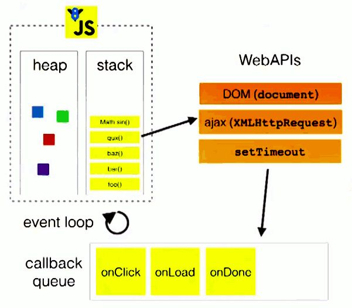

[[TOC]]

[TOC]

# 一、JS在浏览器中运行机制和事件循环

## 1. JavaScript是单线程执行的

JavaScript语言的执行是单线程(single thread)的。

所谓的`单线程`，就是指一次只执行一个任务，如果有多个任务，就必须排队，前面一个任务完成，才能执行后面任务。

这种模式的好处是实现起来比较简单，执行环境相对单纯；坏处是只要有一个任务耗时很长，后面的任务都必须排队等待，会拖延整个程序的执行。常见的浏览器无响应(假死)，往往就是因为某一段JavaScript代码长时间运行(比如死循环)，导致整个页面卡在这个地方，其他任务无法执行。

为了解决这个问题，JavaScript语言将任务的执行模式分成两种：`同步(Synchronous)`和`异步(Asynchronous)`。

`同步任务`：在主线程上排队执行的任务，只有前一个任务执行完毕，才能执行后一个任务。

`异步任务`：不进入主线程、而进入"任务队列"（task queue）的任务，只有"任务队列"通知主线程，某个异步任务可以执行了，该任务才会进入主线程执行。

JavaScript执行机制：

> 1. 所有同步任务都在主线程上执行，形成一个执行栈（execution context stack）。
> 2. 主线程之外，还存在一个"任务队列"（task queue）。只要异步任务有了运行结果，就在"任务队列"之中放置一个事件。
> 3. 一旦"执行栈"中的所有同步任务执行完毕，系统就会读取"任务队列"，如果有有执行任务，则进入执行栈，开始执行。
> 4. 主线程不断重复上面的三步，此过程也就是常说的Event Loop(事件循环)。


## 2. JavaScript执行机制中名词介绍

### 2.1 执行栈

当我们调用一个方法的时候，js会生成一个与这个方法相对应的执行环境，也叫执行上下文，这个执行环境存在着这个方法的私有作用域、参数、this对象等等。因为js是单线程的，同一时间只能执行一个方法，所以当一系列的方法被依次调用的时候，js会先解析这些方法，把其中的**同步任务**按照执行顺序排队到一个地方，这个地方叫做执行栈。

### 2.2 主线程

JavaScript是单线程的，那么这个单线程就成为主线程。而事件循环在主线程执行完执行栈代码后，才执行的。所以主线程代码执行时间过长，会阻塞事件循环的执行。只有当执行栈为空的时候(同步代码执行完毕)，才会执行事件循环来观察有哪些事件回调需要执行，当事件循环检测到任务队列有事件就读取出回调放到执行栈由主线程执行。

### 2.3 任务队列

任务队列也有时称叫消息队列、回调队列。

异步操作会将相关回调添加到任务队列中。而不同的异步操作添加到任务队列的时机也不同，如`onclick`, `setTimeout`,`ajax`处理的方式都不同，这些异步操作是由浏览器内核的`webcore`来执行的，`webcore`包含下图中的3种 webAPI，分别是`DOM Binding`、`network`、`timer`模块。

- **DOM Binding** 模块处理一些DOM绑定事件，如`onclick`事件触发时，回调函数会立即被`webcore`添加到任务队列中。
- **network** 模块处理`Ajax`请求，在网络请求返回时，才会将对应的回调函数添加到任务队列中。
- **timer** 模块会对`setTimeout`等计时器进行延时处理，当时间到达的时候，才会将回调函数添加到任务队列中。

### 2.4 事件循环




1. 主线程运行的时候会生成堆（heap）和栈（stack）；
2. js从上到下解析方法，将其中的同步任务按照执行顺序排列到执行栈中；
3. 当程序调用外部的API时，比如ajax、setTimeout等，会将此类异步任务挂起，继续执行执行栈中的任务，等异步任务返回结果后，再按照执行顺序排列到任务队列中；
4. 主线程先将执行栈中的同步任务清空，然后检查任务队列中是否有任务，如果有，就将第一个事件对应的回调推到执行栈中执行，若在执行过程中遇到异步任务，则继续将这个异步任务排列到任务队列中。
5. 主线程每次将执行栈清空后，就去任务队列中检查是否有任务，如果有，就每次取出一个推到执行栈中执行，这个过程是循环往复的... ...，这个过程被称为“Event Loop 事件循环”。

知道了这个后，下面代码例子输出结果你因该知道结果吧：

```
setTimeout(function(){
    console.log(1);
},0);

console.log(2);

setTimeout(function(){
    console.log(3);
},0);

console.log(4);
```

https://html.spec.whatwg.org/multipage/webappapis.html#event-loops

## 3. 宏任务和微任务

出现**Promise**后，JavaScript对于任务的定义除了广义的同步任务和异步任务，又对任务做了更精细的定义，macrotask（宏任务）和 microtask（微任务）：

- **宏任务**（按优先级顺序排列）: `script`(你的全部JS代码，“同步代码”）, `setTimeout`, `setInterval`, `setImmediate(node的)`, `I/O`,`UI rendering`
- **微任务**（按优先级顺序排列）:`process.nextTick(node的)`,`Promise`（这里指浏览器原生实现的 Promise）, `Object.observe`, `MutationObserver`

***注意***：宏任务、微任务中出现的nodejs中的方法是nodejs专有的，浏览器的JavaScript环境暂时没有支持。

### 3.1 事件循环对宏任务和微任务的处理

有了宏任务和微任务后，JavaScript事件循环对此处理方法如下形式：

- js引擎首先从宏任务队列中取出第一个任务，执行完毕后，将微任务队列中的所有任务取出，按顺序全部执行；
- 然后再从**宏任务队列**(macrotask queue)中取下一个，执行完毕后，再次将**微任务队列**(microtask queue)中的全部取出；
- 循环往复，直到两个queue中的任务都取完。


https://html.spec.whatwg.org/multipage/timers-and-user-prompts.html#microtask-queuing

## 4. 以实际代码讲解JavaScript执行流程

如下代码：

```javascript
console.log('1');
setTimeout(function() {
  console.log('2');
  new Promise(function(resolve) {
      console.log('3');
      resolve();
  }).then(function() {
      console.log('4')
  })
})
console.log('5');
setTimeout(function() {
  console.log('6');
  new Promise(function(resolve) {
      console.log('7');
      resolve();
  }).then(function() {
      console.log('8')
  })
})
console.log('9');
```

上面代码执行过程：

- 第一轮事件循环
  - 整体script代码(同步代码)作为第一个宏任务进入主线程，遇到`console.log`，输出1
  - 遇到`setTimeout`,其回调函数被放到`宏任务队列`中，暂记为`setTmineout1`
  - 遇到`console.log`，输出5
  - 遇到`setTimeout`,其回调函数被放到`宏任务队列`中，暂记为`setTmineout2`
  - 遇到`console.log`，输出9
  - 一个宏任务执行结束，去`微任务队列`查找是否有待执行的任务，没有，结束
  - 第一轮循环结束，输出：`1 5 9`
- 第二轮事件循环
  - 从宏任务队列中取出一个任务，即`setTmineout1`，开始执行
  - 遇到`console.log`，输出2
  - 遇到`Promise`,创建`Promise`,输出了3,同时把`Promise.then`回调函数放到`微任务队列`
  - 一个宏任务执行结束，去`微任务队列`查找是否有待执行的任务, 发现有微任务，全部取出放到执行栈执行
  - 执行微任务，此时就一个微任务，`console.log`，输出4
  - 微任务执行结束
  - 第二轮循环结束，输出：`2 4`
- 第三轮事件循环与第二轮一样，输出：`6 7 8`
- 事件循环发现所有任务都已经处理完毕，此时程序执行结束
- 全部的输出：`1 5 9 2 3 4 6 7 8`,可复制代码到`chrome`浏览器控制台中运行校验结果


***注意***：浏览器环境JavaScript的执行机制和node中JavaScript的执行机制是不同的。


## 参考资料

[这一次，彻底弄懂 JavaScript 执行机制](https://mp.weixin.qq.com/s?__biz=MzA5NzkwNDk3MQ==&mid=2650585345&amp;idx=1&amp;sn=6fd112fbed64246601b48e392d1e7a0b&source=41#wechat_redirect)

[JavaScript任务队列的顺序机制（事件循环）](http://www.yangzicong.com/article/3)

[搞懂 JavsScript 异步 —  事件轮询](https://segmentfault.com/a/1190000017120344)

[JS与Node.js中的事件循环](https://segmentfault.com/a/1190000012362096)

