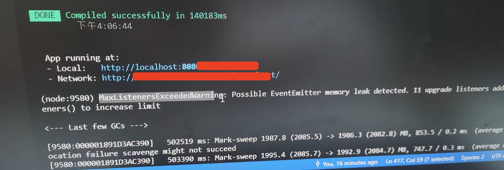
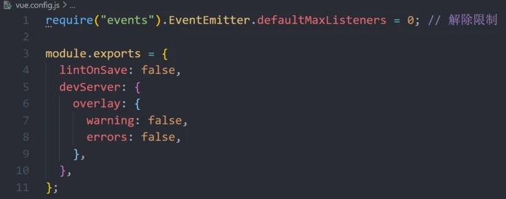
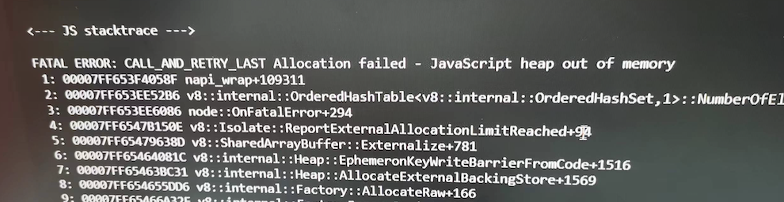
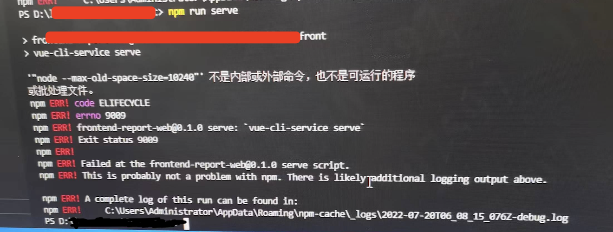
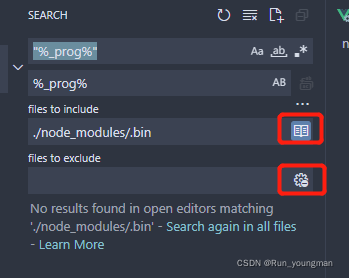

[[TOC]]

[TOC]


# node环境常见问题

## 1. node告警：Maxlistenersexceededwarning



告警的意思是对一个事件添加了11个监听器，溢出了监听器的最大值，需要通过setMaxListeners()增加监听器限制最大值。

增加监听器的limit数量，甚至取消限制，可以解决问题（后文会展示解除限制的方法）。
但这种情况根本的解决途径是去排查什么地方对一个事件增加了11个监听器，当确定11个监听器都是有必要的时候再去增加监听器的限制数。

在vue.config.js文件中添加如下代码：

```js
require('events').EventEmitter.defaultMaxListeners = 20; // 将MaxListeners的限制数增加到20
require('events').EventEmitter.defaultMaxListeners = 0; // 解除限制
```



参考：https://segmentfault.com/a/1190000040710342

## 2. node 内存不足：JavaScript heap out of memory

在运行vue cli项目的时候，有时候会报如下错误：

```
- JS stacktrace --->

FATAL ERROR: CALL_AND_RETRY_LAST Allocation failed - JavaScript heap out of memory
 1: 00007FF7E1BA3D05
 2: 00007FF7E1B7DD46
 3: 00007FF7E1B7E610
```



解决方法一，终端运行如下命令：

```bash
npx --max_old_space_size=4095 vue-cli-service build --modern
```

解决方法二，终端运行如下命令：

```bash
node --max_old_space_size=4096 node_modules/@vue/cli-service/bin/vue-cli-service.js build --mode development
```

解决方法三，安装`increase-memory-limit`npm包，使用该包增加运行内存：

```bash
# 全局安装increase-memory-limit
npm install -g increase-memory-limit
# 进入工程目录，执行：
increase-memory-limit

# 备用选项：https://www.pudn.com/news/62c43ba1502ed3121a92d0bb.html
npm i -g cross-env
#安装结束后，运行如下命令：
cross-env LIMIT=10240  increase-memory-limit # LIMIT是分配的内存大小，有3027、4096、8192、10240
```

注意：`increase-memory-limit`命令会操作`node_modules`里面对应文件，可能会导致git提交命令冲突，解决方法是删除`node_modules`文件夹，重新安装一个就好。

当运行`increase-memory-limit`命令提示报错，`node --max-old-space-size=4096不是内部或外部命令`



这个问题，是因为执行 fix-memory-limit命令时，会在 当前项目的node_modules/.bin文件夹下的*.cmd文件中添加调整运行空间的命令，默认添加的为

`"_prog%"`，但是项目的正常运行需要`_prog%`,也就是去掉双引号才可以。

可以通过编辑器的 replace all的功能，全局进行替换，注意不要选错目录。由此目录也可以发现，当前的命令是只针对当前项目的，所以，如果新开了一个项目，或者删除了node_modules依赖后，需要重新执行命令才可以。
如果vscode全局搜索搜不到 `"_prog%"`关键字，需要点一下下面按钮：




如果是mac电脑，可在终端环境脚本中添加上面命令，然后重启终端：

```bash
vi .zshrc
export NODE_OPTIONS=--max_old_space_size=5120
# 运行命令立即生效：source .zshrc
```


