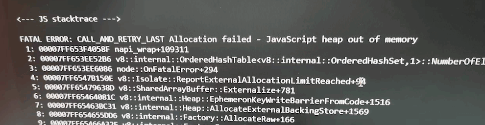

[[TOC]]

[TOC]


# node环境常见问题

## 1. node告警：Maxlistenersexceededwarning


告警的意思是对一个事件添加了11个监听器，溢出了监听器的最大值，需要通过setMaxListeners()增加监听器限制最大值。

增加监听器的limit数量，甚至取消限制，可以解决问题（后文会展示解除限制的方法）。
但这种情况根本的解决途径是去排查什么地方对一个事件增加了11个监听器，当确定11个监听器都是有必要的时候再去增加监听器的限制数。

在vue.config.js文件中添加如下代码：

```js
require('events').EventEmitter.defaultMaxListeners = 20; // 将MaxListeners的限制数增加到20
require('events').EventEmitter.defaultMaxListeners = 0; // 解除限制
```


参考：https://segmentfault.com/a/1190000040710342

## 2. node 内存不足：JavaScript heap out of memory

在运行vue cli项目的时候，有时候会报如下错误：

```
- JS stacktrace --->

FATAL ERROR: CALL_AND_RETRY_LAST Allocation failed - JavaScript heap out of memory
 1: 00007FF7E1BA3D05
 2: 00007FF7E1B7DD46
 3: 00007FF7E1B7E610
```



针对windows系统，解决方法，安装`increase-memory-limit`npm包，使用该包增加运行内存：

```bash
# 全局安装increase-memory-limit
npm install -g increase-memory-limit
# 进入工程目录，执行：
increase-memory-limit

# 备用选项：https://www.pudn.com/news/62c43ba1502ed3121a92d0bb.html
npm i -g cross-env
#安装结束后，运行如下命令：
cross-env LIMIT=10240  increase-memory-limit # LIMIT是分配的内存大小，有3027、4096、8192、10240
```

当运行`increase-memory-limit`命令提示报错，`node --max-old-space-size=4096不是内部或外部命令`


这个问题，是因为执行 fix-memory-limit命令时，会在 当前项目的node_modules/.bin文件夹下的*.cmd文件中添加调整运行空间的命令，默认添加的`"%_prog%"`，但是项目的正常运行需要`%_prog%`,也就是去掉双引号才可以。

可以通过编辑器的 replace all的功能，全局进行替换，注意不要选错目录。由此目录也可以发现，当前的命令是只针对当前项目的，所以，如果新开了一个项目，或者删除了node_modules依赖后，需要重新执行命令才可以。
如果vscode全局搜索搜不到 `"%_prog%"`关键字，需要点一下下面按钮：


参考链接：https://blog.csdn.net/Run_youngman/article/details/122474730

注意：`increase-memory-limit`命令可能会导致git提交命令冲突，解决方法是删除`node_modules`文件夹，重新安装一个就好。

苹果Mac电脑，可在终端环境脚本中添加上面命令，然后重启终端：

```bash
vi .zshrc
export NODE_OPTIONS=--max_old_space_size=5120
# 运行命令立即生效：source .zshrc
```

其他方法尝试：

1、终端运行如下命令：

```bash
npx --max_old_space_size=4095 vue-cli-service build --modern
```

2、终端运行如下命令：

```bash
node --max_old_space_size=4096 node_modules/@vue/cli-service/bin/vue-cli-service.js build --mode development
```


## 3. 监听文件数量超限 ENOSPC：system limit for number of file watchers reached

当我在 统信桌面操作系统(UOS)的类Linux系统启动node服务的时候，报错。

### 3.1 错误信息

`node:internal/errors:490 errorCaptureStackTrace(err)   Error：ENOSPC：system limit for number of file watchers reached `


### 3.2 错误原因

 `ENOSPC: system limit for number of file watchers reached` 是 **Linux/Unix 系统**中常见的文件监视器（inotify）数量超限问题。该错误通常发生在使用 Node.js 工具（如 Webpack、Nodemon、Vite 等）或文件监控类程序时，系统默认的文件监视器数量不足以支持当前应用的需求。

- **文件监视器（inotify）**：Linux 系统通过 `inotify` 机制监控文件变化（如文件修改、新增、删除）。每个文件/目录的监控会占用一个“监视器”。
- **默认限制过低**：Linux 系统默认的 `max_user_watches`（单个用户可用的最大监视器数量）通常为 `8192`，对于大型项目或频繁文件操作的应用（如前端开发工具），此限制容易被触发。

查看默认数量命令：`cat /proc/sys/fs/inotify/max_user_watches`

### 3.3 解决方案

- 永久调整限制(推荐)

  ```bash
  # 编辑 sysctl 配置文件
  sudo vi /etc/sysctl.conf
  
  # 在文件末尾添加以下行（示例值为 524288）
  fs.inotify.max_user_watches=524288
  
  # 保存退出后，执行以下命令使配置生效
  sudo sysctl -p
  ```

- 临时调整限制(重启电脑后失效)

  ```bash
  # 将限制提升到 524288（根据需求调整数值）
  sudo sysctl fs.inotify.max_user_watches=524288
  ```

- 针对特定工具优化

  - **Webpack**：在 `watchOptions` 中忽略 `node_modules` 等无需监控的目录：

    ```js
    // webpack.config.js
    module.exports = {
      watchOptions: {
        ignored: /node_modules/
      }
    };
    ```

  - **Vite**：在 `vite.config.js` 中使用 `server.watch.ignored` 选项。

    ```js
    import { defineConfig } from 'vite';
    export default defineConfig({
      server: {
        watch: {
          ignored: ['**/node_modules', '**/dist']
        }
      }
    });
    ```

  - **Nodemon**：在 `nodemon.json` 中配置忽略目录：

    ```json
    {
      "ignore": ["node_modules/**"]
    }
    ```

### 3.4 扩展知识

- **`fs.inotify` 参数**：
  - `max_user_watches`：单个用户可监视的文件/目录数量。
  - `max_user_instances`：单个用户可创建的监视器实例数量。
  - `max_queued_events`：事件队列的最大长度。
- **其他系统**：
  - **macOS**：无此问题（使用不同的文件监控机制）。
  - **Windows**：通过 WSL 运行时需在 Linux 子系统中调整。


