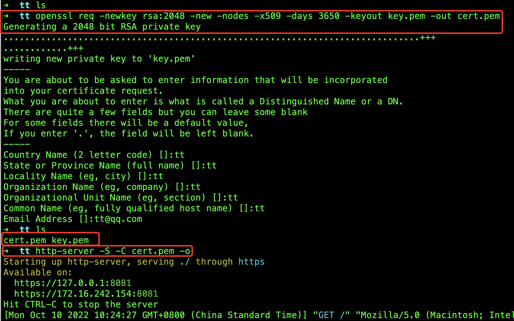

[[TOC]]

[TOC]

# 前端http-server开启本地https服务

1、首先需要使用npm全局安装http-server

```bash
npm i -g http-server
```

1、生成https需要的秘钥文件：打开项目所在文件夹，linux、Mac系统使用终端，Windows系统使用`git bash`(安装git软件带的)，使用以下命令生成一个证书密钥对`key.pem`和`cert.pem`，它将有效期约10年（准确地说是3650天）

```bash
openssl req -newkey rsa:2048 -new -nodes -x509 -days 3650 -keyout key.pem -out cert.pem
```

按照步骤输入对应信息(6种名字和邮箱)，信息随便输入，输入结束后，文件夹中会多出两个文件 cert.pem key.pem。

3、启动服务：通过以下命令就可以运行https服务了：

```bash
http-server -S -C cert.pem -o
```

