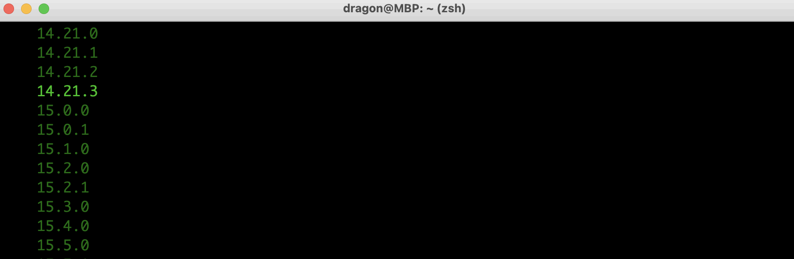
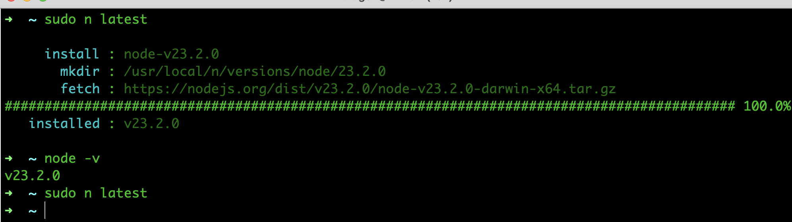
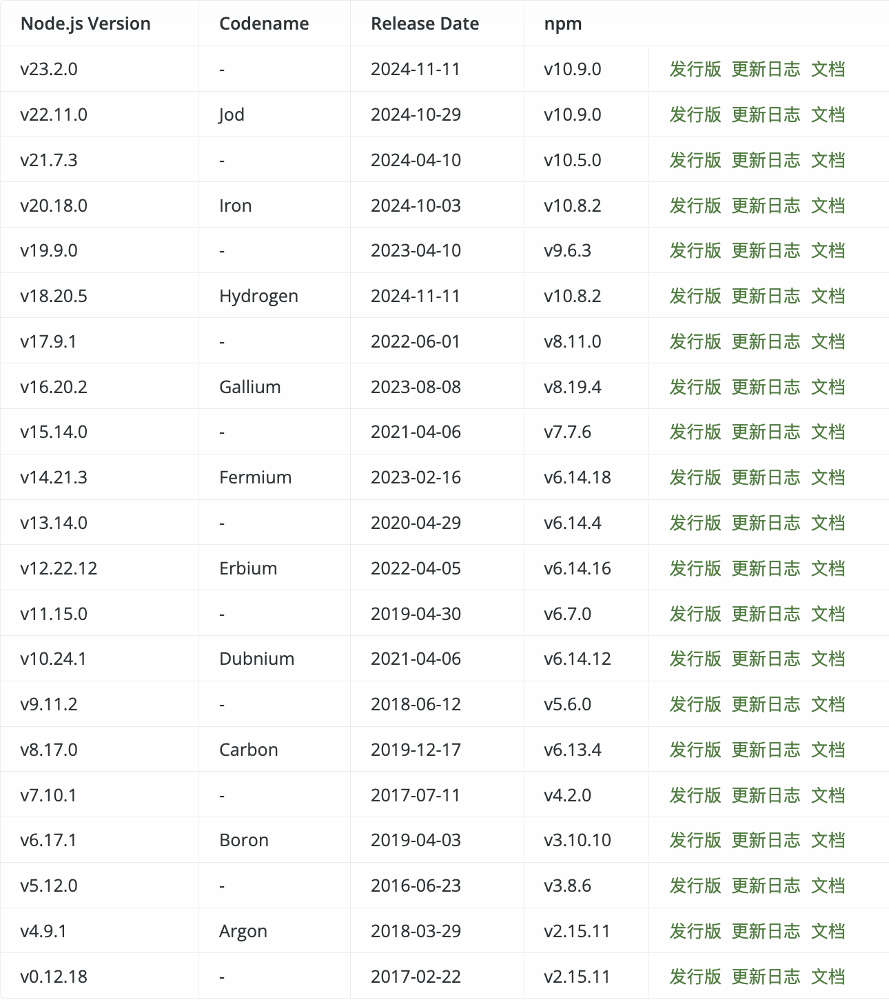

[[TOC]]

[TOC]


# node版本管理工具使用教程

本文是基于n的`2.1.12`版本操作，后续更高级版本可能略有区别。

n包github地址：https://github.com/tj/n

## 1. 安装n工具

终端使用`npm install -g n`命令全局安装，
安装成功后在终端输入`n --version`或`n`查看。

```bash
~ npm install -g n
/usr/local/bin/n -> /usr/local/lib/node_modules/n/bin/n
+ n@2.1.12
updated 1 package in 3.55s

~ n --version
2.1.12
```


**注意**：安装完n工具后，n工具里面没有一个node版本，需要安装一个node才行

## 2. 查找node的历史版本

1、github上node仓库查看node版本：   
1.1、链接：https://github.com/nodejs/node/tree/main/doc/changelogs  
1.2、这个文件夹下每一个文件名为`CHANGELOG_V14`这种带`V14`都是一个node大版本性情文件，点击文件可以查看这个大版本里面的具体需要的版本号    
1.3、LTS 'Fermium'：是长期支持版本，Current：是最新发布版本。推荐优先选择LTS Fermium版本   

2、node中文网站：https://nodejs.org/zh-cn/about/previous-releases

node版本详情介绍见下面的第6条说明

## 3. n一些常用命令

### 3.1 安装一个node：n 版本号

**注意**：   
1、安装成功后，会立刻切换到安装的版本。    
2、安装的时候，需要停止本地正在用node运行的前端项目，否则安装会失败   
3、每个node版本对应的npm版本不一样，修改node版本后，npm版本也会跟着变

安装命令：`n 22.11.0`，需要权限的话：`sudo n 22.11.0`

```bash
~ n 22.11.0
# Mac系统需要sudo命令超级权限操作
~ sudo n 22.11.0
     install : node-v22.11.0
       mkdir : /usr/local/n/versions/node/22.11.0
       fetch : https://nodejs.org/dist/v22.11.0/node-v22.11.0-darwin-x64.tar.gz
   installed : v22.11.0
```


### 3.2 查看已经安装的版本：n

1、命令：`n`

2、在进入的命令行中，高亮的是当前正在使用的版本，键盘的上下键可以选择需要的版本，然后按回车即可切换

3、按`q`或者`control + C`退出node版本列表


### 3.3 切换已安装版本：n 版本号

第一种方式：   
使用`n`命令查看已安装列表，使用键盘的上下键高亮选中一个版本，然后按回车键确认切换到这个版本。

在Mac系统电脑中，由于需要权限才能修改文件，在确认回车后，会看终端显示了没有权限操作的文件列表，经过查看这些都是一些npm包。 命令执行结束后，虽然node版本切换成功了，但是如果某个工程使用了这个没有修改成的包，可能会造成报错。

第二种方式：    
使用n查看安装的版本列表，找到一个需要切换的版本号，然后使用`n 8.16.0`命令切换node版本：

```bash
# Mac系统需要sudo命令超级权限操作
~ sudo n 8.16.0
```


### 3.4 删除一个版本：n rm 版本号

```bash
# 删除一个版本
n rm 22.11.0
# Mac系统需要sudo命令超级权限操作
sudo n rm 22.11.0
# 同时删除多个版本
sudo n rm 9.11.2 10.24.1
# 版本号前面加v也没问题
sudo n rm v12.22.12
# 删除后没有任何输出
```


### 3.5 查看所有可安装的node版本号：n ls

```bash
~ n ls # 或者使用 n list
```

在结果页里面，上下滚动鼠标滚轮，就可以查看所有版本号，其中高亮的版本号表示已经安装的。



### 3.6 安装最新版本：n latest

```bash
# Mac系统需要sudo命令超级权限操作
sudo n latest
```

当已经安装了最新版本，在执行这个命令就变成切换这个版本



### 3.7 安装最新稳定版本：n stable

```bash
# Mac系统需要sudo命令超级权限操作
~ sudo n stable
```

当已经安装了最新稳定的版本，在执行这个命令就变成切换这个版本


### 3.8 安装最新LTS长期支持稳定版：n lts

```bash
# Mac系统需要sudo命令超级权限操作
~ sudo n lts
```


### 3.9 删除除当前版本以外的所有版本：n prune

```bash
# Mac系统需要sudo命令超级权限操作
~ sudo n prune
```


## 4. n包安装node存放路径

Mac系统：`/usr/local/n/versions/node`


## 5. node版本和npm版本需要对应

每个node版本都有对应的npm版本，只有对应起来才能正常执行npm命令，否则使用npm命令就会报错。

由于我是Mac系统，使用`n`命令需要`sudo`权限才能操作成功。当使用`n 8.16.0`或者使用`n`来进行node版本切换的时候，如果没有加上`sudo`命令就会操作部分失败，虽然node版本切换了，但是npm相关的却没有切换成功，当使用npm命令的时候会报如下的错误：


解决版本：使用`sudo n 23.2.0`方式来切换node版本，先切换到最高版本，然后在切换使用的版本。这个时候npm就会安装对应版本了。

node版本对应的npm版本如下图所示：



图片来源：https://nodejs.org/zh-cn/about/previous-releases

## 6. node版本区别说明

在官网上可以看到 Node.js 有 LTS 系列和 Current 系列，分别对应不同的最新版本号。

Node.js 的版本号命名遵循[语义化版本](https://link.juejin.cn?target=https%3A%2F%2Fsemver.org%2F)（Semantic Versioning），统一版本号表示规则，该规则规定了版本号如何表示，如何增加，如何进行比较，不同的版本号意味着什么。

版本格式：`主版本号.次版本号.修订号`

- 主版本号(major)：做了不兼容的 API 修改      
- 次版本号(minor)：做了向下兼容的功能性新增，可以理解为Feature版本     
- 修订号(patch)：做了向下兼容的问题修正，可以理解为Bug fix版本    

### 6.1 LTS 版本

LTS 版本全称 **Long Time Support**，即**长期支持版本**，重点在于稳定性和安全性，每个 LTS 版本的大版本号都是**偶数**，建议首次下载以及后续的每次升级都选择 LTS 版本，减少开发过程中出现的未知问题。 LTS 版本有 3 个阶段的生命周期：

- Active(活跃阶段)：每个从 Current 进入 LTS 的偶数版本，都会有 18 个月的时间被积极维护和升级。    
- Maintenance(维护阶段)：活跃阶段达到 18 个月后，会进入为期 12 个月的维护阶段，期间只会进行错误修复和安全补丁。
- End of Life(结束阶段)：简称 EOL ，在维护阶段达到期限之后，该版本进入 EOL 阶段，将不再维护，也就是说，每个 LTS 版本最长会有 30 个月的维护时间，之后将不再进行维护。

每个大版本生命周期：


### 6.2 Current 版本

Current 即最新发布版本，该版本专注于必要功能的开发和现有 API 的完善，具有较短的寿命和更频繁的代码更新。 你可以在该版本体验到最新功能，也可以能遇到各种意想不到的问题和兼容性要处理。 通常 Current 版本会在每 6 个月发布一次大版本（特殊情况除外）：

- 每年 4 月份发布新的偶数版本
- 每年 10 月份发布新的奇数版本

### 6.3 如何选择合适的版本

LTS 版本：    
一般用于生产环境，重点在于稳定，如果你需要稳定性并拥有复杂的生产环境（例如中型或大型企业），建议使用 **LTS** 版本。

Current 版本：     
一般用于测试环境，如果你是为了尝试新的版本和新特性（比如 ECMAScript 新特性），或者能够在不干扰环境的情况下快速轻松地升级版本，建议使用 **Current** 版本。

在实际开发中，并不需要及时更新到最新版本，我们完全可以按照项目技术栈依赖的最低 Node.js 版本决定是否升级，如果条件允许，还是建议至少把大版本升级到最新的 LTS 版本。


## 参考资料

https://segmentfault.com/a/1190000016956077

https://juejin.cn/post/7126183800874205220
