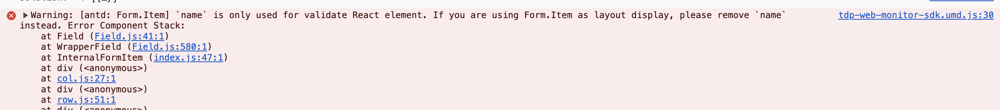

[[TOC]]

[TOC]


# antd组件在react开发中遇到的问题

## 1. Form.Item name属性is only used for validate React element



原因：Form.Item组件下没有可Input或Select组件之类的组件，如果不需要校验或输入内容，可以去掉属性name。

```jsx
{/* 问题代码 */}
<Form.Item label={label} name={question.name} rules={rules}>
  1111
  {/* <Input /> */} {/* 加上可控组件就不报错了 */}
</Form.Item>
```

解决办法 删除name属性：

```jsx
<Form.Item label={label} rules={rules}>
  1111
</Form.Item>
```

或者给`Form.Item`组件子元素加上可控组件：

```jsx
<Form.Item label={label} name={question.name} rules={rules}>
  <Input />
</Form.Item>
```

