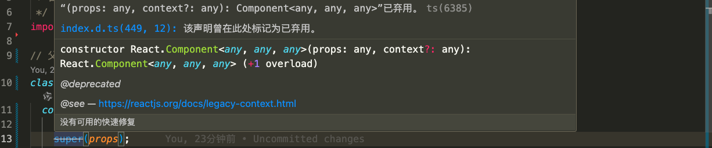

[[TOC]]

[TOC]

# react开发遇到的问题

## 1. Module build failed: SyntaxError: Missing class properties transform.

在react中遇到报错信息：

```bash
Module build failed: SyntaxError: Missing class properties transform.
```

经过查找发现是webpack配置中的问题，

我之前在webpack中的配置：

```js
module: {
  rules: [
    {
      test: /\.js[x]?$/,
      exclude: /node_modules/,
      loader: 'babel',
      query: {
        presets: ['react', 'env']
      }
    },
  ]
}
```

修改解析jsx的配置：

```js
module: {
  rules: [
    {
      test: /\.js[x]?$/,
      exclude: /node_modules/,
      loader: 'babel',
      query: {presets: ['react', 'stage-0'], cacheDirectory: true}
    },
  ]
}
```

https://github.com/babel/babel/issues/2729


## 2.  Cannot update during an existing state transition 

具体的报错信息：

```bash
Warning: Cannot update during an existing state transition (such as within `render` or another component's constructor). Render methods should be a pure function of props and state; constructor side-effects are an anti-pattern, but can be moved to `componentWillMount`.
```

这个错误在偶尔会出来，经过网络查找：大体意思就是在render这种需要props和state进行渲染的方法中，不能再对props和state进行更新。

当报这类错误时，说明你的props和states在渲染的时候更改了。

React会在props和state改变的时候调用 render进行DOM diff然后渲染，如果在渲染过程中再对props和states进行更改，就会陷入死循环了。
例如：

```html
<Button onPress={hideMessage('隐藏信息')}>隐藏信息</Button>
```

当点击button时，就会报上述错误，因为这样会在渲染是更改组件的状态。
解决方法：在调用方法时创建一个匿名函数，再调用。

```html
<Button onPress={()=>{hideMessage('隐藏信息')}}>隐藏信息</Button>
```

参考资料：https://www.jianshu.com/p/9780a302e509

## 3. Can't perform a React state update on an unmounted component

在开发过程中，有时候会遇到如下错误：

```bash
Can't perform a React state update on an unmounted component. 
This is a no-op, but it indicates a memory leak in your application.
```

大致意思：不能在组件销毁后设置state，防止出现内存泄漏的情况。

一般产生这种的可能原因，组件在卸载后，一些异步操作回调执行了。在这些回调中有设置state。比如接口请求、定时器、绑定的 dom 事件 等这些回调方法里面修改了state。

解决方法：

1、在卸载生命周期方法里面清除定时器：

```js
// 1、在卸载生命周期里面 清除异步请求，比如取消接口请求、清除定时器等
componentWillUnMount = () => {
  $.ajax.abort() //1.ajax请求
  clearTimeout(timer) //2.定时器
}
// 2、设置一个锁(默认打开)，在卸载里面把锁关上。 在有问题的异步回调方法设置state前判断，如果锁上了就不修改state
componentDidMount = () => {
  this._isMounted = true;
  $.ajax('你的请求',{}).then(res => {
    if(this._isMounted){this.setState({ aa:true })}
  })
}
componentWillUnMount = () => {
  this._isMounted = false;
}

// 3、直接把 setState方法重置， 修改后，所有使用setState的地方就都不能修改state了
componentWillUnmount = () => {
  this.setState = (state,callback)=>{
    return;
  };
}

// 4、函数组件中：使用第二个方法
function Example(props) {
  const [loading, setloading] = useState(true)
  useEffect(() => {
    let mounted = true
    fetchAPI.then(() => {
      if (mounted) { setloading(false) }
    })
    return function cleanup() {
      mounted = false
    }
  }, [])
  return <div>{loading ? <p>loading...</p> : <p>Fetched!!</p>}</div>
}
```

## 4. 类组件构造函数中 super(*props*) 已弃用

在类组件的构造函数里面必须写 `super()` 才能初始化并使用 `this`。不写`super()`就会报错。之前一直在构造函数中使用`super(props)`方式。但是在react版本更新后。在类组件的构造函数中内部写`super(props)`的时候，编辑器提示这种方式已废弃。如下图所示：



经过查找在React 16.x及以上版本中，如果你需要访问`props`属性，构造函数中可以直接使用`props`参数，在其他地方直接使用`this.props`。

首先说明一下super方法传不传props参数的区别：     
1、不传props参数：构造函数里面 `this.props` 的值是 `undefined`     
2、传props参数：构造函数里面 `this.props` 的值是`props`

在构造函数中使用`props`属性绝大部分情况都可以直接使用构造函数的props参数。因此大多时候可以直接使用`super()`方法，而不必传`props`。除非有必须要使用`this.props`的情况再传。这也是为什么`super(props)`只是提示废弃而没有报错的原因。

```jsx
constructor(props) {
  super();
  // super(props); // 给super传props后，this.props就有值了，可以使用了
  this.sub = React.createRef(); // 调用了super后才能使用this变量
}
```


