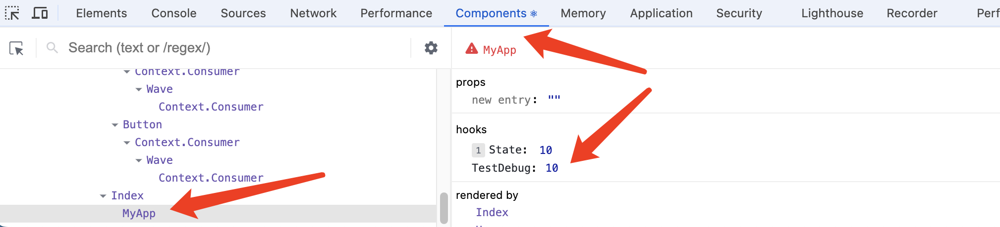

[[TOC]]

[TOC]


# React Hooks详解

本文整理自：https://juejin.cn/post/7118937685653192735，作者：我不是外星人

## 1. 概述

**Hooks** 是 React 16.8 的新增特性。并在React 18版本新增了一些功能。Hooks可以让函数组件也可以实现部分类组件的功能，比如state状态管理、部分React生命周期钩子、*以及其他的React特性*。

在Hooks出现以前，开发遇到的问题：

- 函数组件后期维护需要添加状态管理的功能
- 一些函数组件中不能处理接口请求、获取数据的逻辑处理，只能改成类组件
- 类组件随着开发功能越来越多，随着功能增强而变得越来越臃肿。在进行优化拆分时，只要有状态管理的就都需要使用类组件拆分

所以 Hooks 出现本质上原因是：

- **让函数组件也能做类组件的事，有自己的状态，可以处理一些副作用，能获取 ref ，也能做数据缓存**
- **解决逻辑复用难的问题**
- **放弃面向对象编程，拥抱函数式编程**

关于自定义  Hooks：

自定义 hooks 是在 React Hooks 基础上的一个拓展，可以根据业务需求制定满足业务需要的组合 hooks ，更注重的是逻辑单元。通过业务场景不同，到底需要React Hooks 做什么，怎么样把一段逻辑封装起来，做到复用，这是自定义 hooks 产生的初衷。

自定义 hooks 也可以说是 React Hooks 聚合产物，其内部有一个或者多个 React Hooks 组成，用于解决一些复杂逻辑。

hooks功能概览和出现的版本：


## 2. hooks数据驱动更新

### 2.1 useState

useState 可以使函数组件像类组件一样拥有 state，函数组件通过 useState 可以让组件重新渲染，更新视图。

使用方法、参数说明：

```js
import { useState } from 'react';
const [ state , setState ] = useState(initData)
```

- state：状态变量，目的提供给 UI ，作为渲染视图的数据源。     
- setState：用于更新状态值的函数。当使用这个函数设置新的状态时，React 会根据新的状态重新渲染组件。     
- initData：状态的初始值。分为三种情况：第一种是不传，则 state 的初始值为undefined。第二种情况是非函数，将作为 state 初始化的值。 第三种情况是函数，函数的返回值作为 useState 初始化的值。

使用例子：

```jsx
const DemoState = (props) => {
   /* number为此时state读取值 ，setNumber为派发更新的函数 */
   let [number, setNumber] = useState(0) /* 0为初始值 */
   return (<div>
       <span>{ number }</span>
       <button onClick={ ()=> {
         setNumber(number+1) // 会在下次渲染才更新number便令
         console.log(number) /* 这里的number是 旧值 */
       } } ></button>
   </div>)
}
```

**useState 注意事项：**

1、在函数组件一次执行上下文中，state 的值是固定不变的

```jsx
function Index(){
  const [ number, setNumber ] = React.useState(0)
  const handleClick = () => setInterval(()=>{
    setNumber(number + 1 ) // // 此时 number 一直都是 0
  },1000)
  return <button onClick={ handleClick } > 点击 { number }</button>
}
```

2、 如果两次传入相同的 state 值，那么组件就不会更新

```jsx
let account =5;
export default function Index(){
  const [ state  , dispatchState ] = useState({ name:'alien' })
  const  handleClick = ()=>{ // 点击按钮，视图没有更新。
    state.name = 'Alien';
    dispatchState(state) // state变量是对象，存储的是对象地址，这么操作直接等于内存地址重新赋值了相同的值。而传入相同的state值，组件不会渲染，所以视图没有更新。但是对象内的属性已经修改成功了
  }
  return (<div>
    <span>{state.name}</span>
    <button onClick={handleClick}>changeName++</button>
  </div>);
}
```

3、当执行`setState`时，在当前执行上下文中获取不到最新的 state, 只有再下一次组件 rerender 中才能获取到。

4、当执行`setState`设置state值时，React 将跳过子组件的渲染及 effect 的执行。需要注意的是，React 可能仍需要在跳过渲染前渲染该组件。不过由于 React 不会对组件树的“深层”节点进行不必要的渲染，所以大可不必担心。如果你在渲染期间执行了高开销的计算，则可以使用 `useMemo` 来进行优化。

官方文档：https://zh-hans.react.dev/reference/react/useState

### 2.2 useReducer

useReducer 是 react-hooks 提供的能够在无状态组件中运行的类似redux的功能 api 。

使用方法、参数说明：

```jsx
import { useReducer } from 'react';
const [ ①state , ②dispatch ] = useReducer(③reducer, initialState, processInitState)
```

- state：状态变量，目的提供给 UI ，作为渲染视图的数据源。
- dispatch：用于更新状态值的函数。本质上跟 useState方法返回的 setState 方法一样。
- reducer：一个函数 reducer ，我们可以认为它就是一个 redux 中的 reducer , reducer的参数就是常规reducer里面的state和action, 返回改变后的state, 这里有一个需要注意的点就是：**如果返回的 state 和之前的 state ，内存指向相同，那么组件将不会更新。**
- initialState：状态的初始值。如果不传则 state 的初始值为undefined。注意不能使用函数返回值形式设置。
- processInitState：选填，处理初始值的方法，initialState 可以当这个函数的参数使用。

使用例子：

```jsx
function Index({ dispatch, State }) {
  return (
    <button onClick={() => { dispatch({ name: 'reset', payload: 666 }); }}>子 重置 {State.number}</button>
  );
}
const DemoUseReducer = ({size}) => {
  /* number为更新后的state值,  dispatchNumber 为当前的派发函数 */
  const [number, dispatchNumber] = useReducer((state, action) => {
    const { payload, name } = action;
    switch (name) { // /* return的值为新的state */
      case 'add':
        return state + 1;
      case 'sub':
        return state - 1;
      case 'reset':
        return payload;
      default:
        return 50;
    }
  }, 10, (initialState ) => {return initialState * size});
  return (
    <div>
      当前值：{number}
      <button onClick={() => dispatchNumber({ name: 'add' })}>增加</button>
      <button onClick={() => dispatchNumber({ name: 'sub' })}>减少</button>
      {/* 把dispatch 和 state 传递给子组件  */}
      <Index dispatch={dispatchNumber} State={{ number }} />
    </div>
  );
};
export default DemoUseReducer;
```

官方文档：https://zh-hans.react.dev/reference/react/useReducer

### 2.3 useSyncExternalStore(v18新增)

useSyncExternalStore 的诞生和 v18 的更新模式下外部数据的 tearing 有着十分紧密的关联。useSyncExternalStore 能够让 React 组件在 concurrent 模式下安全地有效地读取外接数据源，在组件渲染过程中能够检测到变化，并且在数据源发生变化的时候，能够调度更新。当读取到外部状态发生了变化，会触发一个强制更新，来保证结果的一致性。

使用方法、参数说明：

```jsx
import { useSyncExternalStore } from 'react';
useSyncExternalStore( subscribe, getSnapshot, getServerSnapshot)
```

- subscribe：为订阅函数，当数据改变的时候，会触发 subscribe，在 useSyncExternalStore 会通过带有记忆性的 getSnapshot 来判别数据是否发生变化，如果发生变化，那么会强制更新数据。
- getSnapshot：可以理解成一个带有记忆功能的选择器。当 store 变化的时候，会通过 getSnapshot 生成新的状态值，这个状态值可提供给组件作为数据源使用，getSnapshot 可以检查订阅的值是否改变，改变的话那么会触发更新。
- getServerSnapshot：用于 hydration 模式下的 getSnapshot。

使用例子：

```jsx
import { combineReducers , createStore  } from 'redux'

/* number Reducer */
function numberReducer(state=1,action){
    switch (action.type){
      case 'ADD':
        return state + 1
      case 'DEL':
        return state - 1
      default:
        return state
    }
}
/* 注册reducer */
const rootReducer = combineReducers({ number:numberReducer  })
/* 创建 store */
const store = createStore(rootReducer,{ number:1  })

function Index(){
    /* 订阅外部数据源 */
    const state = useSyncExternalStore(store.subscribe,() => store.getState().number)
    console.log(state)
    return <div>
        {state}
        <button onClick={() => store.dispatch({ type:'ADD' })} >点击</button>
    </div>
}
```

点击按钮，会触发 reducer ，然后会触发 store.subscribe 订阅函数，执行 getSnapshot 得到新的 number ，判断 number 是否发生变化，如果变化，触发更新。

官方文档：https://zh-hans.react.dev/reference/react/useSyncExternalStore

### 2.4 useTransition(v18新增)

在 React v18 中，有一种`并发模式(concurrent)`，`concurrent`模式允许将UI更新标记为高优先级的或者可中断的低优先级操作。而`useTransition()`方法可以将某些更新标记为`可中断的`和`非紧急的`-也就是所谓的`transitions`。这种新特性在大量的UI更新操作中尤其有效，比如过滤一个较大的列表。打个比方如下图当点击 tab 从 tab1 切换到 tab2 的时候，本质上产生了两个更新任务。

- 第一个就是 hover 状态由 tab1 变成 tab2。
- 第二个就是内容区域由 tab1 内容变换到 tab2 内容。

这两个任务，用户肯定希望 hover 状态的响应更迅速，而内容的响应有可能还需要请求数据等操作，所以更新状态并不是立马生效，通常还会有一些 loading 效果。所以第一个任务作为**立即执行任务**，而第二个任务就可以视为**过渡任务**。


useTransition使用方法、参数说明：

```jsx
import { useTransition } from 'react' 
const  [ isPending , startTransition ] = useTransition ()
```

- isPending：Boolean值，表示处于过渡状态的标志，指明这个`transition`正在加载中(`pending`)
- startTransition：设置过度的方法，这个方法接收一个函数作为参数，在这个参数函数里面执行一些地任务行为

useTransition 例子：

```jsx
/* 模拟数据 */
const mockList1 = new Array(10000).fill('tab1').map((item,index)=>item+'--'+index )
const mockList2 = new Array(10000).fill('tab2').map((item,index)=>item+'--'+index )
const mockList3 = new Array(10000).fill('tab3').map((item,index)=>item+'--'+index )

const tab = { tab1: mockList1, tab2: mockList2, tab3: mockList3 }

export default function Index(){
  const [ active, setActive ] = React.useState('tab1') //需要立即响应的任务，立即更新任务
  const [ renderData, setRenderData ] = React.useState(tab[active]) //不需要立即响应的任务，过渡任务
  const [ isPending,startTransition  ] = React.useTransition() 
  const handleChangeTab = (activeItem) => {
     setActive(activeItem) // 立即更新
     startTransition(()=>{ // startTransition 里面的任务优先级低
       setRenderData(tab[activeItem])
     })
  }
  return <div>
    <div className='tab' >
       { Object.keys(tab).map((item)=> <span className={ active === item && 'active' } onClick={()=>handleChangeTab(item)} >{ item }</span> ) }
    </div>
    <ul className='content' >
       { isPending && <div> loading... </div> }
       { renderData.map(item=> <li key={item} >{item}</li>) }
    </ul>
  </div>
}
```

官方文档：https://zh-hans.react.dev/reference/react/useTransition

### 2.5 useDeferredValue(v18新增)

useDeferredValue用来接受一个值，并返回该值的新副本，该副本将推迟到更紧急地更新之后。由于React 18 将UI更新标记为高优先级的或者可中断的低优先级操作。所以我们可以在高优先级任务结束后，再得到新的状态，而这个新的状态就称之为 DeferredValue。

useDeferredValue使用方法、参数说明：

```jsx
import { useDeferredValue } from 'react';
const [value, setValue] = useState('');
const deferrredValue = React.useDeferredValue(value, initialValue?)
```

- value：你想延迟的值，可以是任何类型。
- initialValue：可选值，组件初始渲染时使用的值。如果省略此选项，`useDeferredValue` 在初始渲染期间不会延迟，因为没有以前的版本可以渲染。
- deferrredValue：延迟的值

注意事项：

- 当更新发生在 Transition 内部时，`useDeferredValue` 总是返回新的 `value` 并且不会产生延迟渲染，因为该更新已经被延迟了。
- 传递给 `useDeferredValue` 的值应该是原始值（如字符串和数字）或是在渲染之外创建的对象。如果你在渲染期间创建一个新对象并立即将其传递给 `useDeferredValue`，它在每次渲染时都会不同，从而导致不必要的后台重新渲染。
- `useDeferredValue` 本身不会引起任何固定的延迟。一旦 React 完成原始的重新渲染，它会立即开始使用新的延迟值处理后台重新渲染。由事件（例如输入）引起的任何更新都会中断后台重新渲染，并被优先处理。
- 由 `useDeferredValue` 引起的后台重新渲染在提交到屏幕之前不会触发 Effect。如果后台重新渲染被暂停，Effect 将在数据加载后和 UI 更新后运行。

用法：

- 1、在新内容加载期间显示旧内容
- 2、延迟渲染 UI 的某些部分

useDeferredValue 例子：

```jsx
import React from "react"
const tab = { tab1: ['1','2','3'], tab2: ['4','5','6'], tab3: ['7','8','9'] }
export default function Index(){
  const [ active, setActive ] = React.useState('tab1') //需要立即响应的任务，立即更新任务
  const deferActive = React.useDeferredValue(active) // 把状态延时更新，类似于过渡任务
  const handleChangeTab = (activeItem) => {
     setActive(activeItem) // 立即更新
  }
  const renderData = tab[deferActive] // 使用滞后状态
  return <div>
    <div className='tab' >
       { Object.keys(tab).map((item)=> <span className={ active === item && 'active' } onClick={()=>handleChangeTab(item)} >{ item }</span> ) }
    </div>
    <ul className='content' >
       { renderData.map(item=> <li key={item} >{item}</li>) }
    </ul>
  </div>
}
// 如上 active 为正常改变的状态，deferActive 为滞后的 active 状态，我们使用正常状态去改变 tab 的 active 状态，使用滞后的状态去更新视图，同样达到了提升用户体验的作用。
```

```jsx
import React, { memo, useState, useDeferredValue } from 'react';

const SlowList = memo(function SlowList({ text }) {
  // 仅打印一次。实际的减速是在 SlowItem 组件内部。
  console.log('[ARTIFICIALLY SLOW] Rendering 250 <SlowItem />');
  let items = [];
  for (let i = 0; i < 250; i++) {
    items.push(<SlowItem key={i} text={text} />);
  }
  return ( <ul className="items"> {items} </ul> );
});
function SlowItem({ text }) {
  let startTime = performance.now();
  while (performance.now() - startTime < 1) {
    // 每个 item 暂停 1ms，模拟极其缓慢的代码
  }
  return (<li className="item">Text: {text}</li>)
}

export default function App() {
  const [text, setText] = useState('');
  const deferredText = useDeferredValue(text);
  return (
    <>
      <input value={text} onChange={e => setText(e.target.value)} />
      <SlowList text={deferredText} />
    </>
  );
}
// 在这个例子中，SlowList 组件中的每个 item 都被 故意减缓了渲染速度，这样你就可以看到 useDeferredValue 是如何让输入保持响应的。当你在输入框中输入时，你会发现输入很灵敏，而列表的更新会稍有延迟。
// 例子链接：https://zh-hans.react.dev/reference/react/useDeferredValue#examples
```

官方文档：https://zh-hans.react.dev/reference/react/useDeferredValue

## 3. 执行副作用

React hooks也提供了 api ，用于弥补函数组件没有生命周期的缺陷。其本质主要是运用了 hooks 里面的 useEffect、useLayoutEffect、useInsertionEffect。其中最常用的就是 useEffect 。

**注意**：`useInsertionEffect` 方法是react 18 版本才有的，低于这个版本没有这个方法。 

### 3.1 三个方法的区别

由于useEffect、useLayoutEffect、 useInsertionEffect三个方法的参数和用法都一样。他们唯一的区别就是执行的时机不一样。关于三个方法参数和用法下一小节会介绍。这里我们先着重介绍他们的区别。

1、三个方法执行效果：        
1.1 执行顺序：useInsertionEffect 执行 -> useLayoutEffect 执行 -> useEffect 执行      
1.2 在方法中修改dom：都是在这一次更新中完成。      
1.2 在方法中修改状态变量：都触发了组件第二次更新。

2、三个方法执行时机(区别)：     
2.1 useEffect：在组件渲染到屏幕之后异步执行。这意味着它不会阻塞浏览器的绘制和更新        
2.2 useLayoutEffect：在修改 DOM 之后，在浏览器进行布局和绘制之前同步执行。      
2.3 useInsertionEffect：在布局副作用触发之前将元素插入到 DOM 中，在useLayoutEffect之前执行

3、三个方法在使用上说明：   

- useEffect
  - 特点、使用场景：由于是异步执行，不会阻塞页面的渲染，对用户交互的响应性影响较小，适用于大多数与数据获取、订阅事件、手动修改`DOM`等不会直接影响页面布局和视觉呈现的操作。 
  - 缺点：由于是在浏览器绘制视图之后执行，如果在这个方法里面去修改DOM元素，就可能会导致浏览器再次回流和重绘。而且由于两次绘制，视图上可能会造成闪现突兀的效果。  
- useLayoutEffect
  - 特点、使用场景：解决 useEffect 修改 DOM 的问题。在这个方法里面可以获取更新后的 DOM，修改 DOM，修改后马上渲染到页面中。
  - 缺点：由于还在等待页面渲染呢，这个方法是同步执行的，如果在其中执行的操作耗时较长，会阻塞页面的渲染，可能导致页面卡顿，影响用户体验。尽可能使用 `useEffect`。
- useInsertionEffect：是为 CSS-in-JS 库的作者特意打造的。除非你正在使用 CSS-in-JS 库并且需要注入样式，否则你应该使用 `useEffect` 或者 `useLayoutEffect`。

三个方法的执行测试例子： 

```jsx
import React from 'react';
let h = 30;
function Index() {
  const [count, setCount] = React.useState(100)
  const divRef = React.useRef(null);
  // 用来测试 三个副作用方法 的执行顺序，把flag变量值改成对应的值即可
  const print = (name) => {
    // console.log(`${name}`);
    const flag = 'useInsertionEffect';
    if (divRef.current) {
      if (flag === name) {
        // h += 10; divRef.current.innerText = h;                // 1、修改dom
        if (count === 0) { setCount(Math.random() + 99); } // 2、修改状态
      }
      console.log(`${name}`, count, divRef.current.innerText);
    }
  };
  React.useEffect(() => {
    print('useEffect');
  });
  React.useLayoutEffect(() => {
    print('useLayoutEffect');
  });
  React.useInsertionEffect(() => {
    print('useInsertionEffect');
  });
  // console.log('函数组件体,', count);
  if (divRef.current) {
    console.log('函数组件体', count, divRef.current.innerText);
  }
  return (<div className="hook-test">
    <div ref={divRef} style={{ border: '1px solid' }}>This is</div>
    <h4>count: {count}</h4>
    {/* 1、修改dom：<button onClick={e => setCount(count + 1)}>count</button> */}
    2、修改状态：<button onClick={e => setCount(0)}>count</button>
  </div>);
}
export default Index;
// 函数组件渲染步骤：
// 1. 函数组件执行，返回了 经过处理逻辑的的dom
// 2. useInsertionEffect 执行
// 3. useLayoutEffect 执行
// 4. 经过修改的dom渲染到浏览器中。
// 5. useEffect 执行，这次渲染结束
```


### 3.1 useEffect

```jsx
import { useEffect } from 'react';
useEffect(setup, dependencies?);

// 真正使用的时候是这种形式的
useEffect(() => {
  // 执行副作用操作
  return () => {}; // 清理操作执行方法，可选
}, [dependencies]); // 依赖数组
```

- setup：处理 Effect 的函数。setup 函数选择性返回一个 **清理(cleanup)** 函数，作为下一次setup执行前调用，用于清理上一次setup执行产生的副作用。
- dependencies：可选参数，类型是数组，作为执行setup处理函数的依赖项。当依赖项改变，会触发useEffect执行。React 将使用 [`Object.is`](https://developer.mozilla.org/zh-CN/docs/Web/JavaScript/Reference/Global_Objects/Object/is) 来比较每个依赖项和它先前的值。这个参数分为三种情况：
  - 传有值的数组([dep1, dep2])：当依赖项改变，会触发useEffect执行。
  - 传空数组([])：只在初始挂载后执行一次，相当于componentDidMount方法
  - 不传：每次重新渲染组件后都会运行 Effect 函数

**React 在必要时会调用 setup 和 cleanup，这可能会发生多次**：

- 1、初次挂载到页面后，运行 setup 代码
- 2、每次重新渲染组件结束后(如果传了第二个参数，那么只有在依赖项值发生改变才执行)：
  - 2.1 首先，使用旧的 props 和 state 运行**清理(cleanup)**函数。
  - 2.2 然后，使用新的 props 和 state 运行 setup 代码。
- 3、组件卸载之前，**清理(cleanup)** 函数 将运行最后一次。

一个使用例子：

```jsx
import React, { useEffect, useRef, useState } from "react"

function getUserInfo(a){ // 模拟数据交互
  return new Promise((resolve)=>{
      setTimeout(()=>{ resolve({ name:a, age:16, }) }, 500)
  })
}
const Demo = ({ a }) => {
  const [ userMessage , setUserMessage ] :any= useState({})
  const div= useRef()
  const [number, setNumber] = useState(0)
  const handleResize =()=>{}    // 模拟事件监听处理函数
  useEffect(()=>{
     // 请求数据
     getUserInfo(a).then(res=>{ setUserMessage(res) })
     const timer = setInterval(()=>console.log(666),1000)
     window.addEventListener('resize', handleResize) // 事件监听
     return function(){ // 此函数用于清除副作用
         clearInterval(timer) 
         window.removeEventListener('resize', handleResize)
     }
  // 只有当 a 和 number 改变的时候,useEffect 函数才会重新执行
  },[ a ,number ]) // 这里如果不加限制 ，会是函数重复执行，陷入死循环
  useEffect(() => {
    console.log('useEffect1111 只执行一次');
  }, []); // 数组为空[],只在初始挂载后执行一次，相当于componentDidMount方法
  return (<div ref={div} >
      <span>{ userMessage.name }</span> <span>{ userMessage.age }</span>
      <div onClick={ ()=> setNumber(1) } >{ number }</div>
  </div>)
}
```

官方文档：https://zh-hans.react.dev/reference/react/useEffect

### 3.2 useLayoutEffect

useLayoutEffect 使用例子：

```jsx
import React from 'react';
let h = 30;
function Index() {
  const [count, setCount] = React.useState(100)
  const divRef = React.useRef(null);
  React.useLayoutEffect(() => {
    h += 10; divRef.current.innerText = h;
  });
  return (<div className="hook-test">
    <div ref={divRef} style={{ border: '1px solid' }}>This is</div>
    <h4>count: {count}</h4>
    修改dom：<button onClick={e => setCount(count + 1)}>count</button>
  </div>);
}
export default Index;
```

官方文档：https://zh-hans.react.dev/reference/react/useLayoutEffect

### 3.3 useInsertionEffect

`useInsertionEffect` 是为 CSS-in-JS 库的作者特意打造的。除非你正在使用 CSS-in-JS 库并且需要注入样式，否则你应该使用 [`useEffect`](https://zh-hans.react.dev/reference/react/useEffect) 或者 [`useLayoutEffect`](https://zh-hans.react.dev/reference/react/useLayoutEffect)。

useInsertionEffect 使用例子：

```jsx
export default function Index(){
  React.useInsertionEffect(()=>{
    /* 动态创建 style 标签插入到 head 中 */
    const style = document.createElement('style')
    style.innerHTML = `
       .css-in-js{
         color: red;
         font-size: 20px;
       }
     `
    document.head.appendChild(style)
  },[])
  return <div className="css-in-js" > hello , useInsertionEffect </div>
}
```

官方文档：https://zh-hans.react.dev/reference/react/useInsertionEffect

## 4. 状态获取与传递

### 4.1 useContext

可以使用 useContext ，来获取父级组件传递过来的 context 值，这个当前值就是最近的父级组件 Provider 设置的 value 值，useContext 参数一般是由 createContext 方式创建的 ,也可以父级上下文 context 传递的 ( 参数为 context )。useContext 可以代替 context.Consumer 来获取 Provider 中保存的 value 值。

useContext 接受一个参数，一般都是 context 对象，返回值为 context 对象内部保存的 value 值。

使用例子：

```jsx
// contextTest.js：定义一个context 文件，所有用到这个context的组件都要引用这个文件
export const UserContext = React.createContext();

// 共同的父组件发布变量
import { UserContext } from '@views/contextTest.js'; // 引入共同的 Context
const App = () => (
  const [age, setAge] = React.useState(256); // 让子组件可以修改 Context
  <UserContext.Provider value={{ name: 'Alice', age: age, setAge: setAge }}>
    <UserInfo />
  </UserContext.Provider>
);

// 函数组件使用变量：1、通过useContext使用。
import { useContext } from 'react';
import { UserContext } from '@views/contextTest.js'; // 引入共同的 Context
export default function UserInfo() {
  const user = useContext(UserContext); // 1、通过useContext获取变量
  return (<div>
    <p>用户名: {user.name}</p> <p>年龄: {user.age}</p>
    <button onClick={() => { user.setAge(user.age + 1); }}>增加年龄</button>
  </div>);
}
```

官方文档：https://zh-hans.react.dev/reference/react/useContext

### 4.2 useRef

useRef 方法主要有下面两个作用：     
1、保存 DOM 引用：react内置了对它的支持。当把useRef变量传递给 JSX 中的 `ref` 属性时，react 会在创建DOM并渲染到页面后，把节点赋值给 ref 对象的 `current` 属性。    
2、保存状态：只要当前组件不被销毁，那么状态就会一直存在。改变 `ref.current` 属性时，React 不会重新渲染组件。React 不知道它何时会发生改变，因为 ref 是一个普通的 JavaScript 对象。

使用方法、参数说明：

```jsx
const ref = React.useRef(initialValue);
```

- `initialValue`：ref 对象的 `current` 属性的初始值。可以是任意类型的值。这个参数在首次渲染后被忽略。
- ref：返回一个只有一个属性的对象(ref.current)，current初始值为传递的 `initialValue`。之后可以将其设置为其他值。如果将 ref 对象作为一个 JSX 节点的 `ref` 属性传递给 React，React 将为它设置 `current` 属性。在后续的渲染中，`useRef` 将返回同一个对象。

**注意**：   
1、除了 [初始化](https://zh-hans.react.dev/reference/react/useRef#avoiding-recreating-the-ref-contents) 外不要在渲染期间写入或者读取 `ref.current`，否则会使组件行为变得不可预测。     
2、在严格模式下，React 将会 **调用两次组件方法**，这是为了 [帮助发现意外问题](https://zh-hans.react.dev/reference/react/useState#my-initializer-or-updater-function-runs-twice)。但这只是开发模式下的行为，不会影响生产模式。每个 ref 对象都将会创建两次，但是其中一个版本将被丢弃。如果使用的是组件纯函数（也应当如此），那么这不会影响其行为。     
3、`const ref = useRef()` 等同于 `const [ref, _] = useState(() => createRef(null))`。详情见：[react.createRef](https://zh-hans.react.dev/reference/react/createRef)，在实际代码中React.createRef() 跟 React.useRef() 效果一样。

使用例子：

```jsx
import React from 'react';
let text = 30;
function Counter() {
  const ref = React.useRef(0);       // 保存变量，组件在变量在，修改不触发更新
  const divRef = React.useRef(null); // 保存dom。
  React.useEffect(() => { console.log('useEffect'); }); // 只执行了一次
  function handleClick() {
    ref.current += 1;
    console.log('ref.current:', ref.current);
    text += 10; divRef.current.innerText = `dom修改${text}`;   
  }
  return (<div>
    <div ref={divRef}>This is</div>
    <button onClick={handleClick}>点击</button>
  </div>);
}
```

官方文档：https://zh-hans.react.dev/reference/react/useRef

### 4.3 useImperativeHandle

useImperativeHandle 可以让函数组件自定义实例对象用来给父组件调用。

对于子组件，如果是 类组件，我们可以通过 ref 获取类组件的实例。但是在子组件是函数组件的情况下(函数组件没有ref属性)，则可以通过 forwardRef 方法来让函数组件拥有 ref 属性。

**注意**：由于react规定函数组件不能有ref属性(react19版本取消这个限制了)，函数组件也可以通过自定义的props属性达到 ref 的效果，详情见下面的例子。

使用方法、参数说明：

```jsx
React.useImperativeHandle(ref, createHandle, dependencies?)
```

- ref：从 [`forwardRef` 渲染函数](https://zh-hans.react.dev/reference/react/forwardRef#render-function) 中获得的第二个参数。或者是props里面的自定义 ref 属性。父组件传过来的
- createHandle：处理函数，返回值作为暴露给父组件的 ref 对象。
- dependencies：可选参数，类型是数组，作为执行setup处理函数的依赖项。当依赖项改变，会执行createHandle生成新的 ref 对象。React 将使用 [`Object.is`](https://developer.mozilla.org/zh-CN/docs/Web/JavaScript/Reference/Global_Objects/Object/is) 来比较每个依赖项和它先前的值。这个参数分为三种情况：
  - 传有值的数组([dep1, dep2])：当依赖项改变，执行createHandle生成新的 ref 对象。
  - 传空数组([])：只在初始挂载后生成新的 ref 对象，相当于componentDidMount方法。这么做会导致一个问题，详情见下面的**注意**说明
  - 不传：每次重新渲染组件后都会执行createHandle生成新的 ref 对象

useImperativeHandle使用例子：

```jsx
import React from 'react';
// 父组件
const Parent = () => {
  const ChildRef = React.createRef(); // React.useRef() 也一样
  return (
    <div>
      <button onClick={() => { ChildRef.current.func(); }}>click</button>
      <Child ref={ChildRef} />
    </div>
  );
};
// 子组件：和 forwardRef 方法配合 暴露自定义的 ref 对象给父组件
const Child = React.forwardRef((props, ref) => {
  const [count, setCount] = React.useState(100);
  React.useImperativeHandle(ref, () => ({
    func: () => {
      setCount(count + 1);
      console.log('我是子组件1，count：', count);
    },
  }));
  return <div>子组件</div>;
});
// 子组件：父组件使用<Child onRef={ChildRef} /> 这种自定义props属性来获取函数组件的自定义 ref 对象
const Child = (props) => {
  const [count, setCount] = React.useState(100);
  React.useImperativeHandle(props.onRef, () => ({
    func: () => {
      setCount(count + 1);
      console.log('我是子组件，count：', count);
    },
  }));
  return <div>子组件</div>;
};
```

**注意**：关于useImperativeHandle 方法依赖项传空数组产生的问题：    
createHandle 只会在组件挂载后执行一次，当父组件执行 ref 对象里面的方法时：读取子组件的state的值永远不会变(初始值)，调用子组件的setCount方法只有第一次有效，以后都是无效的。当为了性能优化而给依赖项传空数组的时候需要特别注意这一点。详情见如下例子：

```jsx
const Child = React.forwardRef((props, ref) => {
  const [count, setCount] = React.useState(10);
  React.useImperativeHandle(ref, () => ({
    func: () => {
      setCount(count + 1);
      console.log('我是子组件1，count：', count);
    },
  }), []);
  return <div>子组件：{count}</div>;
});
// 父组件执行 func 方法，console.log里面的count值永远是10， 页面count值只有在第一次点击后变成了11，后面的点击都没变化
```

官方文档：https://zh-hans.react.dev/reference/react/useImperativeHandle

## 5. 状态派生与保存

### 5.1 useMemo

useMemo 可以在函数组件 render 上下文中同步执行一个函数逻辑，这个函数的返回值可以作为一个新的状态缓存起来。`useMemo` 不会让首次渲染更快，它只会帮助你跳过不必要的更新工作。

使用方法、参数说明：

```jsx
const visible = React.useMemo(calculate, deps)
```

- calculate：计算缓存值的函数。这个函数没有参数，并且可以返回任意类型。React 将会在首次渲染时执行该函数返回结果；在之后的渲染中会根据 `deps` 参数情况而定。
- deps：类型是数组，作为执行 calculate 函数的依赖项。React 将使用 [`Object.is`](https://developer.mozilla.org/zh-CN/docs/Web/JavaScript/Reference/Global_Objects/Object/is) 来比较每个依赖项和它先前的值。这个参数分为三种情况：
  - 传有值的数组([dep1, dep2])：当依赖项改变，会触发 calculate 执行并返回结果。
  - 传空数组([])：只在初始挂载时执行一次，相当于componentDidMount方法。这个参数会导致 useMemo 再也不执行，也就获取不到后续更新了。失去了 useMemo 的意义
  - 不传：每次重新渲染组件时都会运行 useMemo 函数。这么做等于每次都重新计算结果，失去了 useMemo 的意义
- visible：需要缓存的变量。calculate 函数执行后的返回值。

使用例子：

```jsx
function Scope() {
  const keeper = useKeep()
  const { cacheDispatch, cacheList, hasAliveStatus } = keeper
  const contextValue = useMemo(() => { /* 通过 useMemo 得到派生出来的新状态 contextValue  */
    return {
      hasAliveStatus: hasAliveStatus.bind(keeper),
      cacheDestory: (payload) => cacheDispatch.call(keeper, { type: ACTION_DESTORY, payload })
    }
  }, [keeper])
  return <KeepaliveContext.Provider value={contextValue}></KeepaliveContext.Provider>
}
```

需要用到 useMemo 的地方：      
1、跳过代价昂贵的重新计算：默认情况下，React 会在每次重新渲染时重新运行整个组件。如果计算速度很快，这将不会产生问题。但是，当正在过滤转换一个大型数组，或者进行一些昂贵的计算，而数据没有改变，那么可能希望跳过这些重复计算。这种缓存行为叫做 [记忆化](https://en.wikipedia.org/wiki/Memoization)。        
2、跳过组件的重新渲染：**默认情况下，当一个组件重新渲染时，React 会递归地重新渲染它的所有子组件**。这对于不需要太多计算来重新渲染的组件来说很好。但是如果你已经确认重新渲染很慢，你可以通过将它包装在 [`memo`](https://zh-hans.react.dev/reference/react/memo) 中，这样当它的 props 跟上一次渲染相同的时候它就会跳过本次渲染。      
3、防止过于频繁地触发 Effect：     

```jsx
function ChatRoom({ roomId }) {
  const options = { serverUrl: 'https://localhost:1234', roomId: roomId };
  useEffect(() => {
    const connection = createConnection(options);
    connection.connect();
    return () => connection.disconnect();
  }, [options]);
}
// 1. 上面代码中，因为 Effect 中的每一个响应式值都应该声明为其依赖。 然而如果你将 options 声明为依赖，会导致在 Effect 在每次渲染后都会重新执行
// 2. 为了解决这个场景，你可以使用 useMemo 将 Effect 中使用的对象包装起来
const options = useMemo(() => {
  return { serverUrl: 'https://localhost:1234', roomId: roomId };
}, [roomId]); // ✅ 只有当 roomId 改变时才会被改变
// 3. 然而，因为 useMemo 只是一个性能优化手段，而并不是语义上的保证，所以 React 在 特定场景下 会丢弃缓存值。这也会导致重新触发 Effect，因此 最好通过将对象移动到 Effect 内部来消除对函数的依赖：
useEffect(() => {
  // ✅ 不需要将 useMemo 或对象作为依赖！
  const options = {  serverUrl: 'https://localhost:1234', roomId: roomId }
  const connection = createConnection(options);
  connection.connect();
  return () => connection.disconnect();
}, [roomId]); // ✅ 只有当 roomId 改变时才会被改变
```

4、记忆一个函数，这个跟另外一个 hooks 的 useCallback 方法一样。像 `function() {}` 这样的函数声明和像 `() => {}` 这样的表达式在每次重新渲染时都会产生一个 **不同** 的函数。就其本身而言，创建一个新函数不是问题。这不是可以避免的事情！但是，如果 `Form` 组件被记忆了，大概你想在没有 props 改变时跳过它的重新渲染。**总是** 不同的 props 会破坏你的记忆化。

```jsx
export default function ProductPage({ productId, referrer }) {
  function handleSubmit(orderDetails) {
    post('/product/' + productId + '/buy', { referrer, orderDetails });
  }
  // 使用 useMemo 记忆 handleSubmit 函数
  const handleSubmit = useMemo(() => {
    return (orderDetails) => {
      post('/product/' + productId + '/buy', { referrer, orderDetails });
    };
  }, [productId, referrer]);
  return <Form onSubmit={handleSubmit} />;
}
```

如何衡量计算过程的开销是否昂贵？

一般来说，除非要创建或循环遍历数千个对象，否则开销可能并不大。如果你想获得更详细的信息，可以在控制台来测量花费这上面的时间：

```jsx
console.time('filter array');
const visibleTodos = filterTodos(todos, tab);
console.timeEnd('filter array');
// 使用 useMemo 测试
console.time('filter array useMemo');
const visibleTodos = useMemo(() => { return filterTodos(todos, tab);  }, [todos, tab]);
console.timeEnd('filter array useMemo');
```

然后执行你正在监测的交互（例如，在输入框中输入文字）。你将会在控制台看到如下的日志 `filter array: 0.15ms`。如果全部记录的时间加起来很长（`1ms` 或者更多），那么记忆此计算结果是有意义的。作为对比，你可以将计算过程包裹在 `useMemo` 中，以验证该交互的总日志时间是否减少了。

请记住，你的开发设备可能比用户的设备性能更强大，因此最好人为降低当前浏览器性能来测试。例如，Chrome 提供了 [CPU Throttling](https://developer.chrome.com/blog/new-in-devtools-61/#throttling) 选项来降低浏览器性能。另外，请注意，在开发环境中测量性能无法为你提供最准确的结果（例如，当开启 [严格模式](https://zh-hans.react.dev/reference/react/StrictMode) 时，你会看到每个组件渲染两次而不是一次）。要获得最准确的时间，请构建用于生产的应用程序并在用户使用的设备上对其进行测试。

官方文档：https://zh-hans.react.dev/reference/react/useMemo

### 5.2 useCallback

useMemo 和 useCallback 接收的参数都是一样，都是在其依赖项发生变化后才执行，都是返回缓存的值，区别在于 useMemo 返回的是函数运行的结果，useCallback 返回的是函数。

使用方法、参数说明：

```jsx
const cachedFn = React.useCallback(fn, deps)
// useCallback 等于 如下实现，或者 const cachedFn = useMemo(() => fn, dependencies)
function myUseCallback(fn, dependencies) {
  return useMemo(() => fn, dependencies); 
}
```

- fn：想要缓存的函数。在初次渲染时，React 将把函数返回给你。在之后的渲染中会根据 `deps` 参数情况而定。
- deps：类型是数组，作为执行 useCallback 的依赖项。跟 useMemo 方法的参数一样。
- cachedFn：缓存函数的名字

使用例子：

```jsx
/* 用react.memo */
const DemoChildren = React.memo((props)=>{
  /* 只有初始化的时候打印了 子组件更新 */
  console.log('子组件更新')
  useEffect(()=>{ props.getInfo('子组件') },[])
  return <div>子组件</div>
})
const DemoUseCallback=({ id })=>{
  const [number, setNumber] = useState(1)
  const getInfo  = useCallback((sonName)=>{ console.log(sonName) },[id])
  return <div>
    {/* 点击按钮触发父组件更新 ，但是子组件没有更新 */}
    <button onClick={ ()=>setNumber(number+1) } >增加</button>
    <DemoChildren getInfo={getInfo} />
  </div>
}
```

与字面量对象 `{}` 总是会创建新对象类似，**在 JavaScript 中，`function () {}` 或者 `() => {}` 总是会生成不同的函数**。正常情况下，这不会有问题。但是在函数组件中，把函数传给子组件的props。这会导致每次渲染props都是不同的。并且 [`memo`](https://zh-hans.react.dev/reference/react/memo) 对性能的优化永远不会生效。而这就是 `useCallback` 起作用的地方

## 6. 工具 hooks

### 6.1 useDebugValue

可以让你在 [React 开发工具](https://zh-hans.react.dev/learn/react-developer-tools) 中为自定义 Hook 添加标签。**注意**：只有自定义hooks组件才有效，其他函数组件无效。并且需要浏览器安装 [React 开发工具](https://zh-hans.react.dev/learn/react-developer-tools) 插件。

使用方法、参数说明：

```jsx
useDebugValue(value, date => date.toDateString());
```

- `value`：你想在 React 开发工具中显示的值。可以是任何类型。
- **可选** `format`：它接受一个格式化函数。当组件被检查时，React 开发工具将用 `value` 作为参数来调用格式化函数，然后显示返回的格式化值（可以是任何类型）。如果不指定格式化函数，则会显示 `value`。在某些情况下，格式化值的显示可能是一项开销很大的操作。除非需要检查 Hook，否则没有必要这么做。

使用例子：

```jsx
function useTestDebug(data) {
  // const [age, setAge] = React.useState(11);
  React.useDebugValue(data);
  return data;
}
function MyApp() {
  const [count, setCount] = React.useState(10);
  useTestDebug(count);
  return (<div>
    <button onClick={() => { setCount(count + 1); }}>add count</button>
    count: {count}
  </div>);
}
```

浏览器终端显示：



官方文档：https://zh-hans.react.dev/reference/react/useDebugValue

### 6.2 useId

useId 也是 React v18 产生的新的 hooks , 它可以在 client 和 server 生成唯一的 id , 解决了在服务器渲染中，服务端和客户端产生 id 不一致的问题，更重要的是保障了 React v18 中 **streaming renderer （流式渲染）** 中 id 的稳定性。

**低版本 React ssr 存在的问题：**

```jsx
const rid = Math.random() + '_id_'  /* 生成一个随机id  */
function Demo (){
   return <div id={rid} ></div> // 使用 rid 
}
```

这在纯客户端渲染中没有问题，但是在服务端渲染的时候，传统模式下需要走如下流程。在这个过程中，当服务端渲染到 html 和 hydrate 过程分别在服务端和客户端进行，但是会走两遍 id 的生成流程，这样就会造成 id不一致的情况发生。useId 的出现能有效的解决这个问题。


**useId 基本用法:**

```jsx
function Demo (){
   const rid = useId() // 生成稳定的 id 
   return <div id={rid} ></div>
}
```

### 6.2.1 v18 ssr

这部分转载自：https://juejin.cn/post/7118937685653192735#heading-23

在 React v18 中 对 ssr 增加了流式渲染的特性 [New Suspense SSR Architecture in React 18 ](https://link.juejin.cn?target=https%3A%2F%2Fgithub.com%2Freactwg%2Freact-18%2Fdiscussions%2F37)， 那么这个特性是什么呢？我们来看一下：

在传统 React ssr 中，如果正常情况下， hydrate 过程如下所示：


刚开始的时候，因为服务端渲染，只会渲染 html 结构，此时还没注入 js 逻辑，所以我们把它用灰色不能交互的模块表示。（如上灰色的模块不能做用户交互，比如点击事件之类的。）

hydrate js 加载之后，此时的模块可以正常交互，所以用绿色的模块展示。

但是如果其中一个模块，服务端请求数据，数据量比较大，耗费时间长，我们不期望在服务端完全形成 html 之后在渲染，那么 React 18 给了一个新的可能性。可以使用  包装页面的一部分，然后让这一部分的内容先挂起。

接下来会通过 script 加载 js 的方式 流式注入 html 代码的片段，来补充整个页面。接下来的流程如下所示：


在这个原理基础之上， React 个特性叫 Selective Hydration，可以**根据用户交互改变 hydrate 的顺序**。

比如有两个模块都是通过 Suspense 挂起的，当两个模块发生交互逻辑时，会根据交互来选择性地改变 hydrate 的顺序。


如上 C D 选择性的 hydrate 就是 Selective Hydration 的结果。那么回到主角 useId 上，如果在 hydrate 过程中，C D 模块 id 是动态生成的，比如如下：

```jsx
let id = 0
function makeId(){
  return id++
}
function Demo(){
  const id = useRef( makeId() )
  return <div id={id}  >...</div>
}
```

那么如果组件是 Selective Hydration , 那么注册组件的顺序服务端和客户端有可能不统一，这样表现就会不一致了。那么用 useId 动态生成 id 就不会有这个问题产生了，所以说 useId 保障了 React v18 中 **streaming renderer （流式渲染）** 中 id 的稳定性。
