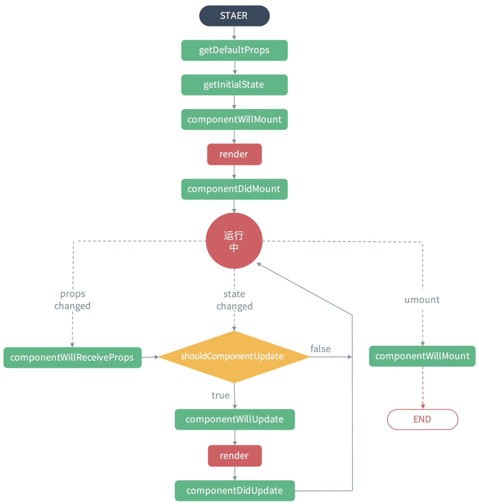

[[TOC]]

[TOC]


# react父子组件交互生命周期执行顺序

整理转载自：https://www.jianshu.com/p/318ffc6f4848

## 1. 组件生命周期执行流程

在网上找到一张生命周期执行顺序图：



### 1.1 组件挂载的过程

- 初始化props，通过类的静态属性defaultProps或者getDefaultProps函数，初始化的props会与父组件指定的props合并，最后赋值给this.props

- constructor()，或者getInitialState

- componentWillMount()，此时dom还没渲染，在这里执行的setState不会导致重绘，执行无效果

- render()

- componentDidMount()，在这里执行的setState会导致重绘（或称为二次渲染）

### 1.2 组件被动更新(父组件调动setState)

- componentWillReceiveProps()，这时子组件的props仍然是旧的，可以在这里把新的props通过setState设置进state中，不会触发二次渲染

- shouldComponentUpdate()，这里读取到的state是以上更新后的state

- componentWillUpdate()，不能在这里执行setState，执行了无效果

- render()

- componentDidUpdate()，可以在这里进行异步的setState

### 1.3 组件主动更新(当前组件调用setState)

- 执行的函数相比上面的被动更新流程，少了一个componentWillReceiveProps方法，其余的都一样。

### 1.4 组件卸载

- componentWillUnmount()，用于清除定时器、事件绑定；React 官方不建议在 componentWillMount() 修改 state ，通常建议在 componentDidMount(), 如果需要设置 state 的初始状态，可以在 (es6:)constructor() 或者 (es5:)getInitialState() 中设置。

- setState是一个异步操作，修改的state必能通过this.state.xxx来马上读取，但可以在setState的第二个参数（回调函数）中读取更新后的值。执行这个函数的时候，新状态会被存放进队列中，稍后才进行状态合并，接着触发shouldComponentUpdate和render，所以连续多次的setState不会影响效率，只会触发一次render

## 2. 父子组件生命周期执行顺序

### 2.1 初始化阶段

总结：当执行render子组件的时候，才会进入子组件的生命周期，子组件的周期结束后，再回到上级的周期。

```jsx
import React from 'react';
import ReactDOM from 'react-dom';
const buildClass = (name)=>{
    return class extends React.Component{
        constructor(props) {
            super(props);
            console.log( name + ' constructor');
        }
        componentWillMount() {
            console.log( name + ' componentWillMount');
        }
        componentDidMount() {
            console.log( name + ' componentDidMount');
        }
        componentWillUnmount() {
            console.log( name + ' componentWillUnmount');
        }
        componentWillReceiveProps(nextProps) {
            console.log( name + ' componentWillReceiveProps(nextProps)');
        }
        shouldComponentUpdate(nextProps, nextState) {
            console.log( name + ' shouldComponentUpdate(nextProps, nextState)');
            return true;
        }
        componentWillUpdate(nextProps, nextState) {
            console.log( name + ' componentWillUpdate(nextProps, nextState)');
        }
        componentDidUpdate(prevProps, prevState) {
            console.log( name + ' componetDidUpdate(prevProps, prevState)');
        }
    }
}
class Child extends buildClass('Child'){
    render(){
        console.log('Child render')
        return (<div>child</div>)
    }
}
class Parent extends buildClass('Parent'){
    render(){
        console.log('Parent render')
        return (<Child />)
    }
}
ReactDOM.render(
    <Parent />,
    document.getElementById('root')
);
```

执行结果：

```bash
Parent constructor
Parent componentWillMount
Parent render
Child constructor
Child componentWillMount
Child render
Child componentDidMount
Parent componentDidMount
```

### 2.2 子组件主动更新

子组件通过setState修改自己的状态。

修改上面的子组件代码：

```jsx
class Child extends buildClass('Child'){
    render(){
        console.log('Child render')
        return (
            <button onClick={()=>{this.setState({data:123})}}>child</button>
        )
    }
}
```

执行结果：

```bash
Child shouldComponentUpdate(nextProps, nextState)
Child componentWillUpdate(nextProps, nextState)
Child render
Child componetDidUpdate(prevProps, prevState)
```

### 2.3 子组件被动更新

父组件通过props把自己的state传递给子组件，父组件执行setState更新状态还原子组件的代码，修改父组件代码如下：

```jsx
class Parent extends buildClass('Parent'){
  render(){
    console.log('Parent render')
    return (
      <div>
        <Child />
        <button onClick={()=>{this.setState({data:123})}}>Parent</button>
      </div>
    )
  }
```

执行结果：

```bash
Parent shouldComponentUpdate(nextProps, nextState)
Parent componentWillUpdate(nextProps, nextState)
Parent render
Child componentWillReceiveProps(nextProps)
Child shouldComponentUpdate(nextProps, nextState)
Child componentWillUpdate(nextProps, nextState)
Child render
Child componetDidUpdate(prevProps, prevState)
Parent componetDidUpdate(prevProps, prevState)
```

总结 ：不管父组件有没有把数据传递给子组件，只要父组件setState，都会走一遍子组件的更新周期。而且子组件被动更新会比主动更新所执行的流程多出来一个componentWillReceiveProps 方法。

如果在以上被动更新的基础上，修改buildClass中的代码，使 shouldComponentUpdate返回false，代码如下：

```jsx
shouldComponentUpdate(nextProps, nextState) {
    console.log( name + ' shouldComponentUpdate(nextProps, nextState)');
    return false;
}
```

点击parent中的更新按钮，仅仅输出一句：Parent shouldComponentUpdate(nextProps, nextState)
结论：只要组件在以上函数中返回false，则子组件不会进行更新re-render，所有更新流程都不执行了。


