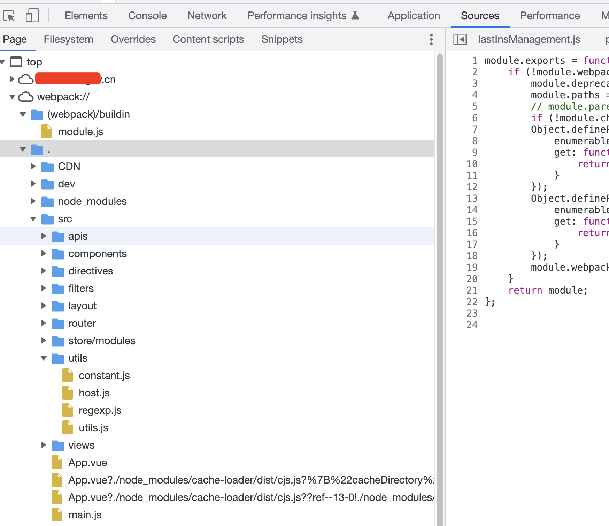

[[toc]]

[TOC]


# webpack常见问题解决

## 1. vue脚手架使用webpack打包后，能看到vue源码

如下图所示，打开浏览器控制台，查看`sources`源码会看到前端部分源代码：



经过查找，应该是webpack打包时，打包中，附带生成了SourceMap格式的源码显示文件，在配置中关掉即可

解决方法：

在`vue.config.js`配置文件中，添加如下代码：

```js
module.exports = {
  // 打包时设置为false则不会打包出map文件
  productionSourceMap: false, // 如果设置这行无效，则把下面的代码也加上
  configureWebpack(config) {  // 正常是对项目运行进行判断是否开启sourceMap,这里一刀切了
    config.devtool = false;
  },
}
```

[参考资料](https://blog.csdn.net/q1004124842/article/details/121093242?utm_medium=distribute.pc_relevant.none-task-blog-2~default~baidujs_title~default-0-121093242-blog-105378099.pc_relevant_aa2&spm=1001.2101.3001.4242.1&utm_relevant_index=3)