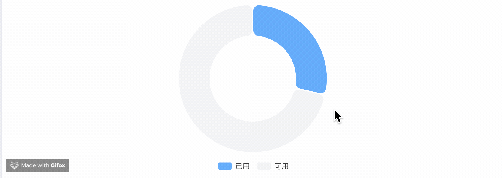

[[TOC]]

[TOC]

# 饼图(pie)示例

## 1. 圆角环形图

效果如下图：



代码：

```js
import * as echarts from 'echarts';
var chartDom = document.getElementById('main');
var myChart = echarts.init(chartDom);
var option = {
  // 提示框组件：鼠标移到每个数据上，鼠标hover 显示的悬浮框
  tooltip: {
    trigger: 'none' // 设置不显示 hover悬浮框
  },
  // 项目标题显示设置: 在底部居中显示
  legend: { bottom: '5%', left: 'center' },
  color: ['#5da2f9', '#f1f2f5'], // 每个series 的 item颜色设置
  series: [
    {
      name: '虚拟VCPU计量',
      type: 'pie',
      radius: ['40%', '70%'],
      center: ['50%', '40%'], // 修改 饼图 显示位置。将饼图向上移动。后添加的属性，示例里面没有这个属性
      avoidLabelOverlap: false,
      // 饼图圆角 有间隙样式
      itemStyle: { borderRadius: 10, borderColor: '#fff', borderWidth: 2 },
      // 每个数据的label不显示
      label: { show: false, position: 'center' },
      emphasis: {
        label: {
          show: true,
          fontSize: 30,
          fontWeight: 'bold',
          formatter: '{bStyle|{b}}\n {d}%',
          rich: { bStyle: { color: '#ccc', fontSize: 20 } }, // formatter中的样式
        }
      },
      labelLine: { show: false },
      data: [
        { value: 28, name: '已用' },
        { value: 70, name: '可用' }
      ]
    }
  ]
};
option && myChart.setOption(option);
```

[在线例子效果 后期可能会失效](https://echarts.apache.org/examples/zh/editor.html?c=pie-borderRadius&code=PYBwLglsB2AEC8sDeAoWsD0HaAXjQXJ6BiFoCN-gb3KBY_4AT5g4BaDfnoAxKg89aBUcoA6mgdsaBQcoDD_1AFsADcApgCdYgPjM8gELdANQaA7WwJpYYYMAA2kEAC5kS9GBEQA5kdE6A5NBhDzmbID7owHb-gWDlJsfsJHzF6AL4AaJSxYQE8MwDu3KkAMjMknHUAKdUBUvUALhMBRHUBaOUklNSFTaAATHSRYACNgMBUAWwsAVgBSc39YbIAzMAsAYyFoMFFbAKV29WARHQBtcwBiaryAQwAmZoBOBthJ5oBGZoXq8wBdRuDmAGdRCCEj2ClYCB6KwByMwCcgpyUTw3OxvV10b9hoGYqhBZAFphgH2jABqAGEAAoAVUAhdGAecSGp99ABPECA1YgM7In7oEQzPIQACuRzG5gALAAGeqNcwAdhpe0CeNgMwEwAgeQAMjNikI1AB5TxqGbaWDNGZqE4svHBQA-mYA_tUAYOqAJcjYIBIc0AL6mATLTAOwWgHh9FHXW4AZTAqOyhRKwzyogASoSSWTYOsqY1SiI7SIIUMRqsJs0gytPd6AOpcsC8HRzWD9VmHVhsKSi_lqVx4Y2pgXWo78ADuOkl0qEjRAwCONyg0A6XR6Ij6sp-QgqIF4M0rLtQrPQ2bUhWNPzzwELyhExNLg--zRgYFNEAAXpiAMzuqfoGfdMNCYy8NqrUpqPK4nsb4YVGblMyrJDFc2WoQAH1vvl8AB04Eg8r5aevYIZ2mjZASnvK1gMGNRhgsCZ2lglZNznRdMTmKk4zjA5sBnEQLyvEQ0ikQ0p18Y14zxPtuQgaBMSKYdR2LE50ONWYwBmD5TyKAQpQnGMAA5Gj-AELEAJ91AApXRspw4rjMUZfj_kxcxAHvlMS42NXZPmI9A1N8ABuIA)

<iframe
  :src="$withBase('/echarts-example/pie/001-pie-borderRadius.html')"
  width="100%" height="200"
  frameborder="0" scrolling="No" leftmargin="0" topmargin="0"
/>

## 2. 粗细不同的环形饼图

效果图片：


```js
import * as echarts from 'echarts';

var chartDom = document.getElementById('main');
var myChart = echarts.init(chartDom);
var option;

option = {
  // 整个容器的背景色
  backgroundColor: '#fff',
  // 中间标题
  title: {
    text: '环形饼图',
    left: 'center',
    top: 'center',
    textStyle: {
      fontSize: 20,
      color: '#333'
    }
  },
  // 提示框样式
  tooltip: {
    trigger: 'item',
    backgroundColor: '#000', // 弹窗背景黑色
    textStyle: {
      color: '#fff' // 文字白色
    }
  },
  // 项目标题显示设置: 在底部居中显示
  legend: { bottom: '0', left: 'center' },
  // 数据颜色
  color: ['#b8741a', '#7f7f7f'],
  series: [
    // 最底层透明边框环
    {
      type: 'pie',
      radius: ['86%', '87%'], // 控制边框环宽度和位置
      // 设置饼图在容器中的位置：[水平位置， 垂直位置]
      center: ['50%', '45%'],
      data: [{ value: 100, itemStyle: { color: 'rgba(0, 0, 0, 0.05)' } }],
      label: { show: false },
      silent: true, // 禁止交互
      z: 1
    },
    // 主圆环图：两个数据块
    {
      name: '环形饼图',
      type: 'pie',
      radius: ['50%', '75%'], // 控制主环厚度
      // 设置饼图在容器中的位置：[水平位置， 垂直位置]
      center: ['50%', '45%'],
      data: [
        {
          value: 13000,
          name: '剩余'
          // itemStyle: {
          //   color: '#b8741a'
          // }
        },
        {
          value: 18000,
          name: '已分配'
          // itemStyle: {
          //   color: '#7f7f7f'
          // }
        }
      ],
      label: {
        show: false
      },
      labelLine: {
        show: false
      },
      z: 2
    },
    // 第二个圆环（用于 A 更粗）——通过叠加实现
    {
      name: '环形饼图',
      type: 'pie',
      radius: ['50%', '80%'], // 比上面更厚
      // 设置饼图在容器中的位置：[水平位置， 垂直位置]
      center: ['50%', '45%'],
      data: [
        {
          value: 13000,
          name: '剩余'
          // itemStyle: {
          //   color: '#b8741a'
          // }
        },
        {
          value: 18000,
          name: '已分配',
          itemStyle: {
            color: 'transparent'
          }
        }
      ],
      label: { show: false },
      labelLine: { show: false },
      z: 3
    }
  ]
};

option && myChart.setOption(option);
```

[在线例子效果 后期可能会失效](https://echarts.apache.org/examples/zh/editor.html?c=bar-simple&code=PYBwLglsB2AEC8sDeAoW6MHpO0C6mgqOUE7tQCzVAQt0BmAwezNAnILQ3QCMBDAYwGsBzAJ2AFdoAJgGFgAG2BcAXLADkAYgBmSmQBo69bLEC0coBfUwOAWgDIz1GSGFEBTaanr0w5gB5hpMwPXOgI31APpmA_tVXH6FhSdZFnNoOy5fGxNQZxCw8wi1KPQ7RwBlMABPCys_GwUYMDSIAC9LWAAmAAYk5PQWMQlnOQBmNpk89ABfPK7ajRxABeNALk9AMQtAdgtAeH08sGAxSBBcurAuCA4OBOcIOwBbSOTmdm4-QRFxKVk5KuvVWE1ATn1AdK8qQEW82mWHIqyc5E6MBvOzSUChkdTuOEA4aaAdW1AL5u72SPSifTymkAnhmAO7dDIA-M2GgD7owB2_tJABTqgFS9QAXCYBRHS0OLyFg2gissAYwDAsx2ziqtwCQRkcXCoORUU0gAdTQB2xoAcjPh9ABTVgAG15AwABwAdgALABGJi3eQqhR6vUyAC6_QwAGcEhBzGbpHK_ppAADmJMAQjqAeATAHBmgE740YuP7WMFZEDlGQgK37OpcJgCCC8G3ymRKgBsAFIdarUybwbBAOXGgDYlb0uQC92oAyvUAMSqAWXl8X90JoCd4iSQtKRK4Asf7lgBYbQDOepXADD_sEAQeqAF7dK0bq7A-Zt4wBWKqplSyNVTjOmqICJhgJi2sfoJCwABuTFEvHKGuu8-25h2GWy5V3MouMi4HGYAAoarB35-AHRVKcASgFWBETBE0x1EJgGHMURGTNAALYAAHdpAUQ8LSAlcbDNCALDCaQVmPedNEAQM9ACNrQASuUAJLkxxKaQNT-QVkk0QBuOUAMHUXC8FtABI5fAxUAdXU_THaAmB2YN3G8cNkkDYNQ3MCSokjaNY1tGQZznWQVSXY1CJwPMmJcQAs5WLMda3xetG2bfE2y7XsB2HfFRzBcdQnCZTVJ1RdlzHNcNy3Ryd23DADyPE8WmuGoAvQISROcQBLJUATXk5LBTQLyvb5bwirN6kaB85GVdUtQ6PysBwYDHIYxz_SKoLj1opUwowuoouDQAn3UAMCVAFlExK6mS3Zrx-Sq_M0LLAUuA19RBDLNFKsFpqiUDHPAyDoN-Iq4MQ5DUPMMdyuSRaoIAGQgaB0tW-CkNgFDRAtbaGowGjKno27NEAGm9ABi5fA2MACH_AApXQA4uVgABBWBABezQB0n0ASH_ABQCSHACwEwBx-MAA-VAAKlQA87UABucBMcprnDEnxbpSTIg2cGSuowBSYzjBU3PnBNZy0rNABXrQAoOUAI3Tgf04ycDrLwG2IJtWw7bt8T7IcRzHCcLipumaY8rSvPXTd5QCgbHOqkL6oy7HZHi0mhRwFK-pOorMvHbLmjyzVtUmkqAp2uoVbBNXao143YC1mQ2s6_GbANtKlld02RpkFYmGgM0QCYLhnMK43ZoRMd5rBPblt3NbzsutC7ZsZPDuOmCzo2q7zHQ6jpBaei8gcjAugAbiAA)

<iframe
  :src="$withBase('/echarts-example/pie/002-simple.html')"
  width="100%" height="200"
  frameborder="0" scrolling="No" leftmargin="0" topmargin="0"
/>


## 3. 显示每个数据的值


```js
const option = {
  title: {
    text: '我是大标题',
    subtext: '我是副标题',
    left: 'center'
  },
  tooltip: {
    trigger: 'item',
  },
  // 图例显示
  legend: {
    orient: 'vertical',  // 垂直布局
    left: 10,           // 距离左边 10px
    bottom: 10,          // 距离底部 10px
    textStyle: {
      fontSize: 12
    }
  },
  series: [
    {
      name: '扩容情况',
      type: 'pie',
      radius: ['0%', '70%'], // 内外半径：第二个的百分比决定这个饼图的大小
      center: ['50%', '55%'], // 中心点位置：通过这个来移动饼图
      // 设置距离容器边缘: 这个设置可以达到位移饼图的效果，但是无法达到把饼图变大的效果
      // top: 10, bottom: 10, left: 10, right: 10,
      label: {
        formatter: '{b}: {c}',
      },
      labelLine: {
        length: 20,
        length2: 10,
      },
      data: [
        { value: 11, name: 'CPU扩容需求数', itemStyle: { color: '#87CEFA' } },
        { value: 11, name: '内存扩容需求数', itemStyle: { color: '#FFA500' } },
        { value: 11, name: '磁盘扩容需求数', itemStyle: { color: '#9370DB' } },
      ],
      emphasis: {
        itemStyle: {
          shadowBlur: 10,
          shadowOffsetX: 0,
          shadowColor: 'rgba(0, 0, 0, 0.5)',
        },
      },
    },
  ],
};
```

[在线例子效果 后期可能会失效](https://echarts.apache.org/examples/zh/editor.html?c=pie-simple&code=PYBwLglsB2AEC8sDeAoWtJgDYFMBcya6GOAHmAQOSCIRoPRmg5JqDgFoBkZlANEegM4CuARmDIVYNWoHslFu06xcAM2GUAxjmiCATpSIBfDujDBgWSCAKpiGNRADmVnGqoRBAWynodRAPQfYgP7VA0fKAfGaAXJ5EuLbQACam0sCWKgoAbnaQigCGWOzoXrCAQeqAL26AwHqAAjrScsIAjAAMbOa1Wd6Au7GA3Z6AZ7qAnfGwVSCk0nzAYPpOBFU1dcTZzYCpeoAXCZ2V3dKC5ADKYACeuNF1sjBgyxAAXvidAEzSWtq6sFx2EDhcBADa0ma10KlOx5SAlkaAndqAowaAVsVXLV1iAviA7iDzGpUhEIDwHrBHpRKgBSTKUADs6MoAF0atlAKGKgDRNQBSyoAQ_UAWP-AGm9ADFygCo5QAhboA_N0AYEqAFetAM2KgCztQCb8QzAD6ZPiZ9EA8DrSdDKVR2J6UACsuJqCvlGIJsGygFo5QDD-oBZeUAdv6SjXeQB90frmr9ABZqbUAGP4EAVmwD3yoBTuUAffGABiVdYBvz2FTMAEqaAHPNADD_gDF5WiAA9NAKs2HsAUUbCwAbyvR_QGjdl9CY5jU-gNgENMzIcPJhtVYJYrAALCrVI1YVJ8HBYLZjHZqJypAaykRIPhaUyKLTQ4juOq1-tYAAyEGgx1eI5UVjA5YIJ2rYwL0AX5ZOxau5mHtQi7dSTyN6CQsAS6R4x3K5Rq70-VAAwgAFACqf0AAOmAIRtAA6mmUcHAnFWDYZ1gRRDFiKgAGIAA4sSfABRAAxABBShYC0TDd1qc9Lywa9hjvWAHy-IlAA1tL8_wA5wQM2ZBwMg-wRGg5C0MVSoMKw_c6jwq8b2I0iqEAQY9AA23Kj_xqQDgPWejzwgrAoJYgBOABmHEABEACEuOwo0CSNICQHLVIuAgJFZ1qaS6JnU9iC4EyImAAB3LSCOYkY7O4RyXIAeVkWQbjAAANAhVzXa4fOcp8mKoNQrD4VIAAoS1SmpKgAOnlABKQc9xwtwcP3AytAAbiAA)

<iframe
  :src="$withBase('/echarts-example/pie/003-pie.html')"
  width="100%" height="300"
  frameborder="0" scrolling="No" leftmargin="0" topmargin="0"
/>
