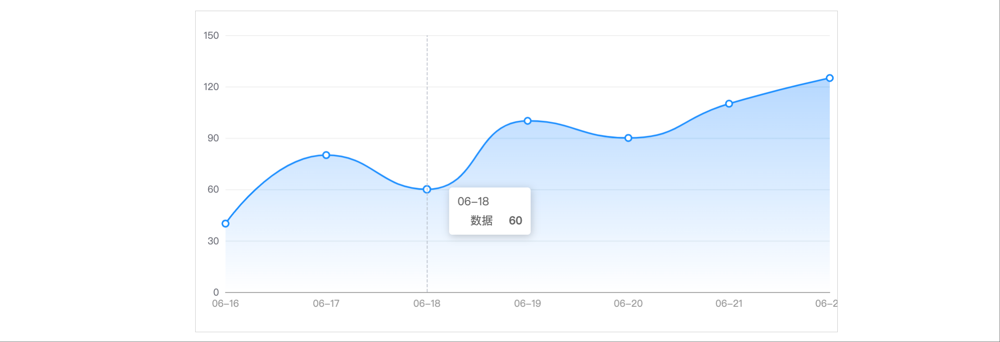
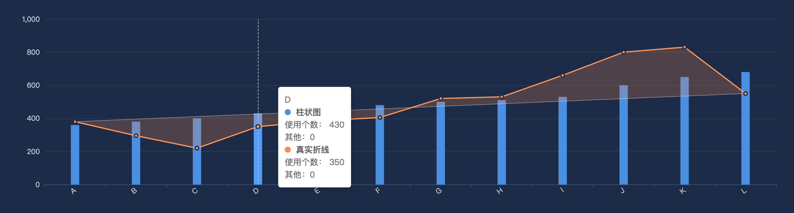
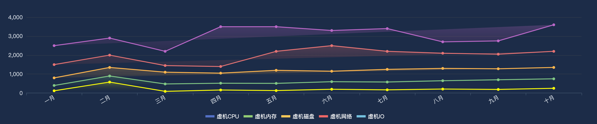

[[TOC]]

[TOC]


# 折线图(line)示例

## 1. 一个最基本的折线图及配置信息

<iframe
  :src="$withBase('/echarts-example/line/001-line-smooth.html')"
  width="100%" height="200"
  frameborder="1" scrolling="No" leftmargin="0" topmargin="0"
/>

```js
import * as echarts from 'echarts';

var chartDom = document.getElementById('main');
var myChart = echarts.init(chartDom);
var option = {
  // 更多的配置：https://echarts.apache.org/zh/option.html#title
  // 整个图表的总标题
  title: {
    text: '整个图表的标题',
    textStyle: { fontSize: 30 }
  },
  // 图表跟容器间的设置，可以调节图表距离容器的位置
  grid: { left: 50, right: 20 /*调节距离容器边距的位置*/ },
  // 每条数据的名字标题设置，不写则不显示
  legend: { bottom: '0%', left: 'center' },
  // 鼠标移到每个数据上出现悬浮窗口，显示数据信息   鼠标hover
  tooltip: {
    trigger: 'axis', // axis移到X轴坐标线就显示
    backgroundColor: '#000', // 背景色
    // 显示文本样式
    textStyle: {
      color: '#fff', // 文字颜色
      fontSize: 18, // 字体大小
    },
    formatter: function(params) {
      // trigger的值是axis，那么params的值就是数组，如果是trigger的值item，那么params就是单个的
      // 想要使用 tooltip 的 formatter 中的其他数据 需要series里面的data是对象
      let html = `${params[0].name} <br/>`
      params.forEach(e => {
        html += `
              <div>
                ${e.marker} <strong>${e.seriesName}</strong> <br />
                使用个数： ${e.value} <br />
                其他：${e.data && e.data.total || 0} <br />
              </div>
            `
      });
      return html
    }
  },
  // X轴坐标信息设置
  xAxis: {
    type: 'category',
    // X轴显示的坐标信息，可以使用'\n'符号进行换行
    data: [
      '09:00\n07-06', '10:00\n07-06', '11:00\n07-06',
      '12:00\n07-06', '12:00\n07-06', '12:00\n07-06',
      '12:00\n07-06'
    ],
    axisLabel: {
      color: 'red', // 坐标颜色 #d0d7df
      // rotate: 30, // 左边旋转角度
      // 文本内容显示设置
      formatter: function (value) {
        return value + ' 个'; // 显示带上单位
      }
    },
    axisLine: { // X轴坐标线样式设置
      lineStyle: {
        color: 'blue', // 线颜色 #2f3a4a
        type: 'dashed' // dashed虚线  solid实线
      }
    }
  },
  // Y轴坐标信息设置
  yAxis: {
    type: 'value',
    // y坐标样式设置
    axisLabel: {
      color: 'red', // 坐标颜色 #d0d7df
      rotate: 30, // 左边旋转角度
      // 文本内容显示设置
      formatter: function (value) {
        return value + ' 个'; // 显示带上单位
      }
    },
    splitLine: { // y轴网格线样式设置
      lineStyle: {
        color: 'red', // 网格线颜色 #2f3a4a
        type: 'dashed' // dashed虚线  solid实线
      }
    }
  },
  // 显示的数据系列，每种数据都要标记是哪种类型，每条数据的显示设置在这里添加
  series: [
    {
      name: '数据1', // 这条数据的名字
      data: [
        {value: 680, total: 3000, itemStyle: { color: '#000'}} // itemStyle：单独设置这个点的样式颜色
        , 632, 501, 434, 500, 700, 1320
      ],
      type: 'line',
      smooth: true
    },
    {
      name: '数据2', // 这条数据的名字
      data: [300, 350, 500, 900, 1000, 1024, 1160],
      type: 'line',
      smooth: true
    },
  ]
};
option && myChart.setOption(option);
function aa() { myChart.resize();}
// 监听页面宽度变化，然图表自动调整
window.addEventListener('resize', aa);
// 删除监听事件
window.removeEventListener('resize', aa)
```

[echarts网站在线示例](https://echarts.apache.org/examples/zh/editor.html?c=line-smooth&code=PYBwLglsB2AEC8sDeAoWsD0HaBezQWJqAhboLKJgdv6BY_wBZhggDOAXFgKYDGFAhgE5i0B07Idmya9gnAOYYAXhQyhIMXlQC2AGwDEkMKqZpM2QC6mgKjlAf2qALCIKBuA0DgFoAyMvVp31ke9GCYAPMM4Dkx8wR2PgA0rrDuXgDKYACeTsiwAGYwYJEQUkzOAMwADLAAvnr5oehYsOaA-7GAndqAFmqAL6kEgH3RJIAw_4D3yoCncoDAMYBBQeaAu7GA3Z61BICy8iR64pwQACbOSLA6id6wAKw5wbDT4lTOAEx5GABUvUO1gJ3x_WMkR9jFemWA89aAhuaADqaAdsYEgLAqgOrads0tQCwcoBMxUAmEqAwB8ZoAuTz0OnETGgcwSACNgNRgMpfDkAKQhRZMZa-FgI9ycHwFEr6WCAAnzrIBvz0ADEqPIwfQBQcoAvxUADc6AGoNAHa2gHSvQDHyi1oR9AIfygHsDdA06wUYAANyYnAcwGAqkgIHmYTA23hnF87A8EFoeLKhuNjIAGoAXeMACurWQD9foBGHWhYWRQgA1lNgABXREAYTVYl86hyYdN2EAMwGAezNAE5BYTK0MA4aaAGnNAOwWgHh9bWeVKxeKoaXSlhB_WwHzqRKViOwJM_QA5GfHC-hktBUulMrAAIwADk2ZR-gGV5QDkmoB4HTC90LyU4ynY1CVzkSfpYCmgAApBJx2MpaABKFxNqk6iDiPUEQA8CoB6M3NtBagGKEwASchut7Rz06L69ACN-LUAQZqAHPML0eJ5KueEDuMod6Plwz5voAqspGAQYSlNggDPBoAgZGAP7ygAUruEqrqhAICwAQSRiDOc6cLAgC0cgQgBuioAa3IfLAgAA6ahtBKhATC0IAM4mAEbpBAzLO7AXoAn9qAIYxiH4mAsAqKoCCwAABgAJEgT7bgA2jkAC6vDQFuTD5LAAA8yKcBgAB8cniSpfBTgAokIFCrkwCCmfuB5SWAaiwAA1IgFluW5BkzBA8qmeJ_noEpIgzpwHpKvpBm0DqMDiKZkW8Kx0wcQAcrp-QGRgiWcMlLlGeRZlheFWEsmQsBpfK7CqD6emGcZmCheFbl0WQaX8WA7CwAAZANsAiL17C8GAaINbAAA-M2wDk8WteVHWFvlQUhRVhZ-U2-Q7gA3OJnBMGAPqcHA0njkUlJlDa9qSs0egeAAgkaDCuW4MQgB2PgsLOTDiGIMQhAm2A2tCBD3RK7QdFhPgADrQD4gBk3oA78qANvxgAyEYARsaY2EY3OKp4k-DkACc9BhojOQAOwALQ5AAbHiPidjkFM5FTdOM8znaduznP00zlKFizez89ANOCzzYuUxLXNC2WnYyxzctS8L0qi-Lkvc2EGnq9eAAy7DIkwqhagexaqMGZbHTM1b2g2sDqDMOQzNTMyJOJZRFX17jZBsVKAGe65yANOmgA28YAS5GAGV6XvYKmgChilU0KPQeU6kaSC5LiusCrvVjVMHuBZucdp3nbAedNd5ZawEYPj7VS0KAGR6rIwaM4mFIWE7SobEDQB2Cy3XajqZinTaqL3TDRHE_cVZb1s-Mi-fVg6jvqHsiRZOwAAs7AVbE32-PxtAUEwdtUkfJ8zIAWmEOugtBqrMgB52g67dXegXdlAAmkPD0TOgMSvWNObaU-8foVyYCDQsZQYj2hHn_bub0jYmzNh9IsJZfC23ttYVeLs3YeyOlNP2sBch9mwMHcO0dY41hTInZO8DJwkVnBnJIWcoBwFzg1JqhcKolzOnAcBVdyS13romKEzdW6v07urWgIBx5gANhPeYVIYjWkAIr-gAeCwdHA8S48-5T3zLPdBNtT7Vg0SvWMTt16bx3nvL6P0L4mPPuwY-p8b53wfjMZ-kjpQdwpA8bAEMPiAG-fQA6EotEeIAWc8PiAF-E1C1hAAN0ReQAVyoRMAN4-gBo9XCW8T4dDAAU6oATfjOKAG_bQABUp6Ayuxd6RNCxF0LDpZQP0PidmrPk7J3wfjiQJrAapbkkDgOcAzbsAdJp9RQbkMMmxQJMGUPo_usA56lnLGGHIPh8j6TKFMmZeYmBkBgoAG6dmj5KMIATocCCZgbBVTYDMsh7E2OsTsmwt5ZC3nciZsBqZvM7DcnI4k9biVAb4XRED1Z32UKqMAFBnA6iauOdWtTpT1Mae8PYLS2m_E6QJQm4zNhZHWK8gOpNPnLM2KzPYLyuydgZppEF4Q7GAonpApstAwVokheETgMKpF6A0igfI-0gA)

## 2. 折线下半部分有渐变色

效果如下图：



代码：

```js
import * as echarts from 'echarts';

var chartDom = document.getElementById('main');
var myChart = echarts.init(chartDom);

const option = {
  grid: {
    left: 10,
    right: 10,
    top: 30,
    bottom: 30,
    containLabel: true
  },
  xAxis: {
    type: 'category',
    boundaryGap: false,
    data: ['06-16', '06-17', '06-18', '06-19', '06-20', '06-21', '06-22'],
    axisLine: { lineStyle: { color: '#999' } },
    axisTick: { show: false }
  },
  yAxis: {
    type: 'value',
    axisLine: { show: false },
    axisTick: { show: false },
    splitLine: { lineStyle: { color: '#eee' } }
  },
  // 鼠标移到每个数据上出现悬浮窗口，显示数据信息   鼠标hover
  tooltip: {
    trigger: 'axis'
  },
  series: [{
    name: '数据',
    type: 'line',
    smooth: true, // 平滑曲线
    data: [40, 80, 60, 100, 90, 110, 125],
    // 设置数据点显示圆点
    symbol: 'circle',
    symbolSize: 8,
    // 每个数据点的样式，需要设置symbol: 'circle',才会生效
    itemStyle: {
      color: '#fff',          // 数据点颜色
      borderColor: '#1890ff', // 数据点边框颜色
      borderWidth: 2          // 数据点边框宽度
    },
    // 点和点之间的连线样式
    lineStyle: {
      color: '#1890ff',       // 连线颜色
      width: 2                // 连线宽度
    },
    areaStyle: {
      // 渐变填充
      color: new echarts.graphic.LinearGradient(0, 0, 0, 1, [
        { offset: 0, color: 'rgba(24,144,255,0.5)' },
        { offset: 1, color: 'rgba(24,144,255,0)' }
      ])
    }
  }]
};
```

[在线例子效果 后期可能会失效](https://echarts.apache.org/examples/zh/editor.html?c=area-basic&code=PYBwLglsB2AEC8sDeAoWsDmAnCATAXMmurADYCmAZmIQIwAMANMejhgBY2wPMmxihCAZiYtYAI2BgBAW2Gi-AYxhgAhhGgAZVePKlCYLAFdyxAL69YADwCCViAGdCqPmACeIcoQDki1WHIMYCw3b0t0SSNoXFUQgHFVEEJKVVIHcnDYGLVCAG1vegA2AFpaQrDYApLaAHYKqtKADnqi0oBOFpKAJnpO4q7aPq6u7wBdTNV7B00NL2QyWYBldwpnWGVSYJ8AYja971gzQ4mpgBUIRQBrNYd2YAB3ZNT0w_NLNztHZzF3Tx8AN1SJjCYkmjhm0DmSFgtweTzS5GOoLOF2u81hj1gKQRSL4DhApAgYAhUIWkOWblW8w2W0q23IDIORzMb2IAHo2bBAAT5gHALQDfnoAGJUA89aAKjlAA6mgDtjQBQcoAvxUADc6AGoNAHa2gHSvQDHyoAYf8AfGaALk9JYBD-UA9gYkXl3f7kLDEATAUiQJJEVxsDAWnxghzeVnodI4chOWC5FwkaCqGRzbySkGuDxhwmQyMkBwyYBSdgGYwZWAc2CAZz1AIt2gCezQD9fmJsqo8gAWJiwRpVwpVhhVtr1njcLoAVnGYizgD7owB2_pLAJ0OusAYOoDsQONwyST6SqKCBYRQUeNeyfTxYQABec0amSzosHgBC3QDsFoB4fQ1gAB0wCBkX2J1ObT45wul4xALJGgCx5QD4roAJUzERPIMgpKlAyUG1aW8bZKEgio-BgrNB0AHIzACcgsQImCXALQAYVArAdloRomygxhM05QdAE74wAxCyQlCJDQi0AHU8DAVNYC6GDYJIiUBwowBe7UAMr0xAsLtOQHQAYlQHQBpOUAF9SD0APfjC1PMRY3IQCoWomkcLpPCCMoaD2NgOSqLY-5GOY1i2PM9AszkviBImLByFUFTvjYrNAAQ7QAN5UAaw1AFFFNTsMISF7lgchFHYWIwAcAA6bBEnYC5IpJWI4iwVRcAgchoDAAAKKtcqI2giNyaj0GhYBIPSLgq3UnwsAwcRVCyrpy0YWhy2a9s20YehIrbABKJlMj4UryvILgCvWfzKlq-rGua1r2rbTr6H6142NGXqBPMUYUDMABuIA)

<iframe
  :src="$withBase('/echarts-example/line/002-line-shadow.html')"
  width="100%" height="200"
  frameborder="1" scrolling="No" leftmargin="0" topmargin="0"
/>


## 3. 折线首尾相连跟折线部分区域有颜色

效果图片：



代码：

```js
const dom = document.getElementById('chart');
const myChart = echarts.init(dom);

const xData = ['A','B','C','D','E','F','G','H','I','J','K','L'];
const actual  = [380,295,220,350,385,405,520,530,660,800,830,550];
const bars    = [360,380,400,430,460,480,500,510,530,600,650,680];

const n = actual.length;
const start = actual[0];
const end = actual[n-1];

const option = {
  backgroundColor: '#1c2c48',
  grid: { left: '6%', right: '6%', bottom: '14%', containLabel: true },
  tooltip: {
    trigger: 'axis',
    axisPointer: { type: 'line' },
    formatter: function (params) {
      // 🚫 过滤掉首尾直线
      const showList = params.filter(p => p.seriesName !== '首尾直线');

      // X 轴名称
      let html = `${showList[0].name} <br/>`
      showList.forEach(e => {
        // 数据颜色点 数据名字 数据值
        // html += `${e.marker} ${e.seriesName}: ${e.value} <br />`
        html += `
              <div>
                ${e.marker} <strong>${e.seriesName}</strong> <br />
                使用个数： ${e.value} <br />
                其他：${e.data && e.data.total || 0} <br />
              </div>
            `
      });
      return html
    }
  },
  xAxis: {
    type: 'category',
    data: xData,
    axisLabel: { color: '#d0d7df', rotate: 35 },
    axisLine: { lineStyle: { color: '#3f536c' } }
  },
  yAxis: {
    type: 'value',
    axisLabel: { color: '#d0d7df' },
    splitLine: { lineStyle: { color: '#2f3a4a' } }
  },
  series: [
    {
      name: '柱状图',
      type: 'bar',
      data: bars,
      barWidth: 14,
      itemStyle: { color: '#4a90e2' },
      z: 0
    },
    {
      name: '真实折线',
      type: 'line',
      data: actual,
      smooth: false,
      symbol: 'circle',
      symbolSize: 6,
      itemStyle: {
        color: '#ff8a4c',
        borderColor: '#1c2c48',
        borderWidth: 2
      },
      lineStyle: { color: '#ff8a4c', width: 2 },
      z: 3
    },
    {
      name: '首尾直线',
      type: 'line',
      data: [start, null, null, null, null, null, null, null, null, null, null, end],
      connectNulls: true,
      symbol: 'none',
      lineStyle: {
        color: 'rgba(255,255,255,0.4)',
        width: 1,
        type: 'solid'
      },
      tooltip: { show: false }, // 🚫 禁止单独 hover 时显示
      z: 2
    }
  ]
};

myChart.setOption(option);

// --- 绘制阴影区域 ---
function updatePolygon() {
  const coords = actual.map((y, i) =>
                            myChart.convertToPixel({xAxisIndex:0,yAxisIndex:0}, [xData[i], y])
                           );
  const startCoord = myChart.convertToPixel({xAxisIndex:0,yAxisIndex:0}, [xData[0], start]);
  const endCoord   = myChart.convertToPixel({xAxisIndex:0,yAxisIndex:0}, [xData[n-1], end]);
  const polygonPoints = [...coords, endCoord, startCoord];

  myChart.setOption({
    graphic: {
      type: 'polygon',
      shape: { points: polygonPoints },
      style: { fill: 'rgba(255,138,76,0.22)', stroke: 'none' },
      z: 1
    }
  });
}

// 多次渲染需要移出监听事件，否则会报错：should not be called during main process
myChart.off('finished');
// 监听图表渲染完成事件
myChart.on('finished', updatePolygon);
// myChart.on('finished', () => {
//   updatePolygon(); // 这么写可以传参
// });
window.addEventListener('resize', () => {
  myChart.resize();
  updatePolygon();
});
```

<iframe
  :src="$withBase('/echarts-example/line/002-line3.html')"
  width="100%" height="250"
  frameborder="1" scrolling="No" leftmargin="0" topmargin="0"
/>

## 4. 多个折线首尾相连阴影

效果图片：



代码：浏览器中控制台查看下面iframe源代码

在线效果：

<iframe
  :src="$withBase('/echarts-example/line/002-line4.html')"
  width="100%" height="300"
  frameborder="1" scrolling="No" leftmargin="0" topmargin="0"
/>

