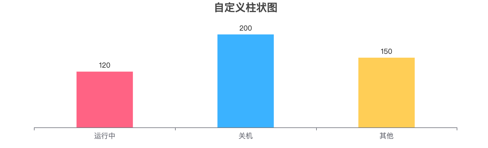
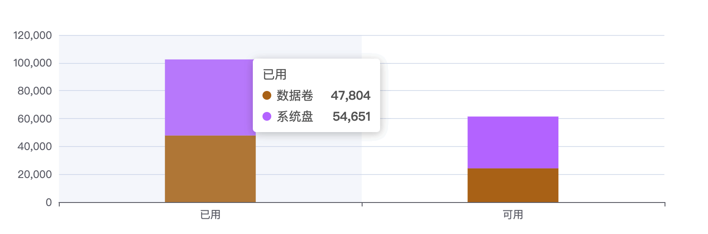
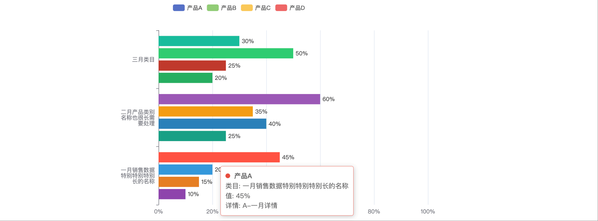

[[TOC]]

[TOC]


# 柱状图(bar)示例

## 1. 每个数据显示不同颜色，不显示Y轴信息

效果如下图：



代码：

```js
import * as echarts from 'echarts';

var chartDom = document.getElementById('main');
var myChart = echarts.init(chartDom);
var option;

option = {
  title: {
    text: '自定义柱状图',
    left: 'center'
  },
  xAxis: {
    type: 'category',
    data: ['运行中', '关机', '其他'] // 每个柱子的X轴名称
    // 设置X周文字显示旋转
    // axisLabel: {
    //   rotate: 30
    // }
  },
  // 设置不显示Y轴信息
  yAxis: { type: 'value', show: false },
  series: [
    {
      type: 'bar',
      data: [
        { value: 120, name: '运行中', itemStyle: { color: '#FF6384' } },
        { value: 200, name: '关机', itemStyle: { color: '#36A2EB' } },
        { value: 150, name: '其他', itemStyle: { color: '#FFCE56' } }
      ],
      // 在柱子顶部显示数值
      label: {
        show: true,
        position: 'top',
        formatter: '{c}', // 显示数据值
        // color: '#333', // 设置显示字体颜色
  			// fontSize: 12,  // 设置显示字体的大小
      },
      // 柱子宽度
      barWidth: '40%'
    }
  ]
};

option && myChart.setOption(option);
```

[在线例子效果 后期可能会失效](https://echarts.apache.org/examples/zh/editor.html?c=bar-simple&code=PYBwLglsB2AEC8sDeAoWtJgDYFMBcya6GOAHmAQOSBXgYFnagknKCP5oG1Ogf2qUA0R6uAZhbEoBjHNDA4ATpSIBfLulIBBUhADOBVMQwBPEPkFCAhuIDmwCds7dYAE2OGCAbUqAF-MAyEYFo5ToMDOioC5zb0pAN0VANblKAF0OWAB6aNhAeetAKjlGQAVtQBC3AA1AF3jAWBVAB89rWNhAPujAO38MwAsVQHDTQHVtQD4zQC5PQGnTQBt4wrjDFVUAGUMAIxwsDXbiCWAwY30AZgAGWBGZWXkYuLLAWDlGgE0swEP5QHsDIm1lNQ0dPSoAN0MsAFccb1UAC2AAdwJea9UcWDkiL4kIDh1LBHJpiGBdPpKH1DFJlug7BMnNZ0EhYFdbvoAIwAJhmUWghgAtlD3F4ohBxESAMoQ3CnITALDmKgAYgAYuyAGxTAAcABZKD8fvDiGiMXcCHj8bBCSSqP5vJScDS6fo0YzmRI2VMuYocQBRABCQpkIpRyHR10lsCxAFYZXKoaElVTadp6ZbNSzBBz2QBhA12rmm81adDWSIjQAU6qlAG4ZgAuExqAB1NADwK1iw_UGw3DsCerwIYAkd1F6BAwFUlKg0CoYFAVlzvHMROM4m1giQQhkQqKKcAdsbprS_LRFVKAXu1AGV61hhEgA6hAbGBHlR-TMAKTSdAycIoGQAbiAA)

<iframe
  :src="$withBase('/echarts-example/bar/001-bar1.html')"
  width="80%" height="200"
  frameborder="0" scrolling="No" leftmargin="0" topmargin="0"
/>


## 2. 堆叠柱状图

效果如下图：



代码：

```js
var option = {
  tooltip: {
    trigger: 'axis',
    axisPointer: {
      type: 'shadow'
    }
  },
  xAxis: {
    type: 'category',
    data: ['已用', '可用']
  },
  yAxis: {
    type: 'value'
  },
  color: ['#b8741a', '#c280ff'],
  series: [
    {
      name: '数据卷',
      type: 'bar',
      stack: 'Ad',
      emphasis: {
        focus: 'series'
      },
      data: [47804, 24230],
      // 柱子宽度
      barWidth: '30%'
    },
    {
      name: '系统盘',
      type: 'bar',
      stack: 'Ad',
      emphasis: {
        focus: 'series'
      },
      data: [54651, 37200]
    }
  ]
};
option && myChart.setOption(option);
```

[在线例子效果 后期可能会失效](https://echarts.apache.org/examples/zh/editor.html?c=bar-simple&code=PYBwLglsB2AEC8sDeAoWszGAG0iAXMmuhgE4QDmFApqYQOQCGAHhAM70A0x6L7ACsAjQwtQqhIkwATxDUGbABaMAJsADu9HrAC-xHd3TMAgqzbjtMuQwDGjURWClpXbSvuNCAbXqAn3UAUrlyw9ID3yoEAuvqGsNKm7BaSVvLBAG6M2ACu1FroBsQ2OE7e9ADEAEYAHADsACwAjIxBpTYATBUADABmnfTh0Wy0ENTmsF7aEpKw0IwAtsn0gA6mgHbGgO7KrpMYsvNljKTrk2xgjDYA1gzGKvuS1DMgymzxRBvoncA2GSP0A-TDOZN5G3cR28NSqHRqnFgLRqLQAzO0-tp0AB6ZGwQCP5oAFbUAvdqAMr0kbAdqQAOoQFRgRQMeEAUj-uWi6AmkmmcwYgG-fQD7foANtyuUi2DCJvPQh2OZ2CFyFsBud0YDxGTMmr3en2-Qw4BIBkyBnlGAFYagA2XV1SGwqotdoIhm6aKRHQAbiAA)

<iframe
  :src="$withBase('/echarts-example/bar/002-bar.html')"
  width="80%" height="200"
  frameborder="0" scrolling="No" leftmargin="0" topmargin="0"
/>


## 3. 柱状图横向显示，成组出现

这个图标特点：

1、横向显示，每个坐标点成组出现。    
2、坐标点名字超长，设置方法换行显示。    
3、鼠标移到柱子上会显示详情信息。    
4、每个柱子颜色不一样。

效果如下图：



代码：

```js
const chart = echarts.init(document.getElementById('chart'));

const categories = [
  '一月销售数据特别特别特别长的名称',
  '二月产品类别名称也很长需要处理',
  '三月类目'
];

// 工具函数：长标签自动换行
function wrapLabel(value, maxLength = 6) {
  if (!value) return '';
  const rowCount = Math.ceil(value.length / maxLength);
  let result = '';
  for (let i = 0; i < rowCount; i++) {
    const start = i * maxLength;
    const end = start + maxLength;
    result += value.substring(start, end);
    if (i < rowCount - 1) result += '\n';
  }
  return result;
}

// 在柱状图的末端/顶部 显示值
const labelOption = {
  show: true,
  position: 'right',  // 横向条形图，数字在右边显示（柱子末端）
  formatter: '{c}%',  // 显示值+百分号
  color: '#333',
  fontSize: 12
};

const option = {
  // 鼠标放到 柱子上出现弹窗显示的内容
  tooltip: {
    trigger: 'item',
    formatter: function (params) {
      return `
        <div>
          ${params.marker} <strong>${params.seriesName}</strong><br/>
          类目: ${params.name} <br/>
          值: ${params.value}%<br/>
          详情: ${params.data.info || '无'}
        </div>
      `;
    }
  },
  // 数据标识
  legend: {
    data: ['产品A', '产品B', '产品C', '产品D']
  },
  // 图表距离容器边缘位置
  grid: { left: '5%', right: '10%', bottom: '10%', containLabel: true },
  // X轴坐标
  xAxis: { 
    type: 'value',
    // 显示单位
    axisLabel: { formatter: '{value}%' },
    max: 100
  },
  yAxis: { 
    type: 'category', 
    data: categories,
    axisLabel: {
      formatter: function (value) {
        return wrapLabel(value, 6);
      }
    },
    triggerEvent: true
  },
  series: [
    {
      name: '产品A',
      type: 'bar',
      label: labelOption,
      data: [
        { value: 45, info: 'A-一月详情', itemStyle: { color: '#e74c3c' } },
        { value: 60, info: 'A-二月详情', itemStyle: { color: '#9b59b6' } },
        { value: 30, info: 'A-三月详情', itemStyle: { color: '#1abc9c' } }
      ]
    },
    {
      name: '产品B',
      type: 'bar',
      label: labelOption,
      data: [
        { value: 20, info: 'B-一月详情', itemStyle: { color: '#3498db' } },
        { value: 35, info: 'B-二月详情', itemStyle: { color: '#f39c12' } },
        { value: 50, info: 'B-三月详情', itemStyle: { color: '#2ecc71' } }
      ]
    },
    {
      name: '产品C',
      type: 'bar',
      label: labelOption,
      data: [
        { value: 15, info: 'C-一月详情', itemStyle: { color: '#e67e22' } },
        { value: 40, info: 'C-二月详情', itemStyle: { color: '#2980b9' } },
        { value: 25, info: 'C-三月详情', itemStyle: { color: '#c0392b' } }
      ]
    },
    {
      name: '产品D',
      type: 'bar',
      label: labelOption,
      data: [
        { value: 10, info: 'D-一月详情', itemStyle: { color: '#8e44ad' } },
        { value: 25, info: 'D-二月详情', itemStyle: { color: '#16a085' } },
        { value: 20, info: 'D-三月详情', itemStyle: { color: '#27ae60' } }
      ]
    }
  ]
};

chart.setOption(option);

// 鼠标移到Y轴坐标上悬停显示完整信息（tooltip）
chart.on('mouseover', function (params) {
  if (params.componentType === 'yAxis') {
    chart.dispatchAction({
      type: 'showTip',
      seriesIndex: 0,
      name: params.value,
      position: 'top',
      dataIndex: categories.indexOf(params.value)
    });
  }
});
chart.on('mouseout', function (params) {
  if (params.componentType === 'yAxis') {
    chart.dispatchAction({ type: 'hideTip' });
  }
});
```

[在线例子效果 后期可能会失效](https://echarts.apache.org/examples/zh/editor.html?c=bar-y-category&code=MYewdgzgLgBMCGUCmBzEAnAlkiMC8MA2gFAwwDkgAHKAQ5oACpgdKqAOpoHbGgnk6DUShx4P6pgIW6CwKoAfPcgBpSFQDFy1QOVygQZVA3j7shgfTlAEfrdAAOmBAyMAgmoDAXUePKBIOWrzAd27liAXQDcxYgHpHMQKe6gd0VAv4qNAWP_dA4BaAft6AV4GAFUqARsaAMhHEAGYArmDAUJjgMADu6PAADgAy8ABGSAA2ABQAbvBFcUgiMAC28AAeOUhgKFAAFvgwAGwAlDAA3uKYMTAlAIQVVUgD6EhQcehgFOT2ZKCQsOggaQDCIAmwBACyiB0AdMBImKXT1RdFre1dLg3Nz5196zBP2zhxIrHVY_GIYcZ_GCYboABlsUJgAB4YDt9ocwFB4ZgANTYgbDMgbcDQGDQeDoYHQgBU9SaLTanR-RK2MFaABNumSKTBsbSPgyOkyUQCgTyCPckBcIHF8tAsG0SlyoLV2d9xGRRuNocjUQcjjAALQwACMcxFsGxBHIAB0wGtxABfcTzRbLYXSoH2J1OFyACnVAI_mgDanQB_arxANTmgHuvRyANwzABcJMEAfGaALk9ADwKxE2JKKBWKAHksslUgQCaSOrsAFwwKDoapiMhZEAQTAFsAV8hYFAdKCiMjOGCAKitAIgqgENzQBG-sHADD_jEA6tq-wDPyoBO-OTgAh__2ABW1I4BIf_EYPQDSgyHQrcGwAdAFJuzBe8mU9jAH5ugDAlQDvyuJQEUMK2AMQAZh_hjIYIxABlTAAC8kArY0ACZiAdexiBAfMUhWItxF7QACfP8QA-U0ABiUYDXQAoOUAL8VAAbnQBOfUAdK9k14QBQxUATu1xCgEAQCBTAsgrYsyCrTAUBQJBDwoJskDqP9CR3PcDwreJEmbcYsnJeA6ggfF1UJF0lhWAADFTCSRNlMDKAA-bSdJgAASQY5MyRSLgadAAGs-IdJE5XAFADPMyyFIgKU-OwCAADkFKQB1EUcFy2gMxF8nQRwjJMkyLArDz5OssAgqcqKYri-LCRTJKLJS7yJTPTLYuMnTADPowBRg3yzzrLZRB4AuTAwDBGAAB92ooQAD03IJ0cqRRw9MM4yNKFfqYAdWtLxcFh_EAMejxCeXiwDZdiVIaqB4ArQhyDkABBbs9tkAAhI65D2c7ZAAEXIaxHWm3tg0ACwjAF3YwBuz1owALNXnQAMf0AWXlADt_cQUCwNahl-JAYigVsAFZz1qdtO1bY0YQRmB8hAfcQDqFG0e7TYtpavJCiKCsq2qSbHpcAANQAXeMABXV_HERp9saTAIHYmAVKgABPLJwIoCURJ7Fxk0AVWV_pUpoOZJ4oubExAJIoQZivPKmVPeCCYRhB7xF5tmOa5nn-cF8gEGQNB0F57sNsaisLdQDA_OmsgZYgOWyaGYzFf3PjJISJIkPGCVlIGtS3QybJPfKSoa16NV4omsgpp59tePQABRMpWhhytqyQPWyAgXycB2lSOMJNK6jNg6RcJPmBdbfJyXrsgs1JisO9zRDwFdwlNu2ohyohiUKwAFlh2oWrBVt9oNGhqu7QS6kAvmni5193woD8kAAdnH4Av2AchJo1gbBhgMfehhafWpAOeDSkJfp-QVf18Fy-t_48gPwATnyLDABPRT5OVThfK-cdBZflvlCe-j9TAvyhG_NevMN4Q2_p-Y0BRgB_xPmfZOhJ7o6XAYSSuZBq611Om3Ssptm6t37u3bMXtu5FDzM2RhMBB7lwgdfSCsCZ4PwoCdBe1AkEr1Qegr-zFt6_y_OPP-AAONk-RQHnxypfa-X4p5wNnsIp-YiqrLxQR_TeMif4fhiF-PBUE1GkPipoqBFZYYCPgfoxBRjX5CUkZ_OA5jPyQSQMAYAe9jR2OMsQwk9jvbxUoa2C6NDG5mxbugGhrCu7MPYUhTh3Dh68KcSaHRgjWx7FEeIkxaDfGYJ3kgHoe8kCQUgnYzhZBHEzAnq4vR5BSnP08cg7xpiMH-J3pBJRMJ8h_2aSPNp1QKyQSKW47pBoPHGIGZUsxb4LHABhNYyCqiCERJUtE8hMA4kUDkLdThST6GpM4ek34mTe5gByfbPJGjIHtJNJ0oR5BrplL6RIwZ0jNmfkUUgce494Bsimfkz58y75dL-b01Z791lDJBTvY0PR4AwkUbDGF7y-HfNbH8lZXjUVSL8Ri3-kE97wFqTCcJ8VIkp3EPdWCQA)

<iframe
  :src="$withBase('/echarts-example/bar/003-bar3.html')"
  width="100%" height="500"
  frameborder="0" scrolling="No" leftmargin="0" topmargin="0"
/>