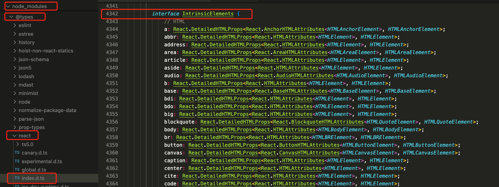

[[TOC]]

[TOC]


# 在react中使用TypeScript

TypeScript在react中两种类型文件：

1、`.tsx`文件：编写程序代码的地方，既包含类型信息又可执行代码

2、`.d.ts`文件：只包含类型信息的类型声明文件。不会生成 .js 文件，仅用于提供类型信息,在.d.ts文件中不允许出现可执行的代码，只用于提供类型

如果要为 JS 库提供类型信息，要使用 `.d.ts` 文件

## 1. props、state等变量属性声明接口

```js
interface Base {
  // 基本类型
  message: string;
  count: number;
  disabled: boolean;
  names: string[]; // 数组类型
  /** 用「联合类型」限制为下面两种「字符串字面量」类型 */
  status: 'waiting' | 'success';
  readonly id: number; // z只读属性，只能在创建的时候被赋值
  [propName: string]: any; // 允许有任意的属性
  // 一旦定义了任意属性，那么确定属性和可选属性的类型都必须是它的类型的子集：
  // 比如([propName: string]: any;)如果有age: 25, TS就会报错：Type 'number' is not assignable to type 'string'.
}

interface Props {
  /** 如果你不需要用到具体的属性 可以这样模糊规定是个对象 ❌ 不推荐 */
  obj: object; // 或 obj2: {}
  /** 拥有具体属性的对象类型 ✅ 推荐 */
  obj3: { id: string; title: string };
  /** 对象数组 😁 常用 */
  objArr: Array<{ id: string; title: string }>;
  /** key 可以为任意 string，值限制为 MyTypeHere 类型 */
  dict1: {
    [key: string]: Base;
  };
  // 基本上和 dict1 相同，用了 TS 内置的 Record 类型。
  dict2: Record<string, Base>;
  
  /** 任意的函数类型 ❌ 不推荐 不能规定参数以及返回值类型 */
  onSomething: Function; // 等同于 () => {}
  /** 没有参数的函数 不需要返回值 😁 常用 */
  onClick: () => void;
  /** 带函数的参数 😁 非常常用 */
  onChange: (id: number) => void;
  /** 另一种函数语法 参数是 React 的按钮事件 😁 非常常用 */
  onClickOne: (event: React.MouseEvent<HTMLButtonElement>) => void;
  // 需要有返回值的类型 import { ReactNode } from 'react';
  renderTmp: () => ReactNode;
  // 可选函数，注意：此时不能直接执行函数了(TS会报错)，需要先判断函数存在才能执行
  renderTmp?: () => ReactNode;
  
  children2: JSX.Element | JSX.Element[]; // ❌ 不推荐 没有考虑字符串 children
  children4: React.ReactChild[]; // 稍微好点 但是没考虑 null
  children: React.ReactNode; // ✅ 包含所有 children 情况
  functionChildren: (name: string) => React.ReactNode; // ✅ 返回 React 节点的函数
  style?: React.CSSProperties; // ✅ 推荐 在内联 style 时使用
  // ✅ 推荐原生 button 标签自带的所有 props 类型
  // 也可以在泛型的位置传入组件 提取组件的 Props 类型
  props: React.ComponentProps<'button'>;
  // ✅ 推荐 利用上一步的做法 再进一步的提取出原生的 onClick 函数类型
  // 此时函数的第一个参数会自动推断为 React 的点击事件类型
  onClickButton: React.ComponentProps<'button'>['onClick'];
}
```

普通函数类型声明：

```tsx
// 有返回值的
type UncertaintyType = Object | number[] 
function fucExp(): UncertaintyType {
    if (0 < 3) { return { "aa": 123 } } else { return [1, 2, 3] }
}
// 没有返回值
function neverFunc():never{
    throw new Error('Throw my error');
}
```


## 2. 类组件声明

```tsx
// props 和 state 都规定具体的
type IPrps = { message: string; };
type IState = { count: number;  };
class App extends React.Component<IPrps, IState> {}

// props 和 state 都是任何数据的
type P = any;
type S = any;
class App extends PureComponent<P, S> {}

// props是泛型，在调用的时候确认，state接口使用上面的
class App<P> extends PureComponent<P, state> {}
// 使用组件
type IProps = { name: string; age: number; };
<App<IProps> name="React" age={18} />;          // Success
<App<IProps> name="TypeScript" age="hello" />;  // Error
```

React 官网对于 Component 的类型定义如下:

```tsx
interface Component<P = {}, S = {}, SS = any> extends ComponentLifecycle<P, S, SS> { }
```


## 3. 函数组件声明

```tsx
import React from 'react';
interface IProps { name: string }
const App = (props: IProps) => {}
// 或
const App = ({name}: IProps) => {}
// 或 FC：函数组件
// type React.FC<P = {}> = React.FunctionComponent<P>
const App: React.FC<IProps> = (props) => {}
```

如果我们在定义组件时不知道props的类型，只有调用时才知道，那就还是用泛型来定义props的类型：

```tsx
// 定义组件
function App<P>(props: P) {}
// 使用组件
type IProps = { name: string; age: number; };
<App<IProps> name="React" age={18} />;          // Success
<App<IProps> name="TypeScript" age="hello" />;  // Error

```

## 4. hooks组件

### 4.1 useState

```tsx
 interface Item { target: string; }
// 1. 默认情况下，React会为根据设置的state的初始值来自动推导state以及更新函数的类型：
const [name, setName] = useState('jack');
// 2. 已知类型
const [count, setCount] = useState<number>(1);
const [item, setItem] = useState<Item | null>(null);
// 3. 初始值为null，需要显示地声明
const [count, setCount] = useState<number | null>(null);

```

### 4.2 useRef、useCallback、useMemo

```tsx
const nameInput = React.useRef<HTMLInputElement>(null);
const ref = React.useRef<HTMLElement | null>(null);
// useCallback
const memoizedCallback = useCallback(
  // 如果不给参数定义类型，会报错
  (a: number) => { add(a, b); },
  [b]
);
// useMemo
const calculatedValue = useMemo<number>(() => a ** 2, [a]);
```

### 4.3 useReducer

```tsx
type AuthState = {};
type Action =
  | { type: "FETCH_SUCCESS"; payload: any }
  | { type: "FETCH_ERROR"; payload: string };

export function reducer(state: AuthState, action: Action): AuthState {
  switch (action.type) {
    case "FETCH_SUCCESS":
      return {
        ...state,
        one: action.payload
      };
    case "FETCH_ERROR":
      ....
    default:
      return state;
  }
}
```

## 5. 事件处理

### 5.1 Event 事件类型

```tsx
interface Event {
  e0: Element; // 泛型类型
  e: React.SyntheticEvent; // 合成 事件
  e4: React.DragEvent; // 拖拽事件
  e41: React.FocusEvent; // 焦点事件
  e42: React.FormEvent; // 表单事件
  e2: React.ChangeEvent; // Change 事件
  e5: React.KeyboardEvent; // 键盘事件
  e6: React.MouseEvent; // 鼠标事件
  e7: React.TouchEvent; // 触摸事件
  e8: React.WheelEvent; // 滚轮事件
  e9: React.AnimationEvent; // 动画事件
  e10: React.TransitionEvent; // 过渡事件
  e3: React.ClipboardEvent; // 剪贴板事件
}
// 使用例子
const onChange = (e: React.FormEvent<HTMLInputElement>): void => {
  setText(e.currentTarget.value);
}; // render: <input type="text" value={text} onChange={onChange} />
const submit = (e: React.SyntheticEvent) => {
  e.preventDefault();
};
const handleChangeCurrent = (e: React.MouseEvent<HTMLDivElement>) => {
  e.stopPropagation();
}; // render: <div onClick={e => handleChangeCurrent(item, e)} />
```

### 5.2  事件处理函数类型

```tsx
type EventHandler<E extends React.SyntheticEvent<any>> = { bivarianceHack: (event: E) => void }['bivarianceHack'];

type ReactEventHandler<T = Element> = EventHandler<React.SyntheticEvent<T>>;
// 剪切板事件处理函数
type ClipboardEventHandler<T = Element> = EventHandler<React.ClipboardEvent<T>>;
// 复合事件处理函数
type CompositionEventHandler<T = Element> = EventHandler<React.CompositionEvent<T>>;
// 拖拽事件处理函数
type DragEventHandler<T = Element> = EventHandler<React.DragEvent<T>>;
// 焦点事件处理函数
type FocusEventHandler<T = Element> = EventHandler<React.FocusEvent<T>>;
// 表单事件处理函数
type FormEventHandler<T = Element> = EventHandler<React.FormEvent<T>>;
// Change事件处理函数
type ChangeEventHandler<T = Element> = EventHandler<React.ChangeEvent<T>>;
// 键盘事件处理函数
type KeyboardEventHandler<T = Element> = EventHandler<React.KeyboardEvent<T>>;
// 鼠标事件处理函数
type MouseEventHandler<T = Element> = EventHandler<React.MouseEvent<T>>;
// 触屏事件处理函数
type TouchEventHandler<T = Element> = EventHandler<React.TouchEvent<T>>;
// 指针事件处理函数
type PointerEventHandler<T = Element> = EventHandler<React.PointerEvent<T>>;
// 界面事件处理函数
type UIEventHandler<T = Element> = EventHandler<React.UIEvent<T>>;
// 滚轮事件处理函数
type WheelEventHandler<T = Element> = EventHandler<React.WheelEvent<T>>;
// 动画事件处理函数
type AnimationEventHandler<T = Element> = EventHandler<React.AnimationEvent<T>>;
// 过渡事件处理函数
type TransitionEventHandler<T = Element> = EventHandler<React.TransitionEvent<T>>;

// 使用例子
const onChange: React.ChangeEventHandler<HTMLInputElement> = (e) => {
  setText(e.currentTarget.value);
}; // <input type="text" value={text} onChange={onChange} />
```


## 6. HTML标签类型

时候会使用到标签类型呢，Event事件类型和事件处理函数类型中都使用到了标签的类型。上面的很多的类型都需要传入一个ELement类型的泛型参数，这个泛型参数就是对应的标签类型值，可以根据标签来选择对应的标签类型。这些类型都继承自HTMLElement类型，如果使用时对类型类型要求不高，可以直接写HTMLELement。

### 6.1 DOM节点相关类型

```tsx
interface nodeDom {
  e1: Node; // 所有节点类型的基类，提供了基本的属性和方法
  e2: ChildNode; // 用于表示DOM节点之间的关系
  e3: Element; // 表示元素节点，如 <div>、<span> 等, 继承自Node接口。
  e4: HTMLElement; // 表示HTML文档中的一个元素节点，继承自Element接口。
  e5: Document; // 表示整个文档（即HTML或XML文件）的根节点，继承自Node接口
  e6: Text; // 类型表示文本节点，如文本内容
  e7: Comment; // 表示文档中的注释节点，继承自Node接口。
  e8: DocumentFragment; // 表示一个轻量级的文档对象，可以包含和操作节点，但不会像完整的文档那样影响页面的布局。
}

// 使用例子：
// 创建一个新的HTML元素
const newElement: HTMLElement = document.createElement('div');
// 查找文档中的元素并操作它们
const allParagraphs: NodeListOf<HTMLParagraphElement> = document.getElementsByTagName('p');
allParagraphs.forEach((paragraph: HTMLParagraphElement) => {
    paragraph.style.color = 'blue'; // 设置段落文本的颜色为蓝色
});
// 创建一个文本节点并添加到元素中
const textNode: Text = document.createTextNode('This is a text node.');
// 创建一个注释节点并添加到元素中
const commentNode: Comment = document.createComment('This is a comment node.');
```

在TypeScript中，`ChildNode` 类型用于表示一个节点的子节点。每个节点都有一个 `childNodes` 属性，该属性返回一个 `NodeList`，包含节点所有的子节点。`NodeList` 是一个类数组对象，保存了一组有序的节点，这些节点会随着DOM结构的变化而自动更新‌

### 6.2 常见标签类型

在react项目中的`@types/react`包里面能找到所有HTML标签相关的类型声明文件

文件路径：node_modules/@types/react/index.d.ts，所有声明都定义在`IntrinsicElements`接口中



常见的标签及类型如下：

```tsx
// 实际代码测试过
interface tag {
  a: HTMLAnchorElement;
  body: HTMLBodyElement;
  br: HTMLBRElement;
  button: HTMLButtonElement;
  div: HTMLDivElement;
  h1: HTMLHeadingElement;
  h2: HTMLHeadingElement;
  h3: HTMLHeadingElement;
  html: HTMLHtmlElement;
  img: HTMLImageElement;
  input: HTMLInputElement;
  ul: HTMLUListElement;
  li: HTMLLIElement;
  link: HTMLLinkElement;
  p: HTMLParagraphElement;
  span: HTMLSpanElement;
  style: HTMLStyleElement;
  table: HTMLTableElement;
  tbody: HTMLTableSectionElement;
  video: HTMLVideoElement;
  audio: HTMLAudioElement;
  meta: HTMLMetaElement;
  form: HTMLFormElement;
}

// 例子
const onClick = (e: React.MouseEvent<HTMLElement>) => {
  e.stopPropagation();
}
// 操作dom
document.querySelectorAll('.paper').forEach(item => {
  const firstPageHasAddEle = (item.firstChild as HTMLDivElement).classList.contains('add-ele');
  if (firstPageHasAddEle) {
    item.removeChild(item.firstChild as ChildNode);
  }
})
```

### 6.3 标签属性类型

常见的元素属性类型如下：

```tsx
import React from 'react';
interface attr {
  attr: React.HTMLAttributes<HTMLButtonElement>; // HTML属性类型 “HTMLAttributes<T>”需要 1 个类型参数
  button: React.ButtonHTMLAttributes<HTMLButtonElement>; // 按钮属性类型
  form: React.FormHTMLAttributes<HTMLFormElement>; // 表单属性类型
  img: React.ImgHTMLAttributes<HTMLImageElement>; // 图片属性类型
  input: React.InputHTMLAttributes<HTMLInputElement>; // 输入框属性类型
  link: React.LinkHTMLAttributes<HTMLLinkElement>; // 链接属性类型
  meta: React.MetaHTMLAttributes<HTMLMetaElement>; // meta属性类型
  select: React.SelectHTMLAttributes<HTMLSelectElement>; // 选择框属性类型
  table: React.TableHTMLAttributes<HTMLTableElement>; // 表格属性类型
  textarea: React.TextareaHTMLAttributes<HTMLInputElement>; // 输入区属性类型
  video: React.VideoHTMLAttributes<HTMLVideoElement>; // 视频属性类型
  svg: React.SVGAttributes<SVGSVGElement>; // SVG属性类型
  webView: React.WebViewHTMLAttributes<HTMLWebViewElement>; // WebView属性类型
}

// 使用例子
export enum ButtonType { Primary = 'primary', Default = 'default', Link = 'link' }
interface BaseButtonProps {
  disabled?: boolean;
  btnType?: ButtonType;
  children: React.ReactNode;
  href?: string;
}
// 使用 交叉类型（&） 获得我们自己定义的属性和原生 a标签、button 的属性
type ButtonProps = BaseButtonProps & React.AnchorHTMLAttributes<HTMLAnchorElement> & React.ButtonHTMLAttributes<HTMLButtonElement>;
const Button: React.FC<ButtonProps> = (props) => {
  const { disabled, className, btnType, children, href, ...restProps } = props;
  if (btnType === ButtonType.Link && href) {
    return (<a href={href} {...restProps} > {children} </a>);
  } else {
    return <button disabled={disabled} {...restProps}>{children}</button>;
  }
};
```

Input框的属性类型定义:

```tsx
import React from 'react';
interface InputHTMLAttributes<T> extends React.HTMLAttributes<T> {
  accept?: string | undefined;
  alt?: string | undefined;
  autoComplete?: string | undefined;
  autoFocus?: boolean | undefined;
  capture?: boolean | string | undefined;
  checked?: boolean | undefined;
  crossOrigin?: string | undefined;
  disabled?: boolean | undefined;
  enterKeyHint?: 'enter' | 'done' | 'go' | 'next' | 'previous' | 'search' | 'send' | undefined;
  form?: string | undefined;
  formAction?: string | undefined;
  formEncType?: string | undefined;
  formMethod?: string | undefined;
  formNoValidate?: boolean | undefined;
  formTarget?: string | undefined;
  height?: number | string | undefined;
  list?: string | undefined;
  max?: number | string | undefined;
  maxLength?: number | undefined;
  min?: number | string | undefined;
  minLength?: number | undefined;
  multiple?: boolean | undefined;
  name?: string | undefined;
  pattern?: string | undefined;
  placeholder?: string | undefined;
  readOnly?: boolean | undefined;
  required?: boolean | undefined;
  size?: number | undefined;
  src?: string | undefined;
  step?: number | string | undefined;
  type?: string | undefined;
  value?: string | ReadonlyArray<string> | number | undefined;
  width?: number | string | undefined;

  onChange?: ChangeEventHandler<T> | undefined;
}
```


## 参考资料

- [React TypeScript Cheatsheet](https://react-typescript-cheatsheet.netlify.app/) 是一个社区维护的，用于在 React 中使用 TypeScript 的速查表，涵盖了许多有用的边界情况，并提供了比本文更广泛全面的内容。

- [如何优雅地在 React 中使用TypeScript，看这一篇就够了！](https://juejin.cn/post/7021674818621669389)

- [React 记录 - 使用 TS 编写 React 项目(1)](https://juejin.cn/post/6844903999351554056)

- [TS在React的优雅写法](https://www.cnblogs.com/cczlovexw/p/15736174.html)

  