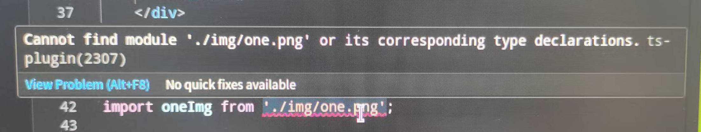

[[TOC]]

[TOC]

# typescript常见问题解决

## 1. 关闭TS校验报错

### 1.1 在 .vue 或 .ts 文件内局部关闭 TS 校验

**文件顶部加入 magic comment：**

```js
// @ts-nocheck
```

该文件内的所有 TypeScript 校验**全部关闭**。

在vue文件中：

```vue
<template></template>
<script setup lang="ts" name="Component">
// @ts-nocheck
</script>
```

### 1.2 关闭单一语句的类型校验

```tsx
// @ts-ignore
const num: number = "abc"
```

### 1.3 彻底关闭 TypeScript 编译校验（官方方式）

在 `tsconfig.json` 中关闭类型检查：

```json
{
  "compilerOptions": {
    "checkJs": false, // 不校验 js 文件
    "allowJs": true,
    "skipLibCheck": true, // 不校验第三方库类型
    "strict": false, // 关闭所有严格检查
    "noImplicitAny": false, // 允许 any
  }
}
```

### 1.4 关闭 ESLint 的 TS 规则

如果报错来自 ESLint（而不是 TS 编译器），在 `.eslintrc.cjs` 中关闭：

```json
rules: {
  "@typescript-eslint/no-explicit-any": "off",
  "@typescript-eslint/ban-ts-comment": "off",
  "@typescript-eslint/ban-types": "off"
}
```

### 1.5 关闭 Vue SFC (*.vue) 的 TS 校验（Volar）

在 `tsconfig.json` 或 `jsconfig.json` 移除 `"vueCompilerOptions"` 中的严格类型：

```json
{
  "vueCompilerOptions": {
    "strictTemplates": false
  }
}
```

或者直接关闭整个 Volar 的类型支持（极端情况，不推荐）：

```json
{
  "vueCompilerOptions": {
    "disableTemplateSupport": true
  }
}
```

### 1.6 Vite 项目彻底禁用 TS 类型检查

如果你的项目使用 Vite（Vue3 默认用 Vite），直接在编译时关掉类型检查：

### **在 vite.config.ts 中增加：**

```tsx
export default defineConfig({
  esbuild: {
    tsconfigRaw: {
      compilerOptions: {
        noImplicitAny: false
      }
    }
  }
});
```

### 或者根本不让 Vite 校验 TypeScript：

安装了 `vite-plugin-checker` 的话，直接删除或禁用：

```js
checker({
  typescript: false,   // 关闭 TS 校验
  vueTsc: false
})
```


## 2. 规则校验类报错

### 2.1 Cannot find module './img/one.png' or its corresponding type declarations.



在vue3项目中， 使用import引入图片资源的时候，报如图所示的错误，经过确认，引用路径没有问题。

#### 2.1.1 报错原因

在 TypeScript 项目中通过 `import` 导入图片时出现 `Cannot find module` 错误，通常是由于 TypeScript 无法识别非代码资源（如 `.png`、`.jpg` 等文件）导致的。

#### 2.1.2 解决方案

##### 2.1.2.1 **添加类型声明文件**(实测有效)

在项目的`src`目录中创建或修改`images.d.ts`，声明图片模块类型：

```typescript
// 示例：src/images.d.ts
declare module '*.png' {
  const value: string;
  export default value;
}
declare module '*.jpg' {
  const value: string;
  export default value;
}
// 可扩展其他图片格式（如 .svg、.jpeg、.gif、.bmp、.tif/.tiff、.webp 等）
```

##### 2.1.2.2 **确保声明文件被 TypeScript 识别**

检查 `tsconfig.json`‌：确保声明文件路径包含在 `include` 或 `typeRoots` 配置中：

```json
{
  "compilerOptions": {
    "typeRoots": ["./node_modules/@types", "./src/types"]
  },
  "include": ["src/**/*"]
}
```

##### 2.1.2.3 **验证导入路径**

- 确认图片路径正确且文件存在35。

- 若使用别名（如 `@/assets`），需在 `tsconfig.json` 中配置 `paths`：

  ```json
  {
    "compilerOptions": {
      "baseUrl": ".",
      "paths": {
        "@/*": ["src/*"]
      }
    }
  }
  ```

##### 2.1.2.4  **替代方案**(非推荐)

- 使用 `require`‌：动态导入图片（需配置 Webpack 或 Vite 支持）：

  ```typescript
  const imgPath = require('./assets/image.png') as string;
  ```

- **直接使用 URL**‌：将图片放在 `public` 目录并通过绝对路径引用。


## 3. 在vue中使用TS报错

### 3.1 JSON.parse()解析路由中的query参数类型报错

1、报错原因

在 **Vue3 + Vue Router 4 + TypeScript** 中，`router.currentRoute.value.query` 的类型是 `LocationQuery`，而不是字符串：

```tsx
type LocationQuery = Record<string, string | string[]>;
```

而 `JSON.parse()` 只接受 `string` 类型，所以会报错：

```pgsql
Argument of type 'LocationQuery' is not assignable to parameter of type 'string'
```

2、解决方法

2.1 先取具体字段，并显式转成 string：假设你的路由是 `/page?data={"a":1}`，并要解析 `data` 字段：

```js
import { useRoute } from 'vue-router';
const route = useRoute();
const rawData = route.query.data;  // 类型: string | string[] | undefined
const parsed = rawData ? JSON.parse(String(rawData)) : null;
console.log(parsed);
```

2.2 给 JSON 数据提前 encodeURIComponent，避免特殊字符问题

```js
// 传递参数
router.push({ path: '/page', query: { data: encodeURIComponent(JSON.stringify(obj)) } });

// 获取参数
const rawData = route.query.data;
const parsed = rawData 
    ? JSON.parse(decodeURIComponent(String(rawData))) 
    : null;
```

2.3 给返回值声明类型（推荐）：TypeScript 可以自动推断解析后的数据类型：

```js
interface MyData {
  a: number;
  b?: string;
}

const rawData = route.query.data;
const parsed: MyData | null = rawData 
    ? JSON.parse(String(rawData)) 
    : null;
```

