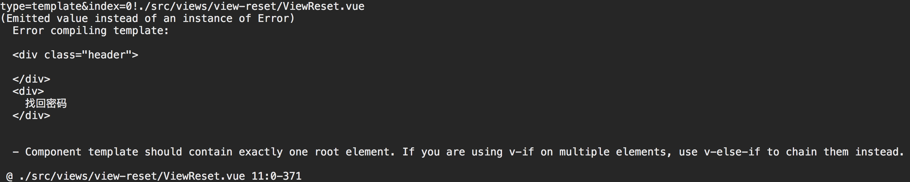
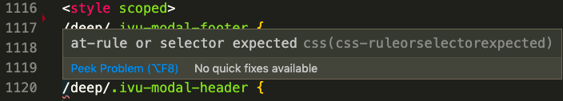
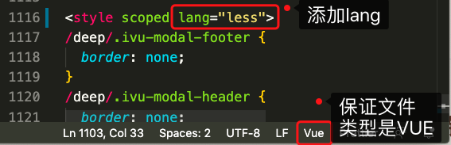

[[TOC]]

[TOC]


# VUE遇到的问题

## 1. VUE组件模板中只能有一个根元素：Component template should contain exactly one root element 



报错的信息：  

```bash
(Emitted value instead of an instance of Error) 
  Error compiling template:
  <div class="header">
  </div>
  <div>
    找回密码
  </div>
  
  - Component template should contain exactly one root element. If you are using v-if on multiple elements, use v-else-if to chain them instead.

 @ ./src/views/view-reset/ViewReset.vue 11:0-371
 @ ./src/router/index.js
```

错误的原因是一个VUE组件的模板中只能有一个根元素，不能出现多个元素，正确的写法：   

```vue
<template>
  <div>
    <div class="header">
      我是头部导航栏
    </div>
  </div>
</template>
```


## 2. Uncaught (in promise) NavigationDuplicated: Avoided redundant navigation

浏览器终端报错如下：

```bash
vue-router.esm.js?8c4f:1958 Uncaught (in promise) NavigationDuplicated: Avoided redundant navigation to current location: "/handlingPunishment".
    at createRouterError (webpack-internal:///./node_modules/vue-router/dist/vue-router.esm.js:1959:15)
    at createNavigationDuplicatedError (webpack-internal:///./node_modules/vue-router/dist/vue-router.esm.js:1929:15)
    at HTML5History.confirmTransition (webpack-internal:///./node_modules/vue-router/dist/vue-router.esm.js:2223:18)
    at HTML5History.transitionTo (webpack-internal:///./node_modules/vue-router/dist/vue-router.esm.js:2153:8)
    at VueComponent.changeItem (webpack-internal:///./node_modules/cache-loader/dist/cjs.js?!./node_modules/babel-loader/lib/index.js!./node_modules/cache-loader/dist/cjs.js?!./node_modules/vue-loader/lib/index.js?!./node_modules/iview-loader/index.js?!./src/layout/ci-sidebar/index.vue?vue&type=script&lang=js&:92:20)
```


在网上查找资料，发现:https://www.cnblogs.com/rxfn/p/13086060.html

根据链接里面的描述，在Router文件或main.js文件里面添加如下：

```js
import Router from 'vue-router'
const routerPush = Router.prototype.push
Router.prototype.push = function push(location) {
  return routerPush.call(this, location).catch(error=> error)
}
```

然后这个问题就解决了。

## 3. Computed property "a" was assigned to but it has no setter

计算属性 CurrentStep 被赋值了，但此它并未定义 set方法 ，故出现上面错误提示。

```js
computed: {
  showModel: {
    get: function () {
      return this.initShowModel;
    },
    set: function (v) {
      // 调用父组件方法关闭弹窗
      this.closeModel();
    }
  }
}
```

## 4. vue文件的css声明中加入了scoped导致样式无效

解决办法是使用`/deep/`

```vue
<style scoped>
.example { color: red; }
</style>
<template>
  <div class="example">hi</div>
</template>
```

转换结果：

````vue
<style>
.example[data-v-f3f3eg9] { color: red; }
</style>
<template>
  <div class="example" data-v-f3f3eg9>hi</div>
</template>
````

在`template`中如果引用了第三方组件，通过组件属性设置了样式类名，则会导致没有效果，这个需要注意。

https://www.jb51.net/article/129228.htm

https://vue-loader-v14.vuejs.org/zh-cn/features/css-modules.html

## 5. vue文件中引入外部CSS样式文件

第一种是：

```vue
<script>
export default {};
</script>
<style scoped>
@import url('./index');
</style>
```

import并不是引入代码到`<style></style>`里面，而是发起新的请求获得样式资源，并且没有加scoped

第二种：

```vue
<script>
export default {};
</script>
<style lang="less" scoped src="./index.less">
</style>
```

这样就可以在引用的样式文件添加`scoped`

## 6. at-rule or selector expectedcss报错

https://blog.csdn.net/weixin_42566993/article/details/107595935

在vue文件中的css部分写了`/deep/.ivu`, 发现编辑器提示报错：`at-rule or selector expectedcss(css-ruleorselectorexpected)`



经过查找提示CSS部分需要加上` lang="less"`属性



## 7. 找不到引用的组件：did you register the component correctly? For recursive components

当在一个组件中引用另一个组件使用的时候发现浏览器终端报错：

```
Invalid component name: "0". Component names should conform to valid custom element name in html5 specification.
Invalid value for option "components": expected an Object, but got Array.
Unknown custom element: <QueryConditions> - did you register the component correctly? For recursive components, make sure to provide the "name" option.
```

经过排查，发现我写的components用的是数组：

```js
import QueryConditions from './query-coditions';
export default {
  components: [
    QueryConditions
  ],
}
```

正确的是components属性是对象，修改成如下：

```js
import QueryConditions from './query-coditions';
export default {
  components: {
    QueryConditions
  },
}
```

注意：

1、引用组件后，必须要在`components`属性里面添加。

2、`components`不能写错，并且`components`属性的值是对象。