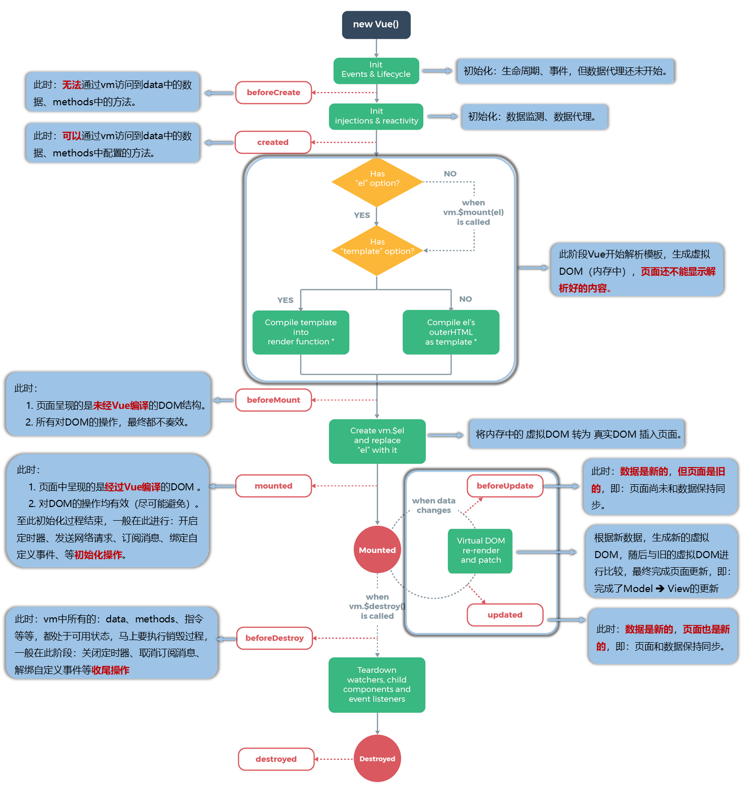

[[TOC]]

[TOC]


# vue 生命周期



## 1. beforeCreate（创建前）

会在实例初始化完成、props 解析之后、data() 之前、event/watcher 事件配置之前和 computed 等选项处理之前立即调用。此时不能获得DOM节点。

在实例初始化之后，数据观测和事件配置之前被调用，此时组件的选项对象还未创建，el 和 data 并未初始化，因此无法访问methods， data， computed等方法和数据。

## 2. created（创建后）

在这个阶段vue实例已经创建，以下内容已经设置完成：响应式数据、计算属性、方法和侦听器。然而，此时挂载阶段还未开始，因此 $el 属性仍不可用。仍然不能获取DOM元素。

实例已经创建完成之后被调用，在这一步，实例已完成以下配置：数据观测、属性和方法的运算，watch/event事件回调，完成了data 数据的初始化，el没有。 然而，挂在阶段还没有开始, $el属性目前不可见，这是一个常用的生命周期，因为你可以调用methods中的方法，改变data中的数据，并且修改可以通过vue的响应式绑定体现在页面上，，获取computed中的计算属性等等，通常我们可以在这里对实例进行预处理，也有一些童鞋喜欢在这里发ajax请求，值得注意的是，这个周期中是没有什么方法来对实例化过程进行拦截的，因此假如有某些数据必须获取才允许进入页面的话，并不适合在这个方法发请求，建议在组件路由钩子beforeRouteEnter中完成

## 3. beforeMount（挂载前）

在挂载开始之前被调用：相关的 `render` 函数首次被调用。

在组件内容被渲染到页面之前自动执行的函数，组件已经完成了其响应式状态的设置，但还没有创建 DOM 节点。

挂在开始之前被调用，相关的render函数首次被调用（虚拟DOM），实例已完成以下的配置： 编译模板，把data里面的数据和模板生成html，完成了el和data 初始化，注意此时还没有挂在html到页面上。

**该钩子在服务器端渲染期间不被调用。**

## 4. mounted（挂载后）

实例被挂载后调用，这时 `el` 被新创建的 `vm.$el` 替换了。如果根实例挂载到了一个文档内的元素上，当 `mounted` 被调用时 `vm.$el` 也在文档内。

在组件被渲染之后自动执行的函数。一般我们的异步请求都写在这里。在这个阶段，数据和DOM都已被渲染出来。

挂载完成，也就是模板中的HTML渲染到HTML页面中，此时一般可以做一些ajax操作，mounted只会执行一次。

注意： `mounted` **不会**保证所有的子组件也都一起被挂载。如果你希望等到整个视图都渲染完毕，可以在 `mounted` 内部使用 [vm.$nextTick](https://cn.vuejs.org/v2/api/#vm-nextTick)：

```
mounted: function () {
  this.$nextTick(function () {
    // Code that will run only after the
    // entire view has been rendered
  })
}
```

**该钩子在服务器端渲染期间不被调用。**

## 5. beforeUpdate（更新前）

在数据更新之前被调用，发生在虚拟DOM重新渲染和打补丁之前。此时变化后的数据还未渲染到页面之上。这里适合在更新之前访问现有的 DOM，比如手动移除已添加的事件监听器。可以在该钩子中进一步地更改状态，不会触发附加地重渲染过程。

**该钩子在服务器端渲染期间不被调用，因为只有初次渲染会在服务端进行。**

## 6. updated（更新后）

数据变化之后自动执行的函数，此时变化后的数据已经渲染到页面之上。

由于数据更改导致地虚拟DOM重新渲染和打补丁时调用，调用时，组件DOM已经更新，所以可以执行依赖于DOM的操作，然后在大多是情况下，应该避免在此期间更改状态，因为这可能会导致更新无限循环。如果要相应状态改变，通常最好使用[计算属性](https://cn.vuejs.org/v2/api/#computed)或 [watcher](https://cn.vuejs.org/v2/api/#watch) 取而代之。

注意 `updated` **不会**保证所有的子组件也都一起被重绘。如果你希望等到整个视图都重绘完毕，可以在 `updated` 里使用 [vm.$nextTick](https://cn.vuejs.org/v2/api/#vm-nextTick)：

```
updated: function () {
  this.$nextTick(function () {
    // Code that will run only after the
    // entire view has been re-rendered
  })
}
```

**该钩子在服务器端渲染期间不被调用。**


## 7. activated（激活 keep-alive组件的）

被 keep-alive 缓存的组件激活时调用。

注意：`activated` 在组件挂载时也会调用，mounted()总是比activated()先加载！

**该钩子在服务器端渲染期间不被调用。**

`<KeepAlive>` 包裹动态组件时，会缓存不活跃的组件实例，而不是销毁它们。

任何时候都只能有一个活跃组件实例作为 `<KeepAlive>` 的直接子节点。

当一个组件在 `<KeepAlive>` 中被切换时，它的 `activated` 和 `deactivated` 生命周期钩子将被调用，用来替代 `mounted` 和 `unmounted`。这适用于 `<KeepAlive>` 的直接子节点及其所有子孙节点。

## 8. deactivated（停用 keep-alive组件的）

被 keep-alive 缓存的组件停用时调用。 `deactivated` 在组件卸载时也会调用。

**该钩子在服务器端渲染期间不被调用。**

## 9. beforeDestroy（销毁前）

在实例销毁之前调用，在这一步，实例仍然完全可用。

1、这一步还可以用this来获取实例，

2、一般在这一步做一些重置的操作，比如清除掉组件中的定时器 和 监听的dom事件

**该钩子在服务器端渲染期间不被调用。**

## 10. destroyed（销毁后）

在实例销毁之后调用，调用后，对应 Vue 实例的所有指令都被解绑，所以的事件监听器会被移出，所有的子实例也会被销毁。

**该钩子在服务器端渲染期间不被调用。**

## 11. errorCaptured（错误捕获）

当捕获一个来自子孙组件的错误时被调用。此钩子会收到三个参数：错误对象、发生错误的组件实例以及一个包含错误来源信息的字符串。此钩子可以返回 `false` 以阻止该错误继续向上传播。

你可以在此钩子中修改组件的状态。因此在捕获错误时，在模板或渲染函数中有一个条件判断来绕过其它内容就很重要；不然该组件可能会进入一个无限的渲染循环。

**错误传播规则**

-   默认情况下，如果全局的 `config.errorHandler` 被定义，所有的错误仍会发送它，因此这些错误仍然会向单一的分析服务的地方进行汇报。
-   如果一个组件的继承或父级从属链路中存在多个 `errorCaptured` 钩子，则它们将会被相同的错误逐个唤起。
-   如果此 `errorCaptured` 钩子自身抛出了一个错误，则这个新错误和原本被捕获的错误都会发送给全局的 `config.errorHandler`。
-   一个 `errorCaptured` 钩子能够返回 `false` 以阻止错误继续向上传播。本质上是说“这个错误已经被搞定了且应该被忽略”。它会阻止其它任何会被这个错误唤起的 `errorCaptured` 钩子和全局的 `config.errorHandler`。

## 12. 官网上的生命周期图


[生命周期图](https://cn.vuejs.org/v2/guide/instance.html#%E7%94%9F%E5%91%BD%E5%91%A8%E6%9C%9F%E5%9B%BE%E7%A4%BA)


## 13. 父子组件生命周期执行顺序

在Vue中，父子组件的生命周期执行顺序遵循以下规则：

创建阶段：

1. 父组件 beforeCreate
2. 父组件 created
3. 父组件 beforeMount
4. 子组件 beforeCreate
5. 子组件 created
6. 子组件 beforeMount
7. 子组件 mounted
8. 父组件 mounted

更新过程中：

1. 父组件 beforeUpdate
2. 子组件 beforeUpdate
3. 子组件 updated
4. 父组件 updated

销毁过程中：

1. 父组件 beforeDestroy
2. 子组件 beforeDestroy
3. 子组件 destroyed
4. 父组件 destroyed
