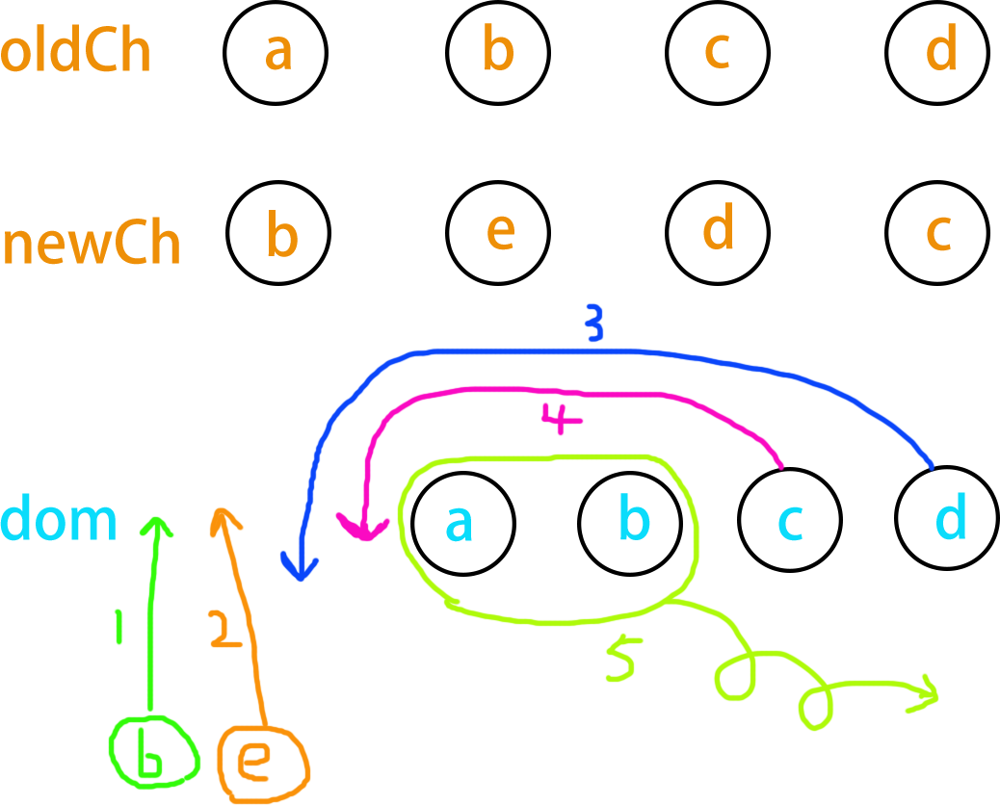
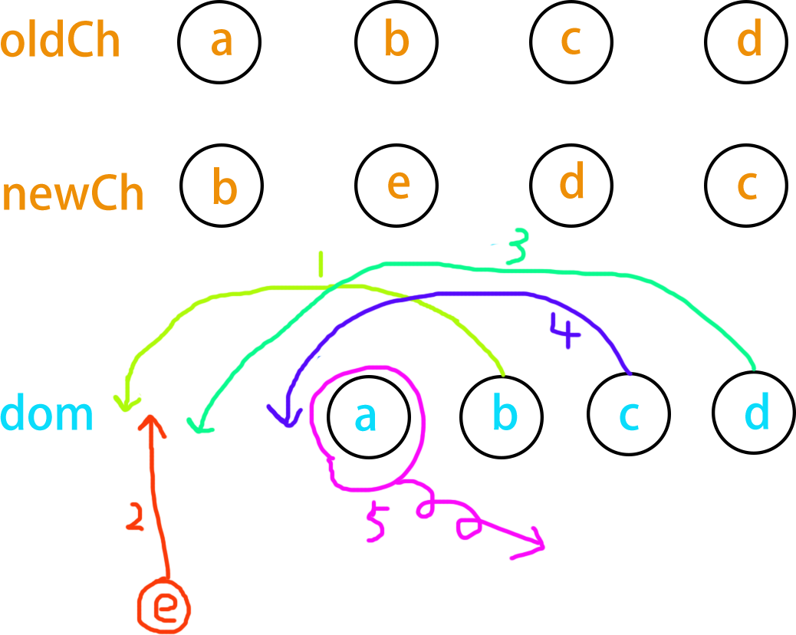

[[TOC]]

[TOC]


# Vue diff算法详解

Vue diff 是 Vue 框架中**用于比较虚拟 DOM（Virtual DOM）差异的算法**。它的主要作用**是在数据发生变化时，高效地更新用户界面**。

diff算法特点：

- 1、比较只会在同层级进行, 不会跨层级比较
- 2、在diff比较的过程中，循环从两边向中间比较
- 3、如果添加了key属性，在第二条的基础上，还会根据key属性提高比较效率

## 1. diff 算法作用

Vue diff 是 Vue 框架中用于高效更新视图的重要机制。**它通过比较虚拟 DOM（Virtual DOM）的差异，只更新实际发生变化的部分，从而减少不必要的 DOM 操作，提高了应用程序的性能**。

> 1、**提高性能(减少DOM操作)：通过只更新实际发生变化的部分，Vue diff 减少了不必要的 DOM 操作**，从而提高了应用程序的性能。这对于需要频繁更新视图的应用程序尤为重要。
>
> 2、`减少闪烁：由于 Vue diff 只更新实际发生变化的部分`，因此可以减少视图的闪烁，提高用户体验。
>
> 3、**提高开发效率：Vue diff 使得开发人员无需关心具体的 DOM 操作**，而是专注于业务逻辑的开发。这降低了开发的复杂性，提高了开发效率。
>
> 4、`跨平台支持：Vue diff 基于虚拟 DOM 实现，因此可以在不同的平台和浏览器上运行`。这使得 Vue 应用程序具有良好的跨平台支持。

总之，Vue diff 是 Vue 框架中用于高效更新视图的重要机制，它提高了应用程序的性能、用户体验和开发效率，为开发高质量的 Vue 应用程序提供了有力支持。

## 2. diff 算法的过程

假设我们有两棵虚拟 DOM 树，如下所示：

```js
// 旧虚拟 DOM 树
const oldTree = {
  tag: 'ul',
  children: [
    { tag: 'li', key: 'a', text: 'a' },
    { tag: 'li', key: 'b', text: 'b' },
    { tag: 'li', key: 'c', text: 'C' },
    { tag: 'li', key: 'd', text: 'd' },
  ]
}
// 新虚拟 DOM 树
const newTree = {
  tag: 'ul',
  children: [
    { tag: 'li', key: 'b', text: 'b' },
    { tag: 'li', key: 'e', text: 'e' },
    { tag: 'li', key: 'd', text: 'd' },
    { tag: 'li', key: 'c', text: 'c' }
  ]
}
```

diff算法分两种情况：

1、dom元素添加了key属性，如代码示例中的key属性。

2、dom元素没有key，比如示例代码children元素中删除key属性。

设置key和不设置key的区别：

不设置key，新dom和旧dom智慧进行头尾两端的相互比较。设置key后，除了头尾两端的比较外，还会从用key生成的对象`oldKeyToIdx`中查找匹配的节点，所以为节点设置key可以更高效的利用dom。

### 2.1 没有设置key情况

由于vue diff算法是新旧虚拟dom两端同时进行比较：

1、新dom开始端节点b没有在旧dom两端找到，因此在结果dom创建一个新节点b。新dom开始端移到第二个节点e，旧dom两端节点索引没动。

2、新dom开始端节点e没有在旧dom两端找到，因此在结果dom创建新节点e。新dom开始端移到第三个节点d。旧dom两端节点索引没动。

3、新dom开始端节点d跟旧dom的末端索引相同，因此，把旧dom末端节点d放到结果dom后面。新dom开始端移到第四个节点c。旧dom末端索引向前移到节点c。

4、新dom开始端节点c跟旧dom的末端索引相同，因此，把旧dom末端节点c放到结果dom后面。由于新dom两端索引相同，结束diff比较，

5、由于新dom两端索引相同，结束diff比较。由于旧dom的a、b两个节点没有用了，因此移除。




### 2.2 设置了key

由于dom节点设置了key，因此，在**头尾两端的比较外**后，如果没有找到相同的节点，那么新dom开始索引节点还会用key在旧dom中的key列表里面找一遍，到后后就移到最终结果中，因此新dom第一个节点b不需要重新创建，只需要从旧dom中一过来就可以。




## 参考资料

[解析vue2.0的diff算法 **杨敬卓**](https://github.com/aooy/blog/issues/2)

[面试官：你了解vue的diff算法吗？说说看](https://vue3js.cn/interview/vue/diff.html)

[Vue diff 算法探秘：如何实现快速渲染 阿里云](https://developer.aliyun.com/article/1428813)