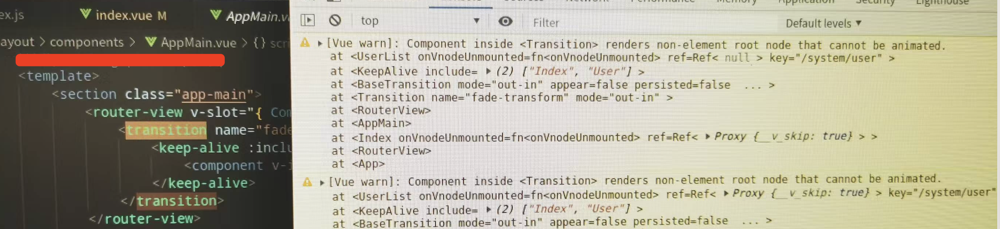
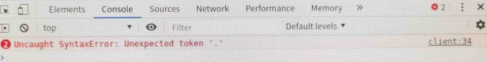

[[TOC]]

[TOC]

# VUE3 开发遇到的问题

## 1. Component inside `Transition` renders non-element root node that cannot be animated



出现问题现象：        
1、浏览器控制台报如上图所示的错误。     
2、首次进入后可以显示画面内容，但是跳转到其他画面后，其他画面打不开，显示空白页，然后再跳转到之前能打开的画面也显示空白页。

问题原因：         
由于项目中用到了vue3内置的`<Transition>` 组件，这个组件可以帮助你制作基于状态变化的过渡和动画。这个组件规定了：

> `<template>` 仅支持单个元素或组件作为其插槽内容。如果内容是一个组件，这个组件必须仅有一个根元素。

由于vue3的`template` 里面可以有多个根元素。 因此有多个根元素的组件在`<template>`里面就会报上面图片中的错误。

解决办法：      
修改组件的`template`，使其只有一个根元素。

参考资料：

[Transition 官方文档](https://cn.vuejs.org/guide/built-ins/transition.html#the-transition-component)

https://blog.csdn.net/m0_72167535/article/details/134814906

## 2. watch监听props属性变化无效

1、当在子组件声明props属性的时候，定义的是解构后的props变量，而解构后的变量就会导致监听失败，例如如下代码：

```js
const { showData } = defineProps({
	ShowData: {
    required: true,
    type: Object,
  }
})

watch(showData, (newVal) => {
  // 这总情况下，当 props的 showData 属性变化， 这里不会监听到
})
```

解决办法：如果需要监听props属性，在定义的时候不要使用解构定义，直接使用props变量接收：

```js
const props = defineProps({
	ShowData: {
    required: true,
    type: Object,
  }
})

watch(props.showData, (newVal) => {
  // 这个时候，当 showData 变化后就能监听到了
})
```

## 3. vite 打包工具相关报错

### 3.1 浏览器版本低导致报错：Uncaught Syntaxerror: Unexpected token '?'



如上图所示，当运行的前端页面在某些浏览器中打开，页面直接是白屏或者是加载动画(网站设置的动画)。打开浏览器的控制台，发现报错：

```bash
# 线上环境报这个错误
Uncaught Syntaxerror: Unexpected token '?'

# 本地使用 npm start 命令启动前端服务，包如下错误
Uncaught Syntaxerror: Unexpected token '.'
```

1、报错原因：

vite打包的项目是基于现代 JavaScript 语法的，只有在高版本浏览器才支持这些语法。低版本浏览器不能加载、执行JS文件，进而页面空白、浏览器终端报错。

经过查看[vite官方文档](https://vitejs.cn/vite5-cn/guide/build.html) ：

vite的构建包会假设目标浏览器支持现代 JavaScript 语法。默认情况下，Vite 的目标是能够 [支持原生 ESM script 标签](https://caniuse.com/es6-module)、[支持原生 ESM 动态导入](https://caniuse.com/es6-module-dynamic-import) 和 [`import.meta`](https://caniuse.com/mdn-javascript_operators_import_meta) 的浏览器：Chrome >=87、Firefox >=78、Safari >=14、Edge >=88。

2、解决方案：通过插件 [@vitejs/plugin-legacy](https://github.com/vitejs/vite/tree/main/packages/plugin-legacy) 来支持

2.1、安装`@vitejs/plugin-legacy`包

```bash
# 安装
npm i @vitejs/plugin-legacy -D

# 如果构建的时候报错(Error: terser not found)，则需要安装下面依赖包
npm i terser -D
```

2.2、配置vite.config.js

```js
import legacyPlugin from '@vitejs/plugin-legacy';
export default defineConfig({
  plugins: [
    legacyPlugin({
      targets: ["chrome < 60", "edge < 15"], // 需要兼容的目标列表，可以设置多个
      additionalLegacyPolyfills: ["regenerator-runtime/runtime"], // 面向IE11时需要此插件
      renderLegacyChunks: true,
    })
  ]
})
```

2.3、重新打包，部署后，在低版本浏览器验证即可。

**注意**：

1、配置后，只对打包生效。本地开发启动的服务，在低版本浏览器访问依然报错。查找的本地开发兼容性也无效，待后期看是否能解决。

2、据网络博主说：谷歌版本 < 50 的，都不支持，以上的均可支持，40+ 版本的请升级版本吧！

参考资料：

https://blog.csdn.net/Gas_station/article/details/131698271

[vite 关于浏览器兼容性说明](https://cn.vitejs.dev/guide/build.html)

[@vitejs/plugin-legacy](https://github.com/vitejs/vite/tree/main/packages/plugin-legacy) 


