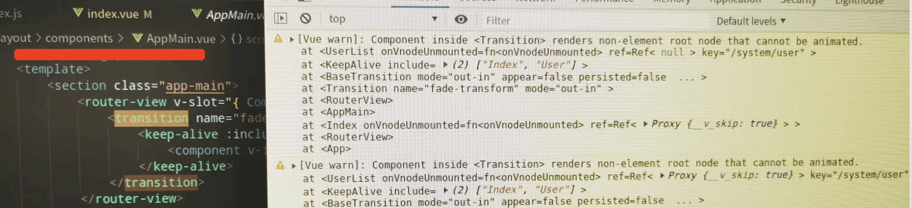

[[TOC]]

[TOC]

# VUE3 开发遇到的问题

## 1. Component inside `Transition` renders non-element root node that cannot be animated



出现问题现象：        
1、浏览器控制台报如上图所示的错误。     
2、首次进入后可以显示画面内容，但是跳转到其他画面后，其他画面打不开，显示空白页，然后再跳转到之前能打开的画面也显示空白页。

问题原因：         
由于项目中用到了vue3内置的`<Transition>` 组件，这个组件可以帮助你制作基于状态变化的过渡和动画。这个组件规定了：

> `<template>` 仅支持单个元素或组件作为其插槽内容。如果内容是一个组件，这个组件必须仅有一个根元素。

由于vue3的`template` 里面可以有多个根元素。 因此有多个根元素的组件在`<template>`里面就会报上面图片中的错误。

解决办法：      
修改组件的`template`，使其只有一个根元素。

参考资料：

[Transition 官方文档](https://cn.vuejs.org/guide/built-ins/transition.html#the-transition-component)

https://blog.csdn.net/m0_72167535/article/details/134814906

## 2. watch监听props属性变化无效

1、当在子组件声明props属性的时候，直接结构了props，然后监听的是解构后的变量，那么这总情况就会导致监听失效，比如如下代码：

```js
const { showData } = defineProps({
	ShowData: {
    required: true,
    type: Object,
  }
})

watch(showData, (newVal) => {
  // 这总情况下，当 props的 showData 属性变化， 这里不会监听到
})
```

解决办法：如果需要监听props属性，在定义的时候不要使用解构定义，直接使用props变量接收：

```js
const props = defineProps({
	ShowData: {
    required: true,
    type: Object,
  }
})

watch(props.showData, (newVal) => {
  // 这个时候，当 showData 变化后就能监听到了
})
```

