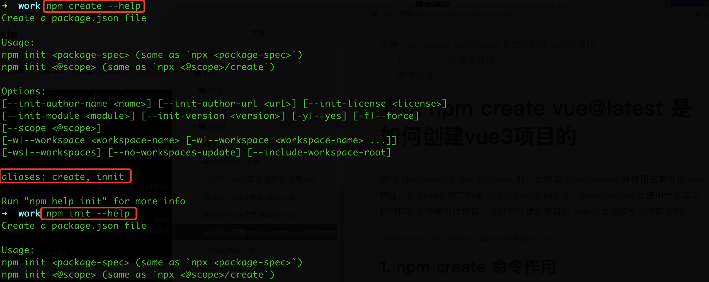
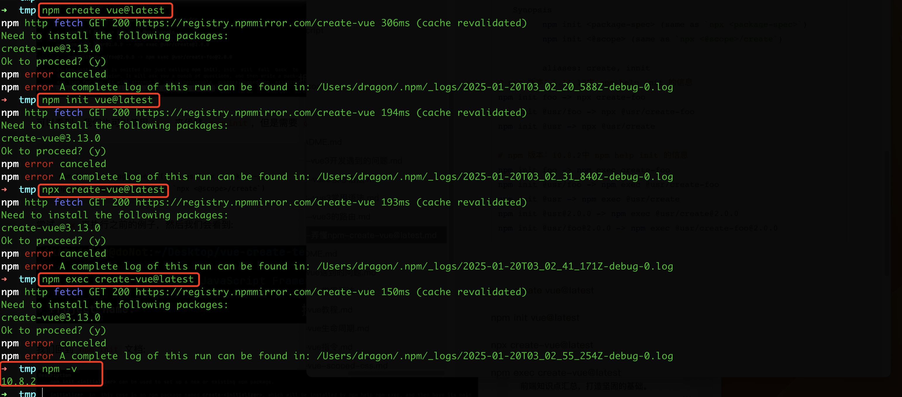
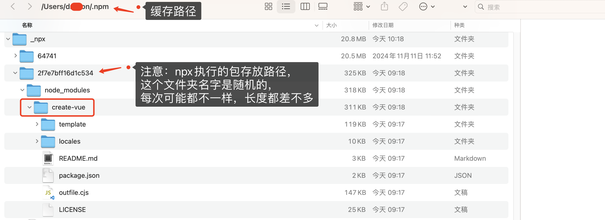
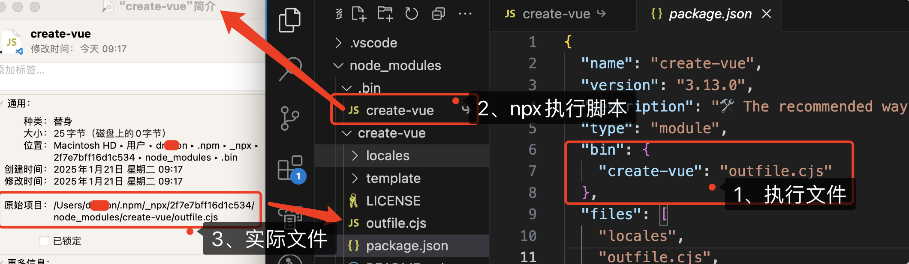
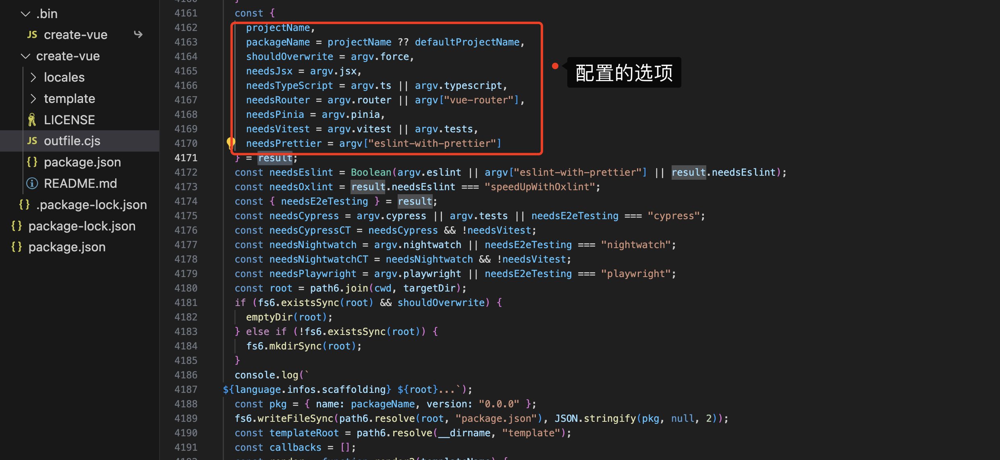

[[TOC]]

[TOC]

# 新建vue3项目及相关问题

## 1. 新建vue3项目

### 1.1 基于 vite 创建(推荐)

`vite` 是新一代前端构建工具，官网地址：[https://vitejs.cn](https://gitee.com/link?target=https%3A%2F%2Fvitejs.cn%2F)，`vite`的优势如下：

- 轻量快速的热重载（`HMR`），能实现极速的服务启动。
- 对 `TypeScript`、`JSX`、`CSS` 等支持开箱即用。
- 真正的按需编译，不再等待整个应用编译完成。

创建详情查看[官方文档](https://cn.vuejs.org/guide/quick-start#creating-a-vue-application)

**注意**：需要node版本是`v20.18.0`以上才可以，否则会报错。

```bash
## 1.创建命令
npm create vue@latest

## 2.具体配置
## 配置项目名称
√ Project name: vue3_test
## 是否添加TypeScript支持
√ Add TypeScript?  Yes
## 是否添加JSX支持
√ Add JSX Support?  No
## 是否添加路由环境
√ Add Vue Router for Single Page Application development?  No
## 是否添加pinia环境
√ Add Pinia for state management?  No
## 是否添加单元测试
√ Add Vitest for Unit Testing?  No
## 是否添加端到端测试方案
√ Add an End-to-End Testing Solution? » No
## 是否添加ESLint语法检查
√ Add ESLint for code quality?  Yes
## 是否添加Prettiert代码格式化
√ Add Prettier for code formatting?  No
```

### 1.2 基于 vue-cli 创建

点击查看[官方文档](https://cli.vuejs.org/zh/guide/creating-a-project.html#vue-create)

> 备注：目前`vue-cli`已处于维护模式，官方推荐基于 `Vite` 创建项目。

```bash
## 查看@vue/cli版本，确保@vue/cli版本在4.5.0以上
vue --version

## 安装或者升级你的@vue/cli 
npm install -g @vue/cli

## 执行创建命令
vue create vue_test

##  随后选择3.x
##  Choose a version of Vue.js that you want to start the project with (Use arrow keys)
##  > 3.x
##    2.x

## 启动
cd vue_test
npm run serve
```


## 2. 使用vue@latest创建项目遇到的问题

### 2.1 添加eslint规则后，自定义规则

在`eslint.config.ts` 文件中，放在**vueTsConfigs.recommended**下方：

```js
export default defineConfigWithVueTs(
  {
    name: 'app/files-to-lint',
    files: ['**/*.{ts,mts,tsx,vue}'],
  },
  globalIgnores(['**/dist/**', '**/dist-ssr/**', '**/coverage/**']),
  pluginVue.configs['flat/essential'],
  vueTsConfigs.recommended,
  {
    rules: {
      'vue/multi-word-component-names': 'off',
    },
  },
  skipFormatting,
)
```

注意：一定要放在**vueTsConfigs.recommended**下方


## 3. 弄懂 npm create vue@latest 是如何创建vue3项目的

使用 `npm create vue@latest` 时，会安装 `create-vue` 并使用它来创建 vue 项目。`@latest` 指定的是 `create-vue` 的版本。`create-vue` 会使用预先定义好的模板文件来创建项目。所以它创建的项目中 vue 版本由模板文件定义的。

[create-vue/template/base/package.json](https://github.com/vuejs/create-vue/blob/main/template/base/package.json)

### 3.1 npm create：是npm init 别名

`npm create` 命令其实就是`npm init`命令的别名，也就是说，`npm create vue@latest` 和 `npm init vue@latest`是一样的。如下图所示：



npm 官方文档没有明面上体现`npm create`。但是可以在github上的npm-(v6.0.0 (2018-04-20))的 CHANGELOG 中找到答案。 随即又翻阅了github上的 CHANGELOG 找到了相关说明。`https://github.com/npm/cli/blob/v6/CHANGELOG.md`

### 3.2 npm init 命令详解

可以在终端输入`npm help init`查看`init`命令详解。或者访问 [npm 网站文档](https://docs.npmjs.com/cli/v6/commands/npm-init)

关于`npm init`的命令部分介绍内容：

```bash
NAME
       npm-init - Create a package.json file
   Synopsis
         npm init <package-spec> (same as `npx <package-spec>`)
         npm init <@scope> (same as `npx <@scope>/create`)

         aliases: create, innit
# npm 版本：6.14.18中 npm help init 的信息
npm init foo -> npx create-foo
npm init @usr/foo -> npx @usr/create-foo
npm init @usr -> npx @usr/create

# npm 版本：10.8.2中 npm help init 的信息
npm init foo -> npm exec create-foo
npm init @usr/foo -> npm exec @usr/create-foo
npm init @usr -> npm exec @usr/create
npm init @usr@2.0.0 -> npm exec @usr/create@2.0.0
npm init @usr/foo@2.0.0 -> npm exec @usr/create-foo@2.0.0
```

经过查看文档：     

- `npm init`：生成一个 package.json 文件，需要在终端手动输入一些 package.json 文件需要的参数。
- `npm init 包名`：设置新的或现有的NPM包(使用这个包新建项目)。它会使用一个名为`create-包名`的npm包。然后由下面的命令去执行包中的`.bin`中的文件。去创建或者更新package. json文件，并且执行一些其他命令。
  - 在低版本中(6.14.18)中 会由`npx`命令执行
  - 在最新版本中(10.8.2以上)，会由`npm exec`命令执行

`npm exec` 和 `npx` 命令执行参数、效果类似，但是对于后续的传参的处理有所不同。具体可以查看[这里](https://docs.npmjs.com/cli/v9/commands/npm-exec#npx-vs-npm-exec)。

因此 `npm init vue@latest` 会被npm转化为`npx create-vue@latest` 或 `npm exec create-vue@latest` 然后再去执行下一步操作。如下图所示：



### 3.3 @latest 是什么意思

**npm命令中的@latest表示最新版本**‌。当你在npm命令中使用@latest时，表示你正在引用NPM仓库中的最新版本。例如，`npm i xx@latest`会安装xx包的最新稳定版本‌。

使用场景和作用：

1. ‌**安装最新版本**‌：当你使用`npm i xx@latest`时，npm会查找xx包的最新稳定版本并安装它。这确保你使用的是该包的最新功能和修复过的bug，但同时也可能接受API变化或不兼容性风险‌2。
2. ‌**确保最新版本**‌：在初始化项目时，使用`npm init vite@latest`可以确保使用Vite的最新稳定版本，从而创建一个使用最新技术和修复的项目‌2。

npm使用语义版本控制（semver）来管理包的版本。当你执行`npm i xx@latest`时，npm会根据semver规则找到xx包的最新稳定版本进行安装。如果没有指定任何版本或版本范围，npm也会默认使用@latest‌

### 3.4 npx命令执行逻辑

npx作用：调用项目内部安装的模块。

npx会先验证本地是否安装了该软件包，安装了则直接使用该软件包。如果未安装将读取远程库中的create-vue，并缓存到全局的npm-cache中。有关npx的详细说明可以[查看官网npx](https://docs.npmjs.com/cli/v7/commands/npx)。

终端查看`npm-cache`缓存路径命令：`npm config get cache`

```bash
~ npm config get cache
# Mac苹果系统的路径是：/Users/用户名/.npm
```

1、首先需要再终端执行一下`npm create vue@latest`，然后直接中断执行(使用`ctrl + C`快捷键)。以便于先缓存上`create-vue`包。

我本人电脑中，`create-vue` 包缓存路径：`/Users/用户名/.npm/_npx/2f7e7bff16d1c534/node_modules/create-vue`



2、当下载`create-vue`后，会根据项目中 `package.json` 的 `bin` 对象中的属性创建可执行文件。然后npx会执行这个文件



### 3.5 create-vue 中的 outfile.cjs 文件

vue3的项目初始化配置，都是根据 `outfile.cjs`文件里面的内容而来的。

```js
// 最底部执行代码
init2().catch((e) => {
  console.error(e);
});
```



**注意**：

 [Vue文档](https://cn.vuejs.org/guide/quick-start) 提供了 [create-vue GitHub](https://github.com/vuejs/create-vue) 仓库的链接。但是，如果你访问该仓库，你将找不到 `outfile.js` 或与我们刚刚探索的 `create-vue` 包有任何直接相似之处。这是因为 GitHub 主要存储用于贡献和开发目的的开源代码。相反，npm 存储了你安装的实际捆绑包代码。因此，重要的是不要将 GitHub 仓库和通过 npm 安装的包混淆。


## 参考资料

[彻底弄懂 `npm init vue@latest` 发生了什么](https://juejin.cn/post/7133992076735152136)

[【译】npm create vue@lastest 是如何工作的？](https://juejin.cn/post/7403949964973965347)

