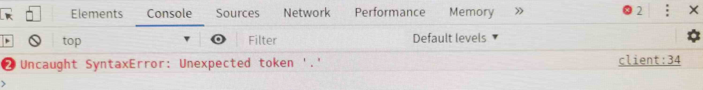

[[TOC]]

[TOC]

# vite对于低版本的浏览器支持处理

## 1. 低版本浏览器遇到的问题



如上图所示，当前端项目在某些浏览器中打开，页面直接是白屏或者是加载动画(网站设置的动画)。打开浏览器的控制台，发现报错：

```bash
# 线上环境报这个错误
Uncaught Syntaxerror: Unexpected token '?'

# 本地使用 npm start 命令启动前端服务，显示如下错误
Uncaught Syntaxerror: Unexpected token '.'
```

经过查看浏览器版本，发现都是一些低版本的浏览器。

## 2. 产生问题的原因

下面是关于[vite官网](https://vitejs.cn/vite5-cn/guide/build.html)对浏览器兼容性的描述

由于vite打包工具用于生产环境的构建包会假设目标浏览器支持现代 JavaScript 语法。默认情况下，Vite 的目标是能够 [支持原生 ESM script 标签](https://caniuse.com/es6-module)、[支持原生 ESM 动态导入](https://caniuse.com/es6-module-dynamic-import) 和 [`import.meta`](https://caniuse.com/mdn-javascript_operators_import_meta) 的浏览器：

- Chrome >=87
- Firefox >=78
- Safari >=14
- Edge >=88

你也可以通过 [`build.target` 配置项](https://vitejs.cn/vite5-cn/config/build-options.html#build-target) 指定构建目标，最低支持 `es2015`。

请注意，默认情况下 Vite 只处理语法转译，且 **不包含任何 polyfill**。你可以访问 https://cdnjs.cloudflare.com/polyfill/ ，这个网站可以根据用户的浏览器 UserAgent 字符串自动生成 polyfill 包。

传统浏览器可以通过插件 [@vitejs/plugin-legacy](https://github.com/vitejs/vite/tree/main/packages/plugin-legacy) 来支持，它将自动生成传统版本的 chunk 及与其相对应 ES 语言特性方面的 polyfill。兼容版的 chunk 只会在不支持原生 ESM 的浏览器中进行按需加载。

## 3. 使用@vitejs/plugin-legacy解决

由于我本人在开发的过程中遇到了低版本浏览器访问vite打包的项目的需求，使用`@vitejs/plugin-legacy`插件解决了问题。因此首先介绍这个插件的使用。

github地址：https://github.com/vitejs/vite/tree/main/packages/plugin-legacy

### 3.1 安装、使用

1、安装

```bash
# 安装
npm i @vitejs/plugin-legacy -D

# 如果构建的时候报错(Error: terser not found)，则需要安装下面依赖包
npm i terser -D
```

2、使用：配置vite.config.js

```js
import legacyPlugin from '@vitejs/plugin-legacy';
export default defineConfig({
  plugins: [
    legacyPlugin({
      targets: ["chrome < 78", "edge < 15"], // 需要兼容的目标列表，可以设置多个
      additionalLegacyPolyfills: ["regenerator-runtime/runtime"], // 面向IE11时需要此插件
      renderLegacyChunks: true,
    })
  ]
})
```

重新打包，部署后，在低版本浏览器验证即可。

**据其他博主说**：谷歌版本 < 50 的，都不支持，以上的均可支持，40+ 版本的请升级版本吧！

### 3.2 本地开发不生效

当配置好这个插件后，发现在本地开发启动的服务在低版本浏览器中打开，仍然报错，不能运行。

搜索其他博主也都是发现没有生效。根据AI搜索查找到的解释：

`@vitejs/plugin-legacy` 主要面向生产环境，在开发模式下，Vite 侧重于快速反馈和高效开发，默认不会生成针对旧版浏览器的兼容代码。

一般来说只要解决了再低版本浏览器打开后基本就没有其他问题了，目前还没发现有其他问题。如果确实需要再低版本浏览器中访问去解决一下问题，可以尝试如下方案：

1、项目打包后本地启动服务。这个注意要修改一下接口请求地址等配置问题。个人觉得这种还不如直接部署到测试环境然后发现问题在修改。

2、在本地设置模式为`production`(经过实测无效)

```js
// vite.config.js
import { defineConfig } from 'vite';
import legacy from '@vitejs/plugin-legacy';

export default defineConfig({
    mode: 'production',
    plugins: [
        legacy({
            targets: ['defaults', 'not IE 11'],
            renderLegacyChunks: true
        })
    ]
});
```


### 3.3 targets

- **类型**: `string | string[] | { [key: string]: string }`
- **默认值**: 项目的 Browserslist 配置（如 `.browserslistrc` 或 `package.json` 中的 `browserslist` 字段）。
- **作用**:
  指定需要支持的目标浏览器环境。插件会根据此配置决定代码转译和 Polyfill 的范围。

取值的内容：

- chrome < 60：表示需要兼容所有 Chrome 浏览器版本小于 60 的浏览器。
- chrome > 50：表示需要兼容所有 Chrome 浏览器版本大于 50 的浏览器。
- chrome = 70(跟`chrome 70`一样)：表示仅需要兼容 Chrome 浏览器版本为 70 的浏览器。插件会对代码进行调整，保证在 Chrome 70 这个特定版本上可以正常运行。
- defaults：`defaults` 是一个预定义的浏览器列表，它代表了当前市场上主流浏览器的最新稳定版本及其一定比例的用户使用量。这个列表会随着时间推移而更新，以反映浏览器市场的变化。通常包含 Chrome、Firefox、Safari、Edge 等主流浏览器的较新版本，使用 `defaults` 能确保项目在大多数主流浏览器中正常运行，无需手动指定每个浏览器的版本。
- 使用浏览器列表字符串： `'> 0.5%, last 2 versions, Firefox ESR, not dead'`表示兼容全球使用率超过 0.5%、每个浏览器的最后两个版本、Firefox 长期支持版本，并且排除已经停止维护的浏览器。常用浏览器列表规则：
  - `> 1%`：全球使用率超过 1% 的浏览器。
  - `last 2 versions`：每个浏览器的最后两个版本。
  - `Firefox ESR`：Firefox 长期支持版本。
  - `not dead`：排除已经停止维护的浏览器。
  - `chrome >= 60`：Chrome 60 及以上版本。
  - `safari < 11`：Safari 11 以下版本。

```js
// vite.config.js
import { defineConfig } from 'vite';
import legacy from '@vitejs/plugin-legacy';
export default defineConfig({
  plugins: [
    legacy({
      // 要兼容 Chrome 60、Safari 11.1 和 Edge 15 
      targets: ['chrome 60', 'safari 11.1', 'edge 15'],
      // 要兼容全球使用率超过 0.5%、每个浏览器的最后两个版本、Firefox 长期支持版本，并且排除已经停止维护的浏览器
      targets: '> 0.5%, last 2 versions, Firefox ESR, not dead',
      targets: {
        // 开发环境，经过测试不生效
        development: ['last 1 chrome version', 'last 1 firefox version'],
        // 生产环境
        production: ['> 0.2%, not dead, not op_mini all']
      }
    })
  ]
});
```

### 3.4 polyfills

- **类型**: `boolean | string[] | { include?: string[], exclude?: string[] }`
- **默认值**: `true`（自动检测需要的 Polyfills）。
- **作用**:
  控制是否自动注入 Polyfills。
  - `true`: 自动检测并注入所需 Polyfills。
  - `false`: 禁用自动注入。
  - 数组或对象：手动指定包含或排除特定 Polyfills。

```js
legacy({
  polyfills: {
    include: ['es.promise', 'es.array.iterator'],
    exclude: ['web.dom-collections.iterator']
  }
})
```

### 3.5 additionalLegacyPolyfills

- **类型**: `string[]`
- **默认值**: `[]`
- **作用**:
  添加额外的 Polyfills 到传统构建中，适用于自动检测未覆盖的 Polyfills。

```js
legacy({
  additionalLegacyPolyfills: ['regenerator-runtime/runtime']
})
```

### 3.6 ignoreBrowserslistConfig

- **类型**: `boolean`
- **默认值**: `false`
- **作用**:
  是否忽略项目的 Browserslist 配置。若设为 `true`，插件将仅使用 `targets` 参数的值。

```js
legacy({
  ignoreBrowserslistConfig: true,
  targets: ['chrome 50']
})
```

### 3.7 modernPolyfills

- **类型**: `boolean | string[]`
- **默认值**: `false`
- **作用**:
  为现代浏览器构建（支持 ES 模块的浏览器）添加 Polyfills。适用于某些现代浏览器仍需要 Polyfill 的情况。
- **与其他参数的关系**
  - 与 `targets` 参数的关系**：`targets` 参数决定了要支持的浏览器范围，而 `modernPolyfills` 是基于这个范围为现代浏览器补充缺失的特性。例如，如果 `targets` 指定了某些较旧的现代浏览器版本，那么 `modernPolyfills` 会确保这些浏览器能获得必要的 polyfill 支持。**
  - 与 `renderLegacyChunks` 参数的关系**：`renderLegacyChunks` 主要关注为不支持 ES 模块的旧版浏览器生成兼容代码块，而 `modernPolyfills` 侧重于为支持 ES 模块的现代浏览器提供 polyfill。两者相互配合，使得应用在不同类型的浏览器中都能正常运行。
- **注意事项**
  - **性能考虑**：注入过多的 polyfill 会增加打包文件的大小，影响页面加载性能。因此，应该只选择应用实际需要的 polyfill。
  - **兼容性测试**：在添加新的 polyfill 后，需要进行充分的兼容性测试，确保它们在目标浏览器中能正常工作，并且不会引入新的问题。

```js
legacy({
  modernPolyfills: ['es.promise.finally', 'es.array.flat-map' ]
})
```

#### 3.7.1 polyfill 列表

可以在 [core-js 的文档](https://github.com/zloirock/core-js#commonjs) 中找到更完整的 polyfill 列表。

下面列举一下常用的：

```markdown
1.1 基本语法相关
es.symbol：为 Symbol 类型提供支持，Symbol 是 ES6 引入的一种原始数据类型，表示独一无二的值。
es.promise：对 Promise 对象进行支持，Promise 用于异步编程，可避免回调地狱问题。
es.async-iterator：支持异步迭代器，可使用 for-await-of 语法处理异步可迭代对象。

1.2 对象方法相关
es.object.assign：支持 Object.assign() 方法，用于将一个或多个源对象的所有可枚举属性复制到目标对象。
es.object.values：支持 Object.values() 方法，返回一个给定对象自己的可枚举属性值的数组。
es.object.entries：支持 Object.entries() 方法，返回一个给定对象自身可枚举属性的键值对数组。

1.3 数组方法相关
es.array.from：支持 Array.from() 方法，用于将类数组对象或可迭代对象转换为真正的数组。
es.array.includes：支持 Array.prototype.includes() 方法，用于判断一个数组是否包含一个指定的值。
es.array.flat：支持 Array.prototype.flat() 方法，用于将嵌套数组扁平化。

1.4 字符串方法相关
es.string.pad-start：支持 String.prototype.padStart() 方法，用另一个字符串填充当前字符串的开头，直到达到指定的长度。
es.string.pad-end：支持 String.prototype.padEnd() 方法，用另一个字符串填充当前字符串的末尾，直到达到指定的长度。
es.string.trim-start：支持 String.prototype.trimStart() 方法，移除字符串开头的空白字符。
```

### 3.8 renderLegacyChunks

- **类型**: `boolean`
- **默认值**: `true`
- **作用**:
  是否生成传统浏览器专用的代码块（带有 `nomodule` 属性的脚本）。关闭后，传统浏览器可能无法正常运行。
- **介绍**：主要用于控制是否为不支持原生 ES 模块的旧版浏览器生成兼容的代码块（legacy chunks）。在现代 Web 开发中，很多项目使用了 ES6+ 的模块语法（如 `import` 和 `export`），但一些旧版浏览器（如 Internet Explorer）并不支持这些语法。通过设置 `renderLegacyChunks` 为 `true`，插件会将代码转换为旧版浏览器能够理解的格式，从而确保应用在这些浏览器上也能正常运行。

```js
legacy({
  renderLegacyChunks: false // 仅生成现代代码
})
```

默认值为 `true`。这意味着在不手动设置该参数的情况下，插件会自动为旧版浏览器生成兼容代码块。如果你确定不需要为旧版浏览器提供支持，可以将其设置为 `false`，以减少构建时间和最终打包文件的大小。

当 `renderLegacyChunks` 设置为 `true` 时，插件会生成两个版本的代码：

- **现代代码块（modern chunks）**：使用原生 ES 模块语法，供支持该语法的现代浏览器使用。
- **兼容代码块（legacy chunks）**：经过转换和填充（polyfill）处理，以适应不支持原生 ES 模块的旧版浏览器。

在 HTML 文件中，插件会自动插入相应的 `<script>` 标签来加载这些代码块。现代浏览器会加载现代代码块，而旧版浏览器会加载兼容代码块。示例如下：

```html
<!DOCTYPE html>
<html lang="en">
<head>
    <meta charset="UTF-8">
    <meta name="viewport" content="width=device-width, initial-scale=1.0">
    <title>My Vite App</title>
</head>
<body>
    <!-- 现代浏览器加载现代代码块 -->
    <script type="module" src="/assets/index-xxxx.js"></script>
    <!-- 旧版浏览器加载兼容代码块 -->
    <script nomodule src="/assets/legacy-xxxx.js"></script>
</body>
</html>
```

**注意事项**

- **性能影响**：生成兼容代码块会增加构建时间和最终打包文件的大小，因为需要对代码进行额外的转换和填充处理。因此，在不需要支持旧版浏览器时，建议将 `renderLegacyChunks` 设置为 `false`。
- **目标浏览器设置**：`renderLegacyChunks` 的效果还受到 `targets` 参数的影响。`targets` 用于指定需要支持的浏览器版本范围，插件会根据这个范围来确定哪些浏览器需要兼容代码块。因此，在配置时需要合理设置 `targets` 参数，以确保生成的兼容代码块符合实际需求。


## 参考资料

[vite官网 关于浏览器兼容性说明](https://cn.vite.dev/guide/build)

[@vitejs/plugin-legacy github地址](https://github.com/vitejs/vite/tree/main/packages/plugin-legacy) 

[（vite/webpack 通用）vue 白屏 Uncaught Syntaxerror: Unexpected token ‘?‘](https://blog.csdn.net/Gas_station/article/details/131698271)


