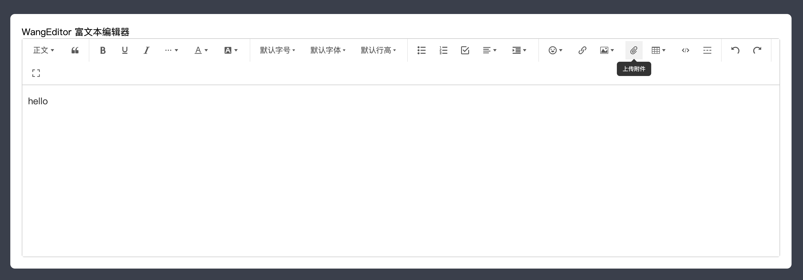

[[TOC]]

[TOC]

# 富文本编辑器包的安装使用

编辑器效果：



## 1. 一些网站

插件包网站：https://www.wangeditor.com/

在线示例(富文本编辑实时转换成html、页面显示效果)：https://www.wangeditor.com/demo/get-html.html

安装使用(vue2、vue3、react)：https://www.wangeditor.com/v5/for-frame.html#vue3

## 2. 安装

```bash
yarn add @wangeditor/editor # 2025-09-10 的版本是5.1.23
# 或者 npm install @wangeditor/editor --save

yarn add @wangeditor/editor-for-vue@next # 2025-09-10 的版本是5.1.12
# 或者 npm install @wangeditor/editor-for-vue@next --save
# 上面报错使用下面命令安装
# npm install @wangeditor/editor-for-vue
```

## 3. 具体使用

```vue
<template>
  <div class="use-wangeditor-main">
    <div>WangEditor 富文本编辑器</div>
    <div class="editor-main">
      <Toolbar class="toolbar" :editor="editorRef" :defaultConfig="toolbarConfig" :mode="mode" />
      <!-- style="height: 500px; overflow-y: hidden" -->
      <Editor
        class="editor-text"
        v-model="valueHtml"
        :defaultConfig="editorConfig"
        :mode="mode"
        @onCreated="handleCreated"
      />
    </div>
  </div>
</template>

<script setup lang="ts" name="UseWangeditor">
import { shallowRef, ref, onBeforeUnmount } from 'vue'
import '@wangeditor/editor/dist/css/style.css' // 引入 css
import { Editor, Toolbar } from '@wangeditor/editor-for-vue'
import { } from '@wangeditor/editor-for-vue'

const editorRef = shallowRef()

const toolbarConfig = {
  excludeKeys: ['group-video'], // 排除视频上传
  // 插入哪些菜单
  insertKeys: {
    index: 23, // 自定义插入的位置
    keys: ['uploadAttachment'], // “上传附件”菜单
  },
}
const mode = 'default' // 'default' | 'simple'

const valueHtml = ref('<p>hello</p>')
// const valueText = ref('hello')
const editorConfig = {
  placeholder: '请输入内容...',
  // 在编辑器中，点击选中“附件”节点时，要弹出的菜单
  hoverbarKeys: {
    attachment: {
      menuKeys: ['downloadAttachment'], // “下载附件”菜单
    },
  },
  MENU_CONF: {
    uploadAttachment: {
      server: 'https://www.yuque.com/yuque/developer/file/upload', // 上传地址
      fieldName: 'file', // 文件参数名
      maxFileSize: 10 * 1024 * 1024, // 限制文件大小 10M
      maxNumberOfFiles: 5, // 一次最多上传 5 个文件
      allowedFileTypes: ['*'], // 限制文件类型，默认允许所有类型
      meta: {
        // 自定义其他参数
        token: 'xxxx',
      },
    },
  },
}

// 组件销毁时，也及时销毁编辑器
onBeforeUnmount(() => {
  const editor = editorRef.value
  if (editor == null) return
  editor.destroy()
})

const handleCreated = (editor: any) => {
  editorRef.value = editor // 记录 editor 实例，重要！
}
</script>

<style lang="scss" scoped>
.use-wangeditor-main {
  padding: 20px;

  .editor-main {
    border: 1px solid #ccc;
    border-radius: 4px;
    margin-bottom: 20px;
    .toolbar {
      border-bottom: 1px solid #ccc;
    }
    .editor-text {
      height: 500px !important;
      overflow-y: hidden;
    }
  }
}
</style>

```


## 4. 上传附件插件添加使用

插件介绍：https://github.com/wangeditor-team/wangEditor-plugin-upload-attachment

1、安装：

```bash
npm i @wangeditor/plugin-upload-attachment #2025-09-11这天版本号："@wangeditor/plugin-upload-attachment": "^1.1.0",
```

2、注册到编辑器，在`main.js`文件中：

```js
import { Boot } from '@wangeditor/editor'
import attachmentModule from '@wangeditor/plugin-upload-attachment'
// 注册。要在创建编辑器之前注册，且只能注册一次，不可重复注册。
Boot.registerModule(attachmentModule)
// 注意要放在app.mount('#app') 的上面
```

3、具体组件中，配置上传附件图标显示在工具栏(不设置不显示)：

```js
const toolbarConfig = {
  excludeKeys: ['group-video'], // 排除视频上传
  // 插入哪些菜单
  insertKeys: {
    index: 23, // 自定义插入的位置
    keys: ['uploadAttachment'], // “上传附件”菜单
  },
}
```

4、配置：

```js
const editorConfig = {
  placeholder: '请输入内容...',
  // 在编辑器中，点击选中“附件”节点时，要弹出的菜单
  hoverbarKeys: {
    attachment: {
      menuKeys: ['downloadAttachment'], // “下载附件”菜单
    },
  },
  MENU_CONF: {
    uploadAttachment: {
      server: 'https://www.yuque.com/yuque/developer/file/upload', // 上传地址
      fieldName: 'file', // 文件参数名
      maxFileSize: 10 * 1024 * 1024, // 限制文件大小 10M
      maxNumberOfFiles: 5, // 一次最多上传 5 个文件
      allowedFileTypes: ['*'], // 限制文件类型，默认允许所有类型
      meta: {
        // 自定义其他参数
        token: 'xxxx',
      },
      onProgress(progress: number) {
        console.log('onProgress', progress)
      },
      onSuccess(file: File, res: any) {
        console.log('onSuccess', file, res)
      },
      onFailed(file: File, res: any) {
        alert(res.message)
        console.log('onFailed', file, res)
      },
      onError(file: File, err: Error, res: any) {
        alert(err.message)
        console.error('onError', file, err, res)
      },

      // // 上传成功后，用户自定义插入文件
      // customInsert(res: any, file: File, insertFn: Function) {
      //   console.log('customInsert', res)
      //   const { url } = res.data || {}
      //   if (!url) throw new Error(`url is empty`)

      //   // 插入附件到编辑器
      //   insertFn(`customInsert-${file.name}`, url)
      // },

      // // 用户自定义上传
      // customUpload(file: File, insertFn: Function) {
      //   console.log('customUpload', file)

      //   return new Promise(resolve => {
      //     // 插入一个文件，模拟异步
      //     setTimeout(() => {
      //       const src = `https://www.w3school.com.cn/i/movie.ogg`
      //       insertFn(`customUpload-${file.name}`, src)
      //       resolve('ok')
      //     }, 500)
      //   })
      // },

      // // 自定义选择
      // customBrowseAndUpload(insertFn: Function) {
      //   alert('自定义选择文件，如弹出图床')
      //   // 自己上传文件
      //   // 上传之后用 insertFn(fileName, link) 插入到编辑器
      // },

      // 插入到编辑器后的回调
      onInsertedAttachment(elem: AttachmentElement) {
        console.log('inserted attachment', elem)
      },
    },
  },
}
```

