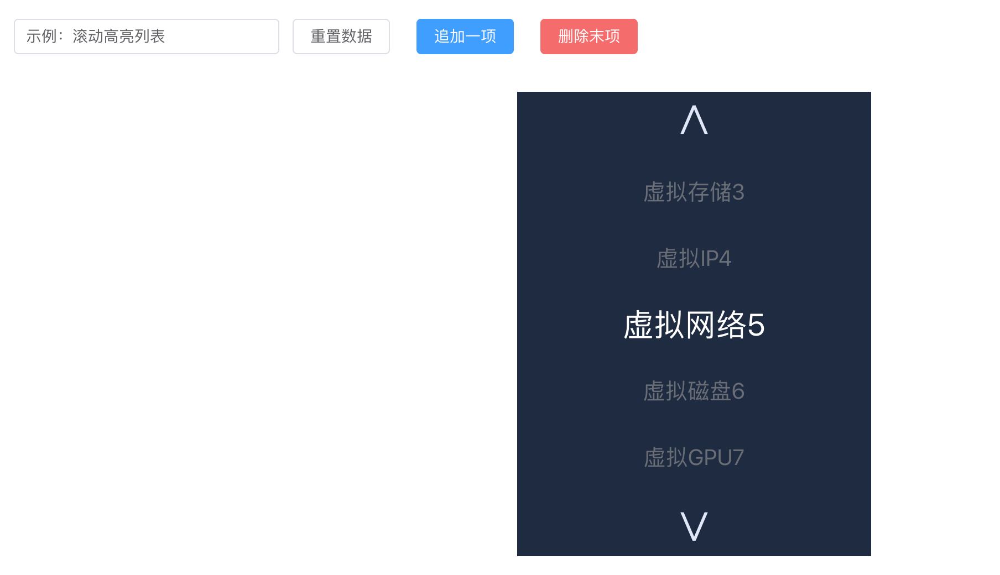

[[TOC]]

[TOC]

# 代码示例1

## 1. 拦截a链接变成JS代码处理

**Vue3 组件中用 `v-html` 渲染富文本**，里面可能有 `<a href="xxx">` 链接。问题是：

- `v-html` 渲染的内容是「静态 HTML」，Vue 不会帮你自动绑定事件。
- 所以点 `<a>` 默认就是直接跳转。

👉 要解决：需要在组件里用 **事件代理** 或者 **手动绑定事件** 来拦截 `<a>` 点击，再调用 Vue 方法。` <a> `链接里可能有参数（比如 query string），点击时拦截，解析参数，用参数做逻辑处理。

```vue
<template>
  <div ref="contentRef" v-html="htmlContent"></div>
</template>

<script setup lang="ts">
import { ref, onMounted, onBeforeUnmount } from 'vue'

const htmlContent = `
  <p>点我看看效果：
    <a href="https://example.com/page?userId=123&action=edit">自定义跳转</a>
  </p>
`
const contentRef = ref<HTMLElement | null>(null)

function handleLinkClick(e: Event) {
  const target = e.target as HTMLElement
  if (target.tagName.toLowerCase() === 'a') {
    e.preventDefault() // 阻止默认跳转
    const href = (target as HTMLAnchorElement).href
    if (href) {
      try {
        // 用 URL API 解析参数
        const url = new URL(href)
        const userId = url.searchParams.get('userId')
        const action = url.searchParams.get('action')

        console.log('拦截到链接:', href)
        console.log('参数 userId:', userId)
        console.log('参数 action:', action)

        // TODO: 这里写自定义处理逻辑
        alert(`处理参数：userId=${userId}, action=${action}`)
      } catch (err) {
        console.error('URL 解析失败:', err)
      }
    }
  }
}

onMounted(() => {
  contentRef.value?.addEventListener('click', handleLinkClick)
})

onBeforeUnmount(() => {
  contentRef.value?.removeEventListener('click', handleLinkClick)
})
</script>
```


## 2. 垂直高亮轮播切换效果

效果：




父组件代码：

```vue
<template>
  <el-container style="padding:24px;">
    <el-header style="display:flex;align-items:center;gap:12px;">
      <el-input v-model="title" placeholder="标题（仅示例）" style="width:240px" />
      <el-button @click="resetItems">重置数据</el-button>
      <el-button type="primary" @click="addItem">追加一项</el-button>
      <el-button type="danger" @click="removeItem" :disabled="items.length===0">删除末项</el-button>
      <div style="margin-left:auto;color:#cfe0ff">当前索引: {{ currentIndex }}</div>
    </el-header>

    <el-main style="display:flex;justify-content:center;align-items:flex-start;padding-top:20px;">
      <!-- 把数组传给子组件，并监听事件 -->
      <SeamlessLoopHighlight
        :items="items"
        @prev="onPrev"
        @next="onNext"
        @item-click="onItemClick"
      />
    </el-main>
  </el-container>
</template>

<script setup lang="ts">
import { ref } from 'vue';
import { ElMessage } from 'element-plus';
import SeamlessLoopHighlight from './component/SeamlessLoopHighlight.vue'; // 根据你项目路径调整

const title = ref('示例：滚动高亮列表');

const initial = [
  {name: '虚拟内存1', value: 1},
  {name: '虚拟CPU', value: 2},
  {name: '虚拟存储', value: 3},
  {name: '虚拟IP', value: 4}, 
  {name: '虚拟网络', value: 5}, 
  {name: '虚拟磁盘', value: 6}, 
  {name: '虚拟GPU', value: 7}, 
  {name: '虚拟带宽', value: 8}, 
  {name: '虚拟安全组', value: 9}, 
  {name: '虚拟交换机', value: 10}, 
  {name: '虚拟防火墙', value: 11}, 
  {name: '虚拟网关', value: 12}, 
  {name: '虚拟负载均衡', value: 13}, 
  {name: '虚拟镜像11', value: 14}
] ;
type Item = { name: string; value: number };
const items = ref<Item[]>([...initial]);

// 如果你想保持父组件里的 currentIndex（展示用）
const currentIndex = ref(0);

function onPrev(a) {
  // 当子组件发出 prev 事件时触发（向上）
  // 这里我们仅演示如何接收事件并更新父状态
  currentIndex.value = (currentIndex.value - 1 + items.value.length) % (items.value.length || 1);
  // ElMessage({ message: '向上翻一项', type: 'info', duration: 800 });
  ElMessage({ message: a, type: 'info', duration: 800 });
}

function onNext() {
  currentIndex.value = (currentIndex.value + 1) % (items.value.length || 1);
  ElMessage({ message: '向下翻一项', type: 'success', duration: 800 });
}

function onItemClick(payload: { item: string; index: number }) {
  // payload 来自子组件 emit('item-click', { item, index })
  ElMessage({
    message: `点击项：${payload.item}（索引 ${payload.index}）`,
    type: 'warning'
  });
  console.log('wozhixing ');
}

// 示范：父组件修改 items（子组件会响应 watch）
function addItem() {
  items.value.push({ name: `新项${items.value.length + 1}`, value: items.value.length + 1 });
}

function removeItem() {
  items.value.pop();
  if (currentIndex.value >= items.value.length) currentIndex.value = Math.max(0, items.value.length - 1);
}

function resetItems() {
  items.value = [...initial];
  currentIndex.value = 0;
}
</script>

<style scoped>
/* 仅作页面布局示例，可按需删改 */
.el-header { background: transparent; border-bottom: none; padding: 12px 0; }
.el-main { min-height: 360px; }
</style>
```

子组件：

```vue
<template>
  <div class="wrap">
    <el-button class="arrow" type="text" @click="onUp">∧</el-button>

    <div class="viewport">
      <div ref="listEl" class="list" :style="listStyle">
        <!-- 渲染 VISIBLE+2 个占位节点 -->
        <div v-for="(n, i) in nodesCount" :key="i" class="item" @click="onItemClick(i)">
          {{ visibleTexts[i]?.name }}{{ visibleTexts[i]?.value }}
        </div>
      </div>
    </div>

    <el-button class="arrow" type="text" @click="onDown">∨</el-button>
  </div>
</template>

<script lang="ts" setup>
import { ref, watch, computed, onMounted, nextTick, onBeforeUnmount } from 'vue';
import type { PropType } from 'vue';

// Props + Emits
type Item = { name: string; value: number };
const props = defineProps({
  items: { type: Array as PropType<Item[]>, default: () => [] }
});
const emit = defineEmits(['prev', 'next', 'item-click']);

// 常量
const ITEM_H = 60;
const VIEW_H = 300;
const VISIBLE = 5;
const CENTER = Math.floor(VISIBLE / 2);
const ANIM_MS = 360;

// DOM refs
const listEl = ref<HTMLElement | null>(null);

// 本地状态
const currentIndex = ref(0);
const isAnimating = ref(false);

// 为了实现跟原生实现一致，保持 VISIBLE+2 个节点
const nodesCount = VISIBLE + 2;

// 计算占位节点显示文本（根据 currentIndex 和 props.items）
const visibleTexts = computed(() => {
  const arr: (Item | null)[] = [];
  const n = props.items.length;
  for (let i = 0; i < nodesCount; i++) {
    const offset = i - (CENTER + 1);
    const idx = n ? ((currentIndex.value + offset) % n + n) % n : -1;
    arr.push(idx >= 0 ? props.items[idx] : null);
  }
  return arr;
});

// list 的 transform 样式（内联 style），用于动画
const baseTranslate = VIEW_H / 2 - ((CENTER + 1) * ITEM_H + ITEM_H / 2);
const translateY = ref(baseTranslate);
const transitioning = ref(false);

const listStyle = computed(() => ({
  transform: `translateY(${translateY.value}px)`,
  transition: transitioning.value ? `transform ${ANIM_MS}ms cubic-bezier(.2,.9,.2,1)` : 'none'
}));

// 更新高亮（字体大小 / 颜色 / opacity）
function updateHighlightStyles() {
  if (!listEl.value) return;
  const children = Array.from(listEl.value.children) as HTMLElement[];
  children.forEach((el, i) => {
    const offset = i - (CENTER + 1);
    const t = Math.max(0, 1 - Math.abs(offset));
    const fontSize = 20 + t * (28 - 20);
    const opacity = 0.6 + t * (1 - 0.6);
    const colorVal = Math.floor(153 + t * (255 - 153));
    el.style.fontSize = `${fontSize}px`;
    el.style.opacity = String(opacity);
    el.style.color = `rgb(${colorVal},${colorVal},${colorVal})`;
  });
}

// 设置 transform（带/不带动画）
function setTransform(y: number, animate = true) {
  transitioning.value = animate;
  translateY.value = y;
}

// 移动函数（step = +1 或 -1）
// 返回一个 Promise，在动画结束时 resolve，便于调用方得到最新高亮项
function move(step: number): Promise<void> {
  return new Promise((resolve) => {
    if (isAnimating.value) return resolve();
    if (!props.items.length) return resolve();

    isAnimating.value = true;
    currentIndex.value = ((currentIndex.value + step) % props.items.length + props.items.length) % props.items.length;

    console.log('move currentIndex.value: ', currentIndex.value );
    // 先更新文本和样式（computed visibleTexts 会变化）
    nextTick(() => {
      updateHighlightStyles();

      // 做动画：移动 step 高度
      setTransform(baseTranslate - step * ITEM_H, true);

      const onEnd = () => {
        if (!listEl.value) return;
        listEl.value.removeEventListener('transitionend', onEnd);

        // 恢复到 baseTranslate（无动画）
        setTransform(baseTranslate, false);
        console.log('我执行了');

        // 等一帧再解除 anim 标志并 resolve
        requestAnimationFrame(() => {
          isAnimating.value = false;
          resolve();
        });
      };

      if (listEl.value) {
        listEl.value.addEventListener('transitionend', onEnd);
        console.log('添加监听');
      } else {
        // 兜底
        setTimeout(() => { isAnimating.value = false; setTransform(baseTranslate, false); resolve(); }, ANIM_MS + 30);
      }
    });
  });
}

// 按钮事件（同时通知父组件）
async function onDown() {
  await move(1);
  // 将当前高亮项（当前 currentIndex 对应的 item）传回父组件
  const item = props.items[currentIndex.value];
  emit('next', item);
}
async function onUp() {
  await move(-1);
  const item = props.items[currentIndex.value];
  emit('prev', item);
}

// 项目点击
function onItemClick(nodeIndex: number) {
  // 计算真实索引
  const n = props.items.length;
  if (!n) return;
  const offset = nodeIndex - (CENTER + 1);
  const idx = ((currentIndex.value + offset) % n + n) % n;
  const item = props.items[idx];
  emit('item-click', item);
}

// 键盘监听
function onKeydown(e: KeyboardEvent) {
  if (e.key === 'ArrowDown') onDown();
  if (e.key === 'ArrowUp') onUp();
}

onMounted(() => {
  // 初始化 transform 与高亮
  setTransform(baseTranslate, false);
  nextTick(() => updateHighlightStyles());
  window.addEventListener('keydown', onKeydown);
});

onBeforeUnmount(() => {
  window.removeEventListener('keydown', onKeydown);
});

// 当父组件修改 items 时，重置 currentIndex 保证不越界并更新显示
watch(() => props.items, (newVal) => {
  if (!newVal || newVal.length === 0) return;
  currentIndex.value = currentIndex.value % newVal.length;
  nextTick(() => updateHighlightStyles());
});
</script>

<style lang="scss" scoped>
:root{
  --bg:#1f2b40;
}
.wrap{
  background-color: #1f2b40;
  text-align:center;
  user-select:none;
  display:flex;
  flex-direction:column;
  align-items:center;
}
.arrow{
  font-size:40px;
  color:#dfe7f6;
  cursor:pointer;
  margin:10px 0;
  -webkit-tap-highlight-color:transparent;
}
.viewport{
  width:320px;
  height:300px;
  overflow:hidden;
  margin:8px auto;
  position:relative;
}
.list{
  display:flex;
  flex-direction:column;
  align-items:center;
  will-change: transform;
}
.item{
  height:60px;
  line-height:60px;
  width:100%;
  text-align:center;
  font-size:20px;
  opacity:0.6;
  color:rgb(153,153,153);
  box-sizing:border-box;
  user-select:none;
  cursor:pointer;
  // display:flex;
  // justify-content:space-between;
  // padding: 0 20px;
  transition: font-size 0.36s cubic-bezier(.2,.9,.2,1),
              color 0.36s cubic-bezier(.2,.9,.2,1),
              opacity 0.36s cubic-bezier(.2,.9,.2,1);
}
// .item .name{
//   flex:1;
//   text-align:left;
// }
// .item .value{
//   width:48px;
//   text-align:right;
// }
</style>
```

## 3. vue3前端项目内文件下载实现

### 3.1 文件存放在 `public` 目录中的下载实现。

1、将需要下载的文件（例如 `template.xlsx`）放入项目根目录的 `public` 文件夹中。

```markdown
project-root/
├── public/
│   ├── template.xlsx  <-- 放在这里
│   └── index.html
├── src/
└── ...
```

2、使用 JavaScript 动态创建 `<a>` 标签来触发下载，这样可以自定义文件名并避免页面跳转。

```vue
<template>
	<el-button type="primary" @click="downloadPublicFile">下载模板文件</el-button>
</template>
<script lang="ts" setup>
  
// 在 Vue 组件的方法中
const downloadPublicFile = () => {
  // 1. 获取文件路径：public 下的文件通过根路径 / 访问
  const fileUrl = '/template.xlsx'; 
  
  // 2. 创建隐藏的 a 标签
  const link = document.createElement('a');
  link.href = fileUrl;
  
  // 3. 设置下载后的文件名（可选，不设置则使用原文件名）
  link.download = '我的数据模板.xlsx'; 
  
  // 4. 触发点击
  document.body.appendChild(link);
  link.click();
  
  // 5. 清理 DOM
  document.body.removeChild(link);
};
</script>
```

### 3.2 通用封装 Hook (TypeScript)

为了在项目中复用下载逻辑，并处理潜在的错误和兼容性，可以封装一个 Composable Hook。

```js
// hooks/useDownload.ts
import { ref } from 'vue';

export function useDownload() {
  const downloading = ref(false);

  /**
   * 下载静态资源
   * @param url 文件URL
   * @param fileName 下载后的文件名
   */
  const downloadFile = (url: string, fileName: string) => {
    if (!url) return;
    
    downloading.value = true;
    
    try {
      const link = document.createElement('a');
      link.href = url;
      link.download = fileName;
      link.style.display = 'none';
      
      // 处理跨域或某些浏览器策略问题
      link.target = '_blank'; 
      
      document.body.appendChild(link);
      link.click();
      
      // 延迟移除，确保触发
      setTimeout(() => {
        document.body.removeChild(link);
        downloading.value = false;
      }, 100);
      
    } catch (error) {
      console.error('下载失败:', error);
      downloading.value = false;
    }
  };

  return {
    downloading,
    downloadFile
  };
}
```

**在组件中使用：**

```vue
<template>
  <el-button 
    type="primary" 
    :loading="downloading" 
    @click="handleDownload"
  >
    下载模板
  </el-button>
</template>

<script setup lang="ts">
import { useDownload } from '@/hooks/useDownload';

const { downloading, downloadFile } = useDownload();

const handleDownload = () => {
  // 假设文件在 public 目录下
  downloadFile('/template.xlsx', '数据导入模板.xlsx');
};
</script>
```

### 3.3 常见问题和注意事项

1. **中文文件名乱码**‌：
   如果下载后的文件名出现乱码，确保服务器响应头中包含了正确的 `Content-Disposition`。如果是前端强制改名，现代浏览器通常支持 `link.download` 属性，但为了兼容 Safari 等浏览器，建议文件名尽量使用英文，或者对文件名进行 `encodeURIComponent` 编码（虽然 `download` 属性通常能自动处理，但在某些复杂场景下需注意）。
2. ‌**TXT/图片直接打开而非下载**‌：
   浏览器默认行为可能会直接在标签页中打开图片或 TXT 文件。使用 `document.createElement('a')` 并设置 `download` 属性通常能强制触发下载对话框。如果依然无效，可以考虑将文件转换为 `Blob` 对象后再下载（见下方进阶方案）。
3. ‌**进阶：Blob 方式下载（解决跨域或强制下载）**‌：
   如果上述方法在某些跨域场景或特定浏览器中失效，可以使用 `fetch` 获取文件流，转为 Blob 后下载。

```js
const downloadViaBlob = async (url: string, fileName: string) => {
  try {
    const response = await fetch(url);
    if (!response.ok) throw new Error('Network response was not ok');
    
    const blob = await response.blob();
    const link = document.createElement('a');
    link.href = window.URL.createObjectURL(blob);
    link.download = fileName;
    
    document.body.appendChild(link);
    link.click();
    
    // 释放内存
    window.URL.revokeObjectURL(link.href);
    document.body.removeChild(link);
  } catch (error) {
    console.error('Blob下载失败:', error);
  }
};
```

‌**总结建议：**‌

- 对于‌**模板文件、大型静态资源**‌，请放在 `public` 目录，使用方案一。
- 对于‌**小型图标、随代码版本管理的资源**‌，可放在 `src/assets`，使用方案二。
- 务必使用动态创建 `<a>` 标签的方式，而不是直接使用 `window.location.href`，后者会导致页面跳转且无法自定义文件名。


