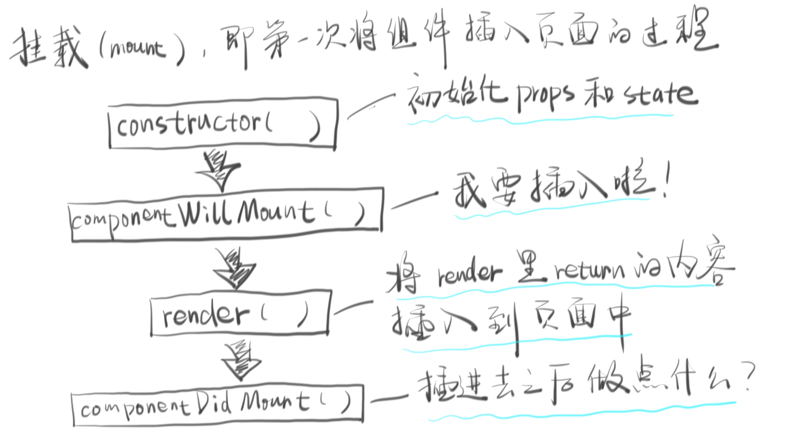

# 一、react常用语法

## 1. react样式的写法

- JSX中使用样式 

  1、行内样式：写行内样式的时候需要使用两个{}  ==>{{}}    

   2、对象样式：在return前面定义一个样式对象，注意样式的写法，与HTML的不同点     

  3、CSS样式

- 在HTML5中与在React中的样式的书写区别

  1、HTML5中以;结束          

  ​	在React中以,结束

   2、在HTML5中属性与值都不需要加上引号          

  ​	在React中，属于javascript对象，key中不能存在 - ,需要使用驼峰命名，如果是value值，需要加上引号

  3、在HTML中，设置带数字的值，宽度，高度==，需要带上单位

  ​         在React中可以不用带单位，直接写数字 这里是指那些规定了默认单位的值。比如说像素px，如果要使用em或者是rem则需要加上单位

- 其他注意事项

  {} 插值符号 (例如写行内style样式的时候为啥要用{{}})      

  在使用插值符号的时候，里面需要时一个对象或者是一个表达式

```jsx
var HelloWorld = React.createClass({  
    render:function(){  
        var styles = {   color: 'blue',  fontSize: '30'  }  
        return (  
            <div className="box">  
                <h3 className="title" 
                  style={{color:'red',backgroundColor:'lime'}}>默认标题</h3>  
                <p className="subtitle" style={styles}>说明</p>  
                <p className="details">这个是用来教学的案例</p>  
            </div>  
        )  
    }  
})  
ReactDOM.render(<HelloWorld/>,document.getElementById("app"))  
```

参考资料：https://blog.csdn.net/chuipaopao163/article/details/73432229

## 2. 生命周期（Lifecycle）

React 的生命周期包括三个阶段：mount（挂载）、update（更新）和 unmount（移除）

### 2.1 mount

mount 就是第一次让组件出现在页面中的过程。这个过程的关键就是 render 方法。React 会将 render 的返回值（一般是虚拟 DOM，也可以是 DOM 或者 null）插入到页面中。

这个过程会暴露几个钩子（hook）方便你往里面加代码：

1. constructor()
2. componentWillMount()
3. render()
4. componentDidMount()

我用一幅图解释一下：



### 2.2 update

mount 之后，如果数据有任何变动，就会来到 update 过程，这个过程有 5 个钩子：

1. componentWillReceiveProps(nextProps) - 我要读取 props 啦！
2. shouldComponentUpdate(nextProps, nextState) - 请问要不要更新组件？true / false
3. componentWillUpdate() - 我要更新组件啦！
4. render() - 更新！
5. componentDidUpdate() - 更新完毕啦！

### 2.3 unmount

当一个组件将要从页面中移除时，会进入 unmount 过程，这个过程就一个钩子：

1. componentWillUnmount() - 我要死啦！

你可以在这个组件死之前做一些清理工作。

 

## 3. ref的使用

ref是使用回调函数的方式去使用：

```javascript
class Input extends Component {
    constructor(props){
        super(props);
    }   
    focus = () => {
        this.textInput.focus();
    }
    render(){
        return (
            <div>
                <input ref={(input) => { this.textInput = input }} />
            </div>
        )
    }
}
```

`input`参数来源：

当我们在DOM Element中使用`ref`时，回调函数将接收当前的DOM元素作为参数，然后存储一个指向这个DOM元素的引用。那么在示例代码中，我们已经把`input`元素存储在了`this.textInput`中，在`focus`函数中直接使用原生DOM API实现focus聚焦。


父组件使用ref调用子组件方法:

```jsx
class Son extends React.Component {
   getShowData = (params) => {
        console.log('params ', params)
  }
   render() {
       return ( <div>12312</div> )
   }
}
class father extends React.Component {
   // 获取子组件引用
  getRef = (ele) => {
    this.incomeTable = ele;
    if (ele) {
      const params = {a: 1, b: 2}
      ele.getShowData(params);
    }
  }
   render() {
       return (  <Son  ref={this.getRef} /> )
   }
}
```


- ref的回调函数执行时间

  当组件挂载后和卸载后，以及ref属性本身发生变化时，回调函数就会被调用。

可以在组件实例中使用`ref`：

```javascript
//<Input>来源于上面的示例代码👆
class AutoFocusTextInput extends Component {
    componentDidMount(){
        this.textInput.focus();
    }
    
    render(){
        return (
            <Input ref={(input) => { this.textInput = input }}>
        )
    }
}
```

当我们在`<Input>`中添加`ref`属性时，其回调函数接收已经挂载的组件实例`<Input>`作为参数，并通过`this.textInput`访问到其内部的`focus`方法。也就是说，上面的示例代码实现了当`AutoFocusTextInput`组件挂载后`<Input>`组件的自动聚焦。

接下来文档指出，`<Input>`组件必须是使用`class`声明的组件，不然无法使用。这意味着React逐渐与ES6全面接轨了。

父组件的ref回调函数可以使用子组件的DOM:

这是Facebook非常不推荐的做法，因为这样会打破组件的封装性，这种方法只是某些特殊场景下的权宜之计。我们看看如何实现，上代码：

```javascript
function CustomTextInput(props) {
    return (
        <div>
            <input ref={props.inputRef} />
        </div>
    );
}

class Parent extends React.Component {
    render() {
        return (
            <CustomTextInput
                inputRef={el => this.inputElement = el}
            />
        );
    }
}
```

原理就是父组件把`ref`的回调函数当做`inputRef`props传递给子组件，然后子组件`<CustomTextInput>`把这个函数和当前的DOM绑定，最终的结果是父组件`<Parent>`的`this.inputElement`存储的DOM是子组件`<CustomTextInput>`中的`input`。

同样的道理，如果A组件是B组件的父组件，B组件是C组件的父组件，那么可用上面的方法，让A组件拿到C组件的DOM。但是官方态度是discouraged，这种多级调用确实不雅，我们确实需要考虑其他更好的方案了。

 参考资料：https://juejin.im/post/5927f51244d904006414925a

## 4.Context：组件间共享变量

Context是react 16.0以上版本才支持的。

注意：使用Context共享变量时，要是一个React.createContext创建的才能共享

### 4.1 API说明

- React.createContext

  ```
  const {Provider, Consumer} = React.createContext(defaultValue);
  ```

  创建一对 `{ Provider, Consumer }`。当 React 渲染 context 组件 Consumer 时，它将从组件树的上层中最接近的匹配的 Provider 读取当前的 context 值。

  如果上层的组件树没有一个匹配的 Provider，而此时你需要渲染一个 Consumer 组件，那么你可以用到 `defaultValue` 。这有助于在不封装它们的情况下对组件进行测试。

- Provider

  ```
  <Provider value={/* some value */}>
  ```

  React 组件允许 Consumers 订阅 context 的改变。

  接收一个 `value` 属性传递给 Provider 的后代 Consumers。一个 Provider 可以联系到多个 Consumers。Providers 可以被嵌套以覆盖组件树内更深层次的值。

- Consumer

  ```
  <Consumer>
    {value => /* render something based on the context value */}
  </Consumer>
  ```

  一个可以订阅 context 变化的 React 组件。

  接收一个 [函数作为子节点](http://react.yubolun.com/docs/render-props.html#using-props-other-than-render). 函数接收当前 context 的值并返回一个 React 节点。传递给函数的 `value` 将等于组件树中上层 context 的最近的 Provider 的 `value` 属性。如果 context 没有 Provider ，那么 `value` 参数将等于被传递给 `createContext()` 的 `defaultValue` 。


每当Provider的值发送改变时, 作为Provider后代的所有Consumers都会重新渲染。 从Provider到其后代的Consumers传播不受shouldComponentUpdate方法的约束，因此即使祖先组件退出更新时，后代Consumer也会被更新。

通过使用与[Object.is](http://developer.mozilla.org/en-US/docs/Web/JavaScript/Reference/Global_Objects/Object/is#Description)相同的算法比较新值和旧值来确定变化。


#### 4.2 一个使用的例子：

```jsx
// theme-context.js  声明一个Context
import React from 'react';
export const {Provider, Consumer} = React.createContext();


// app.jsx 把变量发布出去
import { Provider } from './userContext'   
class App extends React.Component {
    render () {
        return (
        	<Provider value={this.state.userInfo}>
            	<div>巴拉巴拉。。。</div>
            </Provider>
        )
    }
}

// 获取变量有2中方式：
// 1. 把获取的变量当组件的属性传给 组件
// BusinessIncome.jsx 
class BusinessIncome extends React.Component {
    render () {
        return (
        	<Consumer>
                {/*通过属性获取变量*/}
                { value => (<IncomeTrend userInfo={value} />)}
            </Consumer>
        )
    }
}
// 2. 直接在需要变量的组件中放回调方法，在回调方法里面获取变量
// BusinessIncome.jsx 
class ShowIncomeTable extends React.Component {
    consumerCallback = (value) => {
      console.log('consumerCallback -> value', value);
    }
    render () {
        return (
            <Consumer>
                <div>
                    <Consumer>{this.consumerCallback}</Consumer>
                    <div></div>
                </div>
            </Consumer>
        )
    }
}
```

参考资料：http://react.yubolun.com/docs/context.html

